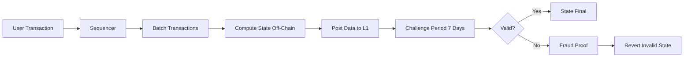

# Introduction to Arbitrum

**Arbitrum** adalah solusi Layer-2 (L2) scaling untuk Ethereum yang dirancang untuk meningkatkan throughput, mengurangi biaya transaksi, dan mempertahankan keamanan penuh dari Ethereum mainnet. Dikembangkan oleh Offchain Labs, Arbitrum merupakan salah satu solusi L2 paling populer dan banyak diadopsi di ekosistem Web3.

---

## Apa itu Layer-2?

Layer-2 adalah solusi scaling yang dibangun di atas blockchain Layer-1 (seperti Ethereum) untuk meningkatkan kapasitas transaksi tanpa mengorbankan keamanan atau desentralisasi. L2 bekerja dengan memproses transaksi secara off-chain, kemudian menggabungkan (batching) dan memposting hasilnya ke Layer-1.

### Problem yang Dipecahkan Arbitrum

**🎯 Masalah Ethereum Mainnet:**

| Problem | Dampak | Solusi Arbitrum |
|---------|--------|-----------------|
| **Biaya Gas Tinggi** | $50-200 per transaksi saat padat | Turun 10-20x → $2-10 per transaksi |
| **Throughput Terbatas** | 15-30 TPS tidak cukup untuk massal | Naik 1000x+ → 40,000+ TPS |
| **Kemacetan Jaringan** | Transaksi tertunda berjam-jam | Konfirmasi dalam hitungan detik |
| **Hambatan Masuk** | Biaya tinggi menghalangi eksperimen | Developer & user dapat bereksperimen |

:::info Kenapa Scaling Penting?
Ethereum Layer-1 hanya bisa handle ~15-30 transaksi per detik. Untuk perbandingan:
- **Visa:** 65,000 TPS
- **PayPal:** 193 TPS
- **Ethereum L1:** 15-30 TPS
- **Arbitrum:** 40,000+ TPS

Tanpa L2, Ethereum tidak bisa mendukung adopsi massal!
:::

---

## Teknologi Inti: Optimistic Rollup

Arbitrum menggunakan teknologi **Optimistic Rollup**, salah satu dari dua pendekatan utama untuk L2 scaling (yang lainnya adalah ZK-Rollup).

### Cara Kerja Optimistic Rollup

### **Step-by-Step Process:**

**1️⃣ Transaction Batching**
- Banyak transaksi dikumpulkan dan diproses secara off-chain di jaringan Arbitrum
- Sequencer mengurutkan dan mengeksekusi transaksi

**2️⃣ State Computation**
- Perubahan state dihitung di Layer-2 menggunakan Arbitrum Virtual Machine (AVM)
- Proses ini jauh lebih murah karena tidak dilakukan di Ethereum mainnet

**3️⃣ Data Posting**
- Data transaksi yang dikompres dan state root baru diposting ke Ethereum mainnet
- Hanya data + hash yang diposting, bukan eksekusi lengkap

**4️⃣ Fraud Proofs**
- Ada periode tantangan (7 hari) di mana siapa pun dapat mengajukan fraud proof
- Jika ada transisi state yang tidak valid, validator dapat menantang

**5️⃣ Finality**
- Setelah periode tantangan selesai tanpa tantangan berhasil, state menjadi final di Ethereum
- Dana dapat ditarik ke L1 dengan keamanan penuh

:::success 💡 Kenapa "Optimistic"?
Disebut "optimistic" karena sistem **mengasumsikan semua transaksi valid secara default** ("optimistically assume validity").

Hanya jika ada yang menantang dengan fraud proof, maka komputasi diverifikasi secara on-chain. Ini berbeda dengan ZK-Rollup yang selalu membuktikan validitas setiap batch.

**Trade-off:** Withdrawal dari Arbitrum ke L1 membutuhkan 7 hari (challenge period), sementara ZK-Rollup bisa lebih cepat (~24 jam).
:::

---

## Key Features Arbitrum

### ⚡ 10x-20x Lebih Murah
Gas fees berkurang drastis: $50 transaksi di L1 = $2-5 di Arbitrum One

### 🔒 Security Inheritance
Keamanan dijamin oleh Ethereum mainnet melalui fraud proofs. Selama minimal 1 validator jujur, sistem aman.

### 🔄 100% EVM Compatible
Fully compatible dengan Ethereum - deploy Solidity contracts tanpa perubahan kode.

### 🚀 High Throughput
Dapat memproses 40,000+ TPS, 1000x+ lebih cepat dari Ethereum L1.

### 🛠️ Developer Friendly
Menggunakan familiar tools: Hardhat, Foundry, Remix, MetaMask - no learning curve!

### 🌍 Decentralized
Open-source protocol dengan roadmap menuju full decentralization.

---

## Kenapa Pilih Arbitrum?

### ✅ **Keamanan Teruji**
- Diluncurkan Agustus 2021
- Mengamankan $2.5B+ TVL
- Zero major security incidents

### 🏛️ **Adopsi Institusional**
- **BlackRock:** BUIDL fund deployment
- **Robinhood:** Wallet integration
- **Circle:** Native USDC support
- **Tether:** Native USDT support

### 🌱 **Ekosistem yang Berkembang**
- 400+ dApp live (GMX, Uniswap, Aave, Curve)
- $2.5B+ Total Value Locked
- 1M+ daily transactions
- 500K+ daily active users

### 👨‍💻 **Komunitas Developer Kuat**
- Pengembangan aktif oleh Offchain Labs
- Dokumentasi lengkap dan tutorial
- Dukungan responsif via Discord
- Open-source codebase

### 💰 **Dana Ekosistem $200M+**
- Grant program untuk builders
- Hackathon sponsorships
- Developer incentives

### 🔬 **Inovasi Teknologi**
- **Stylus:** Smart contract multi-bahasa (Rust/C++)
- **Nitro:** 10x performance improvement
- **Orbit:** Custom L3 chains
- **BoLD:** Enhanced fraud proof system

---

## Arbitrum vs Other L2 Solutions

| Feature | Arbitrum | Optimism | Base | zkSync |
|---------|----------|----------|------|--------|
| **Technology** | Optimistic Rollup | Optimistic Rollup | Optimistic Rollup | ZK-Rollup |
| **TVL (2026)** | $2.5B+ | $1B+ | $800M+ | $600M+ |
| **Withdrawal Time** | 7 days | 7 days | 7 days | ~24 hours |
| **EVM Compatibility** | 100% (Geth-based) | 100% (Geth-based) | 100% (Geth-based) | 99% (some opcodes differ) |
| **Unique Feature** | Stylus (Rust/C++) | Superchain vision | Coinbase backing | ZK proofs (no fraud proofs) |
| **Launch Date** | Aug 2021 | Dec 2021 | Feb 2023 | Mar 2023 |
| **Maturity** | ⭐⭐⭐⭐⭐ | ⭐⭐⭐⭐ | ⭐⭐⭐ | ⭐⭐⭐ |

:::info Trade-off Analysis
- **Arbitrum:** Most mature, largest ecosystem, Stylus innovation
- **Optimism:** OP Stack flexibility, Superchain interop
- **Base:** Coinbase brand power, fiat on/off ramp
- **zkSync:** Faster finality, ZK privacy potential
:::

---

## Key Metrics (January 2026)

  
$2.5B+

  
Total Value Locked

  
Across all Arbitrum chains

  
1M+

  
Daily Transactions

  
Highest among all L2s

  
500K+

  
Daily Active Users

  
Interacting with dApps

  
400+

  
Live dApps

  
DeFi, Gaming, NFTs, Social

---

## Resources untuk Mulai

### 📖 **Official Documentation**
- [Arbitrum Docs](https://docs.arbitrum.io) - Complete documentation
- [Developer Portal](https://portal.arbitrum.io) - dApp ecosystem
- [Whitepaper](https://arxiv.org/abs/2003.10748) - Original research paper

### 🛠️ **Developer Tools**
- [Arbitrum Bridge](https://bridge.arbitrum.io) - Asset bridging L1 ↔ L2
- [Arbiscan](https://arbiscan.io) - Block explorer
- [Faucet](https://faucet.quicknode.com/arbitrum/sepolia) - Testnet tokens
- [GitHub](https://github.com/OffchainLabs) - Open source repos

### 🤝 **Community**
- [Discord](https://discord.gg/arbitrum) - Join official community
- [Forum](https://research.arbitrum.io) - Research discussions
- [Twitter](https://twitter.com/arbitrum) - Latest updates

---

## Next Steps

Sekarang Anda sudah memahami fundamental Arbitrum! Di modul berikutnya, kita akan explore:

1. **Arbitrum Classic** - Sejarah dan evolusi teknologi
2. **Arbitrum One** - Flagship chain untuk DeFi & RWA
3. **Arbitrum Nova** - Gaming & social dengan biaya ultra-rendah
4. **Arbitrum Orbit** - Launching custom L3 chains
5. **Arbitrum Stylus** - Multi-language contracts dengan Rust

:::success Ready to Build? 🚀
Continue to the next module untuk deep dive ke ekosistem Arbitrum!
:::
