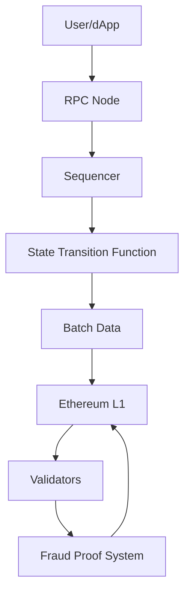

# Arbitrum One - Flagship Chain

**Arbitrum One** adalah chain Layer-2 unggulan dari ekosistem Arbitrum, berjalan di atas teknologi Nitro. Dioptimasi untuk DeFi, RWA (Real World Assets), NFT, dan aplikasi umum yang membutuhkan keamanan tinggi dengan throughput moderat.

---

## Overview Arbitrum One

<div style={{display:'grid',gridTemplateColumns:'repeat(auto-fit, minmax(240px, 1fr))',gap:'16px',margin:'20px 0'}}>

<div style={{background:'#0D102D',borderRadius:'12px',padding:'20px',color:'#fff',border:'2px solid #F2B42D'}}>
  <div style={{fontSize:'32px',fontWeight:'700',color:'#F2B42D'}}>$2.5B+</div>
  <div style={{fontSize:'14px',opacity:'0.9',marginTop:'4px'}}>Total Value Locked</div>
  <div style={{fontSize:'12px',opacity:'0.8',marginTop:'8px'}}>Largest L2 by TVL</div>
</div>

<div style={{background:'#0D102D',borderRadius:'12px',padding:'20px',color:'#fff',border:'2px solid #F2B42D'}}>
  <div style={{fontSize:'32px',fontWeight:'700',color:'#F2B42D'}}>1M+</div>
  <div style={{fontSize:'14px',opacity:'0.9',marginTop:'4px'}}>Daily Transactions</div>
  <div style={{fontSize:'12px',opacity:'0.8',marginTop:'8px'}}>Consistently highest volume</div>
</div>

<div style={{background:'#0D102D',borderRadius:'12px',padding:'20px',color:'#fff',border:'2px solid #F2B42D'}}>
  <div style={{fontSize:'32px',fontWeight:'700',color:'#F2B42D'}}>100%</div>
  <div style={{fontSize:'14px',opacity:'0.9',marginTop:'4px'}}>EVM Compatible</div>
  <div style={{fontSize:'12px',opacity:'0.8',marginTop:'8px'}}>Geth-based, no code changes</div>
</div>

<div style={{background:'#0D102D',borderRadius:'12px',padding:'20px',color:'#fff',border:'2px solid #F2B42D'}}>
  <div style={{fontSize:'32px',fontWeight:'700',color:'#F2B42D'}}>Institutional</div>
  <div style={{fontSize:'14px',opacity:'0.9',marginTop:'4px'}}>Grade Security</div>
  <div style={{fontSize:'12px',opacity:'0.8',marginTop:'8px'}}>BlackRock, Circle, Tether</div>
</div>

</div>

---

## Technical Architecture (Nitro Stack)

### Komponen Arsitektur



<div style={{background:'#E3F2FD',borderRadius:'8px',padding:'16px',margin:'16px 0'}}>

### **1️⃣ Sequencer**
- Mengurutkan dan mengeksekusi transaksi
- Saat ini tersentralisasi (Offchain Labs)
- Rencana desentralisasi di roadmap

### **2️⃣ State Transition Function (STF)**
- Lingkungan eksekusi berbasis WASM
- Menjalankan fork Geth
- Memproses transaksi dan compute state changes

### **3️⃣ RPC Nodes**
- Full node yang menyinkronkan state chain
- Melayani permintaan baca (`eth_call`, `eth_getBalance`)
- Menyiarkan transaksi ke sequencer

### **4️⃣ Validators**
- Monitor output sequencer
- Dapat menantang transisi state tidak valid
- Menggunakan fraud proofs untuk dispute

### **5️⃣ Bridge Contracts (L1)**
- **Inbox:** Menerima transaksi dari L1
- **Outbox:** Menangani withdrawal ke L1
- **Rollup Contract:** Menyimpan state commitments

</div>

---

## How Transactions Work

<div style={{background:'#FFF3E0',borderRadius:'8px',padding:'16px',margin:'16px 0'}}>

### **Transaction Lifecycle:**

**Step 1: User Sends Transaction**
```
User → MetaMask → RPC Node → Sequencer
```
- User signs transaction dengan private key
- Dikirim ke RPC node
- Forwarded ke sequencer

**Step 2: Sequencer Processes**
```
Sequencer → Include in batch → Execute in AVM
```
- Transaksi diurutkan (ordering)
- Dieksekusi di virtual machine
- State updated locally

**Step 3: Soft Confirmation (~250ms)**
```
Sequencer → User Receipt
```
- User menerima konfirmasi instant
- Transaksi muncul di wallet
- State visible di dApp

**Step 4: Batch Posted to L1 (~10-15 minutes)**
```
Batch → Compressed → Posted to Ethereum L1
```
- Multiple transactions digabung
- Data dikompresi
- Posted sebagai calldata ke L1

**Step 5: Challenge Period (7 days)**
```
Validators → Monitor → Challenge if invalid
```
- Validator check validity
- Jika invalid, submit fraud proof
- Jika valid, no action needed

**Step 6: Finality**
```
After 7 days → State final on Ethereum
```
- Setelah challenge period, state final
- Funds dapat ditarik ke L1 dengan keamanan penuh

</div>

:::info Transaction Speed
- **Soft confirmation:** ~250ms (instant UX)
- **L1 inclusion:** ~10-15 minutes (on Ethereum)
- **L1 finality:** 7 days (after challenge period)

Untuk sebagian besar use cases, soft confirmation sudah cukup! 7 hari hanya diperlukan untuk withdrawal ke L1.
:::

---

## Major Protocols on Arbitrum One

### DeFi Powerhouses

| Protocol | Category | TVL/Metrics | Why on Arbitrum |
|----------|----------|-------------|-----------------|
| **GMX** | Perpetual DEX | $500M+ TVL | Low fees crucial untuk high-frequency trading |
| **Uniswap V3** | Spot DEX | $300M+ TVL | Largest DEX volume on any L2 |
| **Aave V3** | Lending | $200M+ TVL | Cross-chain liquidity protocol |
| **Radiant Capital** | Omnichain Lending | $150M+ TVL | Arbitrum-native cross-chain money market |
| **Camelot** | DEX + Launchpad | $100M+ TVL | Arbitrum-native ecosystem hub |
| **Curve Finance** | Stable Swaps | $80M+ TVL | Efficient stablecoin trading |

### Gaming & NFTs

| Protocol | Category | Key Feature |
|----------|----------|-------------|
| **Treasure DAO** | Gaming Ecosystem | Decentralized game publisher, 50K+ players |
| **TofuNFT** | NFT Marketplace | Multi-chain NFT marketplace |
| **Battlefly** | Strategy Game | NFT mechs, competitive gameplay |

---

## Development Setup

### Prerequisites

```bash
# Verify Node.js installation
node --version  # v18+
npm --version

# Install Hardhat globally (optional)
npm install -g hardhat
```

### Hardhat Configuration

```javascript
// hardhat.config.js
require("@nomiclabs/hardhat-ethers");
require("@nomiclabs/hardhat-etherscan");

module.exports = {
  solidity: {
    version: "0.8.20",
    settings: {
      optimizer: {
        enabled: true,
        runs: 200
      }
    }
  },
  networks: {
    // Arbitrum One Mainnet
    arbitrumOne: {
      url: "https://arb1.arbitrum.io/rpc",
      chainId: 42161,
      accounts: [process.env.PRIVATE_KEY]
    },
    // Arbitrum Sepolia Testnet
    arbitrumSepolia: {
      url: "https://sepolia-rollup.arbitrum.io/rpc",
      chainId: 421614,
      accounts: [process.env.PRIVATE_KEY]
    }
  },
  etherscan: {
    apiKey: {
      arbitrumOne: process.env.ARBISCAN_API_KEY,
      arbitrumSepolia: process.env.ARBISCAN_API_KEY
    }
  }
};
```

### Deploy Script

```javascript
// scripts/deploy.js
const hre = require("hardhat");

async function main() {
  console.log("Deploying to Arbitrum...");

  // Get contract factory
  const MyContract = await hre.ethers.getContractFactory("MyContract");

  // Deploy contract
  const contract = await MyContract.deploy();
  await contract.deployed();

  console.log("✅ Contract deployed!");
  console.log("Address:", contract.address);
  console.log("Network:", hre.network.name);
  console.log("Chain ID:", hre.network.config.chainId);
  console.log("Explorer:", `https://sepolia.arbiscan.io/address/${contract.address}`);
}

main()
  .then(() => process.exit(0))
  .catch((error) => {
    console.error(error);
    process.exit(1);
  });
```

### Deploy Commands

```bash
# Deploy ke Arbitrum Sepolia Testnet
npx hardhat run scripts/deploy.js --network arbitrumSepolia

# Deploy ke Arbitrum One Mainnet
npx hardhat run scripts/deploy.js --network arbitrumOne

# Verify contract on Arbiscan
npx hardhat verify --network arbitrumSepolia DEPLOYED_CONTRACT_ADDRESS
```

---

## Kasus Penggunaan Ideal untuk Arbitrum One

<div style={{background:'#E8F5E9',borderRadius:'8px',padding:'16px',margin:'16px 0'}}>

### ✅ **Perfect Fit:**

**🏦 DeFi Trading**
- DEX, perpetual, lending protocols
- Benefit dari low fees + high security

**🖼️ NFT Marketplaces**
- Minting dan trading NFT affordable
- Royalties enforcement on-chain

**🏢 Real World Assets (RWA)**
- Tokenisasi real estate, bonds, securities
- Memerlukan institutional-grade security

**🏛️ DAO Governance**
- On-chain voting hemat biaya
- Treasury management dengan gas rendah

**🌾 DeFi Yield Farming**
- Complex strategies viable
- Gas tidak menggerus profit

**💵 Stablecoin Transfers**
- USDC, USDT, DAI transfer murah
- Enable payment use cases

</div>

---

## Bridging Assets

### Native Bridge (Official Arbitrum)

<div style={{background:'#E3F2FD',borderRadius:'8px',padding:'16px',margin:'16px 0'}}>

**L1 → L2 (Deposit):**
- ⏱️ **Time:** ~10-15 minutes
- 💰 **Cost:** Pay L1 gas fees (~$5-20)
- 🔒 **Security:** Fully trustless

**L2 → L1 (Withdrawal):**
- ⏱️ **Time:** 7 days (challenge period)
- 💰 **Cost:** Pay L2 gas to initiate, L1 gas to claim
- 🔒 **Security:** Fully trustless

**Bridge URL:** [bridge.arbitrum.io](https://bridge.arbitrum.io)

</div>

### Third-Party Bridges (Fast, with trade-offs)

| Bridge | Speed | Trust Model | Cost |
|--------|-------|-------------|------|
| **Stargate** | Instant | LayerZero relayers | ~0.1% |
| **Synapse** | Instant | Liquidity pools | ~0.1% |
| **Hop Protocol** | 5-10 min | Optimistic bridge | Lower |
| **Across** | Instant | Intent-based | Competitive |

:::warning Trade-off
Fast bridges memberikan instant transfers tapi memerlukan trust assumptions. Native bridge sepenuhnya trustless tapi membutuhkan 7 hari untuk L2 → L1.

**Recommendation:** Gunakan native bridge untuk large amounts, fast bridges untuk convenience.
:::

---

## Gas Optimization Tips

### Arbitrum-Specific Optimizations

```solidity
// 1. Calldata Compression (automatic in Nitro)
// Repetitive calldata automatically compressed → cheaper L1 posting

// 2. Batch Operations
contract BatchMint {
    function batchMint(address[] calldata recipients) external {
        for (uint i = 0; i < recipients.length; i++) {
            _mint(recipients[i], tokenId++);
        }
    }
}
// Single batch tx jauh lebih murah dari multiple separate txs

// 3. Use Events Sparingly
// Events contribute to calldata size
emit TransferBatch(ids, amounts); // ✅ Better
// vs multiple:
emit Transfer(id1, amount1);      // ❌ More expensive
emit Transfer(id2, amount2);

// 4. Storage Patterns (sama seperti L1)
// SSTORE, SLOAD expensive
// Memory operations, calldata cheap

// 5. Utilize L2-Specific Precompiles
ArbSys arbSys = ArbSys(address(100));
uint256 l2BlockNumber = arbSys.arbBlockNumber();
bytes32 l2BlockHash = arbSys.arbBlockHash(blockNumber);
```

### Example: Cost Comparison

```solidity
// Simple ERC-20 Transfer
// Ethereum L1:  ~$10-20
// Arbitrum One: ~$0.50-1
// Savings: 10-20x

// Complex DEX Swap
// Ethereum L1:  ~$50-100
// Arbitrum One: ~$2-5
// Savings: 20-25x

// NFT Mint
// Ethereum L1:  ~$50-150
// Arbitrum One: ~$5-10
// Savings: 10-15x
```

---

## Important Considerations

:::warning ⚠️ **Trade-offs dan Keterbatasan:**

**7-Day Withdrawal**
- Withdrawal native membutuhkan 7 hari untuk finality L1
- Gunakan fast bridges untuk instant exit (dengan trust assumptions)

**Sequencer Tersentralisasi**
- Saat ini sequencer tunggal (Offchain Labs)
- Roadmap: desentralisasi sequencer network
- Risk: Single point of failure (mitigated by forced inclusion)

**MEV Considerations**
- Sequencer dapat reorder transaksi dalam blok
- Similar dengan validator Ethereum
- Frontrunning masih mungkin

**L1 Gas Dependency**
- Biaya posting ke L1 berfluktuasi dengan Ethereum gas prices
- Ketika L1 congested, L2 fees naik juga (tapi tetap jauh lebih murah)

**State Growth**
- Full node perlu store seluruh history
- Pruning sedang dikembangkan untuk reduce storage

:::

---

## Network Information

### Arbitrum One Mainnet

```
Network Name:     Arbitrum One
RPC URL:          https://arb1.arbitrum.io/rpc
Chain ID:         42161
Currency Symbol:  ETH
Block Explorer:   https://arbiscan.io
```

### Arbitrum Sepolia Testnet

```
Network Name:     Arbitrum Sepolia
RPC URL:          https://sepolia-rollup.arbitrum.io/rpc
Chain ID:         421614
Currency Symbol:  ETH
Block Explorer:   https://sepolia.arbiscan.io
```

---

## Resources

<div style={{background:'#f8f9fa',borderRadius:'8px',padding:'16px',margin:'16px 0'}}>

### 🔧 **Developer Tools**
- [Arbiscan](https://arbiscan.io) - Block explorer
- [Arbitrum Bridge](https://bridge.arbitrum.io) - Official bridge
- [Portal](https://portal.arbitrum.one) - Ecosystem dApps
- [Faucet](https://faucet.quicknode.com/arbitrum/sepolia) - Testnet tokens

### 📊 **Analytics**
- [DefiLlama](https://defillama.com/chain/Arbitrum) - TVL analytics
- [L2Beat](https://l2beat.com/scaling/projects/arbitrum) - Metrics
- [Dune Analytics](https://dune.com/browse/dashboards?q=arbitrum) - On-chain data

### 💰 **Grants & Support**
- [Arbitrum Grants](https://arbitrum-grants.notion.site) - Funding for builders
- [Developer Discord](https://discord.gg/arbitrum) - Get support

</div>

---

## Next Steps

Di modul berikutnya, kita akan explore **Arbitrum Nova** - chain gaming & social dengan biaya ultra-rendah menggunakan AnyTrust technology!

:::success Ready to Build on Arbitrum One? 🚀
Deploy your first contract dan join ekosistem terbesar L2!
:::
