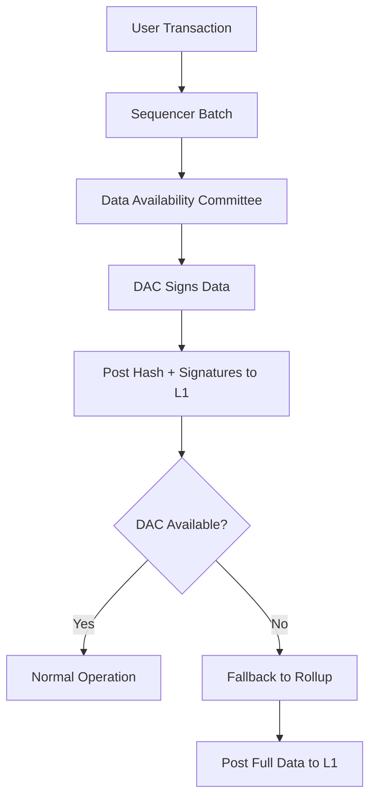

# Arbitrum Nova - Gaming & Social Chain

**Arbitrum Nova** adalah chain kedua dalam ekosistem Arbitrum, diluncurkan Agustus 2022. Nova dioptimasi untuk gaming, aplikasi sosial, dan transaksi volume tinggi bernilai rendah. Nova menggunakan teknologi **AnyTrust** yang menukarkan asumsi kepercayaan ringan untuk biaya sangat rendah.

---

## AnyTrust vs Rollup: Core Difference

<div style={{background:'#FFF3E0',borderRadius:'8px',padding:'20px',margin:'16px 0'}}>

### 🔑 **Perbedaan Fundamental:**

**Arbitrum One (Rollup):**
- ✅ All data posted to Ethereum L1
- ✅ Fully trustless
- 💰 10-20x cheaper than L1

**Arbitrum Nova (AnyTrust):**
- 📊 Data stored by DAC (Data Availability Committee)
- 🤝 Assume at least 2 of N DAC members honest
- 💰 **100x+ cheaper than L1**

</div>

| Aspect | Arbitrum One (Rollup) | Arbitrum Nova (AnyTrust) |
|--------|----------------------|--------------------------|
| **Data Availability** | All data posted to L1 | Data stored by DAC |
| **Trust Assumptions** | Fully trustless | Assume ≥2 honest DAC members |
| **Gas Costs** | 10-20x cheaper than L1 | **100x+ cheaper than L1** |
| **Throughput** | 40,000+ TPS | **100,000+ TPS** |
| **L1 Posting Costs** | Full calldata → expensive | Only hash → very cheap |
| **Fallback Mechanism** | N/A (always L1) | Falls back to Rollup if DAC fails |
| **Best For** | DeFi, RWA, high-value | Gaming, social, high-volume |

:::info Key Insight
Nova menukarkan **slight trust assumptions** untuk **10x cost reduction** vs Arbitrum One. Perfect untuk applications di mana throughput > security absolut.
:::

---

## How AnyTrust Works



<div style={{background:'#E3F2FD',borderRadius:'8px',padding:'16px',margin:'16px 0'}}>

### **Step-by-Step Process:**

**1️⃣ Transaction Batching**
- Sequencer menggabungkan transaksi seperti biasa
- Compute new state root

**2️⃣ Data Availability Committee (DAC)**
- Data batch dikirim ke DAC members (saat ini 6-8 anggota)
- Each member adalah entitas terpercaya

**3️⃣ DAC Signs Data**
- Setiap anggota menandatangani komitmen bahwa mereka menyimpan data
- Signature proves: "I have this data and will provide it if challenged"

**4️⃣ Post Hash to L1**
- **Hanya hash data + signatures** yang diposting ke Ethereum
- **Bukan full data** → drastically cheaper!

**5️⃣ Fallback Mechanism**
- Jika DAC tidak tersedia → otomatis switch ke Rollup mode
- Post full data ke L1 (more expensive tapi tetap available)

</div>

---

## Model Keamanan

<div style={{background:'#E8F5E9',borderRadius:'8px',padding:'16px',margin:'16px 0'}}>

### 💡 **Security Assumption:**

Nova mengasumsikan **"setidaknya 2 dari N anggota DAC jujur"**

**Selama asumsi ini berlaku:**
- ✅ Data availability terjamin (dapat reconstruct state)
- ✅ Invalid state transitions dapat ditantang
- ✅ User selalu dapat withdraw funds

**Jika SEMUA anggota DAC berkolusi atau menghilang:**
- ⚠️ System otomatis fallback ke Rollup mode
- ⚠️ Post full data ke L1 (lebih mahal tapi tetap aman)
- ✅ User funds tetap aman

</div>

:::warning Trade-off Analysis
**Benefit:** 10x cost reduction vs Arbitrum One

**Risk:** Slight trust assumption (need 2/N honest DAC members)

**Mitigation:**
- DAC members are reputable organizations
- Automatic fallback to Rollup mode
- User can always exit via L1 force inclusion
:::

---

## DAC Members (Current)

Nova's Data Availability Committee consists of reputable organizations:

<div style={{display:'grid',gridTemplateColumns:'repeat(auto-fit, minmax(200px, 1fr))',gap:'12px',margin:'16px 0'}}>

<div style={{background:'#f8f9fa',borderRadius:'8px',padding:'16px',border:'2px solid #e0e0e0',textAlign:'center'}}>
  <div style={{fontSize:'24px',marginBottom:'8px'}}>☁️</div>
  <div style={{fontWeight:'700'}}>Google Cloud</div>
  <div style={{fontSize:'13px',color:'#666'}}>Infrastructure giant</div>
</div>

<div style={{background:'#f8f9fa',borderRadius:'8px',padding:'16px',border:'2px solid #e0e0e0',textAlign:'center'}}>
  <div style={{fontSize:'24px',marginBottom:'8px'}}>🔷</div>
  <div style={{fontWeight:'700'}}>Offchain Labs</div>
  <div style={{fontSize:'13px',color:'#666'}}>Arbitrum creators</div>
</div>

<div style={{background:'#f8f9fa',borderRadius:'8px',padding:'16px',border:'2px solid #e0e0e0',textAlign:'center'}}>
  <div style={{fontSize:'24px',marginBottom:'8px'}}>⚡</div>
  <div style={{fontWeight:'700'}}>QuickNode</div>
  <div style={{fontSize:'13px',color:'#666'}}>RPC provider</div>
</div>

<div style={{background:'#f8f9fa',borderRadius:'8px',padding:'16px',border:'2px solid #e0e0e0',textAlign:'center'}}>
  <div style={{fontSize:'24px',marginBottom:'8px'}}>🌐</div>
  <div style={{fontWeight:'700'}}>P2P</div>
  <div style={{fontSize:'13px',color:'#666'}}>Staking infra</div>
</div>

<div style={{background:'#f8f9fa',borderRadius:'8px',padding:'16px',border:'2px solid #e0e0e0',textAlign:'center'}}>
  <div style={{fontSize:'24px',marginBottom:'8px'}}>🦊</div>
  <div style={{fontWeight:'700'}}>ConsenSys</div>
  <div style={{fontSize:'13px',color:'#666'}}>MetaMask parent</div>
</div>

<div style={{background:'#f8f9fa',borderRadius:'8px',padding:'16px',border:'2px solid #e0e0e0',textAlign:'center'}}>
  <div style={{fontSize:'24px',marginBottom:'8px'}}>➕</div>
  <div style={{fontWeight:'700'}}>Additional Members</div>
  <div style={{fontSize:'13px',color:'#666'}}>Rotates periodically</div>
</div>

</div>

:::info Reputation Matters
DAC members dipilih berdasarkan reputasi dan track record. Risiko kolusi sangat rendah karena reputational damage akan jauh lebih mahal dari potential gain.
:::

---

## Perfect Use Cases untuk Nova

<div style={{display:'grid',gridTemplateColumns:'repeat(auto-fit, minmax(280px, 1fr))',gap:'16px',margin:'20px 0'}}>

<div style={{background:'#f8f9fa',borderRadius:'12px',padding:'20px',border:'2px solid #e0e0e0'}}>
  <div style={{fontSize:'24px',marginBottom:'8px'}}>🎮</div>
  <div style={{fontSize:'18px',fontWeight:'700',marginBottom:'8px'}}>Gaming Applications</div>
  <div style={{fontSize:'14px',color:'#666'}}>
    In-game transactions, asset transfers, microtransactions<br/>
    <strong>Example:</strong> Pirate Nation (fully on-chain game)
  </div>
</div>

<div style={{background:'#f8f9fa',borderRadius:'12px',padding:'20px',border:'2px solid #e0e0e0'}}>
  <div style={{fontSize:'24px',marginBottom:'8px'}}>💬</div>
  <div style={{fontSize:'18px',fontWeight:'700',marginBottom:'8px'}}>Social Platforms</div>
  <div style={{fontSize:'14px',color:'#666'}}>
    Posts, likes, follows, comments<br/>
    <strong>Example:</strong> Reddit Community Points
  </div>
</div>

<div style={{background:'#f8f9fa',borderRadius:'12px',padding:'20px',border:'2px solid #e0e0e0'}}>
  <div style={{fontSize:'24px',marginBottom:'8px'}}>🖼️</div>
  <div style={{fontSize:'18px',fontWeight:'700',marginBottom:'8px'}}>High-Volume NFTs</div>
  <div style={{fontSize:'14px',color:'#666'}}>
    Batch minting campaigns, NFT marketplaces<br/>
    <strong>Example:</strong> TofuNFT
  </div>
</div>

<div style={{background:'#f8f9fa',borderRadius:'12px',padding:'20px',border:'2px solid #e0e0e0'}}>
  <div style={{fontSize:'24px',marginBottom:'8px'}}>🤖</div>
  <div style={{fontSize:'18px',fontWeight:'700',marginBottom:'8px'}}>Trading Bots</div>
  <div style={{fontSize:'14px',color:'#666'}}>
    High-frequency MEV bots, arbitrage<br/>
    Ultra-low fees enable profitable micro-arb
  </div>
</div>

<div style={{background:'#f8f9fa',borderRadius:'12px',padding:'20px',border:'2px solid #e0e0e0'}}>
  <div style={{fontSize:'24px',marginBottom:'8px'}}>🎁</div>
  <div style={{fontSize:'18px',fontWeight:'700',marginBottom:'8px'}}>Loyalty Programs</div>
  <div style={{fontSize:'14px',color:'#666'}}>
    On-chain points, rewards, airdrops<br/>
    Cost-effective untuk mass distribution
  </div>
</div>

<div style={{background:'#f8f9fa',borderRadius:'12px',padding:'20px',border:'2px solid #e0e0e0'}}>
  <div style={{fontSize:'24px',marginBottom:'8px'}}>📊</div>
  <div style={{fontSize:'18px',fontWeight:'700',marginBottom:'8px'}}>Analytics/Oracles</div>
  <div style={{fontSize:'14px',color:'#666'}}>
    Frequent data updates<br/>
    Low cost enables high-frequency oracle updates
  </div>
</div>

</div>

---

## Major Projects on Nova

### Gaming

- **Pirate Nation** - Fully on-chain RPG dengan 50K+ players
- **Battlefly** - Strategy game dengan NFT mechs
- **Treasure DAO Games** - Multiple gaming projects in ecosystem

### Social

- **Reddit Community Points** - On-chain karma system untuk Reddit communities
- Largest deployment (millions of users)

### NFT & Marketplaces

- **TofuNFT** - Multi-chain NFT marketplace focus di gaming
- **Sushiswap** - DEX deployment untuk gaming token swaps

---

## Development Setup

### Network Configuration

```javascript
// hardhat.config.js
module.exports = {
  networks: {
    arbitrumNova: {
      url: "https://nova.arbitrum.io/rpc",
      chainId: 42170,
      accounts: [process.env.PRIVATE_KEY]
    }
  }
};
```

### Deploy ke Nova

```bash
# Deploy (exact same process as One)
npx hardhat run scripts/deploy.js --network arbitrumNova

# Key difference: Transaction costs ~10x cheaper than One!
```

### Example: Batch NFT Mint

```solidity
contract GameNFT {
    uint256 public tokenId;

    function batchMint(address[] calldata players) external {
        for (uint i = 0; i < players.length; i++) {
            _mint(players[i], tokenId++);
        }
    }
}

// Cost Comparison - Minting 1000 NFTs:
// Ethereum L1:     ~$500-1000   (baseline)
// Arbitrum One:    ~$5-10        (50-100x cheaper)
// Arbitrum Nova:   ~$0.50-1      (500-1000x cheaper!) ⚡
```

---

## When to Choose Nova vs One

<div style={{background:'#E8F5E9',borderRadius:'8px',padding:'16px',margin:'16px 0'}}>

### ✅ **Pilih Nova jika:**

- Volume transaksi tinggi (ribuan-jutaan transaksi per hari)
- Nilai transaksi individual rendah ($0.01 - $10)
- Aplikasi gaming atau sosial
- Pengguna sensitif terhadap biaya (tidak mampu $1+ per aksi)
- Dapat menerima asumsi kepercayaan ringan (model DAC)
- Kecepatan lebih penting dari keamanan maksimum absolut

</div>

<div style={{background:'#FFEBEE',borderRadius:'8px',padding:'16px',margin:'16px 0'}}>

### ⚠️ **Pilih One jika:**

- DeFi bernilai tinggi (jutaan dolar dalam TVL)
- Persyaratan custody institusional
- Tanpa asumsi kepercayaan yang dapat diterima
- Kepatuhan regulasi memerlukan data lengkap di L1
- Tokenisasi RWA (sekuritas, obligasi)
- Critical security requirements

</div>

---

## Bridging to Nova

### Option 1: Ethereum L1 → Nova

```bash
# Via Official Bridge
https://bridge.arbitrum.io/?destinationChain=arbitrum-nova

# Time: ~10-15 minutes
# Cost: L1 gas fees
```

### Option 2: Arbitrum One → Nova (Cross-L2)

```bash
# Use third-party bridges:
# - Stargate (LayerZero)
# - Synapse
# - Hop Protocol

# Time: Instant
# Cost: Minimal (~$0.10-0.50)
```

### Programmatic Bridging

```javascript
const bridge = new ethers.Contract(BRIDGE_ADDRESS, BRIDGE_ABI, signer);

// Deposit ETH
await bridge.depositETH({
  value: ethers.utils.parseEther("0.1")
});

// Withdrawal Nova → L1
// Time: 7 days (same as One)
// Can use fast bridges untuk instant exit
```

---

## Gas Cost Comparison (Real Examples)

| Operation | Ethereum L1 | Arbitrum One | Arbitrum Nova | Savings |
|-----------|-------------|--------------|---------------|---------|
| **ETH Transfer** | $5-10 | $0.50-1 | $0.05-0.10 | **50-200x** |
| **ERC-20 Transfer** | $10-20 | $1-2 | $0.10-0.20 | **50-200x** |
| **NFT Mint** | $50-100 | $5-10 | $0.50-1 | **50-200x** |
| **Uniswap Swap** | $20-50 | $2-5 | $0.20-0.50 | **40-250x** |
| **Contract Deploy** | $200-500 | $20-50 | $2-5 | **40-250x** |

:::success Cost Optimization Champion 🏆
Nova adalah **chain paling murah** di ekosistem Ethereum sambil tetap maintain security dari Ethereum L1 (via fallback).
:::

---

## Network Information

### Arbitrum Nova Mainnet

```
Network Name:     Arbitrum Nova
RPC URL:          https://nova.arbitrum.io/rpc
Chain ID:         42170
Currency Symbol:  ETH
Block Explorer:   https://nova.arbiscan.io
```

---

## Resources

<div style={{background:'#f8f9fa',borderRadius:'8px',padding:'16px',margin:'16px 0'}}>

### 🔧 **Developer Tools**
- [Nova Explorer](https://nova.arbiscan.io) - Block explorer
- [Bridge to Nova](https://bridge.arbitrum.io/?destinationChain=arbitrum-nova) - Official bridge
- [Nova Portal](https://portal.arbitrum.io) - dApps directory

### 📖 **Documentation**
- [Nova Docs](https://docs.arbitrum.io/nova) - Technical documentation
- [AnyTrust Protocol](https://docs.arbitrum.io/how-arbitrum-works/anytrust-protocol) - Deep dive

</div>

---

## Next Steps

Di modul berikutnya, kita akan explore **Arbitrum Orbit** - framework untuk meluncurkan custom L3 chains dengan full sovereignty!

:::success Perfect for High-Volume Apps 🎮
Nova membuktikan bahwa blockchain dapat scale untuk gaming dan social tanpa compromise security!
:::
