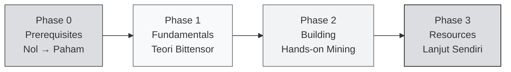

import useBaseUrl from '@docusaurus/useBaseUrl';

# Bittensor Co-Learning Camp — Overview

> **Co-Learning Camp #9 · HackQuest Indonesia × ETHJKT × Bittensor**
> **14 – 24 April 2026 · Online via Zoom · 100% GRATIS**

Selamat datang di **Bittensor Co-Learning Camp**! Kurikulum ini dirancang untuk membawa kamu dari **benar-benar nol** — belum pernah menyentuh blockchain maupun AI — sampai bisa **running miner sendiri** di dua subnet produksi Bittensor: **Sportstensor (SN41)** dan **Data Universe (SN13)**.

---

## 🎯 Untuk Siapa Kurikulum Ini?

:::info Target Peserta
Kurikulum ini beginner-friendly dan cocok untuk:
- 🧑‍🎓 **Mahasiswa CS / Data Science** yang mau eksplor decentralized AI
- 👨‍💻 **Software engineer** yang penasaran dengan AI × Crypto
- 🌐 **Web3 builder** yang mau expand ke AI infrastructure
- 🤔 **Pemula total** yang belum tahu apa itu Web3 atau AI tapi mau belajar
:::

Tidak perlu pengalaman blockchain sebelumnya. Tidak perlu jadi AI researcher. Yang penting: **mau belajar dan mau eksekusi.**

---

## 🗺️ Learning Path — 4 Phase

### 🟡 Phase 0 — Prerequisites (Mulai dari Nol)

Fondasi paling dasar. Kalau kamu belum pernah dengar "Web3" atau "decentralized AI", mulai dari sini.

- **Unit 1:** Apa itu Web3?
- **Unit 2:** Apa itu AI?
- **Unit 3:** Centralized AI vs Decentralized AI
- **Unit 4:** Kenapa Bittensor penting?

### 🔵 Phase 1 — Bittensor Fundamentals

Masuk ke teori Bittensor: arsitektur, incentive mechanism, dan core subnets.

**Concept I — Introduction to Bittensor**
- Unit 1: The Rise of AI and the Emergence of Bittensor
- Unit 2: Core Concepts & Mechanisms
- Unit 3: Tooling & Tokenomics

**Concept II — Core Bittensor Subnets**
- Unit 1: **Chutes** — Decentralized Inference Infrastructure
- Unit 2: **Data Universe** (SN13) — Decentralized Data Provision
- Unit 3: **Sportstensor** (SN41) — Sports Event Prediction
- Unit 4: **Ridges** — Engineering & Code Intelligence

### 🟢 Phase 2 — Building on Bittensor Subnet

Praktek langsung. Di sini kamu **benar-benar jadi miner.**

**Guided Project I — Sportstensor (SN41) Mining Guide** (7 unit)
1. Introduction to SN41
2. Bittensor Wallet Setup & TAO Funding
3. Registering a Miner on Sportstensor
4. Almanac Registration & Miner Identity Binding
5. Miner Initialization & Metadata Registration
6. Programmatic Trade Execution
7. Trading Strategies

**Guided Project II — Data Universe (SN13) Mining** (6 unit)
1. Introduction to SN13
2. Environment Setup & Deployment
3. Miner Configuration & Data Scraping Strategy
4. Understanding the Scoring System & Optimizing Rewards
5. S3 Storage Configuration & Data Upload
6. Interaction Layer

### 🟣 Phase 3 — More Bittensor Resources

Link ke whitepaper, Taostats, repo resmi, YouTube, faucet — biar kamu bisa lanjut eksplorasi sendiri setelah camp selesai.

---

## 📅 Jadwal Townhall (Live Zoom)

| TH | Tanggal | Topik |
|----|---------|-------|
| **TH1** | Sel, 14 April 2026 · 19:00 WIB | Intro — Architecture, Subnets, Miners & Validators |
| **TH2** | Jum, 17 April 2026 · 19:00 WIB | Tooling, Tokenomics & Core Subnets |
| **TH3** | Sel, 21 April 2026 · 19:00 WIB | Hands-on Mining — SN41 & SN13 |
| **TH4** | Jum, 24 April 2026 · 19:00 WIB | 🎉 Graduation Day |

:::tip Pro Tip
Baca materi Phase 0 dan Phase 1 **sebelum TH1** biar kamu bisa ikut diskusi dengan confident. Materi tertulis di sini lebih dalam daripada yang bisa dibahas di 2 jam live session.
:::

---

## 🎓 Cara Lulus (Graduation Criteria)

Untuk mendapat **NFT Certificate + Quack Believers invitation**, kamu harus menyelesaikan **SEMUA** syarat berikut:

### ✅ Persyaratan

1. **Hadir minimal 3 dari 4 Townhall** (live, bukan rekaman)
2. **Tetap di Telegram group** sampai Graduation Day
3. **Submit bukti miner (5 item)** sebelum TH4:
   - Hotkey Address (`btcli wallet overview`)
   - Subnet ID / NetUID
   - Miner UID (`btcli neuron list --netuid <netuid>`)
   - Screenshot miner running di terminal
   - Link X (Twitter) reflection post (tag `@HackQuest_` & `@bittensor`)
4. **Complete HackQuest Learning Track** di platform

### 🏆 Reward Tier

| Tier | Kriteria | Hadiah |
|------|----------|--------|
| 🥇 **Top 5** | Submission valid + engagement & progress tertinggi | Hoodie HackQuest |
| 🥈 **Top 6–20** | Submission valid + engagement tinggi berikutnya | Sticker + Kaos HackQuest |
| 🎓 **Graduate** | Semua syarat terpenuhi | NFT Certificate + Quack Believers invite |
| 📋 **Participant** | Hadir tapi submission belum lengkap | Certificate of Participation |

---

## 💬 Support & Komunitas

- **Telegram Group CLC9 Bittensor** — link dibagikan setelah registrasi
- **HackQuest Indonesia Discord / Channel** — diskusi umum
- **ETHJKT Community** — meetup offline Jakarta
- **Quack Believers** — alumni network (invite-only untuk graduate)

---

## 🚀 Cara Mulai

:::tip Rekomendasi urutan belajar
1. **Baca Phase 0 dulu** kalau kamu pemula total — jangan langsung loncat ke Phase 1.
2. **Phase 1 selesai sebelum TH2** — supaya diskusi tokenomics & subnet di TH2 lebih mudah diikuti.
3. **Phase 2 selesai bersamaan dengan TH3** — workshop hands-on akan mengacu ke langkah-langkah di sini.
4. **Phase 3** dibaca setelah camp selesai untuk eksplorasi mandiri.
:::

**Siap?** Lanjut ke [Phase 0 — Unit 1: Apa itu Web3?](./Phase-0-Prerequisites/apa-itu-web3) 👉

---

### 📚 Referensi Cepat

- 🌐 [Bittensor Official](https://bittensor.com)
- 📄 [Whitepaper](https://bittensor.com/whitepaper)
- 📊 [Taostats Explorer](https://taostats.io)
- 🛠️ [Dokumentasi Resmi](https://docs.bittensor.com)
- 💧 [Testnet Faucet](https://faucet.bittensor.com)

---

:::note Brand & Attribution
Logo Bittensor, TAO, Subtensor, dan Opentensor Foundation mark yang ditampilkan dalam kurikulum ini adalah milik **Opentensor Foundation (OTF)**. Penggunaan di sini mengikuti **Opentensor Graphic Standards** — logo dipakai hanya di versi hitam atau putih, pada latar grayscale, tanpa modifikasi, tanpa efek, dan tidak dikombinasikan dengan mark lain.

Materi edukasi disusun oleh **HackQuest Indonesia** dan **ETHJKT** sebagai community education — tidak berafiliasi resmi dengan OTF kecuali dinyatakan sebaliknya.

Brand assets resmi: [bittensor.com/about](https://bittensor.com/about) · [Opentensor on GitHub](https://github.com/opentensor)
:::

*In Builders We Trust.*
