# 🧠 Pengenalan Bittensor

## Apa itu Bittensor?

**Bittensor** adalah protokol jaringan terdesentralisasi yang membangun pasar komoditas AI (_decentralized AI commodity market_). Bittensor memungkinkan siapa saja untuk berkontribusi dan mendapatkan imbalan dari penyediaan layanan AI — termasuk machine learning, data storage, compute, dan lainnya.

:::info Analogi Sederhana
Jika **Bitcoin** membangun jaringan terdesentralisasi untuk **uang digital**, maka **Bittensor** membangun jaringan terdesentralisasi untuk **kecerdasan buatan (AI)**.
:::

### Token TAO (τ)

**TAO (τ)** adalah token native Bittensor yang digunakan untuk:

| Fungsi | Deskripsi |
|--------|-----------|
| **Insentif** | Reward untuk miner dan validator yang berkontribusi |
| **Staking** | Validator melakukan staking TAO untuk berpartisipasi dalam konsensus |
| **Registrasi** | Dibutuhkan untuk mendaftarkan node ke subnet |
| **Governance** | Digunakan dalam mekanisme tata kelola jaringan |

---

## Masalah AI Terpusat

Saat ini, pengembangan AI dikuasai oleh segelintir perusahaan besar:

| Masalah | Dampak |
|---------|--------|
| **Monopoli data** | Google, OpenAI, Meta menguasai dataset & model terbaik |
| **Akses terbatas** | Developer kecil sulit bersaing tanpa GPU mahal |
| **Sensor & bias** | Model terpusat bisa dimanipulasi sesuai kepentingan korporasi |
| **Single point of failure** | Jika server pusat mati, seluruh layanan terhenti |
| **Ketimpangan nilai** | Kontributor (labeler, researcher) tidak mendapat bagian yang adil |

---

## Solusi Bittensor

Bittensor menawarkan pendekatan berbeda:

1. **Desentralisasi Produksi AI** — Siapa saja bisa menjadi miner dan menyediakan layanan AI
2. **Insentif Berbasis Kualitas** — Reward diberikan berdasarkan kualitas output, bukan sekedar compute
3. **Pasar Terbuka** — Subnet-subnet bersaing untuk menyediakan layanan AI terbaik
4. **Resistensi Sensor** — Tidak ada satu pihak yang bisa mengontrol seluruh jaringan
5. **Distribusi Nilai yang Adil** — Kontributor langsung mendapat reward dalam TAO

---

## ⚖️ Bitcoin vs Bittensor

| Aspek | Bitcoin | Bittensor |
|-------|---------|-----------|
| **Tahun Rilis** | 2009 | 2021 |
| **Token** | BTC | TAO (τ) |
| **Max Supply** | 21 juta | 21 juta |
| **Konsensus** | Proof of Work | Yuma Consensus |
| **Hal yang Dibuktikan** | Energi komputasi | Kualitas kecerdasan (intelligence) |
| **Halving** | ~4 tahun | ~4 tahun |
| **Fungsi Utama** | Penyimpanan & transfer nilai | Produksi & distribusi AI |
| **Miner Menghasilkan** | Hash valid | Output AI berkualitas |
| **Validator Memeriksa** | Validitas transaksi | Kualitas output AI |

:::tip Kesamaan yang Disengaja
Bittensor sengaja meniru tokenomics Bitcoin (21M supply, halving) untuk memberikan kerangka ekonomi yang sudah terbukti dan dipahami pasar.
:::

---

## 📅 Timeline Sejarah Bittensor

| Tahun | Peristiwa |
|-------|-----------|
| **2019** | Ala Shaabana & Jacob Steeves mulai riset Bittensor |
| **2021** | Peluncuran mainnet Bittensor (Nakamoto) |
| **2022** | Migrasi ke Subtensor (berbasis Substrate/Polkadot) |
| **2023 Q1** | Peluncuran Revolution — multi-subnet support |
| **2023 Q3** | Ekosistem berkembang: 32+ subnet aktif |
| **2024** | Dynamic TAO (dTAO) diperkenalkan, 50+ subnet |
| **2025** | Ekosistem matang, HackQuest Co-Learning Camp, Ideathon |

---

## 🔑 Konsep Kunci

### Subnet

**Subnet** adalah sub-jaringan khusus di dalam Bittensor yang fokus pada tugas AI tertentu. Setiap subnet memiliki:

- **Tujuan spesifik** — misalnya text generation, image generation, data scraping
- **Mekanisme insentif sendiri** — bagaimana miner dinilai dan diberi reward
- **Owner** — pihak yang membuat dan mengelola subnet
- **Slot terbatas** — jumlah miner dan validator dibatasi

### Miner

**Miner** adalah node yang menyediakan layanan AI. Mereka:

- Menjalankan model AI atau algoritma tertentu
- Menerima query dari validator
- Mengembalikan response berkualitas tinggi
- Mendapat reward TAO berdasarkan performa

### Validator

**Validator** adalah node yang menilai kualitas output miner. Mereka:

- Mengirim query/challenge ke miner
- Menilai dan memberi skor response miner
- Melakukan staking TAO sebagai jaminan
- Mendapat reward untuk validasi yang akurat

### Consumer

**Consumer** adalah pengguna akhir yang mengakses layanan AI dari subnet melalui API atau aplikasi.

```mermaid
graph TD
    C[🧑 Consumer] -->|Request AI| V[⚖️ Validator]
    V -->|Query| M1[⛏️ Miner 1]
    V -->|Query| M2[⛏️ Miner 2]
    V -->|Query| M3[⛏️ Miner 3]
    M1 -->|Response| V
    M2 -->|Response| V
    M3 -->|Response| V
    V -->|Best Result| C
    V -->|Score & Rank| BC[🔗 Bittensor Chain]
    BC -->|TAO Rewards| M1
    BC -->|TAO Rewards| M2
    BC -->|TAO Rewards| V
```

---

## 💰 Distribusi Emisi TAO

Emisi TAO didistribusikan dengan rasio:

| Penerima | Persentase | Keterangan |
|----------|------------|------------|
| **Miner** | 41% | Reward untuk penyedia layanan AI |
| **Validator** | 41% | Reward untuk penilai kualitas |
| **Subnet Owner** | 18% | Reward untuk pembuat & pengelola subnet |

:::info
Distribusi ini memastikan semua pihak yang berkontribusi mendapat insentif yang seimbang. Subnet owner mendapat porsi lebih kecil karena peran mereka lebih pada desain dan pengelolaan, bukan operasional harian.
:::

---

## 🎯 Mengapa Bittensor Penting untuk Developer Indonesia?

1. **Peluang Baru** — Bittensor membuka akses ke ekonomi AI global tanpa perlu modal besar
2. **Skill Transferable** — Pengetahuan Python, ML, dan DevOps langsung applicable
3. **Komunitas Aktif** — HackQuest dan Ethereum Jakarta menyediakan jalur belajar terstruktur
4. **Potensi Pendapatan** — Mining dan validating bisa menjadi sumber income pasif
5. **Early Mover Advantage** — Ekosistem masih awal, peluang kontribusi besar

---

## Rangkuman

| Konsep | Penjelasan Singkat |
|--------|--------------------|
| Bittensor | Jaringan AI terdesentralisasi berbasis blockchain |
| TAO | Token native dengan supply 21 juta (seperti Bitcoin) |
| Subnet | Sub-jaringan khusus untuk tugas AI tertentu |
| Miner | Penyedia layanan AI yang mendapat reward |
| Validator | Penilai kualitas yang melakukan staking |
| Yuma Consensus | Mekanisme konsensus unik Bittensor |

**Selanjutnya:** [Arsitektur & Ekosistem →](./02-arsitektur-dan-ekosistem.md)
