# 🏗️ Arsitektur & Ekosistem Bittensor

## Arsitektur Jaringan

Bittensor terdiri dari beberapa lapisan (_layer_) yang bekerja bersama:

```mermaid
graph TB
    subgraph "Application Layer"
        APP[🖥️ DApps & APIs]
        SDK[📦 Bittensor SDK]
    end

    subgraph "Subnet Layer"
        SN1[Subnet 1 - Text Gen]
        SN2[Subnet 2 - Translation]
        SN8[Subnet 8 - Trading]
        SN18[Subnet 18 - Climate]
        SNx[Subnet N...]
    end

    subgraph "Consensus Layer"
        YC[⚖️ Yuma Consensus]
        META[📊 Metagraph]
    end

    subgraph "Blockchain Layer"
        SUB[🔗 Subtensor / Bittensor Chain]
        STAKE[💎 Staking & Registration]
        EMIT[💰 Emission & Rewards]
    end

    APP --> SDK
    SDK --> SN1
    SDK --> SN2
    SDK --> SN8
    SDK --> SN18
    SDK --> SNx
    SN1 --> YC
    SN2 --> YC
    SN8 --> YC
    SN18 --> YC
    SNx --> YC
    YC --> META
    META --> SUB
    SUB --> STAKE
    SUB --> EMIT
```



### Komponen Utama

| Komponen | Deskripsi |
|----------|-----------|
| **Subtensor** | Blockchain layer berbasis Substrate yang mencatat skor, reward, dan registrasi |
| **Metagraph** | Data structure yang menyimpan state seluruh jaringan (weights, stakes, trust) |
| **Subnet** | Unit kerja independen dengan tugas AI spesifik |
| **btcli** | Command-line interface untuk interaksi dengan jaringan |
| **Bittensor SDK** | Library Python untuk membangun miner dan validator |

---

## Alur Kerja Subnet

Setiap subnet beroperasi dengan siklus yang berulang (_epoch_):

```mermaid
sequenceDiagram
    participant V as ⚖️ Validator
    participant M as ⛏️ Miner
    participant S as 🔗 Subtensor

    Note over V,S: Epoch Dimulai

    V->>M: 1. Kirim query/challenge
    M->>M: 2. Proses dengan model AI
    M->>V: 3. Kirim response
    V->>V: 4. Evaluasi kualitas response
    V->>S: 5. Set weights (skor miner)
    S->>S: 6. Yuma Consensus agregasi
    S->>M: 7. Distribusi TAO rewards
    S->>V: 7. Distribusi TAO rewards

    Note over V,S: Epoch Selesai → Ulangi
```



### Detail Setiap Langkah

1. **Query** — Validator mengirim permintaan ke semua miner di subnet
2. **Processing** — Miner menjalankan model/algoritma untuk menghasilkan response
3. **Response** — Miner mengirim hasil kembali ke validator
4. **Evaluation** — Validator menilai kualitas berdasarkan kriteria subnet
5. **Weight Setting** — Validator menyimpan skor ke blockchain
6. **Consensus** — Yuma Consensus mengagregasi skor dari semua validator
7. **Reward** — TAO didistribusikan berdasarkan ranking final

---

## 🗺️ Peta Ekosistem

Ekosistem Bittensor terdiri dari berbagai kategori:


---

## 📋 Daftar Subnet Populer

Berikut adalah beberapa subnet aktif yang paling terkenal di ekosistem Bittensor:

| SN | Nama | Tugas | Deskripsi |
|----|------|-------|-----------|
| **SN1** | Prompting | Text Generation | LLM prompting dan text generation berbasis model open-source |
| **SN2** | Omron | Machine Learning Validation | Validasi dan verifikasi output machine learning |
| **SN4** | Targon | Multi-modality | Inference multi-modal (text, image, code) |
| **SN8** | Vanta (Taoshi) | Trading Signals | Prediksi dan sinyal trading berbasis AI untuk financial markets |
| **SN9** | Pretraining | Model Training | Pelatihan model bahasa dan AI dari scratch |
| **SN10** | Map (Sturdy) | Data Mapping | Pemetaan dan strukturisasi data berskala besar |
| **SN13** | Dataverse | Data Scraping | Pengumpulan dan kurating data dari internet |
| **SN18** | Zeus (Cortex) | Climate Forecasting | Prediksi cuaca dan iklim menggunakan AI |
| **SN23** | NicheImage | Image Generation | Generasi gambar AI berkualitas tinggi |
| **SN45** | Gen42 | Code Generation | Generasi dan analisis kode berbasis AI |

:::tip Cara Melihat Subnet Aktif
Gunakan [Taostats](https://taostats.io) untuk melihat daftar lengkap subnet, statistik emisi, dan performa miner/validator secara real-time.
:::

---

## 🔄 Siklus Hidup Subnet


### Tahapan Subnet

1. **Ide** — Identifikasi kebutuhan AI yang bisa di-desentralisasi
2. **Desain** — Buat mekanisme insentif yang baik (bagaimana menilai miner)
3. **Registrasi** — Lock TAO untuk mendapatkan slot subnet
4. **Development** — Bangun kode miner dan validator
5. **Launch** — Buka registrasi untuk miner dan validator publik
6. **Pertumbuhan** — Tarik lebih banyak miner untuk meningkatkan kualitas
7. **Matang** — Subnet stabil dengan output berkualitas tinggi

---

## 🚀 Peluang di Ekosistem Bittensor

### Untuk Developer

| Peluang | Deskripsi | Skill yang Dibutuhkan |
|---------|-----------|----------------------|
| **Miner** | Jalankan model AI dan dapatkan TAO | Python, ML/AI, DevOps |
| **Validator** | Validasi dan scoring output miner | Python, evaluasi AI |
| **Subnet Creator** | Buat subnet baru untuk use case unik | System design, ekonomi |
| **Tool Builder** | Bangun tools untuk ekosistem | Full-stack development |
| **Researcher** | Riset dan publikasi tentang Bittensor | Akademik, ML |

### Untuk Non-Developer

| Peluang | Deskripsi |
|---------|-----------|
| **Delegator** | Stake TAO ke validator terpercaya |
| **Community Builder** | Bangun komunitas lokal Bittensor |
| **Content Creator** | Buat konten edukasi tentang Bittensor |
| **Trader** | Trading TAO di exchange |

---

## 🇮🇩 Jalur Masuk untuk Developer Indonesia

### Beginner Path

```
1. Pelajari dasar Python & ML
   ↓
2. Ikuti Co-Learning Camp ini
   ↓
3. Setup wallet & testnet
   ↓
4. Jalankan miner di subnet sederhana
   ↓
5. Bergabung dengan komunitas Discord
```

### Intermediate Path

```
1. Analisis subnet yang profitable
   ↓
2. Optimisasi model AI untuk mining
   ↓
3. Setup infrastructure yang stabil
   ↓
4. Monitor dan iterasi performa
```

### Advanced Path

```
1. Desain subnet baru
   ↓
2. Bangun mekanisme insentif
   ↓
3. Kumpulkan miner & validator
   ↓
4. Submit ke Bittensor x HackQuest Ideathon
```

---

## Rangkuman

- Bittensor memiliki arsitektur berlapis: Blockchain → Consensus → Subnet → Application
- Setiap subnet beroperasi independen dengan mekanisme insentif sendiri
- Ekosistem sudah memiliki 50+ subnet aktif dengan berbagai use case AI
- Developer Indonesia memiliki banyak jalur masuk sesuai skill level

**Selanjutnya:** [Mekanisme Insentif & Desain Subnet →](./03-mekanisme-insentif.md)
