# ⚙️ Mekanisme Insentif & Desain Subnet

## Yuma Consensus

**Yuma Consensus** adalah mekanisme konsensus unik Bittensor yang menggantikan Proof of Work tradisional. Alih-alih membuktikan energi komputasi, Yuma Consensus membuktikan **kualitas kecerdasan**.

### Cara Kerja

```mermaid
graph TD
    M1[⛏️ Miner 1] -->|Response| V1[⚖️ Validator A]
    M2[⛏️ Miner 2] -->|Response| V1
    M3[⛏️ Miner 3] -->|Response| V1

    M1 -->|Response| V2[⚖️ Validator B]
    M2 -->|Response| V2
    M3 -->|Response| V2

    V1 -->|Weights| YC[🧮 Yuma Consensus]
    V2 -->|Weights| YC

    YC -->|Final Ranking| R[💰 Reward Distribution]
    R -->|TAO| M1
    R -->|TAO| M2
    R -->|TAO| M3
    R -->|TAO| V1
    R -->|TAO| V2
```



### Proses Yuma Consensus

1. **Validator mengirim query** ke seluruh miner di subnet
2. **Miner merespons** dengan output AI mereka
3. **Validator menilai** dan memberikan weight (skor 0-1) untuk setiap miner
4. **Subtensor mengagregasi** weights dari semua validator
5. **Consensus tercapai** — ranking final ditentukan berdasarkan weight rata-rata tertimbang
6. **Reward didistribusikan** berdasarkan ranking

:::info Weight Tertimbang
Weight dari validator dengan stake lebih besar memiliki pengaruh lebih besar dalam consensus. Ini mencegah serangan sybil di mana seseorang membuat banyak validator palsu.
:::

---

## Proof of Effort

**Proof of Effort** (_Bukti Usaha_) adalah konsep bahwa miner harus menunjukkan usaha nyata untuk mendapatkan reward.

### Definisi

> Miner harus melakukan **pekerjaan komputasi yang bermakna** — bukan sekedar mengirim response acak atau menyalin dari miner lain.

### Mengapa Penting?

| Tanpa Proof of Effort | Dengan Proof of Effort |
|-----------------------|----------------------|
| Miner bisa kirim jawaban asal | Jawaban harus berkualitas |
| Copy-paste dari miner lain | Output harus original |
| Tidak ada investasi nyata | Harus investasi compute/model |
| Jaringan tidak berguna | Jaringan menghasilkan nilai nyata |

### Implementasi

Setiap subnet mendefinisikan "effort" secara berbeda:

- **SN1 (Text Gen)** — Miner harus menjalankan LLM yang menghasilkan text berkualitas
- **SN8 (Trading)** — Miner harus menghasilkan prediksi trading yang akurat
- **SN18 (Climate)** — Miner harus menghasilkan prediksi cuaca yang presisi
- **SN13 (Data)** — Miner harus mengumpulkan data yang unik dan terverifikasi

---

## Proof of Intelligence

**Proof of Intelligence** (_Bukti Kecerdasan_) adalah gold standard Bittensor — miner membuktikan bahwa mereka menghasilkan output yang **cerdas dan bernilai**.

### Karakteristik

| Aspek | Deskripsi |
|-------|-----------|
| **Nondeterministic** | Tidak ada satu jawaban "benar" — kualitas dinilai relatif |
| **Subjektif** | Validator menggunakan model evaluasi yang bisa berbeda |
| **Evolving** | Standar kualitas terus meningkat seiring waktu |
| **Context-Dependent** | Kualitas tergantung pada tugas dan konteks spesifik |

### Gold Standard

Proof of Intelligence dianggap sebagai "gold standard" karena:

1. **Tidak bisa di-game dengan mudah** — Berbeda dengan PoW yang hanya butuh hardware
2. **Mendorong inovasi** — Miner harus terus meningkatkan model mereka
3. **Menghasilkan nilai nyata** — Output yang berkualitas langsung berguna
4. **Self-improving** — Kompetisi antar miner meningkatkan kualitas keseluruhan

---

## 🎯 Desain Objektif Subnet

Subnet yang baik harus memenuhi **inequality** berikut:

```
Cost of Quality < Rewards > Cost of Fraud
```

### Penjelasan

| Komponen | Arti | Tujuan |
|----------|------|--------|
| **Cost of Quality** | Biaya untuk menghasilkan output berkualitas | Harus lebih rendah dari reward |
| **Rewards** | TAO yang diterima dari mining | Harus cukup untuk memotivasi |
| **Cost of Fraud** | Biaya/risiko untuk berbuat curang | Harus lebih tinggi dari reward |

:::warning Desain yang Buruk
Jika `Cost of Fraud < Rewards`, miner akan lebih untung berbuat curang daripada bekerja jujur. Ini akan menghancurkan kualitas subnet.
:::

### Prinsip Desain

1. **Buat cheating mahal** — Validasi harus bisa mendeteksi response palsu
2. **Buat quality affordable** — Miner yang jujur harus bisa profit
3. **Reward proporsional** — Semakin baik output, semakin besar reward
4. **Penalize bad actors** — Kurangi weight untuk miner yang curang

---

## Validator Incentives & Trust Score

### Trust Score

Validator memiliki **Trust Score** yang menentukan seberapa besar pengaruh mereka:


### Faktor Trust Score

| Faktor | Pengaruh |
|--------|----------|
| **Stake Amount** | Semakin besar stake, semakin besar pengaruh |
| **Konsistensi** | Validator yang konsisten dalam scoring mendapat trust lebih tinggi |
| **Alignment** | Seberapa selaras scoring dengan validator lain (consensus) |
| **Uptime** | Validator yang sering offline kehilangan trust |

### Insentif Validator

- **41% emisi** untuk validator
- **Delegated staking** — validator bisa menerima stake dari delegator
- **Fee** — validator bisa mengambil fee dari delegated stake

---

## 🏅 Tiered Rewards

Reward di Bittensor tidak dibagi merata — distribusi mengikuti kurva yang tajam:

| Tier | Persentase Reward | Keterangan |
|------|-------------------|------------|
| 🥇 **Gold** (Top Miners) | ~60% | Miner dengan performa terbaik mendapat mayoritas reward |
| 🥈 **Silver** (Mid-tier) | ~30% | Miner dengan performa di atas rata-rata |
| 🥉 **Lower** (Bottom) | ~10% atau kurang | Miner dengan performa rendah mendapat reward minimal |

:::info Winner-Take-Most
Distribusi ini disengaja untuk mendorong kompetisi. Miner harus terus meningkatkan kualitas untuk tetap di tier atas. Miner yang "sekedar jalan" tanpa optimisasi akan tergeser ke tier bawah.
:::

### Implikasi untuk Miner

```
Top 10% miner → ~60% total reward
Next 20% miner → ~30% total reward
Bottom 70% miner → ~10% total reward
```

**Kesimpulan:** Fokus pada kualitas, bukan kuantitas. Satu miner berkualitas tinggi lebih profitable daripada banyak miner biasa-biasa saja.

---

## 📊 Studi Kasus: SN18 Zeus (Climate Forecasting)

### Overview

| Detail | Nilai |
|--------|-------|
| **Subnet** | SN18 |
| **Nama** | Zeus (by Cortex) |
| **Tugas** | Climate & weather forecasting |
| **Tipe Output** | Prediksi cuaca jangka pendek & menengah |

### Mekanisme Insentif

1. **Challenge:** Validator meminta prediksi cuaca untuk lokasi & waktu tertentu
2. **Response:** Miner menjalankan model cuaca mereka dan mengirim prediksi
3. **Verification:** Setelah periode waktu berlalu, validator membandingkan prediksi dengan data cuaca aktual
4. **Scoring:** Miner dengan prediksi paling akurat mendapat skor tertinggi

### Mengapa Desain Ini Baik?

| Aspek | Penjelasan |
|-------|------------|
| **Verifiable** | Prediksi bisa diverifikasi dengan data cuaca aktual |
| **Hard to Fake** | Tidak bisa mengirim prediksi asal — harus benar-benar akurat |
| **Useful** | Prediksi cuaca memiliki nilai komersial nyata |
| **Evolving** | Model cuaca terus berkembang, mendorong inovasi |

### Pelajaran untuk Desain Subnet

1. **Output harus verifiable** — Ada ground truth yang bisa dijadikan acuan
2. **Cheating harus mahal** — Prediksi acak akan selalu kalah dari model nyata
3. **Ada demand komersial** — Output punya pembeli di dunia nyata
4. **Barrier to entry masuk akal** — Cukup menantang tapi tidak mustahil

---

## Rangkuman

| Konsep | Poin Kunci |
|--------|------------|
| **Yuma Consensus** | Konsensus berbasis kualitas output, bukan energi komputasi |
| **Proof of Effort** | Miner harus melakukan pekerjaan bermakna |
| **Proof of Intelligence** | Gold standard — output harus cerdas dan bernilai |
| **Desain Objektif** | Cost of Quality < Rewards > Cost of Fraud |
| **Trust Score** | Validator dinilai berdasarkan konsistensi dan akurasi |
| **Tiered Rewards** | Top miner mendapat ~60% reward (winner-take-most) |

**Selanjutnya:** [Prinsip Penambangan →](./04-prinsip-penambangan.md)
