# ⛏️ Prinsip Penambangan (Mining)

## 4 Metrik Kompetitif Mining

Untuk menjadi miner yang sukses di Bittensor, ada 4 metrik utama yang harus diperhatikan:

| Metrik | Deskripsi | Target | Prioritas |
|--------|-----------|--------|-----------|
| 🎯 **Quality** | Kualitas output AI yang dihasilkan | Setinggi mungkin | ⭐⭐⭐⭐⭐ |
| ⚡ **Latency** | Waktu response terhadap query validator | Serendah mungkin | ⭐⭐⭐⭐ |
| 🔄 **Uptime** | Persentase waktu node aktif dan responsif | >99.5% | ⭐⭐⭐⭐ |
| 💰 **Cost Efficiency** | Biaya operasional per unit output | Serendah mungkin | ⭐⭐⭐ |

### Quality

Quality adalah raja. Miner dengan output berkualitas tinggi akan selalu mendapat ranking lebih baik. Cara meningkatkan quality:

- Gunakan model AI terbaik yang tersedia
- Fine-tune model untuk task spesifik subnet
- Update model secara berkala mengikuti state-of-the-art
- Optimalkan preprocessing dan postprocessing pipeline

### Latency

Latency rendah memberi keunggulan kompetitif:

- **Target:** Di bawah batas waktu yang ditetapkan subnet (biasanya 5-30 detik)
- **Faktor:** Kecepatan GPU, bandwidth internet, jarak ke validator
- **Optimisasi:** Caching, model quantization, GPU yang lebih cepat

### Uptime

Downtime = kehilangan reward:

- Setiap detik offline berarti query yang tidak dijawab
- Validator akan menurunkan weight miner yang sering offline
- Target minimal: **99.5% uptime** (downtime < 44 menit/minggu)

### Cost Efficiency

Profit = Reward - Biaya Operasional:

- Pilih hardware yang cost-effective
- Optimalkan penggunaan GPU (batching, scheduling)
- Pertimbangkan cloud vs on-premises berdasarkan durasi mining

---

## ⚠️ Common Failure Modes

Berikut adalah kesalahan umum yang menyebabkan miner gagal atau performa buruk:

```mermaid
graph TD
    F[❌ Mining Failure] --> F1[🔌 Network Issues]
    F --> F2[🖥️ Hardware Failure]
    F --> F3[🐛 Software Bugs]
    F --> F4[📉 Poor Strategy]

    F1 --> F1a[ISP disconnect]
    F1 --> F1b[Firewall blocking]
    F1 --> F1c[Dynamic IP changed]

    F2 --> F2a[GPU overheating]
    F2 --> F2b[RAM exhaustion]
    F2 --> F2c[Disk full]

    F3 --> F3a[Outdated dependencies]
    F3 --> F3b[Model loading error]
    F3 --> F3c[Memory leak]

    F4 --> F4a[Wrong subnet choice]
    F4 --> F4b[Unoptimized model]
    F4 --> F4c[No monitoring]
```



### Top 5 Failure Modes

| # | Mode | Penyebab | Solusi |
|---|------|----------|--------|
| 1 | **Timeout** | Response terlalu lambat | Optimisasi model, upgrade GPU |
| 2 | **Disconnect** | Koneksi internet putus | ISP backup, VPS sebagai relay |
| 3 | **OOM (Out of Memory)** | Model terlalu besar untuk RAM/VRAM | Model quantization, reduce batch size |
| 4 | **Low Quality Score** | Model tidak cukup baik | Fine-tune atau ganti model |
| 5 | **Deregistration** | Weight terlalu rendah terlalu lama | Perbaiki quality atau pindah subnet |

---

## 💰 Profitabilitas Mining

### Formula Dasar

```
Profit Harian = (Reward TAO × Harga TAO) - Biaya Operasional Harian
```

### Komponen Biaya

| Komponen | Contoh Biaya (Cloud) | Contoh Biaya (On-Premises) |
|----------|---------------------|---------------------------|
| **GPU** | $1-5/jam (A100) | Rp 20-80 juta (sekali beli) |
| **Listrik** | Included | Rp 1.500-3.000/kWh |
| **Internet** | Included | Rp 500rb-1.5jt/bulan |
| **Storage** | $0.1-0.5/GB/bulan | Rp 1-3 juta (SSD 1TB) |
| **Maintenance** | Minimal | Waktu & effort |

### Estimasi Reward

:::warning Fluktuatif
Reward TAO sangat fluktuatif dan tergantung pada:
- Subnet yang dipilih
- Ranking miner di subnet
- Total miner yang bersaing
- Harga TAO saat ini
:::

### Break-Even Analysis

```
Break-Even Point = Total Investasi Awal / (Reward Harian - Biaya Harian)
```

Contoh kalkulasi sederhana:

| Item | Nilai |
|------|-------|
| Investasi awal (GPU + setup) | Rp 30.000.000 |
| Reward harian (estimasi) | 0.05 TAO |
| Harga TAO (asumsi) | $300 |
| Reward harian (IDR) | Rp 240.000 |
| Biaya harian (listrik + internet) | Rp 50.000 |
| Profit harian | Rp 190.000 |
| **Break-even** | **~158 hari (5 bulan)** |

:::info Disclaimer
Angka di atas hanya estimasi kasar. Reward aktual sangat bervariasi. Selalu lakukan riset dan kalkulasi sendiri sebelum investasi.
:::

---

## 🇮🇩 Tips Konteks Lokal Indonesia

### Masalah ISP Indonesia

ISP di Indonesia memiliki tantangan unik untuk mining:

| ISP | Masalah Umum | Rating Mining |
|-----|-------------|---------------|
| **Indihome** | Dynamic IP, NAT berlapis, latency tinggi ke server luar | ⭐⭐ |
| **MyRepublic** | Dynamic IP, port blocking | ⭐⭐⭐ |
| **First Media** | Dynamic IP, bandwidth inconsistent | ⭐⭐⭐ |
| **Biznet** | Lebih stabil, opsi IP statis | ⭐⭐⭐⭐ |
| **CBN Fiber** | Opsi dedicated line | ⭐⭐⭐⭐ |

### Masalah Utama

1. **Dynamic IP** — IP berubah setiap kali restart router, membuat node unreachable
2. **NAT Berlapis (CGNAT)** — Banyak ISP menggunakan CGNAT yang menghalangi koneksi inbound
3. **Port Blocking** — Beberapa ISP memblok port tertentu
4. **Latency ke Server Internasional** — Validator umumnya di US/EU, latency 150-300ms

### Solusi

#### 1. Ngrok Tunnel

```bash
# Install ngrok
curl -s https://ngrok-agent.s3.amazonaws.com/ngrok.asc | \
  sudo tee /etc/apt/trusted.gpg.d/ngrok.asc >/dev/null && \
  echo "deb https://ngrok-agent.s3.amazonaws.com buster main" | \
  sudo tee /etc/apt/sources.list.d/ngrok.list && \
  sudo apt update && sudo apt install ngrok

# Expose port axon (default 8091)
ngrok tcp 8091
```

:::tip Gratis tapi Terbatas
Ngrok gratis cocok untuk testing, tapi untuk production gunakan plan berbayar atau alternatif lain.
:::

#### 2. Cloudflare Tunnel

```bash
# Install cloudflared
wget https://github.com/cloudflare/cloudflared/releases/latest/download/cloudflared-linux-amd64.deb
sudo dpkg -i cloudflared-linux-amd64.deb

# Setup tunnel
cloudflared tunnel create bittensor-miner
cloudflared tunnel route dns bittensor-miner miner.yourdomain.com
cloudflared tunnel run bittensor-miner
```

#### 3. VPS sebagai Relay (Rekomendasi)

Gunakan VPS di **Singapore** (latency rendah dari Indonesia) sebagai relay:

```bash
# Di VPS Singapore (contoh: DigitalOcean, Vultr, Linode)
# Setup SSH reverse tunnel dari mesin lokal
ssh -R 8091:localhost:8091 user@vps-ip -N

# Atau gunakan WireGuard VPN antara mesin lokal dan VPS
```

:::info Rekomendasi VPS Singapore
- **Vultr** — Mulai $5/bulan, datacenter Singapore
- **DigitalOcean** — Mulai $4/bulan, datacenter Singapore
- **Linode (Akamai)** — Mulai $5/bulan, datacenter Singapore
:::

### Stabilitas Listrik PLN

| Masalah | Risiko | Solusi |
|---------|--------|--------|
| **Pemadaman bergilir** | Node offline → kehilangan reward | UPS + auto-restart |
| **Tegangan tidak stabil** | Hardware damage | Stabilizer/AVR |
| **Petir** | Surge damage | Surge protector + grounding |

### Rekomendasi UPS

| Kategori | Spesifikasi | Estimasi Harga | Runtime |
|----------|-------------|----------------|---------|
| **Basic** | 650VA/360W | Rp 500.000-800.000 | 5-10 menit |
| **Standard** | 1200VA/720W | Rp 1.500.000-2.500.000 | 15-30 menit |
| **Heavy Duty** | 2200VA/1320W (untuk GPU rig) | Rp 3.000.000-5.000.000 | 10-20 menit |

:::warning Untuk GPU Mining
GPU rig mengkonsumsi daya tinggi (300-500W per GPU). Pastikan UPS memiliki kapasitas yang cukup. UPS 2200VA minimum untuk setup 1 GPU.
:::

---

## Rangkuman

| Topik | Poin Kunci |
|-------|------------|
| **4 Metrik** | Quality > Latency > Uptime > Cost Efficiency |
| **Failure Modes** | Timeout, disconnect, OOM, low quality, deregistration |
| **Profitabilitas** | Reward TAO - biaya operasional = profit |
| **ISP Indonesia** | Dynamic IP & CGNAT → gunakan VPS relay atau tunnel |
| **Listrik PLN** | UPS wajib, pertimbangkan stabilizer untuk hardware mahal |

**Selanjutnya:** [Perencanaan Hardware & Infrastruktur →](./05-perencanaan-hardware.md)
