# 🔐 Wallet & Keamanan

## Alur Setup Wallet

```mermaid
graph TD
    A[🚀 Mulai] --> B{Pilih Metode}
    B -->|CLI| C[Install btcli]
    B -->|Browser| D[Install Chrome Extension]

    C --> E[btcli wallet create<br/>Buat coldkey]
    E --> F[btcli wallet create<br/>Buat hotkey]
    F --> G[💾 Backup mnemonic<br/>OFFLINE!]

    D --> H[Buat wallet di extension]
    H --> I[Export hotkey<br/>untuk mining]
    I --> G

    G --> J[✅ Wallet Siap]
    J --> K[Fund wallet<br/>dengan TAO]
    K --> L[Register ke subnet]
```



---

## Bittensor Wallet Chrome Extension

### Instalasi

1. Buka **Chrome Web Store**
2. Cari **"Bittensor Wallet"**
3. Klik **"Add to Chrome"**
4. Pin extension ke toolbar untuk akses cepat

### Setup Wallet Baru

1. Klik icon Bittensor Wallet di toolbar Chrome
2. Pilih **"Create New Wallet"**
3. Buat password yang kuat (minimal 12 karakter)
4. **CATAT** 12-word mnemonic phrase yang ditampilkan

:::danger JANGAN PERNAH
- Menyimpan mnemonic di komputer/cloud (Google Drive, Notion, dll)
- Mengambil screenshot mnemonic
- Membagikan mnemonic ke siapapun
- Memasukkan mnemonic di website manapun
:::

5. Verifikasi mnemonic dengan mengisi kata-kata yang diminta
6. Wallet berhasil dibuat

### Fitur Extension

| Fitur | Deskripsi |
|-------|-----------|
| **Send TAO** | Kirim TAO ke wallet lain |
| **Receive** | Tampilkan address untuk menerima TAO |
| **Staking** | Stake/unstake TAO ke validator |
| **Activity** | Riwayat transaksi |
| **Networks** | Switch antara mainnet dan testnet |

---

## 🔑 Cold Key vs Hot Key

Bittensor menggunakan sistem **dual-key** untuk keamanan:

| Aspek | Cold Key | Hot Key |
|-------|----------|---------|
| **Fungsi** | Master key, kontrol dana | Operational key, running node |
| **Akses** | Transfer TAO, staking, unstaking | Mining, validating, signing responses |
| **Keamanan** | Harus SANGAT aman | Boleh ada di server mining |
| **Jika Bocor** | Semua dana bisa dicuri | Hanya operasi mining terpengaruh |
| **Recovery** | Dari mnemonic phrase | Bisa dibuat ulang dari coldkey |
| **Lokasi** | Offline / cold storage | Di server miner/validator |
| **Analogi** | Brankas bank | Kunci kantor |

### Cara Kerja

```mermaid
graph LR
    CK[🧊 Cold Key<br/>Master Control] -->|Membuat| HK[🔥 Hot Key<br/>Operational]
    CK -->|Transfer TAO| W[💰 Wallet Lain]
    CK -->|Stake/Unstake| V[⚖️ Validator]
    HK -->|Mining| SN[🌐 Subnet]
    HK -->|Signing| R[📝 Responses]
```



### Best Practice

1. **Cold Key** — Simpan di mesin yang TIDAK terhubung ke internet (air-gapped)
2. **Hot Key** — Hanya di server mining, dengan permission minimal
3. **Separation** — Jangan pernah menaruh cold key di server mining
4. **Multiple Hot Keys** — Buat hot key berbeda untuk setiap subnet/mesin

---

## 🛡️ Keamanan Operasional

### Secure Server Setup

```bash
# 1. Update sistem
sudo apt update && sudo apt upgrade -y

# 2. Buat user non-root untuk mining
sudo adduser btminer
sudo usermod -aG sudo btminer

# 3. Setup SSH key authentication (disable password)
ssh-keygen -t ed25519 -C "bittensor-miner"
ssh-copy-id btminer@server-ip

# 4. Disable password authentication
sudo nano /etc/ssh/sshd_config
# Set: PasswordAuthentication no
# Set: PermitRootLogin no
sudo systemctl restart sshd

# 5. Setup firewall
sudo ufw default deny incoming
sudo ufw default allow outgoing
sudo ufw allow ssh
sudo ufw allow 8091/tcp  # Bittensor axon port
sudo ufw enable
```

### Monitoring & Alerts

```bash
# Install monitoring sederhana
# Cek disk usage
df -h

# Cek memory usage
free -h

# Cek GPU status
nvidia-smi

# Setup alert jika miner mati (crontab)
crontab -e
# Tambahkan:
# */5 * * * * pgrep -f "miner" || echo "Miner down!" | mail -s "Alert" you@email.com
```

---

## ✅ Checklist Keamanan

### Sebelum Mulai Mining

- [ ] Cold key mnemonic disimpan offline (kertas, metal plate)
- [ ] Cold key TIDAK ada di server mining
- [ ] Hot key terpisah untuk setiap mesin
- [ ] SSH menggunakan key authentication (bukan password)
- [ ] Root login dinonaktifkan
- [ ] Firewall aktif, hanya port yang diperlukan terbuka
- [ ] Sistem operasi terupdate
- [ ] Monitoring aktif untuk miner process

### Keamanan Berkelanjutan

- [ ] Rutin update OS dan dependencies
- [ ] Review log secara berkala
- [ ] Backup konfigurasi miner
- [ ] Monitor wallet balance untuk transaksi mencurigakan
- [ ] Rotasi hot key secara berkala
- [ ] Test restore dari backup mnemonic

### Physical Security (On-Premises)

- [ ] Mesin di ruangan terkunci
- [ ] UPS terpasang dan berfungsi
- [ ] Surge protector aktif
- [ ] Suhu ruangan terkontrol (AC/ventilasi)
- [ ] Akses fisik terbatas ke orang yang berwenang

---

## ⚠️ Pencegahan Penipuan

### Jenis Penipuan Umum

#### 1. Fake Installer / Software Palsu

:::danger Waspada!
**HANYA** download software Bittensor dari sumber resmi:
- GitHub: `https://github.com/opentensor/`
- PyPI: `pip install bittensor`
- Chrome Web Store (untuk wallet extension)

Jangan pernah download dari link yang dibagikan di DM atau grup tidak resmi.
:::

#### 2. Support Scam

| Tanda-Tanda | Contoh |
|-------------|--------|
| **DM pertama** | "Hi, I'm from Bittensor support..." |
| **Minta private key** | "Share your mnemonic for verification" |
| **Urgency palsu** | "Your wallet will be locked in 24 hours" |
| **Link mencurigakan** | "Visit bittensor-support.xyz to fix your issue" |

:::danger Ingat!
- Tim Bittensor **TIDAK PERNAH** DM duluan
- **TIDAK PERNAH** meminta mnemonic atau private key
- **TIDAK PERNAH** meminta transfer TAO untuk "verifikasi"
:::

#### 3. Impersonation di Telegram/Discord

Penipu sering membuat akun yang meniru admin atau developer:

| Yang Asli | Yang Palsu |
|-----------|------------|
| `@opentensor` | `@opentensor_support` |
| Username verified di server | Username mirip tapi beda 1 huruf |
| Tidak DM duluan | DM duluan menawarkan "bantuan" |
| Tidak minta private key | Minta private key/mnemonic |

### Tips Anti-Scam

1. **Verifikasi sumber** — Selalu cek URL dan username dengan teliti
2. **Jangan klik link** di DM dari orang tidak dikenal
3. **Tanya di channel publik** — Kalau ragu, tanya di channel publik Discord/Telegram
4. **Bookmark situs resmi** — Akses Taostats, GitHub, dll dari bookmark, bukan dari link yang dibagikan
5. **Enable 2FA** — Aktifkan 2FA di semua akun (Discord, GitHub, email)

---

## Rangkuman

| Topik | Poin Kunci |
|-------|------------|
| **Wallet Setup** | Chrome Extension atau btcli, backup mnemonic offline |
| **Cold Key** | Master key, simpan SANGAT aman, jangan di server mining |
| **Hot Key** | Operational key, boleh di server, bisa dibuat ulang |
| **Server Security** | SSH key, firewall, non-root user, monitoring |
| **Anti-Scam** | Tidak ada support yang DM duluan atau minta private key |

**Selanjutnya:** [Panduan Setup Node →](./07-panduan-setup-node.md)
