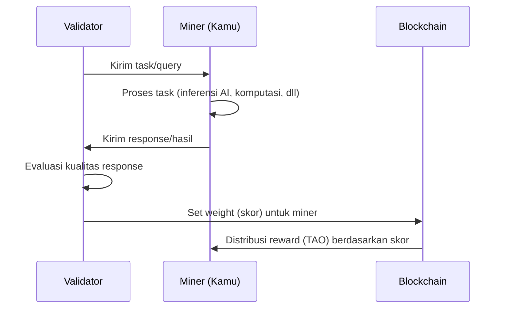

# 🚀 Panduan Setup Node

Panduan ini ditulis **khusus untuk mahasiswa** yang baru pertama kali setup environment blockchain/AI. Ikuti langkah-langkah sesuai sistem operasi (OS) yang kamu gunakan.

:::tip Belum Pernah Pakai Terminal?
Jangan khawatir! Panduan ini akan menjelaskan setiap langkah secara detail. **Terminal** (atau Command Prompt/PowerShell di Windows) adalah aplikasi untuk menjalankan perintah teks. Kamu cukup copy-paste perintah yang diberikan.
:::

---

## Prasyarat Sistem

### Minimum Requirements

| Komponen | Minimum | Rekomendasi | Catatan |
|----------|---------|-------------|---------|
| **OS** | Windows 10/11 (WSL 2), macOS 12+, Ubuntu 20.04 | Windows 11 (WSL 2), macOS 14+, Ubuntu 22.04 | Windows memerlukan WSL 2 |
| **Python** | 3.9 | 3.10 atau 3.11 | btcli mendukung Python 3.9-3.12 |
| **RAM** | 8 GB | 16 GB+ | Cek di System Info / About This Mac |
| **Storage** | 50 GB SSD kosong | 100 GB+ NVMe SSD | Untuk model AI dan dependencies |
| **Internet** | 20 Mbps | 50 Mbps+ | Stabil, hindari WiFi publik untuk mining |
| **Ports** | 8091 (axon) | — | Perlu dibuka di firewall |

:::info GPU Tidak Diperlukan untuk Co-Learning Camp
Panduan ini menggunakan `bittensor-subnet-template` yang hanya memerlukan CPU. Untuk subnet produksi yang membutuhkan GPU NVIDIA, lihat [Modul 5: Perencanaan Hardware](./05-perencanaan-hardware.md).
:::

### Cara Cek Spesifikasi Komputer

import Tabs from '@theme/Tabs';
import TabItem from '@theme/TabItem';

<Tabs>
<TabItem value="windows" label="🪟 Windows" default>

```
1. Tekan tombol Windows + I → buka Settings
2. System → About
3. Lihat: Processor (CPU), Installed RAM, System type (64-bit)
```

</TabItem>
<TabItem value="macos" label="🍎 macOS">

```
1. Klik logo Apple (kiri atas) → About This Mac
2. Lihat: Chip/Processor, Memory, Storage
```

</TabItem>
<TabItem value="linux" label="🐧 Linux">

```bash
# Cek CPU dan RAM
lscpu | head -5
free -h

# Cek storage
df -h /
```

</TabItem>
</Tabs>

---

## Langkah 1: Install Python

Python adalah bahasa pemrograman yang digunakan Bittensor. Kamu **wajib** install Python sebelum melanjutkan.

<Tabs>
<TabItem value="windows" label="🪟 Windows" default>

### Opsi A: Download dari python.org (Paling Mudah)

1. Buka [python.org/downloads](https://www.python.org/downloads/)
2. Download **Python 3.11.x** (klik tombol kuning besar)
3. Jalankan installer yang sudah didownload
4. **PENTING:** Centang ✅ **"Add python.exe to PATH"** di bagian bawah installer
5. Klik **"Install Now"**
6. Tunggu hingga selesai, klik **"Close"**

:::danger Jangan Lupa Centang "Add to PATH"!
Jika lupa mencentang opsi ini, Python tidak akan dikenali di terminal. Kamu harus uninstall dan install ulang dengan opsi ini dicentang.
:::

### Opsi B: Install via Microsoft Store

1. Buka **Microsoft Store**
2. Cari **"Python 3.11"**
3. Klik **"Get"** / **"Install"**

### Verifikasi Instalasi

Buka **Command Prompt** (tekan `Windows + R`, ketik `cmd`, tekan Enter):

```powershell
python --version
```

Output yang diharapkan:

```
Python 3.11.x
```

Jika muncul `python is not recognized`, coba:

```powershell
python3 --version
```

Jika masih error, restart komputer dulu. Jika masih error setelah restart, Python belum benar terinstall — ulangi langkah di atas.

Cek juga pip (package manager Python):

```powershell
pip --version
```

Output yang diharapkan:

```
pip 23.x.x from ... (python 3.11)
```

</TabItem>
<TabItem value="macos" label="🍎 macOS">

### Opsi A: Install via Homebrew (Rekomendasi)

Homebrew adalah package manager untuk macOS. Jika belum punya Homebrew:

```bash
# Install Homebrew (copy-paste seluruh baris ini ke Terminal)
/bin/bash -c "$(curl -fsSL https://raw.githubusercontent.com/Homebrew/install/HEAD/install.sh)"
```

Setelah selesai, ikuti instruksi di terminal untuk menambahkan Homebrew ke PATH. Biasanya:

```bash
# Untuk Apple Silicon (M1/M2/M3/M4)
echo 'eval "$(/opt/homebrew/bin/brew shellenv)"' >> ~/.zprofile
eval "$(/opt/homebrew/bin/brew shellenv)"

# Untuk Intel Mac
echo 'eval "$(/usr/local/bin/brew shellenv)"' >> ~/.zprofile
eval "$(/usr/local/bin/brew shellenv)"
```

Lalu install Python:

```bash
brew install python@3.11
```

### Opsi B: Download dari python.org

1. Buka [python.org/downloads](https://www.python.org/downloads/)
2. Download **Python 3.11.x** untuk macOS
3. Buka file `.pkg` yang didownload dan ikuti installer

### Verifikasi Instalasi

Buka **Terminal** (tekan `Cmd + Space`, ketik "Terminal", tekan Enter):

```bash
python3 --version
```

Output yang diharapkan:

```
Python 3.11.x
```

Cek pip:

```bash
pip3 --version
```

:::info python vs python3
Di macOS, gunakan `python3` dan `pip3` (bukan `python` dan `pip`). macOS memiliki Python 2 bawaan yang sudah usang.
:::

</TabItem>
<TabItem value="linux" label="🐧 Linux (Ubuntu/Debian)">

```bash
# Update package list
sudo apt update

# Install Python 3.11 dan pip
sudo apt install python3.11 python3.11-venv python3-pip -y

# Jika Python 3.11 tidak tersedia di repository, tambahkan PPA:
sudo add-apt-repository ppa:deadsnakes/ppa -y
sudo apt update
sudo apt install python3.11 python3.11-venv python3.11-dev -y
```

### Verifikasi Instalasi

```bash
python3.11 --version
# Output: Python 3.11.x

pip3 --version
# Output: pip 23.x.x from ... (python 3.11)
```

:::tip Jika Punya Multiple Python Versions
Gunakan `python3.11` secara eksplisit, atau set sebagai default:
```bash
sudo update-alternatives --install /usr/bin/python3 python3 /usr/bin/python3.11 1
```
:::

</TabItem>
</Tabs>

---

## Langkah 2: Install Git

Git adalah version control system yang dibutuhkan untuk mengunduh kode subnet.

<Tabs>
<TabItem value="windows" label="🪟 Windows" default>

1. Buka [git-scm.com/download/win](https://git-scm.com/download/win)
2. Download installer (pilih **64-bit Git for Windows Setup**)
3. Jalankan installer:
   - Klik **Next** untuk semua opsi default
   - Pada "Adjusting your PATH environment", pilih **"Git from the command line and also from 3rd-party software"** (opsi tengah, biasanya sudah terpilih)
   - Klik **Next** hingga selesai → **Install** → **Finish**

### Verifikasi

Buka **Command Prompt baru** (tutup yang lama, buka baru):

```powershell
git --version
```

Output yang diharapkan:

```
git version 2.x.x.windows.x
```

</TabItem>
<TabItem value="macos" label="🍎 macOS">

Git biasanya sudah terinstall di macOS. Cek dulu:

```bash
git --version
```

Jika belum ada, macOS akan otomatis menawarkan install **Xcode Command Line Tools**. Klik **"Install"** dan tunggu selesai.

Atau install via Homebrew:

```bash
brew install git
```

</TabItem>
<TabItem value="linux" label="🐧 Linux (Ubuntu/Debian)">

```bash
sudo apt install git -y

# Verifikasi
git --version
```

</TabItem>
</Tabs>

---

## Langkah 3: Install btcli & Bittensor SDK

Di ekosistem Bittensor ada **2 package utama** yang perlu kamu ketahui:

| Package | Install Command | Fungsi |
|---------|----------------|--------|
| **btcli** (Bittensor CLI) | `pip install bittensor-cli` | Tool command-line untuk wallet, staking, registrasi, dan interaksi dengan jaringan |
| **Bittensor SDK** | `pip install "bittensor<10.0.0"` | Library Python untuk membangun miner dan validator kustom |

:::info Referensi Resmi
Panduan ini mengikuti [dokumentasi resmi Bittensor](https://docs.learnbittensor.org/getting-started/install-btcli). Selalu cek halaman tersebut untuk update terbaru.
:::

### Apa itu Virtual Environment?

**Virtual environment** (_lingkungan virtual_) adalah folder terisolasi yang berisi Python dan package-nya sendiri. Ini penting agar dependencies Bittensor tidak konflik dengan project Python lain di komputermu.

```
📁 Komputer kamu
├── 📁 bittensor-env/          ← Virtual environment (Python + btcli + SDK)
│   ├── 📁 bin/ (atau Scripts/)
│   ├── 📁 lib/
│   └── 📁 include/
├── 📁 project-kuliah/         ← Project lain tidak terpengaruh
└── 📁 skripsi/                ← Project lain tidak terpengaruh
```

<Tabs>
<TabItem value="windows" label="🪟 Windows (WSL 2)" default>

:::warning Windows Memerlukan WSL 2
Menurut [dokumentasi resmi Bittensor](https://docs.learnbittensor.org/getting-started/installation), Windows memerlukan **WSL 2 (Windows Subsystem for Linux)** dengan distribusi Ubuntu. Operasi mining dan validating **tidak didukung** di Windows native.
:::

### 4a. Install WSL 2 (Jika Belum Ada)

Buka **PowerShell sebagai Administrator** (klik kanan → "Run as administrator"):

```powershell
wsl --install
```

Ini akan menginstall WSL 2 dengan Ubuntu secara default. **Restart komputer** setelah instalasi selesai.

Setelah restart, Ubuntu akan terbuka otomatis dan meminta kamu membuat username + password untuk Linux.

### 4b. Buka Terminal WSL

Setelah WSL terinstall, buka Ubuntu dari Start Menu, atau ketik di PowerShell:

```powershell
wsl
```

Mulai dari sini, semua perintah dijalankan di **terminal WSL (Linux)**. Ikuti langkah yang sama seperti tab Linux.

### 4c. Buat & Aktifkan Virtual Environment

```bash
# Install venv module
sudo apt update
sudo apt install python3-venv python3-pip -y

# Buat virtual environment
python3 -m venv ~/bittensor-env

# Aktifkan virtual environment
source ~/bittensor-env/bin/activate
```

Setelah aktivasi, terminal akan menampilkan `(bittensor-env)` di awal baris:

```
(bittensor-env) namakamu@DESKTOP-xxx:~$
```

### 4d. Install btcli

```bash
# Upgrade pip dulu
pip install --upgrade pip

# Install btcli (Bittensor CLI)
pip install bittensor-cli
```

Proses ini memakan waktu 2-5 menit tergantung kecepatan internet.

### 4e. Verifikasi

```bash
btcli --version
```

Output yang diharapkan:

```
BTCLI version: 8.x.x
```

Jika muncul, selamat! btcli sudah terinstall.

:::tip Mengaktifkan Ulang di Sesi Berikutnya
Setiap kali membuka terminal WSL baru, aktifkan virtual environment lagi:
```bash
source ~/bittensor-env/bin/activate
```

Tambahkan alias agar lebih mudah:
```bash
echo 'alias btenv="source ~/bittensor-env/bin/activate"' >> ~/.bashrc
source ~/.bashrc
```
Sekarang cukup ketik `btenv` untuk mengaktifkan.
:::

:::info Alternatif: Tanpa WSL (Hanya untuk Wallet Management)
Jika kamu **hanya** ingin membuat wallet dan cek balance (tanpa mining), kamu bisa install btcli di Windows native:
```powershell
python -m venv %USERPROFILE%\bittensor-env
%USERPROFILE%\bittensor-env\Scripts\activate.bat
pip install bittensor-cli
btcli --version
```
Namun untuk mining dan validating, **WSL 2 tetap diperlukan**.
:::

</TabItem>
<TabItem value="macos" label="🍎 macOS">

Buka **Terminal** (Cmd + Space → ketik "Terminal" → Enter):

### 4a. Buat Virtual Environment

```bash
# Buat virtual environment di home directory
python3 -m venv ~/bittensor-env
```

### 4b. Aktifkan Virtual Environment

```bash
source ~/bittensor-env/bin/activate
```

Setelah aktivasi, terminal akan menampilkan `(bittensor-env)` di awal baris:

```
(bittensor-env) namakamu@MacBook ~ %
```

### 4c. Install btcli

Ada 2 cara install btcli di macOS:

#### Cara 1: Via pip (Rekomendasi — di dalam virtual environment)

```bash
# Upgrade pip dulu
pip install --upgrade pip

# Install btcli (Bittensor CLI)
pip install bittensor-cli
```

#### Cara 2: Via Homebrew (Global, tanpa virtual environment)

```bash
brew install btcli
```

:::tip pip vs Homebrew?
- Gunakan **pip** jika kamu juga akan install Bittensor SDK (untuk development miner/validator) — semua dalam satu virtual environment
- Gunakan **Homebrew** jika kamu hanya butuh btcli untuk wallet management dan interaksi dasar
:::

### 4d. Verifikasi

```bash
btcli --version
```

Output yang diharapkan:

```
BTCLI version: 8.x.x
```

:::tip Mengaktifkan Ulang di Sesi Berikutnya
Setiap kali membuka Terminal baru (jika install via pip):
```bash
source ~/bittensor-env/bin/activate
```

Agar tidak lupa, tambahkan alias ke shell config:
```bash
echo 'alias btenv="source ~/bittensor-env/bin/activate"' >> ~/.zshrc
source ~/.zshrc
```
Sekarang cukup ketik `btenv` untuk mengaktifkan.

Jika install via Homebrew, `btcli` tersedia secara global — tidak perlu aktivasi apapun.
:::

</TabItem>
<TabItem value="linux" label="🐧 Linux (Ubuntu/Debian)">

Buka **Terminal**:

### 4a. Install Dependencies

```bash
# Update package list dan install dependencies
sudo apt update
sudo apt install python3-venv python3-pip -y
```

:::warning Linux Perlu Rust
Menurut [dokumentasi resmi](https://docs.learnbittensor.org/getting-started/installation), pengguna Linux harus memiliki **Rust** terinstall. Jika belum:
```bash
curl --proto '=https' --tlsv1.2 -sSf https://sh.rustup.rs | sh
source "$HOME/.cargo/env"
```
Tekan `1` (default) saat diminta memilih opsi instalasi.
:::

### 4b. Buat Virtual Environment

```bash
python3 -m venv ~/bittensor-env
```

### 4c. Aktifkan Virtual Environment

```bash
source ~/bittensor-env/bin/activate
```

Setelah aktivasi, terminal akan menampilkan `(bittensor-env)` di awal baris:

```
(bittensor-env) namakamu@ubuntu:~$
```

### 4d. Install btcli

```bash
# Upgrade pip dulu
pip install --upgrade pip

# Install btcli (Bittensor CLI)
pip install bittensor-cli
```

### 4e. Verifikasi

```bash
btcli --version
```

Output yang diharapkan:

```
BTCLI version: 8.x.x
```

:::tip Mengaktifkan Ulang di Sesi Berikutnya
Setiap kali membuka terminal baru:
```bash
source ~/bittensor-env/bin/activate
```

Tambahkan alias agar lebih mudah:
```bash
echo 'alias btenv="source ~/bittensor-env/bin/activate"' >> ~/.bashrc
source ~/.bashrc
```
Sekarang cukup ketik `btenv` untuk mengaktifkan.
:::

</TabItem>
</Tabs>

### Install Bittensor SDK (Opsional — untuk Development)

Jika kamu ingin membangun miner atau validator kustom, install juga **Bittensor SDK**. SDK ini terpisah dari btcli.

```bash
# Install Bittensor SDK (versi yang kompatibel dengan sebagian besar subnet)
pip install "bittensor<10.0.0"

# Atau dengan dukungan PyTorch (untuk AI/ML)
pip install "bittensor[torch]<10.0.0"
```

:::warning Mengapa Versi di Bawah 10?
Banyak subnet (termasuk template resmi) belum di-update untuk Bittensor SDK v10+. Menggunakan `bittensor<10.0.0` memastikan kompatibilitas paling luas. Jika nanti subnet yang kamu pilih membutuhkan versi lebih baru, kamu bisa upgrade sesuai instruksi README-nya.
:::

:::info Ukuran Download Besar
Package `bittensor[torch]` berukuran 2-4 GB karena menyertakan PyTorch. Pastikan koneksi internet stabil.
:::

Verifikasi SDK:

```bash
python3 -c "import bittensor as bt; print(bt.__version__)"
```

### Install dari Source (Alternatif)

Jika ingin install btcli dari source code:

```bash
git clone https://github.com/opentensor/btcli.git
cd btcli
pip3 install .
```

### Konfigurasi btcli

Setelah install, btcli menyimpan konfigurasi default di `~/.bittensor/config.yml`. Kamu bisa mengatur default values agar tidak perlu mengetik ulang setiap kali:

```bash
# Set default wallet name
btcli config set --wallet-name mywallet

# Set default network
btcli config set --network finney

# Lihat konfigurasi saat ini
btcli config get
```

| Environment Variable | Fungsi |
|---------------------|--------|
| `BTCLI_CONFIG_PATH` | Override lokasi file config |
| `BTCLI_DEBUG_FILE` | Lokasi debug log (default: `~/.bittensor/debug.txt`) |

### Verifikasi Koneksi ke Jaringan

Pastikan btcli bisa terhubung ke jaringan Bittensor:

```bash
btcli subnets list
```

Output yang diharapkan (tabel subnet yang aktif):

```
                                Subnets
NETUID  HYPERPARAMS    NAME              TEMPO  EMISSION  ...
   1    ...           prompting           99     0.13     ...
   2    ...           omron               99     0.08     ...
   ...
```

Jika muncul error koneksi, cek internet kamu dan coba lagi. Jika masih gagal, gunakan endpoint alternatif:

```bash
btcli subnets list --network finney
```

---

## Langkah 4: Membuat Wallet

Wallet Bittensor terdiri dari **cold key** dan **hot key**. Jika belum paham perbedaannya, baca dulu [Modul 6: Wallet & Keamanan](./06-wallet-dan-keamanan.md).

### Apa yang Akan Dibuat?

```
📁 ~/.bittensor/wallets/
└── 📁 mywallet/               ← Nama wallet kamu
    ├── 🔑 coldkey              ← Master key (JAGA BAIK-BAIK!)
    ├── 🔑 coldkeypub.txt       ← Public key (aman untuk dibagikan)
    └── 📁 hotkeys/
        └── 🔑 miner1           ← Key untuk mining
```

:::warning Langkah Ini Sama untuk Semua OS
Setelah Bittensor terinstall, perintah `btcli` sama di Windows, macOS, dan Linux. Pastikan virtual environment sudah aktif (ada `(bittensor-env)` di terminal).
:::

### 5a. Buat Wallet Baru (Cold Key + Hot Key Sekaligus)

```bash
btcli wallet create --wallet-name mywallet --hotkey miner1
```

:::info Syntax btcli
Perhatikan bahwa btcli menggunakan tanda hubung (`--wallet-name`) bukan titik. Beberapa versi lama menggunakan `--wallet.name` — pastikan kamu menggunakan versi terbaru.
:::

Sistem akan meminta kamu membuat **password**:

```
Enter password to encrypt key: ********
Retype password: ********
```

:::tip Tips Password
- Minimal 12 karakter
- Campuran huruf besar, kecil, angka, dan simbol
- **Jangan** gunakan password yang sama dengan akun lain
- **Catat** password ini di tempat aman — jika lupa, cold key tidak bisa diakses
:::

Setelah itu, sistem akan menampilkan **mnemonic phrase** (12 atau 24 kata). Kamu bisa mengatur jumlah kata dengan flag `--n-words`:

```bash
# Default: 12 kata
btcli wallet create --wallet-name mywallet --hotkey miner1

# Atau 24 kata (lebih aman)
btcli wallet create --wallet-name mywallet --hotkey miner1 --n-words 24
```

```
Your mnemonic phrase:
abandon bicycle cargo dragon elephant flame guitar ...
```

:::danger SANGAT PENTING: Backup Mnemonic Phrase!

Mnemonic phrase ini adalah **satu-satunya cara** untuk memulihkan wallet jika hilang. Tidak ada "forgot password" atau "reset" di blockchain.

**WAJIB dilakukan:**
1. Tulis mnemonic di **kertas** (bukan di komputer/HP)
2. Simpan kertas di **tempat aman** (brankas, amplop tersegel)
3. Buat **minimal 2 salinan** di lokasi berbeda
4. Pastikan tulisan terbaca jelas

**JANGAN PERNAH:**
- Screenshot atau foto mnemonic
- Copy-paste ke Notes, Word, Google Docs, atau Notion
- Simpan di cloud (Google Drive, iCloud, OneDrive)
- Kirim via chat (WhatsApp, Telegram, Discord)
- Bagikan ke siapapun — termasuk orang yang mengaku "support Bittensor"
:::

### 5b. Atau Buat Cold Key dan Hot Key Terpisah

Jika lebih suka membuat satu per satu:

```bash
# Buat cold key
btcli wallet new-coldkey --wallet-name mywallet

# Buat hot key
btcli wallet new-hotkey --wallet-name mywallet --hotkey miner1
```

### 5c. Verifikasi Wallet

```bash
# Lihat daftar wallet yang sudah dibuat
btcli wallet list
```

Output yang diharapkan:

```
Wallets
└── mywallet (<ss58_address>)
    └── miner1 (<ss58_address>)
```

```bash
# Lihat overview wallet (semua subnet dan stake)
btcli wallet overview --wallet-name mywallet
```

### 5d. Cek Balance

```bash
btcli wallet balance --wallet-name mywallet
```

Output (wallet baru, balance masih 0):

```
Wallet: mywallet
  Coldkey: <ss58_address>
  Balance: τ0.000000000
```

Opsi tambahan untuk balance:

```bash
# Cek balance semua wallet
btcli wallet balance --all

# Cek balance berdasarkan ss58 address (tanpa perlu wallet lokal)
btcli wallet balance --ss58-address 5Gx...abc

# Sort berdasarkan total balance
btcli wallet balance --all --sort total
```

### 5e. Recovery Wallet (Jika Perlu)

Jika kamu sudah punya mnemonic phrase dan ingin memulihkan wallet:

```bash
# Recovery cold key dari mnemonic
btcli wallet regen-coldkey --wallet-name mywallet --mnemonic "word1 word2 word3 ..."

# Recovery hot key dari mnemonic
btcli wallet regen-hotkey --wallet-name mywallet --hotkey miner1 --mnemonic "word1 word2 word3 ..."
```

### 5f. Mendapatkan TAO

<Tabs>
<TabItem value="testnet" label="🧪 Testnet (Gratis, untuk Belajar)" default>

:::info TAO Testnet
TAO testnet **tidak memiliki nilai uang nyata**. Gunakan untuk belajar dan testing tanpa risiko kehilangan uang.
:::

Pertama, set btcli ke testnet:

```bash
# Set btcli ke testnet
btcli config set --network test

# Atau jalankan command langsung ke testnet
btcli wallet balance --wallet-name mywallet --network test
```

#### Cara Mendapatkan Testnet TAO

Ada beberapa cara untuk mendapatkan testnet TAO:

#### Cara 1: Miner's Union Testnet Faucet (Rekomendasi untuk Pemula)

[Miner's Union](https://app.minersunion.ai/testnet-faucet) menyediakan faucet web yang mudah digunakan untuk mendapatkan testnet TAO.

**Langkah-langkah:**

1. Buka [https://app.minersunion.ai/testnet-faucet](https://app.minersunion.ai/testnet-faucet) di browser
2. Pastikan kamu sudah punya **ss58 address** dari cold key testnet kamu:
   ```bash
   btcli wallet list --wallet-name mywallet
   ```
   Catat alamat ss58 yang ditampilkan (dimulai dengan `5...`)
3. Masukkan **ss58 address cold key** kamu di form faucet
4. Klik **Claim** / **Request Tokens**
5. Tunggu beberapa saat, lalu cek balance:
   ```bash
   btcli wallet balance --wallet-name mywallet --network test
   ```

:::tip Miner's Union
Miner's Union adalah platform komunitas yang membantu miner baru untuk testing di testnet tanpa perlu setup validator sendiri. Selain faucet, mereka juga menyediakan tools monitoring dan panduan mining.
:::

#### Cara 2: Request di Discord Bittensor

Faucet bawaan btcli saat ini **dinonaktifkan** di testnet. Alternatif utama adalah meminta langsung di komunitas:

1. Bergabung ke [Discord Bittensor](https://discord.gg/bittensor)
2. Cari channel **#requests-for-testnet-tao** (atau nama serupa)
3. Kirim pesan dengan ss58 address kamu dan jelaskan bahwa kamu butuh testnet TAO untuk belajar
4. Tunggu admin atau community member mengirim testnet TAO

#### Cara 3: Local Subtensor (untuk Developer)

Jika kamu ingin testing tanpa tergantung testnet publik, jalankan subtensor lokal dengan faucet aktif:

```bash
# Clone subtensor
git clone https://github.com/opentensor/subtensor.git
cd subtensor

# Build dengan fitur faucet
cargo build --release --features pow-faucet

# Jalankan local subtensor
./target/release/node-subtensor --dev
```

Lalu gunakan faucet lokal:

```bash
btcli wallet faucet --wallet-name mywallet --network local
```

:::info Local vs Testnet
- **Local subtensor** — Kamu kontrol penuh, cocok untuk development dan testing cepat
- **Testnet publik** — Lebih realistis, cocok untuk testing sebelum deploy ke mainnet
:::

</TabItem>
<TabItem value="mainnet" label="💰 Mainnet (Bayar, untuk Mining Sungguhan)">

Untuk mainnet, kamu perlu membeli TAO dari exchange:

| Exchange | Pair | Catatan |
|----------|------|---------|
| **Binance** | TAO/USDT | Exchange terbesar, mudah diakses dari Indonesia |
| **KuCoin** | TAO/USDT | Alternatif jika Binance tidak tersedia |
| **Gate.io** | TAO/USDT | Banyak pilihan pair |
| **MEXC** | TAO/USDT | Fee rendah |

**Langkah:**
1. Beli TAO di exchange
2. Withdraw/kirim TAO ke **ss58 address cold key** kamu
3. Pastikan memilih **network Bittensor (TAO)** saat withdraw
4. Cek balance: `btcli wallet balance --wallet-name mywallet`

:::warning Cek Address 2 Kali!
Salah kirim ke address yang salah = TAO hilang permanen dan **tidak bisa dikembalikan**. Selalu double-check address sebelum transfer.
:::

</TabItem>
</Tabs>

### Lokasi File Wallet

Wallet disimpan di lokasi berikut:

| OS | Lokasi |
|----|--------|
| **Windows** | `C:\Users\namakamu\.bittensor\wallets\` |
| **macOS** | `/Users/namakamu/.bittensor/wallets/` |
| **Linux** | `/home/namakamu/.bittensor/wallets/` |

:::tip Folder Tersembunyi
Folder `.bittensor` dimulai dengan titik, artinya tersembunyi di file explorer.

- **Windows:** Buka File Explorer → View → centang "Hidden items"
- **macOS:** Di Finder, tekan `Cmd + Shift + .` untuk tampilkan file tersembunyi
- **Linux:** `ls -la ~/` atau tekan `Ctrl + H` di file manager
:::

---

## Langkah 5: Registrasi ke Subnet

Sebelum mining, kamu harus mendaftarkan hotkey ke subnet yang ingin kamu ikuti.

### 6a. Lihat Daftar Subnet

```bash
# Lihat semua subnet yang tersedia
btcli subnets list
```

:::tip Riset Subnet
Sebelum memilih subnet, lakukan riset di [taostats.io](https://taostats.io) atau [tao.app](https://tao.app) untuk melihat:
- Emisi TAO per subnet
- Jumlah miner dan validator aktif
- Requirements hardware
- Profitabilitas estimasi
:::

### 6b. Lihat Detail Subnet (Metagraph)

```bash
# Lihat metagraph (daftar miner/validator) subnet tertentu
# Ganti 1 dengan nomor subnet yang diinginkan
btcli subnets metagraph --netuid 1
```

:::info Tentang Metagraph
Metagraph menampilkan data "lite" — termasuk stake, trust, incentive, dan emission. Untuk data lengkap (weights & bonds), gunakan Python SDK dengan `lite=False`.
:::

### 6c. Pilih Metode Registrasi

Untuk menjadi miner, kamu harus mendaftarkan hotkey ke subnet agar mendapat **UID** (slot unik). Setiap subnet memiliki jumlah UID terbatas (biasanya 256 slot: maksimal 64 validator + 192 miner).

| Metode | Biaya | Kecepatan | Cocok Untuk |
|--------|-------|-----------|-------------|
| **TAO Registration** | Bayar TAO (fluktuatif) | Cepat (detik) | Yang sudah punya TAO |
| **POW Registration** | Gratis (pakai CPU/GPU) | Lambat (menit - jam) | Mahasiswa yang belum punya TAO |

:::info Biaya Registrasi Dinamis
Biaya registrasi **berubah secara dinamis** — harga naik dua kali lipat setiap ada registrasi baru, lalu perlahan turun seiring waktu. Ini seperti sistem lelang terdesentralisasi. Biaya registrasi yang sudah dibayar **tidak bisa dikembalikan**.
:::

#### Opsi A: Registration dengan TAO (Rekomendasi)

```bash
btcli subnet register \
  --netuid 1 \
  --wallet.name mywallet \
  --wallet.hotkey miner1
```

Sistem akan menampilkan biaya dan meminta konfirmasi:

```
Registration cost: τ0.1 (example)
Do you want to proceed? [y/n]: y
```

:::info Untuk Windows (WSL)
Di WSL, perintah multiline dengan `\` bekerja normal. Jika kamu mengetik di satu baris:
```bash
btcli subnet register --netuid 1 --wallet.name mywallet --wallet.hotkey miner1
```
:::

#### Opsi B: POW Registration (Gratis)

```bash
btcli subnet pow_register \
  --netuid 1 \
  --wallet.name mywallet \
  --wallet.hotkey miner1
```

Proses ini memerlukan komputasi dan bisa memakan waktu beberapa menit hingga jam. Terminal akan menampilkan progress:

```
Solving POW... [difficulty: xxx] [hash rate: xxx H/s]
```

### 6d. Verifikasi Registrasi

```bash
btcli subnets metagraph --netuid 1
```

Cari hotkey address kamu di daftar. Jika muncul, registrasi berhasil.

Kamu juga bisa verifikasi via Python SDK:

```python
import bittensor as bt
sub = bt.subtensor(network="finney")
print(sub.is_hotkey_registered("YOUR_HOTKEY_SS58_ADDRESS"))
# Output: True jika terdaftar
```

---

## Langkah 6: Menjalankan Miner

:::warning Setiap Subnet Berbeda!
Setiap subnet memiliki **cara instalasi dan menjalankan miner yang berbeda-beda**. Tidak ada satu cara universal. **Selalu baca README** dari repository subnet yang kamu pilih sebelum mulai.
:::

### 7a. Cara Umum: Clone dan Ikuti Instruksi Subnet

Langkah umumnya:

1. **Temukan repository subnet** — Cek [GitHub OpenTensor](https://github.com/opentensor), halaman subnet di [Taostats](https://taostats.io), atau docs resmi subnet
2. **Clone repository**
3. **Baca README.md** — Ini langkah PALING PENTING, karena setiap subnet punya cara setup sendiri
4. **Install dependencies** sesuai instruksi
5. **Jalankan miner** sesuai instruksi

### 7b. Contoh: Menjalankan Miner dengan Subnet Template

Kita akan menggunakan [bittensor-subnet-template](https://github.com/opentensor/bittensor-subnet-template) sebagai contoh praktik. Template ini dibuat untuk SDK Bittensor versi lama, jadi kita perlu pin versi `bittensor<10.0.0`.

#### Clone dan Install

```bash
# Clone template subnet
git clone https://github.com/opentensor/bittensor-subnet-template.git
cd bittensor-subnet-template

# Install package
pip install -e .
```

#### Cari Subnet di Testnet

```bash
# Lihat daftar subnet yang tersedia di testnet
btcli subnet list --subtensor.network test
```

Catat **netuid** subnet yang ingin kamu ikuti (misalnya `1`).

#### Register Miner ke Subnet

```bash
btcli subnet register \
  --netuid 1 \
  --wallet.name mywallet \
  --wallet.hotkey miner1 \
  --subtensor.network test
```

:::info Butuh Test TAO
Registrasi ke subnet membutuhkan test TAO. Jika belum punya, claim dari faucet terlebih dahulu (lihat [Langkah 4](#langkah-4-membuat-wallet)).
:::

#### Jalankan Miner

<Tabs>
<TabItem value="macos" label="🍎 macOS" default>

```bash
# caffeinate mencegah Mac sleep saat miner berjalan
caffeinate -i python3 neurons/miner.py \
  --netuid 1 \
  --wallet.name mywallet \
  --wallet.hotkey miner1 \
  --subtensor.network test \
  --logging.debug
```

</TabItem>
<TabItem value="linux" label="🐧 Linux / WSL">

```bash
python3 neurons/miner.py \
  --netuid 1 \
  --wallet.name mywallet \
  --wallet.hotkey miner1 \
  --subtensor.network test \
  --logging.debug
```

</TabItem>
</Tabs>

#### Verifikasi Miner Berjalan

Buka **terminal baru** (jangan tutup terminal miner!) dan jalankan:

```bash
# Aktifkan virtual environment dulu
source ~/bittensor-env/bin/activate

# Cek metagraph — miner kamu seharusnya muncul di sini
btcli subnet metagraph --netuid 1 --subtensor.network test
```

Jika miner kamu terdaftar dan berjalan, kamu akan melihat hotkey-mu di daftar metagraph dengan status `ACTIVE: True`.

#### Parameter Umum Miner

| Parameter | Fungsi | Contoh |
|-----------|--------|--------|
| `--wallet.name` | Nama wallet | `mywallet` |
| `--wallet.hotkey` | Nama hotkey | `miner1` |
| `--netuid` | Nomor ID subnet (lihat `btcli subnets list`) | `1`, `8`, `18`, dll |
| `--axon.port` | Port untuk menerima query | `8091` |
| `--logging.debug` | Tampilkan log detail | — |
| `--subtensor.network` | Jaringan yang digunakan | `finney` (mainnet) atau `test` |

:::tip Cara Tahu Command yang Benar
1. **Baca README.md** di repo subnet
2. Cari folder `neurons/` atau `src/` untuk entry point
3. Cek `pyproject.toml` atau `setup.py` untuk script commands
4. Join Discord subnet untuk tanya komunitas
:::

#### Apa yang Terjadi Saat Miner Berjalan?

Ketika miner berjalan, berikut proses yang terjadi di balik layar:



| Apa yang Terjadi | Penjelasan |
|-----------------|------------|
| **Miner menerima query** | Validator mengirim task ke miner melalui jaringan |
| **Miner memproses task** | Miner menjalankan logika (AI model, komputasi, dll) sesuai spesifikasi subnet |
| **Validator menilai** | Response miner dinilai kualitasnya oleh validator |
| **Reward diberikan** | Miner dengan response terbaik mendapat porsi TAO terbesar |
| **Kompetisi terus-menerus** | Proses ini berulang setiap epoch — miner harus terus memberikan response berkualitas |

#### Contoh Manfaat Nyata per Subnet

| Subnet | Apa yang Miner Lakukan | Output untuk Dunia Nyata |
|--------|----------------------|--------------------------|
| **SN1 Apex** | Mengirim solusi algoritma | Benchmark dan optimisasi AI model |
| **SN8 Taoshi** | Prediksi harga aset finansial | Sinyal trading untuk trader dan hedge fund |
| **SN13 Dataverse** | Scraping dan kurasi data web | Dataset terstruktur untuk riset dan bisnis |
| **SN18 Zeus** | Prediksi cuaca berbasis AI | Data cuaca untuk pertanian dan asuransi |
| **SN23 NicheImage** | Generate gambar dari prompt | Layanan image generation terdesentralisasi |

#### Mengapa Ini Penting?

1. **Kamu dibayar TAO** — Semakin bagus response miner-mu, semakin besar reward yang kamu terima
2. **Kontribusi nyata** — Output miner digunakan oleh konsumen dan aplikasi di dunia nyata
3. **Kompetisi sehat** — Mekanisme insentif mendorong miner untuk terus meningkatkan kualitas
4. **Desentralisasi AI** — Kamu membantu membangun infrastruktur AI yang tidak dikontrol satu pihak

:::info Subnet Template = Latihan
Perlu diingat bahwa `bittensor-subnet-template` yang kita jalankan tadi adalah **template untuk belajar**, bukan subnet produksi. Di mainnet, setiap subnet memiliki task spesifik (seperti contoh di tabel di atas) dengan reward TAO yang bernilai nyata.
:::

### 7c. Menjaga Miner Tetap Berjalan

Saat kamu tutup terminal, miner akan berhenti. Gunakan metode berikut agar miner tetap berjalan di background:

<Tabs>
<TabItem value="windows" label="🪟 Windows (WSL)" default>

Karena mining memerlukan WSL, gunakan metode Linux (screen/tmux) di dalam WSL:

```bash
# Buka WSL dari PowerShell
wsl
```

Lalu ikuti instruksi Linux di tab sebelah.

</TabItem>
<TabItem value="macos" label="🍎 macOS">

#### Metode 1: screen (Rekomendasi untuk Belajar)

```bash
# Install screen (biasanya sudah ada)
# Jika belum: brew install screen

# Buat screen session baru
screen -S bittensor-miner

# Aktifkan virtual environment
source ~/bittensor-env/bin/activate

# Jalankan miner (sesuaikan command dengan subnet yang kamu pakai)
# Contoh subnet template:
python neurons/miner.py \
  --wallet.name mywallet \
  --wallet.hotkey miner1 \
  --netuid 1 \
  --axon.port 8091 \
  --logging.debug

# Untuk detach (keluar tanpa mematikan): tekan Ctrl+A, lalu tekan D
# Untuk re-attach (kembali ke screen): screen -r bittensor-miner
# Untuk list semua screen session: screen -ls
```

#### Metode 2: tmux (Alternatif screen)

```bash
# Install tmux
brew install tmux

# Buat session baru
tmux new -s bittensor-miner

# Aktifkan virtual environment dan jalankan miner
source ~/bittensor-env/bin/activate
# Jalankan command miner sesuai instruksi subnet

# Untuk detach: tekan Ctrl+B, lalu tekan D
# Untuk re-attach: tmux attach -t bittensor-miner
# Untuk list sessions: tmux ls
```

#### Metode 3: caffeinate (Mencegah Mac Sleep)

```bash
# Mencegah Mac sleep selama miner berjalan
# Tambahkan caffeinate -s di depan command miner kamu
caffeinate -s python neurons/miner.py \
  --wallet.name mywallet \
  --wallet.hotkey miner1 \
  --netuid 1 \
  --axon.port 8091
```

:::warning caffeinate Saja Tidak Cukup
`caffeinate` hanya mencegah sleep, tapi jika terminal ditutup miner tetap mati. **Kombinasikan** caffeinate dengan screen/tmux:
```bash
screen -S bittensor-miner
caffeinate -s <command-miner-kamu>
# Ctrl+A, D untuk detach
```
:::

#### Metode 4: launchd (Auto-start saat Mac Menyala)

Buat file plist:

```bash
nano ~/Library/LaunchAgents/com.bittensor.miner.plist
```

Isi dengan:

```xml
<?xml version="1.0" encoding="UTF-8"?>
<!DOCTYPE plist PUBLIC "-//Apple//DTD PLIST 1.0//EN" "http://www.apple.com/DTDs/PropertyList-1.0.dtd">
<plist version="1.0">
<dict>
    <key>Label</key>
    <string>com.bittensor.miner</string>
    <key>ProgramArguments</key>
    <array>
        <string>/Users/namakamu/bittensor-env/bin/python</string>
        <string>neurons/miner.py</string>
        <string>--wallet.name</string>
        <string>mywallet</string>
        <string>--wallet.hotkey</string>
        <string>miner1</string>
        <string>--netuid</string>
        <string>1</string>
        <string>--axon.port</string>
        <string>8091</string>
    </array>
    <key>WorkingDirectory</key>
    <string>/Users/namakamu/subnet-repo</string>
    <key>RunAtLoad</key>
    <true/>
    <key>KeepAlive</key>
    <true/>
    <key>StandardOutPath</key>
    <string>/tmp/bittensor-miner.log</string>
    <key>StandardErrorPath</key>
    <string>/tmp/bittensor-miner-error.log</string>
</dict>
</plist>
```

```bash
# Load service
launchctl load ~/Library/LaunchAgents/com.bittensor.miner.plist

# Cek status
launchctl list | grep bittensor

# Lihat log
tail -f /tmp/bittensor-miner.log

# Stop service
launchctl unload ~/Library/LaunchAgents/com.bittensor.miner.plist
```

</TabItem>
<TabItem value="linux" label="🐧 Linux (Ubuntu/Debian)">

#### Metode 1: screen (Rekomendasi untuk Belajar)

```bash
# Install screen
sudo apt install screen -y

# Buat screen session baru
screen -S bittensor-miner

# Aktifkan virtual environment
source ~/bittensor-env/bin/activate

# Jalankan miner (sesuaikan command dengan subnet yang kamu pakai)
# Contoh subnet template:
python neurons/miner.py \
  --wallet.name mywallet \
  --wallet.hotkey miner1 \
  --netuid 1 \
  --axon.port 8091 \
  --logging.debug

# Untuk detach (keluar tanpa mematikan): tekan Ctrl+A, lalu tekan D
# Untuk re-attach (kembali ke screen): screen -r bittensor-miner
# Untuk list semua screen session: screen -ls
```

#### Metode 2: tmux (Alternatif screen)

```bash
# Install tmux
sudo apt install tmux -y

# Buat session baru
tmux new -s bittensor-miner

# Aktifkan virtual environment dan jalankan miner
source ~/bittensor-env/bin/activate
# Jalankan command miner sesuai instruksi subnet

# Untuk detach: tekan Ctrl+B, lalu tekan D
# Untuk re-attach: tmux attach -t bittensor-miner
# Untuk list sessions: tmux ls
```

#### Metode 3: systemd (Rekomendasi untuk Production)

systemd membuat miner **otomatis berjalan saat server menyala** dan **auto-restart jika crash**.

```bash
# Buat service file
sudo nano /etc/systemd/system/bittensor-miner.service
```

Isi dengan (ganti `namakamu` dengan username kamu, dan sesuaikan `ExecStart` dengan command miner subnet yang kamu pakai):

```ini
[Unit]
Description=Bittensor Miner
After=network.target

[Service]
Type=simple
User=namakamu
WorkingDirectory=/home/namakamu/subnet-repo
# Sesuaikan ExecStart dengan command miner dari subnet kamu
ExecStart=/home/namakamu/bittensor-env/bin/python neurons/miner.py \
  --wallet.name mywallet \
  --wallet.hotkey miner1 \
  --netuid 1 \
  --axon.port 8091
Restart=on-failure
RestartSec=10
Environment=PYTHONUNBUFFERED=1

[Install]
WantedBy=multi-user.target
```

Simpan file (`Ctrl+O` → Enter → `Ctrl+X`), lalu aktifkan:

```bash
# Reload konfigurasi systemd
sudo systemctl daemon-reload

# Aktifkan agar auto-start saat boot
sudo systemctl enable bittensor-miner

# Jalankan sekarang
sudo systemctl start bittensor-miner

# Cek status (harus "active (running)")
sudo systemctl status bittensor-miner
```

Perintah systemd yang sering dipakai:

| Perintah | Fungsi |
|----------|--------|
| `sudo systemctl start bittensor-miner` | Mulai miner |
| `sudo systemctl stop bittensor-miner` | Hentikan miner |
| `sudo systemctl restart bittensor-miner` | Restart miner |
| `sudo systemctl status bittensor-miner` | Cek status |
| `journalctl -u bittensor-miner -f` | Lihat log real-time |
| `journalctl -u bittensor-miner --since "1 hour ago"` | Log 1 jam terakhir |

</TabItem>
</Tabs>

---

## Langkah 7: Membuka Port Firewall

Miner perlu menerima koneksi masuk dari validator. Port default Bittensor axon adalah **8091**.

<Tabs>
<TabItem value="windows" label="🪟 Windows" default>

### Via GUI (Windows Defender Firewall)

1. Tekan `Windows + R` → ketik `wf.msc` → Enter
2. Klik **"Inbound Rules"** di panel kiri
3. Klik **"New Rule..."** di panel kanan
4. Pilih **"Port"** → Next
5. Pilih **"TCP"**, masukkan **8091** → Next
6. Pilih **"Allow the connection"** → Next
7. Centang semua (Domain, Private, Public) → Next
8. Name: **"Bittensor Axon"** → Finish

### Via Command (PowerShell sebagai Administrator)

```powershell
netsh advfirewall firewall add rule name="Bittensor Axon" dir=in action=allow protocol=TCP localport=8091
```

</TabItem>
<TabItem value="macos" label="🍎 macOS">

macOS Firewall biasanya tidak memblok koneksi outbound. Untuk koneksi inbound:

1. Buka **System Settings** → **Network** → **Firewall**
2. Jika Firewall aktif, klik **"Options..."**
3. Klik **"+"** → tambahkan aplikasi Python dari virtual environment
4. Set ke **"Allow incoming connections"**

Atau via terminal:

```bash
# Cek status firewall
sudo /usr/libexec/ApplicationFirewall/socketfilterfw --getglobalstate

# Tambahkan exception (jika firewall aktif)
sudo /usr/libexec/ApplicationFirewall/socketfilterfw --add /Users/namakamu/bittensor-env/bin/python3
sudo /usr/libexec/ApplicationFirewall/socketfilterfw --unblockapp /Users/namakamu/bittensor-env/bin/python3
```

:::info Port Forwarding di Router
Jika mining dari rumah, kamu mungkin perlu setup **port forwarding** di router WiFi agar validator bisa mencapai miner kamu. Caranya bervariasi per router — cek manual router atau tanya ISP kamu. Forward **port 8091 TCP** ke IP lokal komputer kamu.
:::

</TabItem>
<TabItem value="linux" label="🐧 Linux (Ubuntu/Debian)">

```bash
# Cek status UFW (Ubuntu Firewall)
sudo ufw status

# Jika UFW aktif, buka port 8091
sudo ufw allow 8091/tcp

# Verifikasi
sudo ufw status
```

Output yang diharapkan:

```
Status: active

To                         Action      From
--                         ------      ----
8091/tcp                   ALLOW       Anywhere
```

Jika UFW belum aktif dan kamu ingin mengaktifkan:

```bash
# HATI-HATI: pastikan SSH port (22) sudah diallow sebelum enable
sudo ufw allow ssh
sudo ufw allow 8091/tcp
sudo ufw enable
```

:::danger Jangan Lock Diri Sendiri!
Jika mengakses server via SSH, **SELALU** allow port SSH (22) sebelum mengaktifkan UFW. Jika tidak, kamu akan terkunci dan tidak bisa akses server.
:::

</TabItem>
</Tabs>

---

## Langkah 8: Verifikasi Node

Setelah miner berjalan, verifikasi bahwa semuanya bekerja dengan benar.

### 9a. Cek Metagraph

```bash
btcli subnets metagraph --netuid 1
```

Output contoh:

```
UID  │ HOTKEY       │ STAKE    │ TRUST  │ INCENTIVE │ EMISSION │ UPDATED
0    │ 5Gx...abc    │ 100.0    │ 0.95   │ 0.12      │ 0.08     │ 120
1    │ 5Hy...def    │ 50.0     │ 0.87   │ 0.09      │ 0.06     │ 115
...  │ (key kamu)   │ ...      │ ...    │ ...       │ ...      │ ...
```

### 9b. Memahami Metrik

| Metrik | Arti | Target | Penjelasan |
|--------|------|--------|------------|
| **UID** | ID unik di subnet | — | Nomor registrasi kamu di subnet |
| **HOTKEY** | Alamat public hotkey | — | Cari ini untuk menemukan posisi kamu |
| **STAKE** | Jumlah TAO yang di-stake | Lebih tinggi = lebih baik (validator) | Menunjukkan "taruhan" di jaringan |
| **TRUST** | Skor kepercayaan | Di atas 0.5 | Seberapa dipercaya validator terhadap kamu |
| **INCENTIVE** | Skor insentif | Setinggi mungkin | Kualitas response kamu vs miner lain |
| **EMISSION** | TAO yang diterima per epoch | Setinggi mungkin | Reward yang kamu dapatkan |
| **UPDATED** | Block terakhir update | Harus recent | Jika angka ini tidak berubah, ada masalah |

### 9c. Monitor Berkala

Jalankan pengecekan ini secara rutin (minimal 1x sehari):

```bash
# Cek metagraph (posisi dan skor kamu)
btcli subnets metagraph --netuid 1

# Cek balance (apakah reward masuk)
btcli wallet balance --wallet-name mywallet

# Cek apakah miner masih running
# Linux/macOS:
ps aux | grep miner.py

# Windows (PowerShell):
# Get-Process python | Where-Object {$_.CommandLine -like "*miner*"}
```

---

## 🔧 Troubleshooting Cepat

### Masalah Umum per OS

<Tabs>
<TabItem value="windows" label="🪟 Windows (WSL)" default>

| Masalah | Penyebab | Solusi |
|---------|----------|--------|
| `wsl --install` gagal | Fitur WSL belum aktif | Buka "Turn Windows features on/off", aktifkan "Windows Subsystem for Linux" |
| `python3: command not found` (di WSL) | Python belum terinstall di WSL | `sudo apt update && sudo apt install python3 python3-pip python3-venv -y` |
| `btcli: command not found` | venv tidak aktif | `source ~/bittensor-env/bin/activate` |
| `pip install bittensor-cli` error | Rust belum terinstall (di WSL) | Install Rust: `curl --proto '=https' --tlsv1.2 -sSf https://sh.rustup.rs \| sh` |
| Port 8091 tidak bisa diakses | Firewall Windows memblok WSL | Tambahkan rule di Windows Firewall untuk port 8091 |
| Mining tidak berjalan di Windows native | Mining tidak didukung di Windows | Gunakan WSL 2 atau mesin Linux |

</TabItem>
<TabItem value="macos" label="🍎 macOS">

| Masalah | Penyebab | Solusi |
|---------|----------|--------|
| `command not found: python` | macOS pakai `python3` | Gunakan `python3` bukan `python` |
| `xcrun: error: invalid active developer path` | Xcode tools belum install | `xcode-select --install` |
| `ERROR: Could not install packages` | Permission issue | Pastikan pakai virtual environment |
| `btcli: command not found` | venv tidak aktif | `source ~/bittensor-env/bin/activate` |
| Mac sleep saat mining | Power settings | `caffeinate -s` atau ubah di System Settings → Energy |
| `SSL: CERTIFICATE_VERIFY_FAILED` | Sertifikat Python belum install | Jalankan `/Applications/Python 3.11/Install Certificates.command` |

</TabItem>
<TabItem value="linux" label="🐧 Linux">

| Masalah | Penyebab | Solusi |
|---------|----------|--------|
| `btcli: command not found` | venv tidak aktif | `source ~/bittensor-env/bin/activate` |
| `Connection refused` | Port tertutup | `sudo ufw allow 8091/tcp` |
| `Permission denied` saat install | Perlu sudo | Jangan `sudo pip install`, gunakan venv |
| `No module named 'venv'` | python3-venv belum install | `sudo apt install python3-venv` |

</TabItem>
</Tabs>

### Masalah Umum Semua OS

| Masalah | Penyebab | Solusi |
|---------|----------|--------|
| `Registration failed` | TAO tidak cukup atau slot penuh | Cek balance, coba POW registration |
| `Timeout` di btcli | Koneksi jaringan lambat | Coba endpoint alternatif (lihat di atas) |
| `Wallet not found` | Nama wallet salah atau path berbeda | `btcli wallet list` untuk cek nama |
| Miner running tapi tidak dapat reward | Quality terlalu rendah atau baru mulai | Tunggu beberapa epoch, optimisasi model |
| `ModuleNotFoundError` | Dependencies belum terinstall | `pip install -r requirements.txt` |

:::warning Selalu Cek Log!
Jika ada masalah, langkah pertama adalah **selalu baca pesan error dengan teliti**. 90% masalah bisa diselesaikan hanya dengan membaca error message.

```bash
# Linux (systemd)
journalctl -u bittensor-miner -f --no-pager -n 100

# Linux/macOS (screen)
screen -r bittensor-miner

# Semua OS (jika miner jalan langsung di terminal)
# Error akan langsung terlihat di terminal
```
:::

---

## Rangkuman Perintah

Cheat sheet lengkap — bookmark halaman ini untuk referensi cepat:

| Langkah | Perintah | Catatan |
|---------|----------|---------|
| Install btcli | `pip install bittensor-cli` | Atau `brew install btcli` (macOS) |
| Install SDK | `pip install "bittensor<10.0.0"` | Opsional, untuk dev miner/validator |
| Aktifkan venv (Windows WSL/Linux) | `source ~/bittensor-env/bin/activate` | Setiap buka terminal baru |
| Aktifkan venv (macOS) | `source ~/bittensor-env/bin/activate` | Setiap buka terminal baru |
| Cek versi btcli | `btcli --version` | Pastikan terinstall |
| Set default config | `btcli config set --wallet-name mywallet` | Opsional, agar tidak ketik ulang |
| Buat wallet | `btcli wallet create --wallet-name mywallet --hotkey miner1` | Backup mnemonic! |
| Cek wallet | `btcli wallet list` | Lihat semua wallet |
| Cek balance | `btcli wallet balance --wallet-name mywallet` | Cek saldo TAO |
| Lihat subnet | `btcli subnets list` | Daftar subnet aktif |
| Register (bayar) | `btcli subnet register --netuid 1 --wallet.name mywallet --wallet.hotkey miner1` | Butuh TAO |
| Register (gratis) | `btcli subnet pow_register --netuid 1 --wallet.name mywallet --wallet.hotkey miner1` | Butuh waktu |
| Jalankan miner | Bervariasi per subnet — baca README repo subnet | Contoh: `python neurons/miner.py ...` |
| Cek metagraph | `btcli subnets metagraph --netuid 1` | Lihat posisi kamu |
| Recovery wallet | `btcli wallet regen-coldkey --wallet-name mywallet --mnemonic "..."` | Dari mnemonic phrase |

**Selanjutnya:** [Debugging & Troubleshooting →](./08-debugging-dan-troubleshooting.md)
