# 🔧 Debugging & Troubleshooting

## Top 10 Masalah Umum

### 1. Miner Tidak Menerima Query

**Gejala:** Log menunjukkan miner berjalan, tapi tidak ada query masuk.

**Penyebab:**
- Port axon (8091) tidak terbuka
- Firewall memblok koneksi
- NAT/CGNAT dari ISP

**Solusi:**
```bash
# Cek apakah port terbuka
sudo ufw status
sudo ufw allow 8091/tcp

# Test dari luar (gunakan VPS/server lain)
nc -zv <your-ip> 8091

# Jika di belakang NAT, gunakan tunnel
# Lihat bagian ISP Indonesia di modul 4
```

### 2. CUDA Out of Memory

**Gejala:** Error `RuntimeError: CUDA out of memory`

**Penyebab:** Model terlalu besar untuk VRAM GPU.

**Solusi:**
```bash
# Cek penggunaan GPU
nvidia-smi

# Opsi 1: Kurangi batch size di config miner
# Opsi 2: Gunakan model quantized (4-bit/8-bit)
pip install bitsandbytes
# Dalam kode: model = AutoModel.from_pretrained(..., load_in_4bit=True)

# Opsi 3: Clear GPU cache
python3 -c "import torch; torch.cuda.empty_cache()"
```

### 3. Wallet Not Found

**Gejala:** Error `Wallet not found at path...`

**Penyebab:** Path wallet tidak sesuai atau virtual environment berbeda.

**Solusi:**
```bash
# Cek lokasi wallet
ls ~/.bittensor/wallets/

# Pastikan nama wallet benar
btcli wallet list

# Jika wallet di lokasi custom
btcli wallet list --wallet.path /path/to/wallets/
```

### 4. Registration Gagal

**Gejala:** `Registration failed` atau `Not enough balance`

**Penyebab:** TAO tidak cukup atau semua slot terisi.

**Solusi:**
```bash
# Cek balance
btcli wallet balance --wallet.name mywallet

# Cek biaya registrasi
btcli subnet register --netuid <ID> --wallet.name mywallet --wallet.hotkey miner1

# Alternatif: POW registration (gratis tapi lambat)
btcli subnet pow_register --netuid <ID> --wallet.name mywallet --wallet.hotkey miner1
```

### 5. Connection Timeout ke Subtensor

**Gejala:** `ConnectionError` atau `Timeout` saat konek ke chain.

**Penyebab:** Network issue atau endpoint subtensor bermasalah.

**Solusi:**
```bash
# Gunakan endpoint alternatif
btcli subnet list --subtensor.network finney
# atau
btcli subnet list --subtensor.chain_endpoint wss://entrypoint-finney.opentensor.ai:443
```

### 6. Python Dependency Conflicts

**Gejala:** `ImportError` atau versi package tidak cocok.

**Penyebab:** Environment Python tidak bersih.

**Solusi:**
```bash
# Buat environment baru
python3 -m venv ~/bittensor-fresh
source ~/bittensor-fresh/bin/activate

# Install ulang dari awal
pip install --upgrade pip
pip install bittensor
pip install -r requirements.txt
```

### 7. Miner Sering Restart / Crash

**Gejala:** Miner berhenti secara tiba-tiba dan sering.

**Penyebab:** Memory leak, OOM killer, atau bug di kode miner.

**Solusi:**
```bash
# Cek apakah OOM killer aktif
dmesg | grep -i "oom\|killed"

# Cek memory usage
free -h
watch -n 5 free -h  # Monitor real-time

# Tambahkan swap jika RAM kurang
sudo fallocate -l 8G /swapfile
sudo chmod 600 /swapfile
sudo mkswap /swapfile
sudo swapon /swapfile
```

### 8. Weight Terus Menurun

**Gejala:** Ranking/weight miner terus turun di metagraph.

**Penyebab:** Kualitas response menurun atau kompetitor naik.

**Solusi:**
- Update model ke versi terbaru
- Cek log untuk error yang mungkin merusak quality
- Benchmark response time vs kompetitor
- Pertimbangkan pindah ke subnet yang lebih cocok

### 9. Deregistration

**Gejala:** Hotkey tidak lagi muncul di metagraph.

**Penyebab:** Weight terlalu rendah terlalu lama, atau subnet penuh dan digantikan miner baru.

**Solusi:**
```bash
# Cek apakah masih terdaftar
btcli subnet metagraph --netuid <ID> | grep <your-hotkey>

# Jika sudah deregistered, perlu register ulang
btcli subnet register --netuid <ID> --wallet.name mywallet --wallet.hotkey miner1
```

### 10. Log Tidak Informatif

**Gejala:** Log hanya menunjukkan info minimal, sulit debug.

**Penyebab:** Log level terlalu rendah.

**Solusi:**
```bash
# Jalankan miner dengan debug logging
python neurons/miner.py \
  --wallet.name mywallet \
  --wallet.hotkey miner1 \
  --netuid <ID> \
  --logging.debug \
  --logging.trace  # Paling detail
```

---

## 🔄 Alur Debugging

Gunakan alur berikut saat menemui masalah:

```mermaid
graph TD
    A[❌ Masalah Terdeteksi] --> B{Miner Running?}

    B -->|Tidak| C[Cek Error Message]
    C --> C1{Import Error?}
    C1 -->|Ya| C2[Fix dependencies<br/>pip install]
    C1 -->|Tidak| C3{Wallet Error?}
    C3 -->|Ya| C4[Cek wallet path<br/>btcli wallet list]
    C3 -->|Tidak| C5{Port Error?}
    C5 -->|Ya| C6[Cek firewall<br/>ufw allow port]
    C5 -->|Tidak| C7[Cek log detail<br/>--logging.debug]

    B -->|Ya| D{Receiving Queries?}
    D -->|Tidak| E[Cek network<br/>connectivity]
    E --> E1[Cek port terbuka]
    E1 --> E2[Cek NAT/firewall]
    E2 --> E3[Setup tunnel<br/>jika perlu]

    D -->|Ya| F{Quality Score OK?}
    F -->|Tidak| G[Benchmark model]
    G --> G1[Update model]
    G1 --> G2[Optimize response time]

    F -->|Ya| H{Resource OK?}
    H -->|Tidak| I[Monitor resources]
    I --> I1[GPU: nvidia-smi]
    I1 --> I2[RAM: free -h]
    I2 --> I3[Disk: df -h]

    H -->|Ya| J[✅ Semua Normal<br/>Monitor terus]
```



---

## 📋 Analisis Log

### Lokasi Log

| Metode Running | Lokasi Log |
|----------------|------------|
| **Terminal langsung** | Stdout di terminal |
| **screen** | Re-attach: `screen -r bittensor-miner` |
| **systemd** | `journalctl -u bittensor-miner -f` |
| **Docker** | `docker logs -f <container>` |
| **File** | `--logging.logging_dir /path/to/logs/` |

### Log Level

| Level | Flag | Kapan Digunakan |
|-------|------|-----------------|
| **Info** | (default) | Operasi normal |
| **Debug** | `--logging.debug` | Troubleshooting umum |
| **Trace** | `--logging.trace` | Debugging mendalam |

### Pola Log Penting

```bash
# Contoh log normal
[INFO] Miner started on port 8091
[INFO] Received query from validator 5Gx...abc
[INFO] Response sent in 2.3s
[INFO] Weight updated: 0.85

# Contoh log bermasalah
[ERROR] CUDA out of memory
[WARNING] Response timeout after 30s
[ERROR] Connection refused to subtensor
[WARNING] Trust score dropping: 0.45 -> 0.32
```

### Tips Analisis Log

```bash
# Cari error di log
journalctl -u bittensor-miner --since "1 hour ago" | grep -i error

# Hitung jumlah error
journalctl -u bittensor-miner --since "1 day ago" | grep -ci error

# Lihat response time
journalctl -u bittensor-miner --since "1 hour ago" | grep "Response sent"

# Monitor real-time
journalctl -u bittensor-miner -f --no-pager
```

---

## 🌐 Debugging Koneksi Jaringan

### Step-by-Step Network Debug

```bash
# 1. Cek koneksi internet dasar
ping -c 5 8.8.8.8

# 2. Cek DNS resolution
nslookup entrypoint-finney.opentensor.ai

# 3. Cek koneksi ke subtensor
curl -s -o /dev/null -w "%{http_code}" https://entrypoint-finney.opentensor.ai:443

# 4. Cek port lokal terbuka
ss -tlnp | grep 8091

# 5. Cek port dari luar (jalankan dari VPS/server lain)
nc -zv <your-public-ip> 8091

# 6. Cek latency ke validator (jika tahu IP-nya)
ping -c 10 <validator-ip>
traceroute <validator-ip>
```

---

## 🖥️ Troubleshooting GPU/CUDA

### Diagnostic Commands

```bash
# Status GPU lengkap
nvidia-smi

# Monitor GPU real-time (refresh tiap 1 detik)
watch -n 1 nvidia-smi

# Cek CUDA version
nvcc --version

# Cek PyTorch CUDA support
python3 -c "import torch; print(f'CUDA available: {torch.cuda.is_available()}'); print(f'CUDA version: {torch.version.cuda}'); print(f'GPU: {torch.cuda.get_device_name(0)}')"

# Cek VRAM usage detail
python3 -c "import torch; print(f'Allocated: {torch.cuda.memory_allocated()/1e9:.1f} GB'); print(f'Reserved: {torch.cuda.memory_reserved()/1e9:.1f} GB')"
```

### Masalah CUDA Umum

| Masalah | Penyebab | Solusi |
|---------|----------|--------|
| `CUDA not available` | Driver tidak terinstall | `sudo apt install nvidia-driver-535` |
| `CUDA version mismatch` | PyTorch & CUDA tidak cocok | Install PyTorch yang match dengan CUDA version |
| `CUDA OOM` | VRAM penuh | Quantize model, reduce batch size |
| `CUDA error: device-side assert` | Bug dalam kode | Cek input data, tambahkan error handling |
| GPU tidak terdeteksi | Driver issue | Reboot, reinstall driver |

---

## 🇮🇩 Masalah Spesifik Indonesia

### ISP Troubleshooting

```bash
# Cek public IP (apakah berubah?)
curl -s ifconfig.me
# Simpan dan bandingkan secara berkala

# Cek apakah di belakang CGNAT
# Jika IP dimulai dengan 10.x.x.x atau 100.64-127.x.x → CGNAT
curl -s ifconfig.me
ip addr show

# Test port forwarding
# Dari luar: nc -zv <public-ip> 8091
# Jika gagal → perlu tunnel (Ngrok/Cloudflare/VPS)
```

### Masalah Listrik

```bash
# Script auto-restart setelah power outage
# Tambahkan ke crontab
crontab -e
# @reboot sleep 60 && systemctl start bittensor-miner

# Cek uptime (berapa lama sejak boot terakhir)
uptime
```

---

## 📚 Referensi Command

| Perintah | Fungsi |
|----------|--------|
| `btcli wallet list` | Daftar wallet |
| `btcli wallet balance` | Cek balance |
| `btcli subnet list` | Daftar subnet |
| `btcli subnet metagraph --netuid <ID>` | Lihat state subnet |
| `nvidia-smi` | Status GPU |
| `journalctl -u bittensor-miner -f` | Log miner (systemd) |
| `screen -r bittensor-miner` | Re-attach screen |
| `sudo ufw status` | Status firewall |
| `ss -tlnp` | Port yang terbuka |
| `free -h` | Memory usage |
| `df -h` | Disk usage |
| `htop` | Proses dan resource monitor |

---

## Rangkuman

| Area | Tips Utama |
|------|-----------|
| **Debugging** | Mulai dari log, lalu resources, lalu network |
| **GPU** | Selalu monitor VRAM, jangan overload |
| **Network** | Cek port, firewall, dan NAT secara berurutan |
| **Indonesia** | ISP dan listrik adalah masalah utama, siapkan mitigasi |
| **Tools** | nvidia-smi, journalctl, htop, ss adalah teman terbaik |

**Selanjutnya:** [Kinerja & Optimisasi →](./09-kinerja-dan-optimisasi.md)
