# 📈 Kinerja & Optimisasi

## Target Pemantauan

Untuk menjaga dan meningkatkan performa mining, monitor metrik-metrik berikut secara rutin:

| Metrik | Target | Cara Cek | Prioritas |
|--------|--------|----------|-----------|
| **Uptime** | >99.5% | `uptime`, monitoring tool | ⭐⭐⭐⭐⭐ |
| **Response Time** | Di bawah 5 detik (tergantung subnet) | Log miner, timing | ⭐⭐⭐⭐⭐ |
| **Error Rate** | Di bawah 1% | Log analysis | ⭐⭐⭐⭐ |
| **GPU Utilization** | 70-95% | `nvidia-smi` | ⭐⭐⭐⭐ |
| **GPU Temperature** | Di bawah 80°C | `nvidia-smi` | ⭐⭐⭐ |
| **RAM Usage** | Di bawah 85% | `free -h` | ⭐⭐⭐ |
| **Disk Usage** | Di bawah 80% | `df -h` | ⭐⭐⭐ |
| **Network Latency** | Di bawah 100ms ke validator | `ping` | ⭐⭐⭐ |
| **Weight/Rank** | Meningkat atau stabil | `btcli subnet metagraph` | ⭐⭐⭐⭐⭐ |
| **Daily Earnings** | Sesuai target | Taostats, wallet balance | ⭐⭐⭐⭐ |

:::info Baseline Dulu
Sebelum optimisasi, catat metrik baseline Anda. Tanpa baseline, Anda tidak bisa mengukur apakah optimisasi berhasil.
:::

---

## 🔍 Tools Pemantauan

### Built-in Tools

```bash
# GPU monitoring real-time
watch -n 1 nvidia-smi

# System resources
htop

# Disk I/O
iotop

# Network
iftop
```

### Monitoring Script Sederhana

```bash
#!/bin/bash
# monitor.sh - Jalankan dengan: bash monitor.sh

echo "=== Bittensor Miner Monitor ==="
echo "Waktu: $(date)"
echo ""

echo "--- GPU Status ---"
nvidia-smi --query-gpu=name,temperature.gpu,utilization.gpu,memory.used,memory.total --format=csv,noheader

echo ""
echo "--- Memory ---"
free -h | grep Mem

echo ""
echo "--- Disk ---"
df -h / | tail -1

echo ""
echo "--- Miner Process ---"
pgrep -a -f "miner.py" || echo "MINER NOT RUNNING!"

echo ""
echo "--- Network Latency ---"
ping -c 3 entrypoint-finney.opentensor.ai | tail -1
```

### Taostats

[Taostats](https://taostats.io) adalah dashboard web untuk monitoring:

| Fitur | Deskripsi |
|-------|-----------|
| **Subnet Overview** | Statistik per subnet (emisi, jumlah miner, dll) |
| **Miner Ranking** | Posisi miner Anda dibanding kompetitor |
| **Emission Tracker** | TAO yang diterima per epoch |
| **Validator Stats** | Performa validator yang menilai Anda |
| **Historical Data** | Tren performa dari waktu ke waktu |

### Prometheus + Grafana (Advanced)

Untuk monitoring yang lebih serius, setup Prometheus + Grafana:

```bash
# Install Prometheus node exporter
wget https://github.com/prometheus/node_exporter/releases/download/v1.7.0/node_exporter-1.7.0.linux-amd64.tar.gz
tar xvfz node_exporter-1.7.0.linux-amd64.tar.gz
./node_exporter-1.7.0.linux-amd64/node_exporter &

# Install NVIDIA GPU exporter
# Mengekspose metrik GPU ke Prometheus
docker run -d --gpus all -p 9400:9400 utkuozdemir/nvidia_gpu_exporter:1.2.0
```

---

## 🚀 Strategi Optimisasi

### 1. Model Caching

Hindari loading model berulang kali:

```python
# Contoh caching model di memory
import functools

@functools.lru_cache(maxsize=1)
def load_model():
    """Load model sekali, cache di memory."""
    from transformers import AutoModelForCausalLM, AutoTokenizer
    model = AutoModelForCausalLM.from_pretrained(
        "model-name",
        torch_dtype=torch.float16,
        device_map="auto"
    )
    tokenizer = AutoTokenizer.from_pretrained("model-name")
    return model, tokenizer
```

### 2. Response Caching

Cache response untuk query yang serupa:

```python
from functools import lru_cache
import hashlib

# Cache response berdasarkan hash query
response_cache = {}

def get_cached_response(query: str):
    query_hash = hashlib.md5(query.encode()).hexdigest()
    if query_hash in response_cache:
        return response_cache[query_hash]
    return None

def cache_response(query: str, response: str):
    query_hash = hashlib.md5(query.encode()).hexdigest()
    response_cache[query_hash] = response
    # Limit cache size
    if len(response_cache) > 10000:
        # Remove oldest entries
        oldest = list(response_cache.keys())[:1000]
        for key in oldest:
            del response_cache[key]
```

:::warning Hati-hati dengan Caching
Beberapa subnet mungkin mendeteksi dan menghukum response yang di-cache (identical responses). Gunakan caching dengan bijak dan pastikan sesuai dengan aturan subnet.
:::

### 3. Batch Processing

Proses multiple queries sekaligus jika memungkinkan:

```python
# Batch inference untuk efisiensi GPU
def batch_inference(queries: list, model, tokenizer, batch_size=8):
    results = []
    for i in range(0, len(queries), batch_size):
        batch = queries[i:i+batch_size]
        inputs = tokenizer(batch, return_tensors="pt", padding=True).to("cuda")
        outputs = model.generate(**inputs, max_new_tokens=256)
        results.extend(tokenizer.batch_decode(outputs, skip_special_tokens=True))
    return results
```

### 4. Model Quantization

Kurangi ukuran model untuk inference lebih cepat:

```python
# 4-bit quantization dengan bitsandbytes
from transformers import AutoModelForCausalLM, BitsAndBytesConfig

quantization_config = BitsAndBytesConfig(
    load_in_4bit=True,
    bnb_4bit_quant_type="nf4",
    bnb_4bit_compute_dtype=torch.float16,
)

model = AutoModelForCausalLM.from_pretrained(
    "model-name",
    quantization_config=quantization_config,
    device_map="auto"
)
```

| Quantization | VRAM Savings | Quality Impact | Speed Impact |
|-------------|-------------|----------------|-------------|
| **FP32** (baseline) | 0% | Terbaik | Paling lambat |
| **FP16** | ~50% | Minimal | Lebih cepat |
| **8-bit** | ~75% | Kecil | Lebih cepat |
| **4-bit** | ~87% | Moderat | Paling cepat |

### 5. Worker Scaling

Jalankan multiple worker jika GPU mendukung:

```python
# Gunakan multiprocessing untuk parallel inference
import torch.multiprocessing as mp

def worker(gpu_id, task_queue, result_queue):
    model = load_model_on_gpu(gpu_id)
    while True:
        task = task_queue.get()
        if task is None:
            break
        result = inference(model, task)
        result_queue.put(result)
```

---

## 🔄 Decision Framework: Upgrade Hardware vs Optimize Software

```mermaid
graph TD
    A[Performa Kurang] --> B{GPU Utilization?}

    B -->|Under 50%| C[Software Issue<br/>Model tidak optimal]
    C --> C1[Optimisasi kode<br/>Batching, caching]

    B -->|50-90%| D{Response Time OK?}
    D -->|Ya| E[✅ Optimal<br/>Monitor terus]
    D -->|Tidak| F{Model bisa di-quantize?}
    F -->|Ya| F1[Quantize model<br/>4-bit/8-bit]
    F -->|Tidak| F2[Upgrade GPU]

    B -->|>90%| G{Error/Crash?}
    G -->|Ya| G1[VRAM kurang<br/>Upgrade GPU]
    G -->|Tidak| H{Quality score OK?}
    H -->|Ya| E
    H -->|Tidak| I[Model terlalu kecil<br/>Upgrade GPU + model]
```



### Kapan Upgrade Hardware?

| Situasi | Aksi |
|---------|------|
| GPU utilization >95% terus-menerus | Upgrade GPU |
| VRAM penuh, tidak bisa quantize lebih | Upgrade ke GPU VRAM lebih besar |
| Response time masih lambat setelah optimisasi | Upgrade GPU generasi lebih baru |
| Multiple subnet / scaling up | Tambah GPU |
| Network bottleneck | Upgrade internet / pindah VPS |

### Kapan Optimize Software?

| Situasi | Aksi |
|---------|------|
| GPU utilization rendah (di bawah 50%) | Optimisasi batching |
| Model loading lambat | Implement caching |
| Banyak response duplicate | Response caching |
| Memory leak (RAM naik terus) | Profile dan fix memory management |
| Startup time lama | Preload model, warmup |

---

## 📊 Benchmarking Tips

### Benchmark Response Time

```python
import time

def benchmark_inference(model, tokenizer, prompt, n_runs=10):
    """Benchmark rata-rata response time."""
    times = []
    for _ in range(n_runs):
        start = time.time()
        inputs = tokenizer(prompt, return_tensors="pt").to("cuda")
        outputs = model.generate(**inputs, max_new_tokens=256)
        tokenizer.decode(outputs[0], skip_special_tokens=True)
        elapsed = time.time() - start
        times.append(elapsed)

    avg_time = sum(times) / len(times)
    min_time = min(times)
    max_time = max(times)
    print(f"Avg: {avg_time:.2f}s | Min: {min_time:.2f}s | Max: {max_time:.2f}s")
    return avg_time
```

### Benchmark Checklist

- [ ] Benchmark sebelum dan sesudah setiap perubahan
- [ ] Test dengan berbagai jenis query (pendek, panjang, kompleks)
- [ ] Monitor GPU memory dan utilization selama benchmark
- [ ] Bandingkan dengan response time kompetitor (via Taostats)
- [ ] Ulangi benchmark minimal 10 kali untuk rata-rata yang akurat

---

## 🔁 Iterative Improvement Loop

```mermaid
graph LR
    A[📊 Measure<br/>Catat metrik] --> B[🔍 Analyze<br/>Identifikasi bottleneck]
    B --> C[💡 Plan<br/>Tentukan optimisasi]
    C --> D[🔧 Implement<br/>Terapkan perubahan]
    D --> E[📊 Measure<br/>Catat metrik baru]
    E --> F{Improved?}
    F -->|Ya| G[✅ Keep change<br/>Cari optimisasi lain]
    F -->|Tidak| H[↩️ Rollback<br/>Coba pendekatan lain]
    G --> A
    H --> B
```



### Best Practices

1. **Satu perubahan per iterasi** — Jangan ubah banyak hal sekaligus
2. **Ukur sebelum dan sesudah** — Tanpa data, Anda hanya menebak
3. **Rollback jika gagal** — Jangan pertahankan perubahan yang tidak membaik
4. **Dokumentasikan** — Catat apa yang berhasil dan apa yang tidak
5. **Sabar** — Optimisasi butuh waktu, jangan expect hasil instan

---

## Rangkuman

| Area | Rekomendasi |
|------|-------------|
| **Monitoring** | Pantau uptime, response time, GPU, dan weight secara rutin |
| **Caching** | Cache model di memory, response caching untuk query serupa |
| **Quantization** | Gunakan 4-bit/8-bit untuk model besar di GPU kecil |
| **Decision** | GPU di bawah 50% = optimize software; GPU di atas 95% = upgrade hardware |
| **Benchmarking** | Selalu measure sebelum dan sesudah perubahan |
| **Iterasi** | Measure → Analyze → Plan → Implement → Measure |

**Selanjutnya:** [Logika Bisnis & Strategi GTM →](./10-logika-bisnis-dan-strategi.md)
