# 💼 Logika Bisnis & Strategi GTM

## "Bittensor Test" — Kapan Membuat Subnet?

Tidak setiap masalah AI cocok dijadikan subnet Bittensor. Gunakan "Bittensor Test" berikut untuk mengevaluasi kelayakan:

### 5 Pertanyaan Kunci

| # | Pertanyaan | Jawaban yang Diharapkan |
|---|-----------|------------------------|
| 1 | **Apakah masalahnya memerlukan AI/ML?** | Ya — bukan masalah yang bisa diselesaikan dengan aturan sederhana |
| 2 | **Apakah output bisa diverifikasi?** | Ya — ada cara objektif untuk menilai kualitas |
| 3 | **Apakah desentralisasi memberi keuntungan?** | Ya — misalnya resistensi sensor, redundansi, atau akses global |
| 4 | **Apakah ada demand komersial?** | Ya — ada pihak yang mau membayar untuk output ini |
| 5 | **Apakah cheating mahal/sulit?** | Ya — miner tidak bisa mudah berbuat curang |

### Scoring

| Skor | Rekomendasi |
|------|-------------|
| 5/5 ✅ | Sangat cocok untuk subnet Bittensor |
| 4/5 | Potensial, perlu desain mekanisme yang hati-hati |
| 3/5 | Ragu-ragu, pertimbangkan alternatif |
| Kurang dari 3/5 | Mungkin lebih cocok di platform lain |

:::tip Contoh yang Lulus Bittensor Test
- **SN18 Zeus (Climate):** AI ✅, Verifiable (data cuaca aktual) ✅, Desentralisasi (tidak tergantung satu provider) ✅, Demand (industri pertanian, asuransi) ✅, Anti-cheat (prediksi harus akurat) ✅
:::

---

## 🏰 Analisis Kompetitif

### Moat di Bittensor

> **Moat** (_parit_) di Bittensor bukan dari kode — karena kode miner biasanya open-source. Moat datang dari **data** dan **trust**.

| Tipe Moat | Deskripsi | Contoh |
|-----------|-----------|--------|
| **Data Moat** | Dataset unik yang sulit diduplikasi | SN13: Unique web scraping pipeline |
| **Trust Moat** | Track record panjang, high trust score | Validator dengan uptime 99.9% selama 1 tahun |
| **Network Moat** | Banyak miner berkualitas = output lebih baik | SN1: Ratusan miner bersaing |
| **Domain Expertise** | Pengetahuan spesifik di bidang tertentu | SN18: Ahli meteorologi yang membuat model cuaca |
| **Infrastructure Moat** | Hardware/setup yang sulit direplikasi | Multi-GPU cluster dengan latency rendah |

### Apa yang BUKAN Moat?

| Bukan Moat | Alasan |
|------------|--------|
| **Kode sumber** | Biasanya open-source, bisa di-fork |
| **API wrapper** | Mudah direplikasi |
| **Harga murah** | Race to the bottom, tidak sustainable |
| **First mover** (saja) | Tanpa quality, akan tergeser |

---

## 💰 3 Fase Pendapatan

Subnet Bittensor memiliki tiga fase pendapatan yang berevolusi seiring waktu:

```mermaid
graph LR
    A[Fase 1<br/>TAO Emission] --> B[Fase 2<br/>TAO → USD Revenue]
    B --> C[Fase 3<br/>USD → TAO Buyback]
```

### Fase 1: TAO Emission (Early Stage)

| Aspek | Detail |
|-------|--------|
| **Sumber Revenue** | Emisi TAO dari blockchain |
| **Model** | Miner mendapat TAO berdasarkan performa |
| **Monetisasi** | Jual TAO di exchange untuk USD/IDR |
| **Risiko** | Fluktuasi harga TAO |
| **Durasi** | Bulan 1-6 (atau sampai revenue komersial dimulai) |

### Fase 2: TAO → USD Revenue (Growth Stage)

| Aspek | Detail |
|-------|--------|
| **Sumber Revenue** | Pelanggan membayar USD untuk layanan AI |
| **Model** | API subscription, pay-per-query |
| **Monetisasi** | Pendapatan langsung dalam USD |
| **Risiko** | Kompetisi dari provider terpusat |
| **Durasi** | Bulan 6-18 |

### Fase 3: USD → TAO Buyback (Mature Stage)

| Aspek | Detail |
|-------|--------|
| **Sumber Revenue** | Revenue komersial yang mapan |
| **Model** | Sebagian revenue digunakan untuk membeli TAO |
| **Manfaat** | Meningkatkan harga TAO, mengurangi selling pressure |
| **Indikator** | Subnet sudah profitable secara komersial |
| **Durasi** | Bulan 18+ |

:::info Flywheel Effect
Fase 3 menciptakan flywheel: revenue komersial → buyback TAO → harga TAO naik → reward miner lebih bernilai → miner berkualitas tertarik → output lebih baik → revenue komersial naik → dan seterusnya.
:::

---

## 🎯 Strategi Go-To-Market (GTM)

### "Vampire Attack" pada Pasar Web2

Strategi GTM yang efektif untuk subnet Bittensor adalah melakukan **"vampire attack"** pada pasar Web2 yang sudah ada:

### Langkah-langkah

1. **Identifikasi target pasar** — Cari layanan AI yang developer bayar mahal
2. **Bangun kompetitor terdesentralisasi** — Buat subnet yang menyediakan layanan serupa
3. **Subsidi harga awal** — TAO emission memungkinkan harga lebih murah dari Web2
4. **Akuisisi developer** — Tawarkan API yang kompatibel, migrasi mudah
5. **Scale up** — Kualitas meningkat seiring kompetisi miner

### Target Market: Developer yang Membayar API Premiums

| Pasar Web2 | Harga Web2 | Potensi Subnet |
|-------------|------------|----------------|
| **OpenAI GPT-4 API** | $30-60/1M tokens | SN1, SN4 (text/multi-modal) |
| **Midjourney/DALL-E** | $10-60/bulan | SN23 (image generation) |
| **Bloomberg Terminal** | $24,000/tahun | SN8 (trading signals) |
| **Weather data APIs** | $100-1000/bulan | SN18 (climate) |
| **Web scraping services** | $50-500/bulan | SN13 (data scraping) |

### Channels Distribusi

| Channel | Strategi |
|---------|---------|
| **OpenRouter** | Integrasikan subnet output ke OpenRouter untuk distribusi luas |
| **HuggingFace** | Publish model dan API di HuggingFace Hub |
| **RapidAPI** | Listing API subnet di marketplace |
| **Direct Sales** | API langsung untuk enterprise clients |
| **Developer Communities** | GitHub, Discord, forum AI |

---

## 🏁 Early Participation Incentives

Mengapa berpartisipasi sekarang lebih menguntungkan:

| Keuntungan | Penjelasan |
|-----------|------------|
| **Kompetisi rendah** | Lebih sedikit miner = share reward lebih besar |
| **Trust score head start** | Mulai lebih awal = trust score lebih tinggi |
| **Network building** | Membangun reputasi di komunitas saat masih kecil |
| **TAO accumulation** | Akumulasi TAO saat harga masih reasonable |
| **Learning advantage** | Pemahaman mendalam tentang teknologi yang masih baru |

:::tip Untuk Developer Indonesia
Ekosistem Bittensor di Asia Tenggara masih sangat awal. Developer Indonesia yang masuk sekarang memiliki kesempatan menjadi pemimpin regional di ekosistem ini.
:::

---

## 📊 Studi Kasus: SN8 Vanta / Taoshi (HFT Trading Signals)

### Overview

| Detail | Nilai |
|--------|-------|
| **Subnet** | SN8 |
| **Nama** | Vanta (by Taoshi) |
| **Tugas** | Prediksi dan sinyal trading untuk financial markets |
| **Target Market** | Trader, hedge funds, quantitative analysts |

### Model Bisnis

```mermaid
graph TD
    M[⛏️ Miner] -->|Trading Signals| V[⚖️ Validator]
    V -->|Best Signals| API[🔌 API Gateway]
    API -->|Subscription| T1[📊 Retail Traders]
    API -->|Enterprise| T2[🏦 Hedge Funds]
    API -->|Integration| T3[🤖 Trading Bots]

    T1 -->|$$$| REV[💰 Revenue]
    T2 -->|$$$| REV
    T3 -->|$$$| REV
    REV -->|Buyback TAO| FLYWHEEL[🔄 Flywheel]
```

### Keunggulan Kompetitif

| Aspek | Tradisional | SN8 (Bittensor) |
|-------|-------------|-----------------|
| **Sumber sinyal** | 1 tim analisis | Ratusan miner bersaing |
| **Diversitas strategi** | Terbatas | Sangat beragam |
| **Cost** | Bloomberg $24K/tahun | Fraction of cost |
| **Transparansi** | Black box | Open competition, verifiable |
| **Downtime risk** | Single point of failure | Distributed, resilient |

### Pelajaran

1. **Target market yang jelas** — Financial markets memiliki demand nyata dan willingness to pay
2. **Output verifiable** — Prediksi trading bisa diverifikasi terhadap harga aktual
3. **Competitive advantage** — Ratusan miner menghasilkan sinyal yang lebih diverse
4. **Revenue model** — API subscription untuk trader dan integrasi enterprise
5. **Moat** — Data dan track record yang terakumulasi seiring waktu

---

## Rangkuman

| Topik | Poin Kunci |
|-------|------------|
| **Bittensor Test** | 5 pertanyaan untuk evaluasi kelayakan subnet |
| **Moat** | Data + Trust > Code (kode bisa di-fork, data dan trust tidak) |
| **3 Fase Revenue** | TAO Emission → USD Revenue → TAO Buyback |
| **GTM Strategy** | "Vampire attack" pada pasar Web2 yang mahal |
| **Early Advantage** | Kompetisi rendah, trust head start, TAO accumulation |

**Selanjutnya:** [Komunitas & Kontribusi →](./11-komunitas-dan-kontribusi.md)
