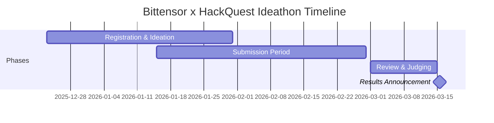

# 🏆 Bittensor x HackQuest Ideathon

## Detail Event

### Ideathon Round I

| Detail | Informasi |
|--------|-----------|
| **Event** | Bittensor x HackQuest Ideathon Round I |
| **Periode** | 23 Desember 2025 — 28 Februari 2026 |
| **Tipe** | Ideathon (desain konsep, bukan coding) |
| **Platform** | HackQuest |
| **Bahasa** | English (submission) |
| **Partisipasi** | Individual atau tim |
| **Prize Pool** | Lihat halaman resmi HackQuest untuk detail |

### Timeline



:::warning Deadline
Pastikan semua submission selesai sebelum **28 Februari 2026**. Late submission tidak akan diterima.
:::

---

## 📋 Komponen Submission

### Overview

Submission terdiri dari 4 komponen utama:

| # | Komponen | Format | Bobot |
|---|---------|--------|-------|
| 1 | **Subnet Design Proposal** | Dokumen tertulis | Utama |
| 2 | **Video Presentasi** | Video 5-10 menit | Penting |
| 3 | **Public Intro Post** | Post di X (Twitter) | Wajib |
| 4 | **Pitch Deck** | Presentasi 10 halaman | Penting |

---

### 1. Subnet Design Proposal

Proposal subnet harus mencakup 5 komponen berikut:

#### a. Incentive Mechanism Design

Jelaskan bagaimana miner dinilai dan diberi reward:

| Aspek | Yang Harus Dijawab |
|-------|-------------------|
| **Objective function** | Apa yang dioptimalkan? |
| **Scoring criteria** | Bagaimana validator menilai miner? |
| **Anti-cheating** | Bagaimana mencegah kecurangan? |
| **Fairness** | Apakah semua miner punya kesempatan yang sama? |
| **Scalability** | Apakah mekanisme skala untuk 100+ miner? |

#### b. Miner Specification

| Aspek | Deskripsi |
|-------|-----------|
| **Tugas miner** | Apa yang dilakukan miner? |
| **Input/Output** | Format input query dan output response |
| **Model/Algorithm** | Model AI apa yang digunakan? |
| **Hardware requirement** | Minimum hardware yang dibutuhkan |
| **Onboarding** | Bagaimana miner baru bergabung? |

#### c. Validator Specification

| Aspek | Deskripsi |
|-------|-----------|
| **Evaluation method** | Bagaimana menilai kualitas response? |
| **Ground truth** | Apakah ada ground truth untuk verifikasi? |
| **Consensus** | Bagaimana mencapai consensus antar validator? |
| **Cost of validation** | Berapa biaya untuk menjalankan validator? |

#### d. Business Logic

| Aspek | Deskripsi |
|-------|-----------|
| **Problem statement** | Masalah apa yang diselesaikan? |
| **Target market** | Siapa yang akan menggunakan output subnet? |
| **Revenue model** | Bagaimana menghasilkan revenue? |
| **Competitive advantage** | Apa keunggulan vs solusi yang ada? |
| **Market size** | Seberapa besar pasar potensial? |

#### e. Go-To-Market (GTM) Strategy

| Aspek | Deskripsi |
|-------|-----------|
| **Launch strategy** | Bagaimana launch subnet? |
| **User acquisition** | Bagaimana menarik pengguna? |
| **Distribution channels** | Melalui apa output didistribusikan? |
| **Partnerships** | Siapa partner potensial? |
| **Timeline** | Roadmap 6-12 bulan |

---

### 2. Video Presentasi (5-10 Menit)

#### Struktur Video yang Baik

| Menit | Konten |
|-------|--------|
| **0:00 - 0:30** | Intro — siapa Anda, nama subnet |
| **0:30 - 2:00** | Problem — masalah apa yang diselesaikan |
| **2:00 - 4:00** | Solution — bagaimana subnet Anda bekerja |
| **4:00 - 6:00** | Mechanism — incentive design, miner/validator flow |
| **6:00 - 8:00** | Business — market, revenue, GTM |
| **8:00 - 9:00** | Why Bittensor — mengapa harus di Bittensor |
| **9:00 - 10:00** | Call to action & closing |

#### Tips Video

- Gunakan slide/visual, jangan hanya talking head
- Berbicara dengan jelas dan percaya diri
- Demo atau prototype (jika ada) sangat menambah nilai
- Sertakan diagram alur untuk mekanisme teknis
- Record di tempat tenang dengan audio yang bagus
- Upload ke YouTube (unlisted jika perlu) atau platform lain

---

### 3. Public Intro Post di X (Twitter)

#### Template Post

```
🧠 Excited to share my subnet design for @bittensor x @HackQuest Ideathon!

🎯 [Nama Subnet]: [Satu kalimat deskripsi]

Problem: [Masalah yang diselesaikan]
Solution: [Bagaimana subnet menyelesaikan masalah]

Key features:
✅ [Feature 1]
✅ [Feature 2]
✅ [Feature 3]

#Bittensor #HackQuest #TAO #AI

[Link ke video/proposal]
```

#### Tips

- Gunakan thread jika perlu penjelasan lebih panjang
- Sertakan visual/infographic yang menarik
- Tag @bittensor_ dan @HackQuest
- Engage dengan komentar dari komunitas
- Post di waktu yang optimal (pagi US time = malam WIB)

---

### 4. Pitch Deck (10 Halaman)

#### Struktur Pitch Deck

| Halaman | Konten |
|---------|--------|
| **1. Cover** | Nama subnet, tagline, logo (opsional) |
| **2. Problem** | Masalah yang diselesaikan, data pendukung |
| **3. Solution** | Bagaimana subnet menyelesaikan masalah |
| **4. How It Works** | Diagram alur miner → validator → output |
| **5. Incentive Design** | Mekanisme scoring dan reward |
| **6. Market** | Target market, market size, demand |
| **7. Business Model** | Revenue model, pricing strategy |
| **8. Go-To-Market** | Launch strategy, distribution |
| **9. Competitive Advantage** | Moat, uniqueness, barriers to entry |
| **10. Roadmap & Team** | Timeline 6-12 bulan, team background |

#### Tips Pitch Deck

- **Satu ide per halaman** — Jangan overload informasi
- **Visual > Text** — Gunakan diagram, chart, dan icon
- **Data berbicara** — Sertakan angka dan data pendukung
- **Konsisten** — Gunakan color scheme dan font yang konsisten
- **Storytelling** — Bawa pembaca melalui journey logis

---

## 📝 Template Proposal

### Contoh Format Proposal

```markdown
# [Nama Subnet] — Subnet Design Proposal

## 1. Executive Summary
[2-3 paragraf ringkasan keseluruhan proposal]

## 2. Problem Statement
### 2.1 Current State
[Deskripsi masalah saat ini]

### 2.2 Pain Points
- Pain point 1
- Pain point 2
- Pain point 3

### 2.3 Market Opportunity
[Data market size dan demand]

## 3. Proposed Solution
### 3.1 Subnet Overview
[Deskripsi high-level subnet]

### 3.2 Architecture
[Diagram arsitektur]

### 3.3 Why Bittensor?
[Mengapa masalah ini harus diselesaikan di Bittensor]

## 4. Incentive Mechanism
### 4.1 Miner Task
[Apa yang dilakukan miner]

### 4.2 Validator Evaluation
[Bagaimana validator menilai]

### 4.3 Scoring Function
[Formula/kriteria scoring]

### 4.4 Anti-Cheating Measures
[Bagaimana mencegah kecurangan]

## 5. Technical Specification
### 5.1 Miner Requirements
[Hardware, software, model]

### 5.2 Validator Requirements
[Hardware, software]

### 5.3 API/Interface
[Format input/output]

## 6. Business Model
### 6.1 Revenue Streams
[Bagaimana menghasilkan uang]

### 6.2 Pricing Strategy
[Strategi harga]

### 6.3 Financial Projections
[Estimasi revenue 12 bulan]

## 7. Go-To-Market Strategy
### 7.1 Launch Plan
[Strategi peluncuran]

### 7.2 User Acquisition
[Strategi akuisisi pengguna]

### 7.3 Partnerships
[Partner potensial]

## 8. Roadmap
| Quarter | Milestone |
|---------|-----------|
| Q1 2026 | [Milestone 1] |
| Q2 2026 | [Milestone 2] |
| Q3 2026 | [Milestone 3] |
| Q4 2026 | [Milestone 4] |

## 9. Team
[Background dan expertise tim]

## 10. References
[Sumber dan referensi yang digunakan]
```

---

## 💡 Tips Menang

### Do's ✅

| Tips | Alasan |
|------|--------|
| **Riset mendalam** | Pahami subnet yang sudah ada, jangan duplikasi |
| **Fokus pada feasibility** | Ide yang bisa diimplementasi > ide ambisius tapi mustahil |
| **Desain insentif yang kuat** | Ini komponen terpenting dari proposal |
| **Tunjukkan demand** | Bukti bahwa ada market untuk output subnet Anda |
| **Gunakan data** | Angka dan data membuat proposal lebih kredibel |
| **Visual & diagram** | Mempermudah reviewer memahami mekanisme |
| **Proofreading** | Periksa grammar dan formatting sebelum submit |

### Don'ts ❌

| Hindari | Alasan |
|---------|--------|
| **Ide terlalu generic** | "AI untuk semua" tidak spesifik |
| **Mengabaikan anti-cheat** | Validator harus bisa deteksi kecurangan |
| **Tidak ada business model** | Harus jelas bagaimana menghasilkan revenue |
| **Copy paste subnet lain** | Orisinalitas sangat dihargai |
| **Video terlalu panjang** | Tetap dalam batas 5-10 menit |
| **No visual** | Deck tanpa visual sulit dipahami |

### Ide Brainstorming untuk Developer Indonesia

| Bidang | Ide Potensial | Keunggulan Lokal |
|--------|---------------|-----------------|
| **Bahasa** | Subnet NLP Bahasa Indonesia | Dataset dan native speaker |
| **Pertanian** | Prediksi panen berbasis AI | Data pertanian lokal |
| **E-commerce** | Product recommendation engine | Pasar e-commerce besar |
| **Fintech** | Credit scoring alternatif | Populasi unbanked besar |
| **Healthcare** | Diagnosis awal berbasis gejala | Akses kesehatan terbatas |
| **Education** | Tutor AI Bahasa Indonesia | Kebutuhan edukasi besar |

:::tip Keunggulan Lokal
Pikirkan masalah yang unik untuk Indonesia atau Asia Tenggara. Subnet yang menyelesaikan masalah lokal dengan data lokal memiliki moat yang kuat karena sulit direplikasi oleh kompetitor dari luar.
:::

---

## Rangkuman

| Komponen | Checklist |
|----------|-----------|
| **Proposal** | ☐ Incentive design ☐ Miner spec ☐ Validator spec ☐ Business logic ☐ GTM |
| **Video** | ☐ 5-10 menit ☐ Visual/slides ☐ Audio jelas ☐ Demo (bonus) |
| **X Post** | ☐ Tag @bittensor_ @HackQuest ☐ Visual ☐ Hashtags |
| **Pitch Deck** | ☐ 10 halaman ☐ 1 ide per slide ☐ Data & visual ☐ Roadmap |
| **Deadline** | ☐ Submit sebelum 28 Februari 2026 |

---

**Selamat! Anda telah menyelesaikan Bittensor Co-Learning Camp.** 🎉

Kembali ke: [Pengenalan Bittensor](./01-pengenalan-bittensor.md) | [Daftar Isi](../category/bittensor-co-learning-camp)
