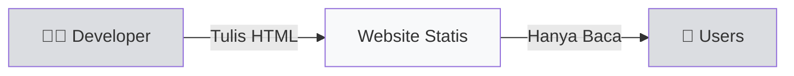
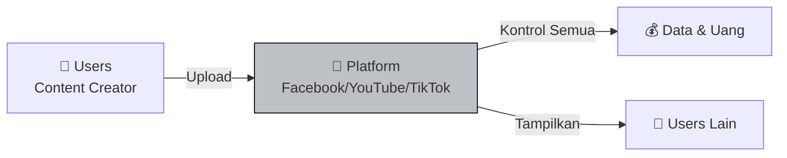
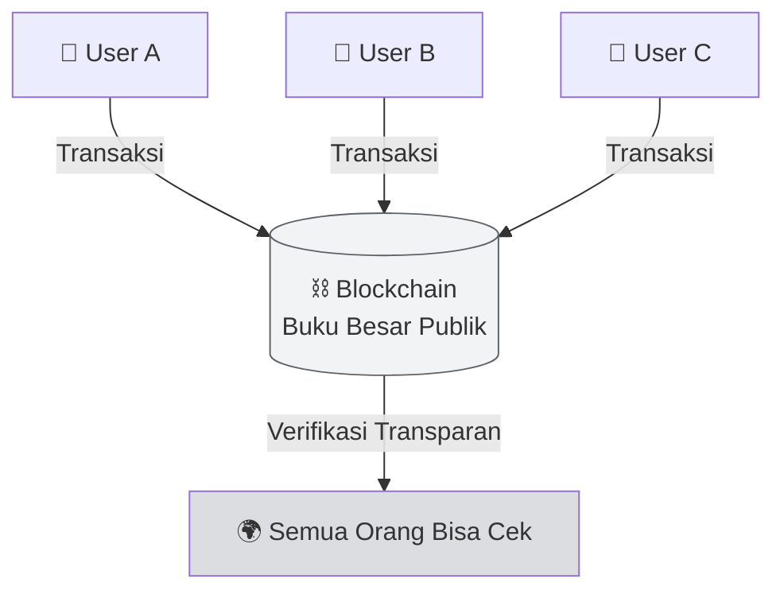

# 🌐 Unit 1 — Apa itu Web3?

:::info Goal Unit Ini
Setelah baca unit ini, kamu akan paham:
1. Perbedaan **Web1, Web2, Web3** dengan analogi sederhana
2. Apa itu **blockchain** dan **wallet** (tanpa jargon teknis)
3. Kenapa Web3 penting untuk AI — yang akan jadi pondasi Bittensor
:::

> Kalau kamu belum pernah sentuh crypto, blockchain, atau wallet — **unit ini wajib baca dulu.** Semua materi berikutnya akan asumsikan kamu paham dasar-dasar di sini.

---

## 🤔 Kenapa Kita Perlu Bahas Web3 Dulu?

Bittensor adalah **decentralized AI network**. Kata "decentralized" itu konsep Web3. Kalau kamu nggak paham Web3, kamu akan bingung kenapa Bittensor dibangun di blockchain, kenapa ada "token TAO", kenapa perlu "wallet", dan kenapa miner "diberi reward on-chain".

Jadi sebelum ngomong AI, kita samakan dulu fondasinya: **apa itu Web3.**

---

## 📖 Analogi Sederhana: Evolusi Internet

Bayangin internet itu kayak **toko kelontong di kampung**:

### 🏪 Web1 (1990–2005) — "Toko Majalah"

- Kamu bisa **baca** halaman web, tapi **nggak bisa comment, like, atau upload**.
- Cuma satu arah: developer bikin konten, user baca doang.
- Contoh: halaman Wikipedia jaman dulu, situs berita statis.

**Analogi:** Seperti baca koran. Cuma konsumsi, nggak bisa interaksi.

### 🏢 Web2 (2005–sekarang) — "Mall Milik Konglomerat"

- Sekarang kamu **bisa upload, comment, like, share** — interaktif.
- Tapi **semua data kamu dimiliki oleh platform** (Meta, Google, TikTok, dll.).
- Mereka bisa:
  - 🚫 **Ban akun kamu** kapan aja
  - 💰 **Monetisasi data kamu** (iklan target)
  - 📊 **Kontrol algoritma** — siapa lihat apa
  - 🔒 **Lock-in** kamu di platform mereka

**Analogi:** Kamu buka toko di mall. Dapat traffic banyak, tapi **si pemilik mall bisa tendang kamu kapan aja** dan ambil komisi besar.

### 🌐 Web3 (2015–sekarang) — "Pasar Rakyat dengan Buku Besar Publik"

- Nggak ada "pemilik mall". Transaksi **dicatat di blockchain** — buku besar publik yang bisa dilihat semua orang.
- Kamu **own data, own assets, own identity** pakai **wallet** (dompet digital).
- Nggak ada yang bisa ban akun kamu — karena akun kamu = wallet kamu = private key kamu.

**Analogi:** Pasar tradisional. Kamu jual barang langsung ke pembeli, semua transaksi tercatat di buku besar kampung yang bisa diaudit siapa aja. Nggak perlu mall.

---

## 🔑 Konsep Inti Web3 (Wajib Paham)

### 1. Blockchain — "Buku Besar Bersama"

:::tip Analogi Sederhana
Bayangin **WhatsApp group berisi 10.000 orang**. Setiap kali ada yang kirim uang, bukan cuma pengirim & penerima yang tahu — **semua 10.000 orang mencatat transaksi itu di buku masing-masing.**

Kalau ada yang mau curang (misal edit history jadi "aku punya $1 juta"), dia harus bajak **lebih dari setengah** buku semua orang secara bersamaan. **Mustahil.**

Itulah blockchain: **buku catatan yang disalin ke ribuan komputer, nggak bisa dipalsukan, dan terbuka untuk diaudit.**
:::

Contoh blockchain populer:
- **Bitcoin** — blockchain untuk uang digital
- **Ethereum** — blockchain untuk smart contract & aplikasi
- **Bittensor (Subtensor)** — blockchain untuk decentralized AI ✨

### 2. Wallet — "KTP + Rekening Bank Digital"

Wallet = dompet digital yang punya 2 komponen:

| Komponen | Fungsi | Boleh Share? |
|----------|--------|--------------|
| **Public Key** (alamat) | Seperti nomor rekening, buat terima transfer | ✅ Boleh (public) |
| **Private Key** (seed phrase) | Seperti PIN + password ATM — BUKTI kepemilikan | ❌ **JANGAN PERNAH** |

:::danger PERINGATAN
**Private key bocor = semua aset kamu hilang, nggak bisa di-recover.**
Nggak ada "lupa password → reset" di Web3. Ini beda 180 derajat dari Web2.
:::

Di Bittensor kamu akan punya 2 jenis wallet:
- **Coldkey** — wallet utama, simpan TAO (uang), jarang dipakai
- **Hotkey** — wallet harian untuk operasi miner

Kita akan bahas lebih detail di **Phase 2 Guided Project I Unit 2 (Wallet Setup)**.

### 3. Token — "Mata Uang & Insentif"

Token itu **aset digital yang tinggal di blockchain**. Contoh:
- 🟠 **BTC** — token Bitcoin
- 🔷 **ETH** — token Ethereum
- 🦆 **TAO** — token Bittensor (yang akan kamu dapat kalau jadi miner produktif!)

Token bisa punya banyak fungsi: mata uang, governance voting, hadiah kontribusi, dsb.

### 4. Decentralized — "Nggak Ada Bos Tunggal"

Ini kata kunci Web3. Artinya:

✅ **Nggak ada satu perusahaan** yang bisa matikan network
✅ **Nggak ada satu orang** yang bisa ubah aturan sembarangan
✅ **Nggak ada kantor pusat** yang bisa digeruduk pemerintah

Aturan ditegakkan lewat **kode + konsensus ribuan komputer di seluruh dunia.**

---

## 🆚 Perbandingan Cepat: Web2 vs Web3

| Aspek | Web2 🏢 | Web3 🌐 |
|-------|---------|---------|
| **Pemilik data** | Platform (Meta, Google) | Kamu sendiri |
| **Identitas** | Email + password | Wallet (private key) |
| **Aset digital** | Disimpan platform (skin game, koin) | Disimpan di wallet kamu (NFT, token) |
| **Sensor** | Platform bisa ban | Nggak bisa di-ban (permissionless) |
| **Ekonomi** | Platform ambil 30–50% komisi | Protocol fee 0.1–2% |
| **Recovery** | "Lupa password?" ✅ | Kalau private key hilang → aset hilang ❌ |

---

## 🤖 Nyambung ke Bittensor & AI

Pertanyaan: **"Oke Web3 keren, tapi kenapa relevan buat AI?"**

Jawaban singkat: karena AI sekarang **dikuasai segelintir perusahaan besar** (OpenAI, Google, Anthropic, Meta). Siapa yang train model, siapa yang pakai data kamu, siapa yang kontrol akses — semua di-lock oleh mereka.

Web3 + AI = **AI yang dimiliki bersama**, di mana:
- Siapa pun bisa kontribusi (jadi "miner AI")
- Siapa pun bisa akses (permissionless)
- Kontribusi dapat reward otomatis (token TAO)

Ini yang dibangun Bittensor. Kita akan bahas lebih jauh di [Unit 3 — Centralized AI vs Decentralized AI](./centralized-vs-decentralized-ai).

---

## 🎯 Rangkuman

:::tip Yang Harus Kamu Ingat
1. **Web1 = baca** (statis), **Web2 = interaksi tapi kontrol platform**, **Web3 = kamu yang own**
2. **Blockchain = buku besar bersama** yang nggak bisa dipalsukan
3. **Wallet = KTP digital** dengan public key (boleh share) + private key (RAHASIA)
4. **Token = aset digital** di blockchain (TAO untuk Bittensor)
5. **Decentralized = nggak ada bos tunggal** — aturan ditegakkan kode + konsensus
:::

### ✅ Quick Check

Coba jawab di kepala kamu:
- ❓ Kalau private key kamu hilang, apa yang terjadi?
- ❓ Apa bedanya platform Web2 (YouTube) dengan protokol Web3 (YouTube di blockchain)?
- ❓ Kenapa "permissionless" itu penting?

Kalau ketiga pertanyaan di atas bisa kamu jawab, kamu siap lanjut.

---

**Next:** [Unit 2 — Apa itu AI?](./apa-itu-ai) 👉

*Sudah paham Web3? Sekarang kita masuk ke AI — komponen lain yang Bittensor gabungkan.* 🧠
