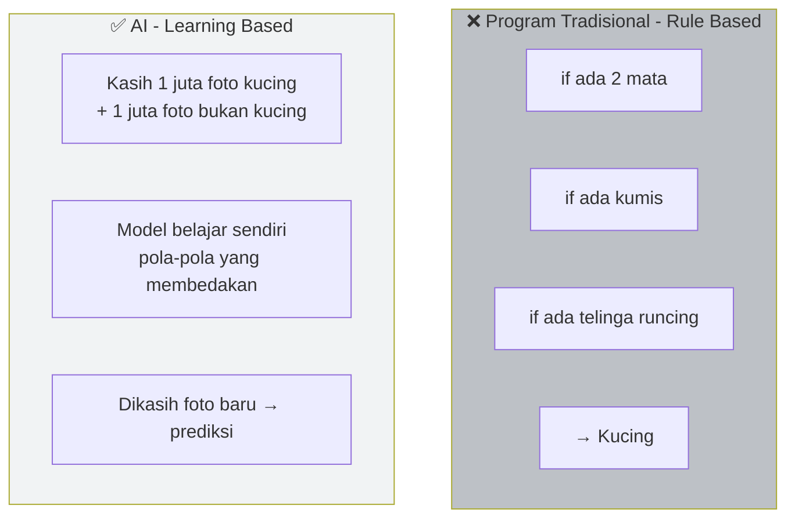
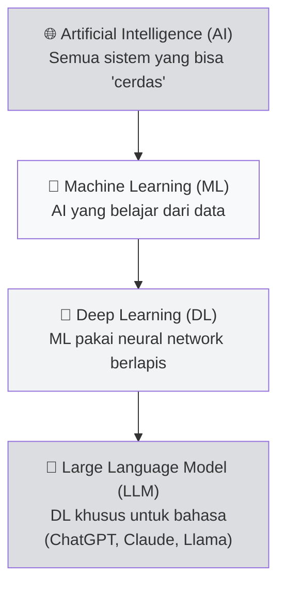
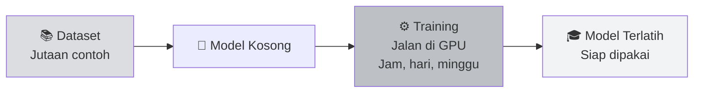

# 🧠 Unit 2 — Apa itu AI?

:::info Goal Unit Ini
Setelah baca unit ini, kamu akan paham:
1. Apa itu **AI, Machine Learning, dan Deep Learning** (dan bedanya)
2. Konsep **training vs inference** — dua aktivitas utama AI
3. Apa itu **LLM, model, dataset, GPU** — istilah yang akan terus muncul di Bittensor
:::

> Kalau kamu sudah familiar dengan ChatGPT dan paham bedanya "training" sama "inference", boleh skim aja unit ini. Tapi kalau belum, **baca pelan-pelan** — konsep di sini akan dipakai terus di Phase 1.

---

## 🤔 AI dalam 1 Kalimat

**AI = program komputer yang bisa "belajar" dari data, bukan cuma ngikutin aturan kaku yang ditulis manual.**

### Analogi Sederhana

Bayangin kamu mau bikin program untuk **kenali foto kucing**:

**Program tradisional:** manusia yang nulis aturan. Kaku, susah handle kasus unik (kucing tanpa kumis? bingung).

**AI:** kita kasih banyak contoh, **model belajar sendiri** pola-pola implicitnya. Lebih fleksibel, lebih powerful.

---

## 🎯 Hierarki Istilah: AI → ML → DL → LLM

Banyak orang campur aduk istilah ini. Urutannya dari paling luas ke paling spesifik:

| Istilah | Definisi Sederhana | Contoh |
|---------|-------------------|--------|
| **AI** | Sistem yang meniru kecerdasan manusia | Chess bot, self-driving, ChatGPT |
| **Machine Learning (ML)** | AI yang **belajar dari data**, bukan rule manual | Spam filter, rekomendasi Netflix |
| **Deep Learning (DL)** | ML pakai **neural network berlapis-lapis** | Face recognition, speech-to-text |
| **LLM** | DL untuk **memahami & generate bahasa** | ChatGPT, Claude, Llama, Gemini |

---

## 🏋️ Dua Aktivitas Utama AI: Training & Inference

Ini **konsep penting** — akan muncul terus di Bittensor. Ingat baik-baik.

### 1. 🏋️ Training — "Fase Belajar"

**Apa yang terjadi:** Model disodori dataset besar, coba prediksi, cek salah/benarnya, adjust parameter internal, ulang jutaan kali.

- ⏱️ **Lama:** bisa jam, hari, minggu
- 💰 **Mahal:** butuh banyak GPU ($$$)
- 📊 **Sekali jadi, dipakai berkali-kali**

**Analogi:** seperti anak sekolah belajar matematika selama 12 tahun. Lama dan mahal, tapi sekali lulus bisa kerjakan soal apa aja.

### 2. 💬 Inference — "Fase Pakai"

**Apa yang terjadi:** Model yang sudah terlatih dipakai untuk jawab pertanyaan / prediksi baru.

- ⏱️ **Cepat:** milidetik sampai detik
- 💸 **Relatif murah** per request
- 🔁 **Dipakai jutaan kali per hari**

**Analogi:** anak tadi sudah lulus. Sekarang dikasih soal → langsung jawab.

### 📊 Tabel Perbandingan

| Aspek | Training 🏋️ | Inference 💬 |
|-------|-------------|--------------|
| **Tujuan** | Bikin model | Pakai model |
| **Durasi** | Jam – minggu | Milidetik – detik |
| **Biaya** | Sangat mahal | Relatif murah |
| **Frekuensi** | Jarang (1 kali per versi) | Sering (tiap request user) |
| **Di Bittensor** | Miner sebagian train model | **Semua subnet butuh inference** |

:::tip Di Bittensor
- **Chutes subnet** fokus ke **inference** — sediain API AI murah & terdesentralisasi
- **Data Universe (SN13)** fokus ke **data untuk training**
- **Sportstensor (SN41)** fokus ke **prediction** (bentuk inference spesifik)
:::

---

## 🧩 Komponen AI yang Akan Kamu Temui

### 1. 📦 Model

File yang berisi "otak" AI setelah training. Biasanya berbentuk `.pth`, `.safetensors`, `.gguf`.

- **Ukuran kecil:** 100 MB – 1 GB (bisa jalan di laptop)
- **Ukuran besar:** 10 GB – 500 GB+ (butuh GPU dedicated)

Contoh populer:
- 🦙 **Llama 3** (Meta) — open-source LLM
- 🌪️ **Mistral** — open-source LLM
- 🤖 **GPT-4** (OpenAI) — closed-source
- 🎨 **Stable Diffusion** — image generation

### 2. 📚 Dataset

Kumpulan data untuk training. Bisa:
- Teks (Wikipedia, Reddit, buku)
- Gambar (foto + label)
- Audio (podcast + transcript)
- Data terstruktur (harga saham, data cuaca)

:::info Kenapa Data Penting
**"Garbage in, garbage out"** — kualitas model dibatasi kualitas data. Makanya **Data Universe (SN13)** di Bittensor jadi subnet penting: dia sediain dataset berkualitas untuk training.
:::

### 3. 🖥️ GPU

Komputer biasa (CPU) bisa jalankan AI kecil. Tapi untuk model besar, kamu butuh **GPU** (Graphics Processing Unit).

Kenapa? AI butuh **banyak perkalian matriks paralel** — persis yang GPU dirancang untuk lakukan (originally untuk game 3D).

| GPU | VRAM | Harga Beli | Cocok Untuk |
|-----|------|------------|-------------|
| RTX 3060 | 12 GB | ~Rp 5 jt | Belajar, model kecil |
| RTX 4090 | 24 GB | ~Rp 35 jt | Mining serius, LLM 7B |
| A100 | 40–80 GB | $15k+ | Production, LLM besar |
| H100 | 80 GB | $30k+ | Cutting-edge training |

Alternatif: **sewa GPU di cloud** (Vast.ai, RunPod, Lambda) — bayar per jam, nggak perlu beli.

### 4. ⚙️ Hyperparameter & Weights

- **Weights:** angka-angka internal model (bisa jutaan sampai miliaran). Ini yang berubah saat training.
- **Hyperparameter:** setting training (learning rate, batch size, epoch). Manusia yang set.

Kamu nggak perlu hafal ini. Cukup paham: **"model = gudang angka hasil training yang bisa prediksi".**

---

## 🎯 AI dalam Kehidupan Sehari-hari

Supaya nggak abstract, contoh AI yang kamu sudah pakai:

| Produk | Tipe AI |
|--------|---------|
| **ChatGPT / Claude** | LLM — generative text |
| **Google Translate** | Neural Machine Translation |
| **Instagram filter** | Computer Vision |
| **Spotify Discover Weekly** | Collaborative Filtering |
| **Gmail spam filter** | Classification ML |
| **Google Maps ETA** | Predictive ML |
| **Siri / Alexa** | Speech Recognition + LLM |
| **Face ID iPhone** | CNN (Convolutional Neural Network) |

AI udah ada di mana-mana. Pertanyaannya: **siapa yang kontrol?** → Ini yang kita bahas di [Unit 3](./centralized-vs-decentralized-ai).

---

## ⚠️ Mitos AI yang Harus Kamu Tahu

:::danger Jangan Percaya
- ❌ "AI itu sadar seperti manusia" — TIDAK. LLM cuma prediksi kata berikutnya berdasarkan pola statistik.
- ❌ "AI selalu benar" — TIDAK. AI bisa **halusinasi** (ngarang fakta) dan bias.
- ❌ "AI butuh miliaran dolar untuk train" — nggak semua. Model kecil bisa di-train di GPU rumahan.
- ❌ "AI bakal ganti semua pekerjaan besok" — lebih realistis: AI jadi **tools**, yang pakai AI (kamu) yang akan menang atas yang nggak.
:::

---

## 🎯 Rangkuman

:::tip Yang Harus Kamu Ingat
1. **AI → ML → DL → LLM** — dari luas ke spesifik
2. **Training** = bikin model (lama, mahal). **Inference** = pakai model (cepat, murah)
3. **Model** = otak AI; **Dataset** = bahan belajar; **GPU** = mesin perhitungan
4. **LLM** (ChatGPT, Claude, Llama) adalah AI untuk bahasa — paling populer sekarang
5. AI **bukan** intelligence sadar — tapi **tool statistik** yang powerful
:::

### ✅ Quick Check

- ❓ Apa bedanya training sama inference?
- ❓ Kenapa GPU lebih cocok untuk AI daripada CPU biasa?
- ❓ Kalau kamu mau jalan ChatGPT di laptop sendiri, kamu butuh apa?

---

**Next:** [Unit 3 — Centralized AI vs Decentralized AI](./centralized-vs-decentralized-ai) 👉

*Sekarang kamu paham Web3 + AI. Waktunya gabungkan keduanya — dan paham kenapa "decentralized AI" itu game changer.* 🚀
