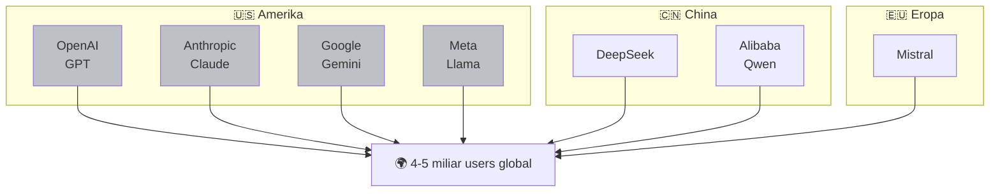
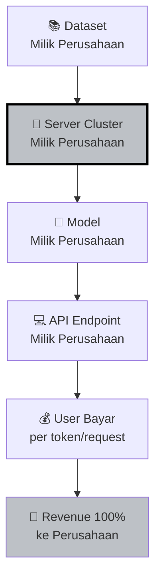
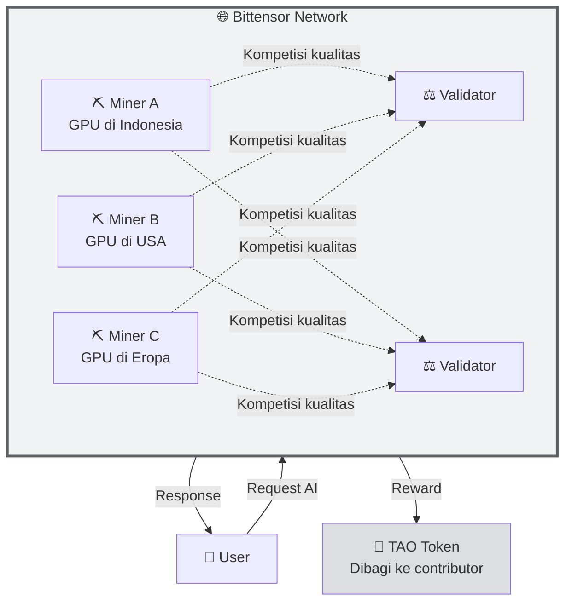

# 🆚 Unit 3 — Centralized AI vs Decentralized AI

:::info Goal Unit Ini
Setelah baca unit ini, kamu akan paham:
1. Cara kerja AI **tersentralisasi** hari ini (OpenAI, Google, Anthropic, Meta)
2. **Masalah nyata** yang muncul dari model tersentralisasi
3. Apa itu **Decentralized AI** dan bagaimana dia solve masalah di atas
4. **Trade-off** antara keduanya — bukan hitam-putih
:::

> Unit ini adalah **jembatan** dari Phase 0 ke Bittensor. Di sini kamu akan paham **"kenapa Bittensor ada"** sebelum masuk ke **"bagaimana Bittensor kerja"** di Phase 1.

---

## 🏢 Gambaran Besar: Siapa yang Kontrol AI Hari Ini?

Per 2026, AI global didominasi segelintir "Big AI":



**Fakta menarik:**
- OpenAI sendiri punya valuasi >$150 miliar (2025)
- Microsoft invest >$13 miliar ke OpenAI
- Biaya training GPT-4 diperkirakan >$100 juta
- Satu model besar butuh **ribuan GPU H100** yang harganya $30k+ per unit

**Akibatnya:** hanya **segelintir perusahaan raksasa** yang mampu train AI kelas atas. Kamu dan saya cuma bisa **jadi user** — bayar biaya API, pakai fitur yang mereka izinkan.

---

## 🔍 Arsitektur Centralized AI (Status Quo)



**Yang perusahaan kontrol:**
- ✅ Data training (apa yang model belajar)
- ✅ Weights model (bisa diubah tanpa notice)
- ✅ Akses API (bisa block country, region, user)
- ✅ Harga (naik turun sesuka hati)
- ✅ Uptime (down = seluruh app yang bergantung juga down)
- ✅ Policy (apa yang bisa & nggak bisa ditanya)
- ✅ Data kamu (setiap prompt kamu bisa mereka review)

---

## ⚠️ Masalah Nyata dari Centralized AI

### 1. 🚫 Single Point of Failure

:::danger Kasus Nyata
**November 2023** — OpenAI board mendadak pecat Sam Altman. Perusahaan hampir pecah. Ribuan startup yang bangun di atas API OpenAI **panik** karena masa depan produk mereka nggak pasti.

Kalau OpenAI runtuh besok, **50% use case GenAI global terdampak**. Itulah masalah single point of failure.
:::

### 2. 💰 Monopoli Harga

- GPT-4 API: $30 per 1 juta token input
- Claude Sonnet: $3 per 1 juta token input
- Kamu nggak bisa "pindah vendor" — tiap model punya karakter sendiri
- Naikkan harga 2x besok? Kamu cuma bisa pasrah

### 3. 🌍 Censorship & Geo-blocking

- OpenAI block akses dari China, Iran, Rusia, dll.
- Model dilatih dengan "safety guidelines" perusahaan — topik tertentu dijawab dengan template "I can't help with that"
- **Siapa yang putuskan apa yang "safe"?** Perusahaan, bukan user.

### 4. 🔒 Data Privacy — Kamu Bukan Klien, Kamu Produknya

:::info Kenyataan Pahit
Kecuali kamu bayar enterprise tier dengan data processing agreement khusus:
- 📊 Prompt kamu **bisa dipakai untuk training versi berikutnya**
- 🔍 Karyawan perusahaan **bisa review prompt** untuk safety research
- 🌐 Data bisa tersimpan di server negara lain dengan hukum berbeda
:::

### 5. 🎨 Model Behavior Tanpa Transparansi

- Update model GPT-4 dari versi lama ke baru bisa **ubah output drastis** tanpa notice
- Startup yang prompt engineering-nya di-tune untuk versi lama: **tiba-tiba rusak**
- Nggak ada "versi stable" yang bisa kamu andalkan selamanya

### 6. 💸 Concentration of Wealth

Economic flow AI global:

```
Pengguna → Bayar API → Perusahaan AI → Profit untuk investor & founder
```

Kamu (sebagai contributor potensial — developer, data annotator, researcher) **nggak kebagian** dari value yang tercipta. Cuma "Big AI" yang menang.

---

## 🌐 Decentralized AI — Alternatif Web3

**Decentralized AI (DeAI)** = bangun infrastruktur AI **tanpa single company yang kontrol**, pakai blockchain sebagai koordinasi layer.

### Arsitektur Decentralized AI (Bittensor)



**Komponen kunci:**
- **Miners** — kontributor yang sediakan AI service (jalanin model, scraping data, dll.)
- **Validators** — evaluator yang score kualitas miner
- **Subnets** — kategori spesifik (inference, data, sports prediction, dll.)
- **TAO token** — insentif ekonomi untuk kontributor

---

## 📊 Comparison Langsung: Centralized vs Decentralized AI

| Aspek | Centralized AI 🏢 | Decentralized AI 🌐 |
|-------|-------------------|---------------------|
| **Siapa train model?** | Satu perusahaan | Ribuan miners global |
| **Siapa own data?** | Perusahaan | Kontributor individual |
| **Akses** | Permissioned (bisa di-ban) | Permissionless (siapa pun bisa) |
| **Harga** | Ditetapkan perusahaan | Kompetitif market-driven |
| **Censorship** | Ada (sesuai policy perusahaan) | Minimal (protocol level) |
| **Uptime** | 99.5% (tapi kalau down, semua down) | 99.9%+ (redundansi global) |
| **Kontribusi** | Cuma jadi user | Bisa jadi miner & dapat TAO |
| **Transparansi** | Closed (model weights rahasia) | Open (on-chain verifiable) |
| **Reward contributor** | Gaji karyawan (limited) | Token-based (global, permissionless) |
| **Innovation speed** | Top-down | Bottom-up, swarm-style |

---

## 🎯 Trade-offs — Ini Bukan Hitam Putih

:::warning Realistis
Decentralized AI **bukan solusi sempurna**. Ada trade-off yang harus kamu paham:
:::

### ✅ Keunggulan Decentralized AI
- Censorship-resistant
- Contributor bisa dapat reward ekonomi
- Transparent & auditable
- Nggak ada single point of failure
- Innovation bisa muncul dari siapa saja

### ❌ Kekurangan Decentralized AI (Current State)
- **Kualitas belum seragam** — miner jelek bisa bikin response buruk
- **Latency lebih tinggi** — karena perlu routing + konsensus
- **UX lebih kompleks** — user harus paham wallet, token, dll.
- **Model terbaik masih di centralized** — GPT-5/Claude masih lead di frontier AI
- **Regulatory unclear** — pemerintah belum tahu mau regulate gimana

### 💡 Insight

**Dua model ini akan coexist.** Analoginya seperti:
- **AWS (centralized cloud)** masih dominan untuk enterprise
- **Cloudflare / Akamai (distributed CDN)** dominan untuk edge & bandwidth

Di AI pun sama: **Centralized** akan tetap kuat untuk frontier research. **Decentralized** akan menang di domain-specific + cost-sensitive + privacy-sensitive use cases.

**Bittensor bet-nya:** ada market yang sangat besar di "long tail" AI — sports prediction, specialized inference, niche datasets — yang **nggak akan pernah jadi prioritas OpenAI**, tapi bisa dihandle network decentralized dengan reward ekonomi yang tepat.

---

## 🦆 Kenapa Pilihan Individual Kamu Penting

Sebagai developer Indonesia di 2026, kamu punya **3 pilihan sikap** terhadap AI:

### Pilihan 1: **Consumer Saja** 🙈
Pakai ChatGPT/Claude untuk kerja. Bayar subscription. Done.

- Pro: gampang
- Con: value terkunci 100% di perusahaan Amerika/China

### Pilihan 2: **Builder di Ekosistem Centralized** 🏢
Bangun produk pakai OpenAI/Anthropic API.

- Pro: cepat ship, model terbaik
- Con: margin tipis (vendor ambil potongan), risk dependency

### Pilihan 3: **Contributor di Ekosistem Decentralized** 🌐
Jadi miner di Bittensor. Dapat reward TAO. Kontribusi langsung ke network.

- Pro: own piece of the pie, unlimited upside
- Con: learning curve lebih tinggi, butuh effort setup awal

**Co-Learning Camp ini fokus ke Pilihan 3.** Kita ajarin kamu dari nol sampai bisa jadi miner aktif yang dapat reward TAO sendiri.

---

## 🎯 Rangkuman

:::tip Yang Harus Kamu Ingat
1. **Centralized AI** hari ini = 5–7 perusahaan raksasa kontrol ~95% kapasitas AI global
2. **Masalahnya:** single point of failure, monopoli harga, censorship, privacy, concentration of wealth
3. **Decentralized AI** = jaringan tanpa bos, contributor dapat reward, open & permissionless
4. **Trade-off ada** — decentralized belum se-polished centralized, tapi **model terbaik di niche** sudah bisa terdesentralisasi
5. **Bittensor** bet besar di long-tail AI dengan insentif ekonomi via token TAO
:::

### ✅ Quick Check

- ❓ Sebutkan 3 masalah dari AI yang sepenuhnya dikontrol satu perusahaan
- ❓ Apa bedanya jadi "user" Centralized AI dengan jadi "miner" Decentralized AI?
- ❓ Kenapa decentralized AI cocok untuk use case long-tail (niche)?

---

**Next:** [Unit 4 — Kenapa Bittensor Penting?](./04-mengapa-bittensor) 👉

*Kamu udah paham konteksnya. Sekarang kita zoom ke pemain utama yang akan kamu pelajari 2 minggu ke depan — Bittensor.* 🦆
