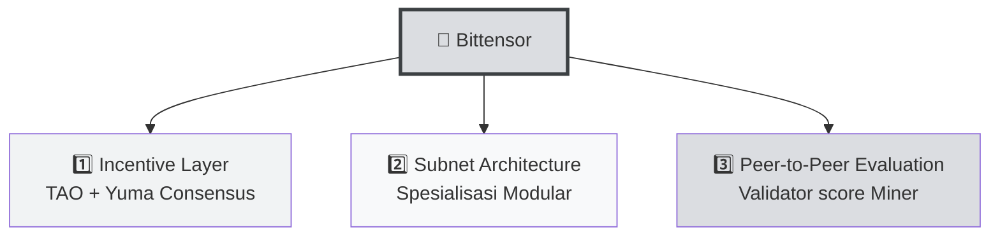
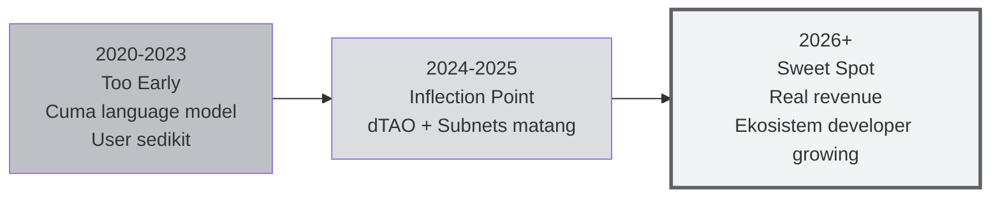

# 🦆 Unit 4 — Kenapa Bittensor Penting?

:::info Goal Unit Ini
Setelah baca unit ini, kamu akan paham:
1. **Sejarah singkat Bittensor** — dari paper 2020 sampai jadi top-30 cryptocurrency
2. **Tiga pilar Bittensor** yang bikin dia beda dari DeAI lain
3. **Apa itu subnet, miner, validator** — overview paling awal sebelum deep-dive di Phase 1
4. **Mengapa 2026 adalah tahun yang tepat** untuk terjun ke Bittensor
:::

> Ini unit terakhir Phase 0. Setelah ini, kamu punya seluruh konteks yang diperlukan untuk mulai deep-dive ke fundamentals di Phase 1.

---

## 📜 Sejarah Singkat Bittensor

### 2020 — Whitepaper & Visi Awal

**Yuma Rao** (nama pena dari tim pendiri, mengacu pada Yuma — kota di Arizona) publish whitepaper pertama Bittensor. Visinya:

> *"Membangun pasar untuk machine intelligence — di mana kontributor dihadiahi berdasarkan nilai yang mereka tambahkan ke network, divalidasi secara peer-to-peer tanpa otoritas pusat."*

**Co-founder:** Jacob Steeves (ex-Google, researcher) dan Ala Shaabana (neuroscience researcher).

### 2021 — Testnet "Kusanagi"
Network awal berjalan dengan neural language model kecil. Miners kompetisi menghasilkan representasi teks terbaik.

### 2023 — Dynamic Subnets
Upgrade besar: network dipecah jadi **subnet** yang spesialisasi di tugas berbeda (bukan cuma language model). Sekarang ada inference, data, prediction, code — apa pun.

### 2024 — Dynamic TAO (dTAO)
Upgrade ekonomi: tiap subnet punya "alpha token" sendiri yang harganya ditentukan market, bukan manual. Ekonomi Bittensor jadi jauh lebih organik.

### 2025–2026 — Ekosistem Matang
- 100+ subnet aktif
- TAO masuk **top-30 cryptocurrency** by market cap
- Revenue real mulai mengalir: subnet Sportstensor generate revenue dari sports betting, Chutes dari AI API sales, dll.
- Adopsi developer global meningkat drastis

---

## 🏛️ Tiga Pilar Bittensor

Yang bikin Bittensor beda dari project Decentralized AI lain:

### 1️⃣ Incentive Layer — "Kerja = Dapat TAO"

Bittensor punya sistem ekonomi built-in. Kontributor nggak kerja gratis — mereka dapat **token TAO** setiap blok (~12 detik).

- Reward terbagi: **41% miner, 41% validator, 18% subnet owner** (per blok per subnet)
- Besar reward ditentukan **kualitas kontribusi**, bukan sekedar kuota

Ini menyelesaikan masalah klasik open-source: kenapa orang harus kontribusi kalau nggak dibayar?

### 2️⃣ Subnet Architecture — "Spesialisasi"

Alih-alih satu network mengerjakan semua task, Bittensor **pecah jadi subnet**. Setiap subnet:
- Punya tujuan spesifik (contoh: SN13 = data scraping, SN41 = sports prediction)
- Punya reward mechanism sendiri
- Punya miner & validator sendiri
- Dimiliki "subnet owner" yang bikin logic-nya

**Akibatnya:** ekosistem bisa tumbuh **luas** (banyak subnet) + **dalam** (tiap subnet bisa spesialis).

### 3️⃣ Peer-to-Peer Evaluation — "Validator Score Miner"

Dalam setiap subnet:
- **Miner** menghasilkan output (inference, data, prediction)
- **Validator** memberi challenge & skor kualitas
- Skor di-aggregate via **Yuma Consensus** → tentuin reward distribusi

Nggak ada "juri pusat". Yang skor adalah validator-validator independen, dan skor mereka sendiri divalidasi cross-check.

:::tip Analogi
Bayangin kontes masak di tiap kabupaten (subnet), dengan juri lokal (validator), dan hadiah berdasarkan ranking (Yuma Consensus). **Nggak ada MasterChef jakarta** yang harus approve — sistem self-organizing.
:::

---

## 🧩 Glossary Cepat (Akan Dalam di Phase 1)

Supaya kamu familiar dengan istilah yang akan muncul terus:

| Istilah | Arti Singkat |
|---------|--------------|
| **TAO (τ)** | Native token Bittensor. Max supply 21 juta (mirip Bitcoin) |
| **Subtensor** | Blockchain Bittensor (Substrate-based, mirip Polkadot) |
| **Subnet** | Sub-network spesialisasi (100+ subnet aktif) |
| **NetUID** | ID angka subnet (contoh: 13 untuk Data Universe, 41 untuk Sportstensor) |
| **Miner** | Kontributor yang sediain AI service |
| **Validator** | Kontributor yang evaluasi kualitas miner |
| **Subnet Owner** | Pihak yang deploy & maintain subnet |
| **Metagraph** | "Snapshot" state subnet — siapa miner, siapa validator, skor berapa |
| **Coldkey** | Wallet utama (simpan TAO) |
| **Hotkey** | Wallet operasional (jalankan miner/validator) |
| **Yuma Consensus** | Algoritma agregasi skor validator |
| **dTAO (Dynamic TAO)** | Sistem ekonomi baru (2024+) — tiap subnet punya alpha token |
| **Alpha Token** | Token per-subnet yang harganya ditentukan market |
| **btcli** | CLI (command-line tool) untuk interaksi dengan Bittensor |

**Jangan panik** kalau belum paham semua. Kita akan bahas satu-satu di Phase 1.

---

## 📈 Mengapa 2026 Tahun Tepat Terjun ke Bittensor?

### 🎯 Tiga Alasan Timing Tepat

### 1. **Infrastruktur Sudah Matang** ✅
Tahun 2020–2022, menjalankan miner Bittensor berarti deal dengan dokumentasi tipis, bug di tooling, community kecil. **Sekarang (2026):** btcli stabil, dokumentasi lengkap, YouTube tutorials ada, Discord aktif. **Entry barrier jauh lebih rendah.**

### 2. **Masih Early untuk Mass Market** 🌱
Meskipun top-30 crypto, Bittensor masih **pre-chasm** dibanding Ethereum atau Solana yang sudah mainstream. Jumlah developer aktif masih **ribuan**, bukan ratusan ribu. **Opportunity arbitrage:** skill Bittensor hari ini = skill scarce yang akan di-premium kan 2–3 tahun ke depan.

### 3. **Real Revenue Mulai Datang** 💰
Subnet seperti Sportstensor (SN41) sudah generate **USD revenue** dari sports betting integration, lalu buyback TAO. Ini bukan token dengan tokenomics kosong — ada **business model riil** di belakangnya. Makin banyak subnet dengan revenue → makin stabil ekosistem.

---

## 🇮🇩 Angle Indonesia

### Kenapa CLC9 Bittensor Relevan untuk Developer Indonesia?

1. **Akses GPU masih mahal di Indonesia.** Tapi **cloud GPU rental murah** ($0.20–$2/jam di Vast.ai) — kamu nggak perlu beli GPU untuk mulai.

2. **TAO reward = USD-equivalent income.** Kalau kamu berhasil jadi top-miner di subnet produktif, TAO yang kamu dapat bisa convert ke rupiah secara langsung. Ini income stream baru yang belum banyak kompetitornya di Indonesia.

3. **Skill scarcity + community growing.** Di ETHJKT + HackQuest Indonesia, comunity Bittensor masih early. **Early contributor = early credibility.** Graduate CLC9 = tier pertama talent pool lokal.

4. **Timezone advantage nihil, tapi internet stabil di kota besar sudah cukup.** Mining 24/7 bisa dikerjakan dari Jakarta, Bandung, Surabaya dengan VPS sewaan.

### 💡 Peluang Spesifik

| Peluang | Target Kamu |
|---------|-------------|
| **Jadi miner Sportstensor** | Passive TAO income dari sports prediction |
| **Jadi miner Data Universe** | TAO dari scraping Twitter/Reddit data |
| **Jadi subnet builder** | Bikin subnet baru (contoh: Indonesia-specific dataset) |
| **Jadi validator** | Mid-term goal — setelah skill & TAO stake cukup |
| **Jadi community lead** | Lead komunitas Bittensor Indonesia — first-mover advantage |

---

## 🎯 Apa yang Akan Kamu Pelajari Setelah Ini

Setelah Phase 0 ini, kamu masuk ke fase yang lebih teknis:

### 🔵 Phase 1 — Fundamentals (Teori)
- **Concept I:** Sejarah detail, arsitektur lengkap, tokenomics, dTAO
- **Concept II:** Deep-dive 4 core subnet — Chutes, Data Universe, Sportstensor, Ridges

### 🟢 Phase 2 — Building (Praktek)
- **Guided Project I:** Setup & run miner di Sportstensor (SN41)
- **Guided Project II:** Setup & run miner di Data Universe (SN13)

### 🟣 Phase 3 — Resources
- Link referensi untuk belajar lanjut sendiri

---

## ⚠️ Ekspektasi Realistis

:::warning Sebelum Lanjut
**Bittensor mining bukan "get rich quick".** Ini **skill + capital investment** yang hasil-nya tergantung:
- Kualitas strategy kamu (bukan cuma "running node")
- Subnet yang kamu pilih (ada yang profit, ada yang loss)
- Harga TAO saat kamu cash out
- Kompetisi miner lain (network efek)

Kamu **bisa rugi** kalau asal jalan tanpa strategy — biaya registrasi, biaya GPU, biaya waktu. Ini yang akan kita bahas di Phase 1 Concept I Unit 3 (Tokenomics).

**Ekspektasi yang sehat:**
- ✅ **Belajar skill** Decentralized AI yang scarce
- ✅ **Network effect** — masuk komunitas early adopter
- ✅ **Peluang income** kalau kamu commit serius & iterasi
- ❌ Bukan cheat code untuk kaya mendadak
:::

---

## 🎯 Rangkuman

:::tip Yang Harus Kamu Ingat
1. **Bittensor** = decentralized AI network dengan TAO token (top-30 crypto, whitepaper 2020)
2. **Tiga pilar:** Incentive Layer (TAO), Subnet Architecture, Peer-to-Peer Evaluation
3. **Subnet** = sub-network spesialisasi (100+ aktif), pakai NetUID sebagai ID
4. **Miner** = kontributor AI service, **Validator** = evaluator, **Subnet Owner** = pembuat subnet
5. **2026 sweet spot:** infra matang, masih early, revenue mulai real
6. **Ekspektasi sehat:** bukan get-rich-quick, tapi skill scarce + opportunity income
:::

### ✅ Quick Check

- ❓ Sebutkan 3 pilar Bittensor
- ❓ Apa fungsi miner, validator, dan subnet owner?
- ❓ Kenapa dTAO (2024+) penting buat ekosistem?
- ❓ Apa beda Centralized AI (Unit 3) dengan Bittensor?

---

## 🚀 Ready untuk Phase 1?

**Phase 0 selesai!** 🎉 Kamu sekarang punya fondasi:
- ✅ Paham Web3 (blockchain, wallet, token)
- ✅ Paham AI (training, inference, model, LLM)
- ✅ Paham kenapa Decentralized AI matter
- ✅ Paham posisi Bittensor di ekosistem DeAI

**Next:** [Phase 1 → Concept I → Unit 1: The Rise of AI and Bittensor](../Phase-1-Fundamentals/Concept-1-Introduction/rise-of-ai-bittensor) 👉

*Saatnya deep-dive ke teknisnya. Let's go, miner!* 🦆⚡
