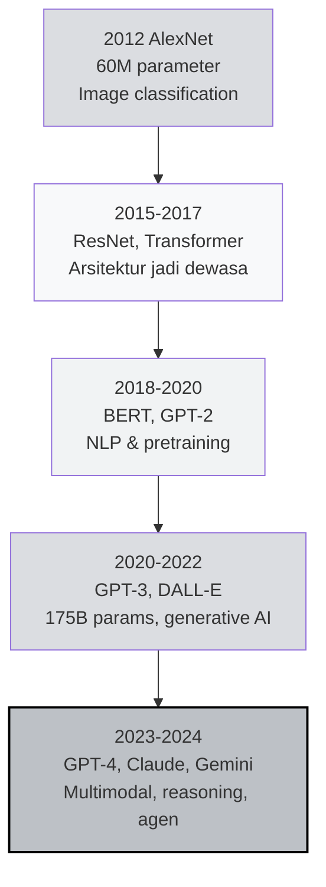
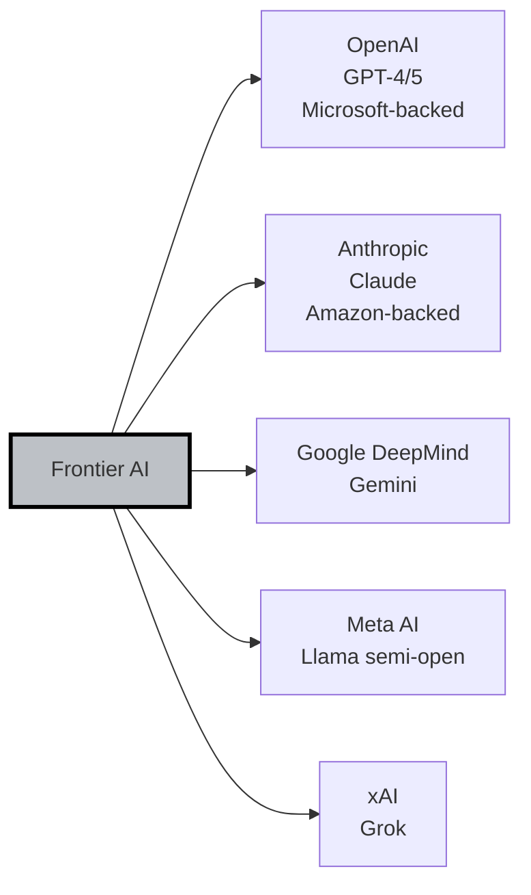
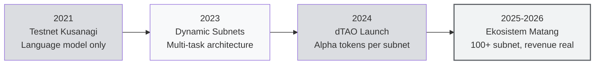

# 🧠 Unit 1 — The Rise of AI and the Emergence of Bittensor

:::info Goal Unit Ini
Setelah baca unit ini, kamu akan paham:
1. **Alur progresi AI** dari 2012 (AlexNet) sampai era GPT-4 / Claude / Gemini — apa yang sebenarnya berubah
2. **Masalah struktural** yang muncul karena AI dikuasai segelintir perusahaan (OpenAI, Anthropic, Google, Meta)
3. **Latar belakang whitepaper Yuma Rao 2020** dan kenapa timing-nya tepat
4. **Kenapa Bittensor secara spesifik** menyelesaikan masalah ini — bukan blockchain AI biasa
:::

> Unit ini sengaja dibuat **naratif**. Sebelum kita bedah arsitektur teknis Bittensor di Unit 2, kamu perlu ngerti **kenapa** Bittensor ada. Tanpa konteks historis, arsitekturnya akan terasa random. Dengan konteks, setiap design decision-nya jadi masuk akal.

---

## 📜 2012 — Momen ketika AI "Hidup Lagi"

Sebelum 2012, bidang AI (saat itu disebut "machine learning") adalah area yang **stagnan selama dekade**. Neural network dikenal sebagai ide elegan yang *nggak pernah work dengan baik* — mayoritas peneliti justru memilih metode lain seperti Support Vector Machines atau Random Forests.

Semua berubah di **ImageNet 2012**.

Tim **Alex Krizhevsky, Ilya Sutskever, dan Geoffrey Hinton** submit sebuah arsitektur bernama **AlexNet** — sebuah convolutional neural network dengan 8 layer. Hasilnya?

- Error rate 15.3% vs runner-up 26.2% (selisih hampir 11%)
- Dijalankan di **2 GPU Nvidia GTX 580** (bukan CPU farm)
- Membuktikan: **scale + GPU + data banyak** = jalan pintas yang selama ini hilang

:::tip Analogi Sederhana
Bayangin bidang AI itu seperti laboratorium kimia yang stuck selama 20 tahun. Semua orang coba bikin reaksi dengan panci kecil di api sedang. Tim AlexNet datang bawa reaktor industri + bahan bakar roket. Hasilnya: reaksi yang orang lain tidak pernah lihat. **Ini bukan discovery chemistry baru — ini discovery bahwa "scale matters more than elegance".**
:::

Dari 2012 itu, dimulailah **era Deep Learning**. Setiap tahun model makin besar, data makin banyak, compute makin mahal.

---

## 📈 2012 → 2024: Progresi yang Tak Terduga

### 2015–2017: Era Arsitektur

**ResNet** (Microsoft, 2015) menyelesaikan masalah vanishing gradient dengan skip connection — membuka jalan untuk training network dengan ratusan layer. Di 2017, paper legendaris **"Attention Is All You Need"** dari Google memperkenalkan **Transformer** — arsitektur yang kemudian jadi backbone hampir semua LLM modern.

### 2018–2020: Era Pretraining

**BERT** (Google, 2018) dan **GPT-2** (OpenAI, 2019) memperkenalkan paradigma baru: alih-alih train model dari nol untuk tiap task, **pretrain di corpus raksasa** dulu, lalu fine-tune untuk task spesifik. Efeknya: satu model bisa digeneralisasi ke banyak task.

### 2020–2022: Era Scale

**GPT-3** (OpenAI, Juni 2020) shockingly large: 175 miliar parameter. Bukan cuma ukuran, tapi **emergent behavior** — kemampuan yang nggak diprogram eksplisit tapi muncul dari scale. Few-shot learning jadi real. Generative AI bukan mainan akademis lagi; dia jadi API komersial.

### 2023–2024: Era Asisten Umum

**GPT-4** (Maret 2023), **Claude 2** & **Claude 3** (Anthropic), **Gemini** (Google), **Llama 2/3** (Meta). Model jadi:
- **Multimodal** (text + image + audio + video)
- **Reasoning-capable** (chain-of-thought, tool use)
- **Agen-kapabel** (bisa pakai tools, orkestrasi workflow)

Di akhir 2024, ChatGPT punya **300+ juta weekly active users**. AI bukan teknologi masa depan — sudah infrastruktur sehari-hari.

---

## 💰 Apa yang Bikin AI Modern Begitu Mahal?

Supaya paham kenapa akhirnya muncul masalah monopoli, kamu perlu ngerti **biaya sebenarnya** bikin LLM sekelas GPT-4.

| Komponen | Estimasi Biaya (GPT-4 class) |
|----------|------------------------------|
| **GPU cluster training** | $50M – $100M (Nvidia H100/A100, 10,000+ unit) |
| **Listrik untuk training run** | $5M – $10M (megawatt-scale power) |
| **Data curation + annotation** | $10M – $20M (human labelers, filtering, RLHF) |
| **Riset talent** | $100M+/tahun (top researcher $1M–$10M TC) |
| **Biaya inference (ongoing)** | $700K/hari (ChatGPT di peak) |

:::warning Implikasi Ekonomis
Biaya **training satu model SOTA** (state-of-the-art) sekitar **$80–$200 juta**. Tambah biaya riset + inference 2–3 tahun → total easily **$1 milyar** per generasi model.

Jumlah organisasi di dunia yang bisa afford ini? **Kurang dari 10.** Itu realitas AI modern.
:::

---

## 🏢 Monopoli Silent: Siapa yang Sebenarnya Mengontrol AI?

Di 2024, lanskap "AI frontier" didominasi oleh lima entitas:

**Yang mereka semua punya sama:**
- GPU cluster ukuran data-center (10,000+ H100)
- Akses ke data scale-web (scraping + licensing deal)
- Talent pool yang dibayar premium
- Capital cadangan miliaran dolar

**Yang nggak banyak orang sadari:** walaupun kamu **user** API-nya, kamu bukan **stakeholder**. Keputusan seperti:
- Model mana yang di-deprecate (tiba-tiba GPT-3 dimatikan → aplikasi kamu rusak)
- Harga API naik 5x (sudah pernah terjadi)
- Filter konten apa yang diaplikasikan (apa yang boleh/tidak boleh)
- Data kamu dipakai untuk training lagi atau tidak

Semua diputuskan **secara sepihak** oleh perusahaan, **tanpa mekanisme voting, protes, atau exit yang meaningful**.

### Kenapa Ini Masalah?

:::info Problem Statement
Kalau AI akan jadi **general-purpose technology** sekelas listrik atau internet, maka membiarkan **5 perusahaan** mengontrolnya adalah resiko peradaban. Bayangin kalau seluruh internet dikontrol oleh 5 ISP yang bisa shutdown website mana pun. Itu kira-kira situasi AI sekarang.
:::

Masalah konkretnya:

1. **Single point of failure** — kalau OpenAI API down, ribuan startup AI langsung mati.
2. **Censorship by default** — model menolak topik tertentu yang sebenarnya legitimate (riset medis, security research, dll).
3. **Data extraction tanpa compensation** — crawler mereka ambil data dari website/blog kamu untuk training, kamu nggak dapat apa-apa.
4. **Alignment ambiguity** — siapa yang decide "AI safety"? Tim internal 50 orang di San Francisco, untuk model yang dipakai 300 juta orang global.
5. **Zero interoperability** — model GPT nggak bisa "ngomong" langsung dengan Claude. Semua API terisolasi.

---

## 🤔 Solusi yang Pernah Dicoba (dan Gagal)

Sebelum Bittensor, beberapa pendekatan sudah coba menyelesaikan masalah monopoli AI. Spoiler: kebanyakan gagal.

### 1. Open-Source Models (Hugging Face, Llama)

**Idenya:** rilis model secara gratis, siapa saja bisa pakai dan modifikasi.

**Realitanya:**
- ✅ Democratize **access** ke model
- ❌ Tidak democratize **training** — masih butuh GPU jutaan dolar
- ❌ Tidak ada insentif **ongoing** untuk kontributor
- ❌ Meta masih yang control keputusan Llama (berhenti kapan saja)

### 2. Federated Learning

**Idenya:** latih model di device masing-masing (HP, laptop), gabungkan gradient di server pusat.

**Realitanya:**
- ✅ Data privacy OK
- ❌ Masih butuh **coordinator pusat**
- ❌ Bandwidth & device heterogeneity jadi bottleneck
- ❌ Tidak cocok untuk model skala LLM

### 3. Blockchain AI Pertama (SingularityNET, Fetch.ai, Ocean)

**Idenya:** marketplace AI di blockchain, bayar pakai crypto.

**Realitanya:**
- ✅ Permissionless access
- ❌ **Tidak ada incentive untuk kualitas** — sistem reputation lemah, gampang di-Sybil
- ❌ Kebanyakan jadi "AI API gateway + crypto payment", bukan substrate komputasi terdesentralisasi
- ❌ Token-nya pure speculative, nggak kepake untuk coordination

:::note Pelajaran Penting
Semua pendekatan di atas gagal bukan karena **tidak mulia**, tapi karena **tidak menyelesaikan masalah inti**: bagaimana incentivize orang berkontribusi AI berkualitas secara terdesentralisasi, dalam cara yang Sybil-resistant dan self-sustaining. Itulah gap yang Bittensor target.
:::

---

## 📄 2020 — Whitepaper Yuma Rao

Di November 2020, seorang anonim bernama **Yuma Rao** publish whitepaper berjudul:

> **"A Peer-to-Peer Intelligence Market"**

Nama "Yuma Rao" ini adalah pseudonym. Yuma adalah sebuah kota di Arizona yang dekat perbatasan Meksiko — sedangkan Rao adalah referensi ke **C.R. Rao**, statistisi India terkenal. Di balik pseudonym ini, dua figur publik kemudian muncul:

- **Jacob Steeves** (sekarang Const) — ex-Google researcher
- **Ala Shaabana** — PhD neuroscience, ex-researcher di University of Toronto

### Apa yang Berbeda dari Whitepaper Ini?

Bittensor bukan sekadar "blockchain + AI". Tiga ide kunci yang whitepaper ini bawa:

#### 1. Peer-to-Peer Evaluation (Bukan Central Authority)

Di sistem tradisional, kualitas AI di-verifikasi oleh tim internal atau benchmark publik. Di Bittensor: **validator-validator** yang saling independen memberikan skor, dan skor mereka sendiri juga divalidasi silang.

Analogi: bukan "satu MasterChef yang nilai semua masakan", tapi "ratusan chef independen yang saling nilai, dan output final adalah consensus dari semua nilai mereka".

#### 2. Incentive Melalui Market Dynamics

Reward (TAO token) dibagi **proporsional terhadap kontribusi yang dinilai berkualitas**. Bukan quota, bukan fixed salary — tapi murni market signal.

#### 3. Protocol, Bukan Product

Bittensor **bukan** aplikasi AI. Dia **infrastruktur** di mana banyak aplikasi AI (subnet) bisa dibangun. Ini beda filosofis yang penting: Bittensor ingin jadi **TCP/IP-nya AI**, bukan Gmail-nya AI.

### Ide yang Dipinjam

Yuma Rao mengakui secara eksplisit kalau beberapa ide diambil dari:

- **Bitcoin** (Satoshi Nakamoto) — konsep mining dengan insentif token, max supply cap
- **Ethereum** (Vitalik Buterin) — smart contract-like logic untuk custom subnet
- **Polkadot** (Gavin Wood) — arsitektur multi-chain / substrate (Bittensor sebenarnya dibangun di atas Substrate framework)

**Yang baru:** bagaimana mekanisme Proof-of-Work di-remake jadi **Proof-of-Intelligence** — kontribusi bernilai kalau menghasilkan output AI yang berguna, bukan hash yang berguna-nggak-jelas.

---

## 🌱 2021–2026: Evolusi Bittensor

### 2021 — Testnet Kusanagi

Launch awal. Satu "subnet" saja, fokus language modeling. Miner kompetisi menghasilkan representasi teks terbaik, validator score berdasarkan loss function shared. Skala kecil — puluhan miner, bukan ribuan.

### 2023 — Dynamic Subnets

Refactor besar: Bittensor dipecah jadi **multi-subnet architecture**. Setiap subnet bisa punya task sendiri, reward mechanism sendiri, miner & validator sendiri. **Ini yang bikin Bittensor scalable sebagai ekosistem.**

Subnet awal yang muncul: language generation, translation, image generation, code, data scraping, prediction markets, dll.

### 2024 — Dynamic TAO (dTAO)

Upgrade ekonomi terbesar. Sebelum dTAO, alokasi emission TAO ke subnet ditentukan oleh **root validator voting** (kompleks, politis, manipulable). Setelah dTAO:

- Setiap subnet punya **alpha token** sendiri
- Harga alpha token ditentukan **AMM pool** (mirip Uniswap) antara TAO ↔ alpha
- Emission ke subnet **proporsional** terhadap harga alpha → market decide subnet mana yang valuable

Kami akan deep-dive dTAO di Unit 3 (Tokenomics).

### 2025–2026 — Maturation

- **100+ subnet aktif** dengan use case nyata
- **TAO masuk top-30 cryptocurrency** by market cap
- **Revenue real** mulai mengalir: Sportstensor dari sports betting, Chutes dari AI API sales, subnet lain dari enterprise contract
- **Adopsi developer global** makin pesat, termasuk Indonesia

---

## 🎯 Posisi Bittensor di Peta DeAI

Supaya jelas di mana Bittensor berdiri relative terhadap "decentralized AI" lain:

| Kategori | Contoh Project | Apa yang Mereka Solve | Beda dari Bittensor |
|----------|----------------|------------------------|----------------------|
| **AI API Aggregator** | SingularityNET | Marketplace AI service di on-chain | Bittensor punya **incentive-based quality control**, bukan cuma payment gateway |
| **Federated Learning** | Flower, FedML | Training kolaboratif preserving privacy | Bittensor **permissionless + token-incentivized**, Flower masih butuh koordinator |
| **GPU Compute** | Akash, Render, io.net | Marketplace rental GPU | Bittensor fokus **AI quality consensus**, bukan cuma rental compute |
| **Data / Training Data** | Ocean, Gensyn | Data marketplace, verified training | Bittensor punya subnet yang **end-to-end** (data + training + inference) |
| **Agent Framework** | Fetch.ai, ChainGPT | AI agent di on-chain | Bittensor = **substrate untuk banyak agent**, bukan agent tunggal |

:::tip Analogi: Bittensor = Operating System, Bukan App
Kalau kamu pikir Ethereum itu "operating system untuk smart contract", maka Bittensor adalah "operating system untuk AI services". Setiap subnet = aplikasi. Miner = developer. Validator = QA tester. TAO = listrik yang bikin semuanya jalan.
:::

---

## 💡 Kenapa Bittensor Secara Spesifik Menyelesaikan Monopoli AI?

Mari langsung dicocokin: masalah-masalah monopoli AI dari earlier, lalu bagaimana Bittensor address-nya.

| Masalah Monopoli AI | Bagaimana Bittensor Solve |
|---------------------|---------------------------|
| **Single point of failure** | Tidak ada API gateway pusat — tiap subnet dijalankan ratusan miner independen di banyak negara |
| **Censorship by default** | Miner bebas pilih model, filter, dan policy sendiri. User bisa pilih miner yang match values-nya |
| **Data extraction tanpa kompensasi** | Kontribusi data (via subnet Data Universe misalnya) di-reward dengan TAO |
| **Alignment ambiguity** | "Alignment" didefinisikan per-subnet oleh subnet owner + market. Bukan keputusan sepihak 1 perusahaan |
| **Zero interoperability** | Semua subnet share substrate & token (TAO) yang sama. Composable by design |

:::warning Bukan Tanpa Trade-off
Bittensor **bukan perfect solution**. Trade-off yang penting kamu sadari:

- **Quality variance** — miner amateur bisa menghasilkan output buruk (validator job adalah filter, tapi nggak perfect)
- **Lebih lambat innovation** — 1 tim OpenAI bisa move fast. Network Bittensor butuh koordinasi lewat governance
- **Complexity** — user experience lebih kompleks dari "ChatGPT klik tombol"
- **Scalability limit** — subnet terbatas (awalnya 256, sekarang lebih banyak tapi still bounded)

Ini bukan alasan Bittensor buruk — ini **karakteristik sistem decentralized**. Trade-off worth it untuk skenario di mana monopoly risk > efficiency gain.
:::

---

## 🧭 Peta Jalan Konsep Setelah Unit Ini

Sekarang kamu tahu **kenapa Bittensor ada**. Selanjutnya di Concept I, kita masuk ke **bagaimana Bittensor bekerja**:

- **Unit 2 (next):** Core Concepts & Mechanisms — deep dive subnet, miner, validator, Yuma Consensus, metagraph, incentive distribution
- **Unit 3:** Tooling & Tokenomics — `btcli`, Subtensor, TAO, dTAO/alpha, emission schedule, wallet Chrome Extension

Setelah Concept I, kita masuk Concept II untuk bedah 4 core subnet: Chutes, Data Universe, Sportstensor, Ridges.

---

## 🎯 Rangkuman

:::tip Yang Harus Kamu Ingat
1. **2012 AlexNet** memicu era Deep Learning modern — GPU + scale + data = recipe baru AI
2. **2020–2024 progresi** membawa kita ke GPT-4/Claude/Gemini era — AI jadi general-purpose, tapi **biaya training $100M+**
3. **Monopoli AI** bukan teori konspirasi — realitanya 5 perusahaan kontrol frontier AI, dengan resiko single point of failure + censorship + zero user stake
4. **Solusi sebelumnya gagal** (open-source, federated learning, blockchain AI gen-1) karena nggak solve incentive & Sybil-resistance
5. **Yuma Rao whitepaper 2020** memperkenalkan tiga ide kunci: peer-to-peer evaluation, market-driven incentive, protocol-not-product
6. **Bittensor 2021→2026 evolusi**: Kusanagi → Dynamic Subnets → dTAO → maturation era
7. **Bittensor ≠ AI app**. Dia substrate (OS) untuk AI services — setiap subnet adalah aplikasi
:::

### ✅ Quick Check

- ❓ Kenapa 2012 AlexNet dianggap turning point AI modern? Apa 2 faktor kunci yang bikin dia berhasil?
- ❓ Sebutkan 3 masalah konkret yang muncul akibat AI dikuasai 5 perusahaan
- ❓ Apa bedanya Bittensor dengan SingularityNET atau Akash Network?
- ❓ Apa arti "Bittensor adalah protocol, bukan product"?

---

## 🚀 Next Unit

Sudah siap masuk ke bagian teknisnya?

**Next:** [Unit 2 — Core Concepts & Mechanisms of Bittensor](./core-concepts) 👉

*Di unit berikut, kita akan bedah: apa itu subnet (arsitektur lengkap), bagaimana miner bekerja, bagaimana validator evaluasi, dan bagaimana Yuma Consensus mengagregasi semua itu jadi satu angka reward.*

---

### 📚 Referensi untuk Unit Ini

- [Bittensor Whitepaper — Yuma Rao 2020](https://bittensor.com/whitepaper)
- ["Attention Is All You Need" — Vaswani et al. 2017](https://arxiv.org/abs/1706.03762)
- [ImageNet 2012 Paper (AlexNet)](https://papers.nips.cc/paper/2012/hash/c399862d3b9d6b76c8436e924a68c45b)
- [State of AI Report 2024 — Nathan Benaich](https://www.stateof.ai/)
- Phase 0 recap: [Centralized vs Decentralized AI](../../Phase-0-Prerequisites/centralized-vs-decentralized-ai)
