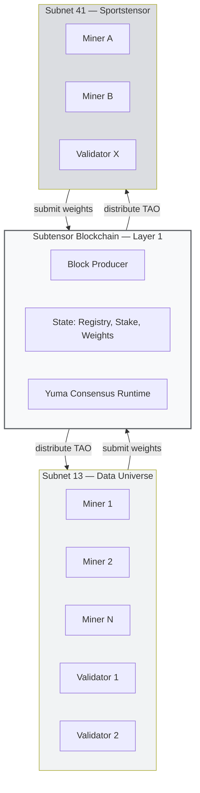
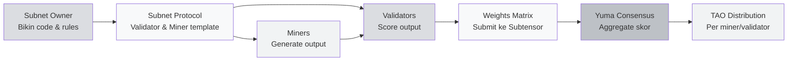
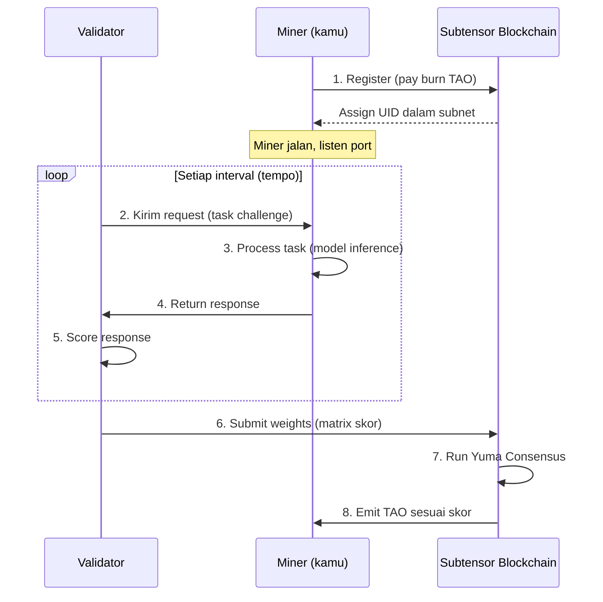
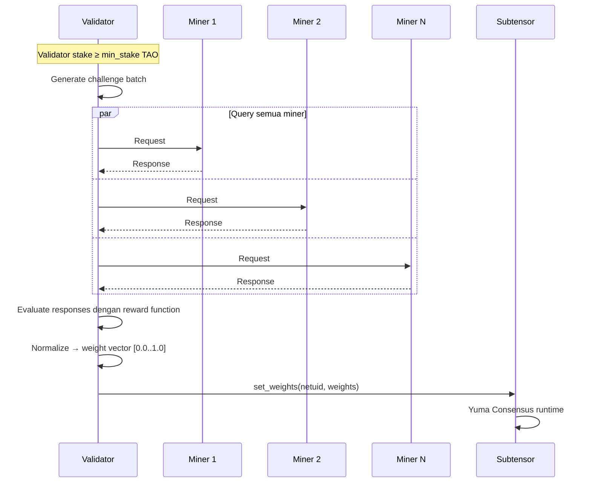
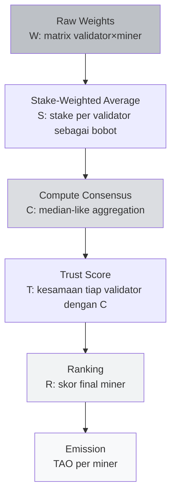
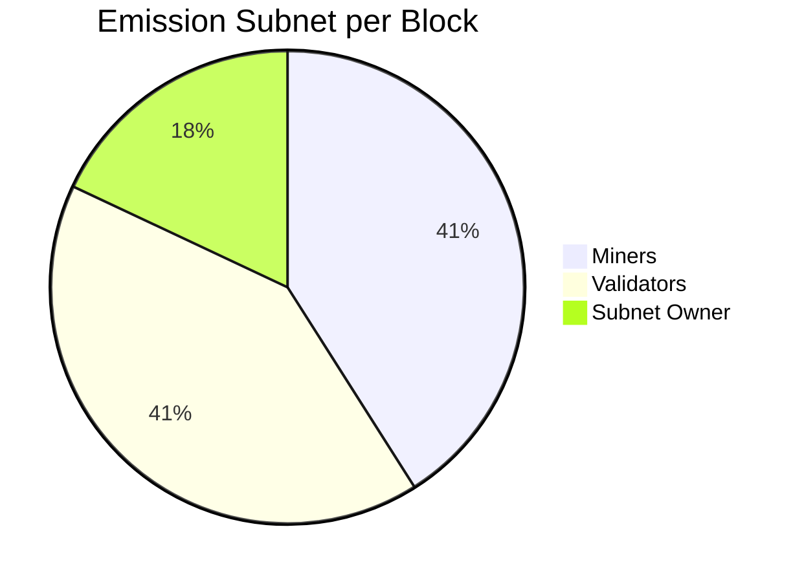
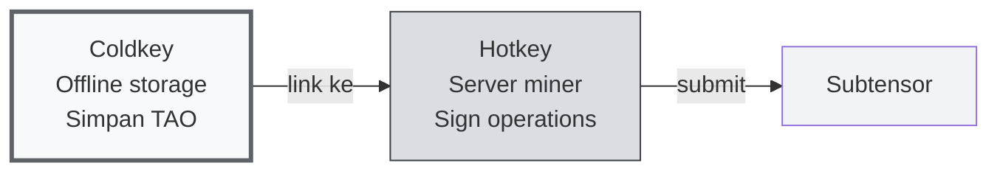
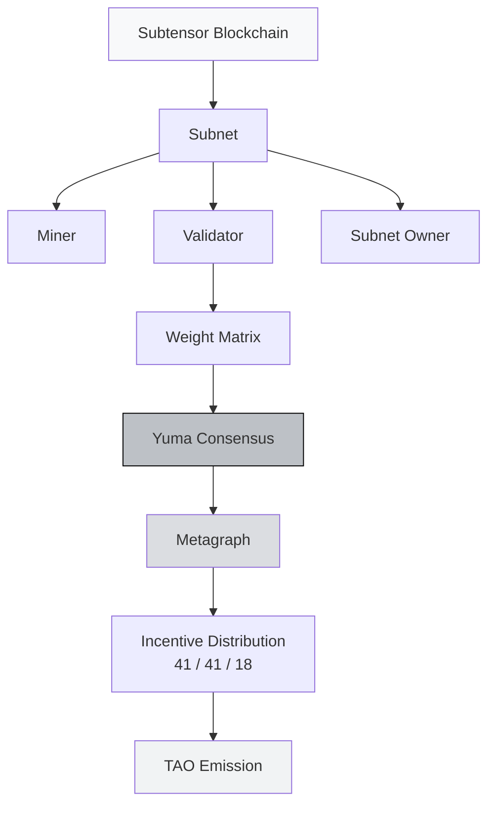

# ⛏️ Unit 2 — Core Concepts & Mechanisms of Bittensor

:::info Goal Unit Ini
Setelah baca unit ini, kamu akan paham:
1. **Arsitektur subnet** — apa isinya, siapa pelakunya, bagaimana datanya mengalir
2. **Role miner vs validator** — flow request-response dan skoring
3. **Yuma Consensus** — algoritma agregasi skor validator (simplified math)
4. **Metagraph** — "snapshot" network yang jadi ground truth untuk distribusi reward
5. **Incentive split 41/41/18** — siapa dapat apa, dan kenapa ratio ini
:::

> Unit sebelumnya (Unit 1) sudah menjelaskan **kenapa** Bittensor ada. Sekarang kita bedah **bagaimana** dia bekerja. Unit ini lebih teknis dari Unit 1 — sediain kopi, siap?

---

## 🗺️ Big Picture — Komponen Bittensor dalam Satu Gambar

Sebelum masuk detail, pahami dulu the big picture:



**Yang harus kamu tangkap dari diagram ini:**

1. Di bawah semuanya ada **Subtensor** — blockchain utama. Ini tempat state disimpan, consensus di-run, dan TAO di-emit.
2. Di atas Subtensor ada **subnet-subnet**. Setiap subnet punya komunitas miner & validator sendiri.
3. Subnet **tidak berinteraksi langsung satu sama lain** — masing-masing punya task spesifik. Tapi mereka **semua share Subtensor** sebagai source of truth.
4. Flow TAO: Subtensor emit TAO tiap blok → dibagi ke subnet → dibagi lagi ke miner & validator di dalam subnet sesuai kontribusi.

---

## 🧩 Apa Itu Subnet?

**Subnet** = unit spesialisasi di Bittensor. Setiap subnet adalah komunitas miner + validator yang bekerja di **satu task spesifik** dengan **reward mechanism yang di-customize**.

### Komponen Subnet



Mari kita bedah satu-satu:

### 1. Subnet Owner

Pihak (orang atau team) yang **deploy subnet** ke Subtensor dan menentukan:

- **Task apa** yang dikerjakan subnet (contoh: "scraping Twitter data", "prediksi hasil olahraga")
- **Reward function** — bagaimana validator score miner
- **Protocol** — request-response format antara miner dan validator
- **Parameter** — minimum stake, burn amount untuk registrasi, dll

Subnet owner dapat **18% emission** subnet-nya sebagai kompensasi maintenance. Kalau subnet populer → revenue bagus, kalau sepi → kerjaan sia-sia.

### 2. Miner

**Worker** yang menjalankan layanan AI aktual. Miner:

- Run model/algoritma di server/GPU sendiri
- Listen request dari validator
- Generate response secepat & seberkualitas mungkin
- Dapat **41% emission** subnet jika performanya bagus

### 3. Validator

**Auditor** yang menilai kualitas miner. Validator:

- Stake TAO (butuh minimum stake — di mainnet biasanya 1,000+ TAO)
- Kirim challenge/request ke miner
- Score response berdasarkan reward function
- Submit **weight matrix** ke Subtensor (angka 0–1 per miner)
- Dapat **41% emission** subnet jika scoring-nya "konsisten" dengan validator lain

### 4. NetUID

Setiap subnet punya ID angka unik. Contoh:
- **NetUID 1** — Text Prompting (subnet pertama)
- **NetUID 13** — Data Universe
- **NetUID 41** — Sportstensor
- **NetUID 64** — Chutes
- **NetUID 62** — Ridges

Saat kamu jalankan btcli atau code, kamu selalu rujuk subnet lewat NetUID-nya.

:::tip Analogi Sederhana: Subnet = Stall di Pasar
Bayangin Bittensor itu **pasar raksasa**. Setiap subnet = **stall (lapak)** dengan produk berbeda. Stall 13 jual data. Stall 41 jual prediksi olahraga. Stall 64 jual inference AI.

- **Subnet owner** = pemilik stall, bikin aturan stall (harga minimum, kualitas, dll)
- **Miner** = penjual di stall (bawa produk)
- **Validator** = inspektur pasar (nilai kualitas)
- **Subtensor** = sertifikat pasar (ngasih "ijin stall" dan "bayar sewa")
- **TAO** = mata uang umum di pasar
:::

---

## ⛏️ Miner — Flow Lengkap

Seorang miner punya lifecycle yang repetitif tapi penting dipahami:



### Step-by-Step untuk Miner

**1. Register ke subnet** — bayar "registration fee" berupa TAO yang di-burn. Besarannya dinamis (naik kalau banyak yang register kompetisi). Habis register, kamu dapat **UID** (angka unik dalam subnet, 0–255 biasanya).

**2. Jalankan software miner** — biasanya script Python yang:
- Load model (misalnya LLM, classifier, scraper, dll)
- Listen pada axon port (port TCP untuk komunikasi)
- Register axon IP ke Subtensor supaya validator bisa connect

**3. Serve request** — validator akan kirim request setiap **tempo** (interval block, biasanya ~72 menit / 360 blok). Miner proses dan return response.

**4. Tunggu reward** — kalau validator nilai kamu bagus (high weight), kamu dapat share emission TAO setiap tempo.

### Contoh Request-Response Miner

Misalnya di subnet Text Prompting (fictional simple example):

```python
# Miner pseudocode
def forward(synapse: TextPromptSynapse) -> TextPromptSynapse:
    prompt = synapse.prompt
    response = my_llm.generate(prompt, max_tokens=200)
    synapse.response = response
    return synapse
```

Di subnet Sportstensor (SN41):

```python
# Miner pseudocode
def forward(synapse: MatchPredictionSynapse) -> MatchPredictionSynapse:
    match_id = synapse.match_id
    # Fetch stats, run prediction model
    prediction = my_model.predict(match_id)
    synapse.prediction = prediction  # {home_win: 0.6, draw: 0.2, away_win: 0.2}
    return synapse
```

:::note Realita Teknis Miner
Sebagai miner, pekerjaan kamu **tidak hanya** menjalankan script. Yang bedain top-miner vs bottom-miner biasanya:
- **Kualitas model** (kalau subnet ML-heavy)
- **Latency** (validator timeout cepat — 5–10 detik)
- **Uptime** (kalau offline saat tempo, nggak dapat reward)
- **Strategy** (tahu pattern challenge validator, optimasi terhadap reward function)
:::

---

## 🔍 Validator — Flow Lengkap

Validator punya tanggung jawab berbeda dan lebih berat:



### Tanggung Jawab Validator

1. **Stake TAO** — minimum stake bervariasi per subnet, tapi umumnya ≥ 1,000 TAO (di dTAO era, stake pakai alpha token)
2. **Query semua miner** tiap tempo
3. **Score dengan reward function** subnet (ditentukan subnet owner)
4. **Submit weight vector** ke Subtensor — array angka 0–1 sepanjang jumlah miner
5. **Konsisten dengan validator lain** — kalau kamu skor beda drastis, Yuma Consensus akan "punish" kamu

### Reward Function — Contoh Konkret

Di Sportstensor (SN41), reward function sederhananya seperti ini (simplified):

```
score_miner_i = accuracy_over_last_N_matches - latency_penalty
weight_miner_i = softmax(score_miner_i across all miners)
```

Artinya: miner yang prediksinya **lebih akurat** di N match terakhir dan **responsenya cepat** dapat weight lebih tinggi.

Di Data Universe (SN13):

```
score_miner_i = volume_data × freshness × uniqueness × validation_pass_rate
```

Miner yang contribute **banyak data segar & unik** (bukan duplikat) yang lulus validasi dapat skor tinggi.

:::tip Kenapa Validator Butuh Stake Tinggi?
Karena kalau validator jahat (kasih weight random, atau collude dengan miner), dia bisa merusak distribusi reward. Stake tinggi adalah **skin in the game** — kalau scoring-nya deviate dari consensus, emission dia berkurang. Economic disincentive untuk bad behavior.
:::

---

## 🧠 Yuma Consensus — Jantung Bittensor

**Yuma Consensus** adalah algoritma yang agregasi semua weight dari validator-validator jadi satu distribusi reward akhir. Ini inovasi core Bittensor.

### Masalah yang Dipecahkan

Bayangin kamu punya 50 validator, masing-masing submit weight vector untuk 200 miner. Kamu dapat matrix 50×200 angka. Pertanyaan:

- **Weight validator mana yang lebih valid?** (Validator boss atau validator random?)
- **Gimana kalau satu validator jahat** kasih weight aneh?
- **Gimana aggregate secara adil** tanpa trust satu validator saja?

### Solusi: Weighted Consensus + Trust Score

Yuma Consensus bekerja dalam beberapa tahap (disederhanakan):



### Matematika Simplified

Anggap ada 3 validator (A, B, C) dengan stake (10, 20, 30) TAO, dan 2 miner (X, Y). Weight matrix-nya:

| Validator | Stake | Weight X | Weight Y |
|-----------|-------|----------|----------|
| A         | 10    | 0.8      | 0.2      |
| B         | 20    | 0.7      | 0.3      |
| C         | 30    | 0.2      | 0.8      |

**Step 1 — Stake-weighted average per miner:**

```
Miner X: (10×0.8 + 20×0.7 + 30×0.2) / 60 = (8 + 14 + 6) / 60 = 0.467
Miner Y: (10×0.2 + 20×0.3 + 30×0.8) / 60 = (2 + 6 + 24) / 60 = 0.533
```

**Step 2 — Consensus C = [0.467, 0.533]**

**Step 3 — Trust score tiap validator** (seberapa mirip weight mereka dengan consensus):

```
Trust_A = similarity([0.8, 0.2], [0.467, 0.533]) = rendah (jauh dari consensus)
Trust_B = similarity([0.7, 0.3], [0.467, 0.533]) = medium
Trust_C = similarity([0.2, 0.8], [0.467, 0.533]) = tinggi
```

**Step 4 — Validator dengan trust tinggi → emission validator mereka lebih besar.** Validator A yang "out-of-consensus" dapat emission lebih kecil (disincentive untuk melawan mayoritas).

**Step 5 — Miner Y (skor 0.533) dapat share emission lebih besar dari Miner X (skor 0.467).**

:::warning Kenapa "Mayoritas" Bukan Tyranny of Majority?
Pertanyaan valid: apa kalau 51% validator collude kasih skor jahat? Dalam teori bisa. Tapi dalam praktek:

- **Stake minimum** membuat validator colluding butuh stake puluhan ribu TAO ($juta dolar)
- **Reputation long-term** — validator yang konsisten scoring bagus akan dipercaya delegator dan dapat lebih banyak stake delegated
- **Reward function transparan** — kalau validator skor random, gampang di-detect oleh komunitas
- **Fork resistance** — komunitas bisa fork kalau ada attack serious

Trade-off-nya mirip Bitcoin — secara teori 51% attack mungkin, praktek sangat mahal.
:::

---

## 📊 Metagraph — Snapshot State Subnet

**Metagraph** adalah representasi lengkap state subnet pada titik waktu tertentu. Dia bukan "live stream" — dia snapshot yang di-update setiap tempo.

### Isi Metagraph

| Field | Arti | Contoh |
|-------|------|--------|
| `uids` | Array UID miner/validator dalam subnet | [0, 1, 2, ..., 255] |
| `stake` | Stake TAO tiap UID | [1000, 500, 20, ...] |
| `weights` | Matrix weight terakhir (validator → miner) | [[0.1, 0.2, ...], ...] |
| `ranks` | Skor ranking miner (hasil Yuma Consensus) | [0.8, 0.5, 0.3, ...] |
| `trust` | Trust score tiap neuron | [0.9, 0.7, ...] |
| `incentive` | Share incentive miner (fraction of miner pool) | [0.4, 0.1, ...] |
| `dividends` | Share dividend validator (fraction of validator pool) | [0.3, 0.2, ...] |
| `emission` | TAO emission per neuron per block | [0.05, 0.02, ...] |
| `hotkeys` | Public key tiap UID | ["5C4h...", "5F3s...", ...] |
| `axons` | IP:port tiap miner (buat validator connect) | ["1.2.3.4:8091", ...] |

### Cara Akses Metagraph

Pakai `btcli`:

```bash
btcli subnet metagraph --netuid 13
```

Atau di Python:

```python
import bittensor as bt
metagraph = bt.metagraph(netuid=13)
print(metagraph.ranks)       # [0.8, 0.5, 0.3, ...]
print(metagraph.incentive)   # [0.4, 0.1, ...]
```

:::tip Metagraph = Ground Truth
Kalau kamu jadi miner dan nggak yakin performa kamu bagus atau tidak, **baca metagraph**. Cek:
- `incentive[my_uid]` — share reward kamu sekarang
- `trust[my_uid]` — seberapa dipercaya kamu oleh validator
- `emission[my_uid]` — TAO per block yang kamu dapat

Semua decision optimization miner biasanya berbasis data metagraph.
:::

---

## 💰 Incentive Distribution — Ratio 41 / 41 / 18

Setiap subnet punya "emission pool" per blok. Pool ini dibagi tiga pihak:



### Kenapa 41 / 41 / 18?

Design choice dari Yuma Rao + iterasi community:

- **41% miner** — mereka yang bikin output real (the product)
- **41% validator** — mereka yang jaga kualitas (gatekeeper)
- **18% subnet owner** — mereka yang bikin & maintain protocol (infrastructure)

Kalau satu sisi over-rewarded, sistem collapse:
- Kalau miner 90%, validator quit → kualitas drop
- Kalau validator 90%, miner quit → nggak ada yang kerja
- Kalau owner 50%, miner & validator protest

41/41/18 adalah equilibrium yang work secara empiris.

### Contoh Angka Konkret

Anggap:
- Emission per block subnet = **1 TAO** (angka realistis untuk subnet medium)
- 1 block = 12 detik
- 1 tempo = 360 blocks = 72 menit

**Per tempo, subnet emit 360 TAO**, dibagi:

| Pihak | Share | Per Tempo | Per Hari (20 tempo) |
|-------|-------|-----------|---------------------|
| **Miner pool** | 41% | 147.6 TAO | 2,952 TAO |
| **Validator pool** | 41% | 147.6 TAO | 2,952 TAO |
| **Subnet owner** | 18% | 64.8 TAO | 1,296 TAO |
| **Total** | 100% | 360 TAO | 7,200 TAO |

Sekarang miner pool 147.6 TAO dibagi ke **semua miner aktif** (misalnya 128 miner) **proportional to incentive[uid]**. Jadi kalau miner UID 5 punya `incentive = 0.1`, dia dapat:

```
emission_miner_5 = 147.6 × 0.1 = 14.76 TAO per tempo
= 14.76 × 20 = 295.2 TAO per hari
```

Kalau TAO = $300, itu sekitar **$88,560/hari**. Kalau TAO = $50, itu $14,760/hari. Makanya harga TAO matters banget untuk ROI miner.

:::warning Realita Ekonomis
Contoh di atas adalah best case — top miner di subnet populer. Realitanya:
- Kebanyakan miner dapat incentive < 0.01 (bottom 80% kolektif)
- Top 3 miner bisa dominate dengan incentive > 0.3
- Kalau kamu new miner, **ekspektasinya loss dulu** beberapa tempo sampai strategy kamu matang

Dari perspektif subnet owner: kalau subnet sepi (sedikit validator total stake), emission ke subnet kamu juga kecil. Ada alokasi dinamis berbasis demand (lewat dTAO, bahas di Unit 3).
:::

---

## 🔑 Coldkey vs Hotkey — Pemisahan Kunci

Ini konsep penting yang akan kamu pakai terus di btcli:

| Kunci | Fungsi | Contoh Penggunaan |
|-------|--------|-------------------|
| **Coldkey** | Wallet utama, simpan TAO, tandatangan transaksi penting | Transfer TAO, stake/unstake, delegasi |
| **Hotkey** | Operational key, di-run di server miner/validator | Submit weight, serve axon, signing lightweight |

**Kenapa dipisah?**

Hotkey disimpan di server yang always-on → resiko compromised lebih tinggi. Kalau hotkey kamu bocor, attacker **tidak bisa drain TAO kamu** — mereka cuma bisa ganggu operation miner kamu. TAO tetap aman di coldkey yang disimpan offline.



Satu coldkey bisa punya **banyak hotkey** — misalnya kamu jalanin 5 miner di 5 subnet, tiap miner pakai hotkey berbeda tapi coldkey sama (untuk kumpulkan reward).

---

## 🧪 Contoh Perhitungan End-to-End

Oke, mari gabungkan semua konsep dengan satu skenario konkret.

**Setup:**
- Kamu miner di subnet SN41 (Sportstensor)
- UID kamu = 17
- Ada 128 miner aktif, 24 validator aktif
- Emission per block subnet = 0.8 TAO

**Tempo ke-100:**

1. 24 validator semua query UID 17. Kamu return prediction match.
2. Rata-rata accuracy kamu di 20 match terakhir = 62% (di atas average 55%).
3. 20 dari 24 validator kasih weight tinggi ke UID 17 (say, 0.05 average).
4. 4 validator kasih weight rendah (maybe disconnect, maybe scoring beda).
5. Stake-weighted average weight UID 17 = 0.042.
6. Ini di-feed ke Yuma Consensus → rank UID 17 = 0.042.
7. Normalisasi semua miner → **incentive[17] = 0.08**.

**Emission kamu tempo ini:**

```
miner_pool = 0.8 TAO/block × 360 blocks × 41% = 118.08 TAO
emission_17 = 118.08 × 0.08 = 9.45 TAO per tempo
```

Per hari (20 tempo): **189 TAO**. Kalau TAO = $200, itu **$37,800/hari**. 😮

(Sekali lagi: ini example untuk top-tier miner. Realistic median miner jauh di bawah.)

---

## 🧭 Peta Konsep yang Sudah Kamu Pelajari



Semua istilah ini harus kamu kenal by heart sebelum lanjut ke Unit 3.

---

## 🎯 Rangkuman

:::tip Yang Harus Kamu Ingat
1. **Subnet** = unit spesialisasi di Bittensor, dimiliki subnet owner, dijalankan miner & validator
2. **Miner** generate output AI; **Validator** score output; **Subnet Owner** bikin protocol
3. **Yuma Consensus** agregasi weight validator jadi ranking final — validator out-of-consensus dihukum lewat trust score
4. **Metagraph** = snapshot state subnet (stake, weights, incentive, dividends, emission) — ground truth untuk reward
5. **Incentive split 41/41/18** — miner, validator, subnet owner — equilibrium stabil secara empiris
6. **Coldkey vs Hotkey** — security hygiene dasar; coldkey simpan TAO, hotkey operate miner
7. Reward real depend pada: **incentive fraction × pool size × harga TAO** — semua variabel ini perlu di-optimize
:::

### ✅ Quick Check

- ❓ Sebutkan 4 role utama dalam subnet (selain Subtensor blockchain)
- ❓ Kenapa validator harus stake TAO sebelum bisa submit weight?
- ❓ Jelaskan secara singkat alur Yuma Consensus: raw weights → emission
- ❓ Apa beda coldkey dan hotkey, dan kenapa harus dipisah?

---

## 🚀 Next Unit

Kamu sekarang paham arsitektur Bittensor. Selanjutnya kita masuk ke **tools praktis** untuk interact dengan network ini.

**Next:** [Unit 3 — Tooling & Tokenomics](./03-tooling-tokenomics) 👉

*Di unit berikut: install btcli, bikin wallet, kenalan dengan TAO tokenomics lengkap (halving, max supply 21M), dTAO + alpha tokens, dan Chrome Extension wallet.*

---

### 📚 Referensi Tambahan

- [Bittensor Docs — Subnet Architecture](https://docs.bittensor.com/subnets/understanding-subnets)
- [Yuma Consensus Deep Dive (Opentensor Blog)](https://blog.opentensor.ai/)
- [Metagraph Reference](https://docs.bittensor.com/reference/metagraph)
- Phase 0 recap: [Kenapa Bittensor Penting?](../../Phase-0-Prerequisites/04-mengapa-bittensor)
