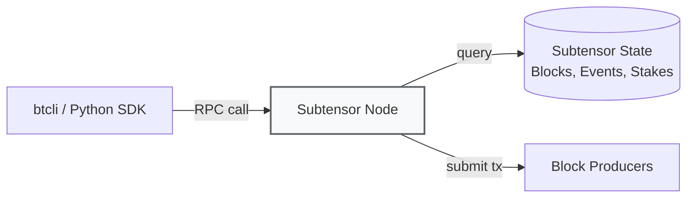
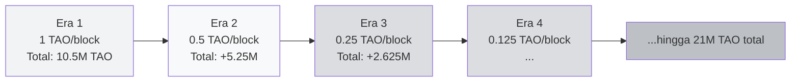
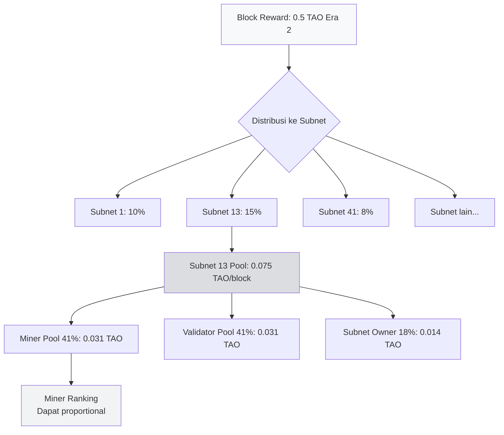
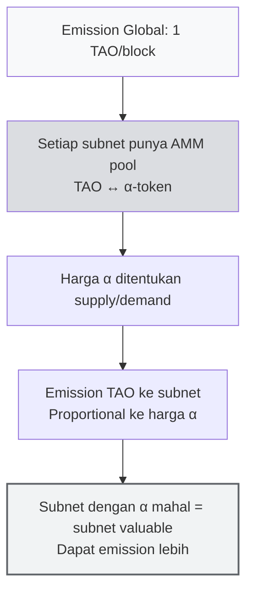

# 💰 Unit 3 — Tooling & Tokenomics

:::info Goal Unit Ini
Setelah baca unit ini, kamu akan paham:
1. **btcli** — install & pakai command-line tool utama Bittensor (wallet, stake, transfer, overview)
2. **Subtensor** — apa perannya, kenapa kamu biasanya pakai public endpoint
3. **TAO tokenomics** — halving schedule, max supply 21M, emission split 41/41/18 (subnet level)
4. **dTAO & alpha tokens** — mekanisme baru 2024+ di mana tiap subnet punya market price-nya sendiri
5. **Bittensor Chrome Extension wallet** — setup GUI wallet untuk user yang lebih familiar dengan Metamask-style
:::

> Unit ini setengah teori (tokenomics) + setengah praktek (btcli). Kamu belum perlu run miner — itu Phase 2. Tapi kamu akan **install tool + bikin wallet** supaya siap lanjut ke Phase 2.

---

## 🛠️ Bagian 1 — Tooling

### Apa Itu btcli?

**btcli** = "Bittensor Command Line Interface". Ini adalah tool utama untuk:

- 🔑 Bikin & manage wallet (coldkey + hotkey)
- 💸 Transfer TAO
- 🔒 Stake / unstake TAO ke validator
- 📝 Register miner/validator ke subnet
- 📊 Lihat metagraph, overview, emission
- 🗳️ Vote / delegate (untuk governance)

Built di atas Python SDK (`bittensor-cli`), jadi compatible dengan hampir semua OS (Linux, macOS, Windows WSL).

### Subtensor — Apa Itu dan Kenapa Harus Tahu?

**Subtensor** = blockchain utama Bittensor, dibangun di atas **Substrate framework** (sama seperti Polkadot). Dia tempat semua state, transaction, dan emission di-track.



**Tiga cara akses Subtensor:**

| Cara | Pro | Con | Cocok Untuk |
|------|-----|-----|-------------|
| **Public endpoint** (`finney`) | Gratis, tinggal pakai | Rate-limited, shared dengan dunia | Beginner, testing |
| **Self-hosted Subtensor node** | Full control, no rate limit | Butuh hardware + storage 500GB+ | Serious validator/miner |
| **Lite node (pruned)** | Lebih ringan dari full node | Tidak punya historical data | Middle ground |

Untuk CLC9, kita akan pakai **public endpoint finney** sepanjang Phase 1–2.

---

### Install btcli — Step by Step

#### Prerequisites

- **Python 3.9+** (cek dengan `python3 --version`)
- **pip** (biasanya sudah bundled)
- **Virtual environment** (recommended, nggak wajib)

#### Install via pip

```bash
# Bikin virtual env (recommended)
python3 -m venv btvenv
source btvenv/bin/activate     # Linux / macOS
# atau
btvenv\Scripts\activate        # Windows

# Install bittensor-cli
pip install bittensor-cli

# Verifikasi
btcli --version
```

Output yang diharapkan:

```
btcli v9.x.x
```

:::warning Windows User
Native Windows kadang bermasalah dengan dependency crypto. **Rekomendasi:** pakai **WSL2** (Windows Subsystem for Linux) + Ubuntu. Tutorial setup WSL ada di Phase 2 Unit 1 (Sportstensor setup).
:::

#### Install Full SDK (Optional, Tapi Recommended)

Kalau kamu mau juga pakai Python script:

```bash
pip install bittensor
```

Beda:
- `bittensor-cli` = cuma CLI tool
- `bittensor` = full Python SDK (CLI + library untuk bikin miner/validator)

Untuk CLC9 Phase 2, kamu butuh **full SDK**.

---

### Command btcli Penting — Cheatsheet

Berikut command yang akan paling sering kamu pakai. Hafalin atau bookmark.

#### 🔑 Wallet Management

```bash
# Bikin coldkey baru
btcli wallet new_coldkey --wallet.name my_wallet

# Bikin hotkey di bawah coldkey
btcli wallet new_hotkey --wallet.name my_wallet --wallet.hotkey miner1

# List semua wallet di system
btcli wallet list

# Lihat overview wallet (balance, stake, subnet)
btcli wallet overview --wallet.name my_wallet

# Export (backup) mnemonic
btcli wallet regen_coldkey --wallet.name backup_wallet
```

:::danger BACKUP MNEMONIC KAMU!
Saat `btcli wallet new_coldkey`, kamu akan di-prompt untuk **mnemonic 12/24 kata**. Ini adalah **satu-satunya cara recovery** kalau wallet hilang.

**Yang harus kamu lakukan:**
- Tulis di kertas fisik (jangan di cloud note!)
- Simpan di 2 lokasi berbeda
- **Jangan screenshot**
- **Jangan share ke siapa pun** — bahkan admin HackQuest nggak boleh tahu

Kalau mnemonic bocor, TAO kamu bisa di-drain dalam hitungan detik.
:::

#### 💸 Transfer & Stake

```bash
# Transfer TAO ke address lain
btcli wallet transfer --wallet.name my_wallet --dest 5CAh... --amount 10

# Stake TAO ke validator (delegated staking)
btcli stake add --wallet.name my_wallet --amount 50

# Unstake TAO
btcli stake remove --wallet.name my_wallet --amount 50

# Lihat current stake
btcli stake show --wallet.name my_wallet
```

#### 🌐 Subnet Management

```bash
# List semua subnet aktif
btcli subnet list

# Lihat metagraph subnet tertentu
btcli subnet metagraph --netuid 41

# Register miner/validator ke subnet
btcli subnet register --netuid 41 --wallet.name my_wallet --wallet.hotkey miner1

# Lihat harga registrasi sekarang
btcli subnet register --netuid 41 --wallet.name my_wallet --wallet.hotkey miner1 --dry-run
```

#### 📊 Info & Monitoring

```bash
# Root overview — TAO total supply, emission rate
btcli root get_weights

# Subnet-specific emission & stake
btcli subnet show --netuid 13

# Lihat delegasi di suatu validator
btcli stake show --all
```

:::tip Tip Praktis
Pakai `--help` di akhir command untuk lihat opsi lengkap. Contoh:

```bash
btcli wallet --help
btcli subnet register --help
```
:::

---

### Contoh Session: Bikin Wallet Pertama Kamu

Ini flow realistic yang akan kamu lakuin hari ini:

```bash
# 1. Aktifkan virtual env
source btvenv/bin/activate

# 2. Bikin coldkey pertama
$ btcli wallet new_coldkey --wallet.name clc9 --wallet.hotkey default

# [Prompt] Enter password:
# [Prompt] Confirm password:
# 
# Wallet created successfully!
# 
# MNEMONIC (SIMPAN INI!):
# abandon ability able about above absent absorb abstract absurd abuse access accident
# 
# coldkey address: 5CAh5A...

# 3. Bikin hotkey untuk miner Sportstensor
$ btcli wallet new_hotkey --wallet.name clc9 --wallet.hotkey sn41_miner

# 4. Cek overview
$ btcli wallet overview --wallet.name clc9

# Output:
# Coldkey: 5CAh5A...
# Hotkeys:
#   - default (5F3s...)       Stake: 0 TAO
#   - sn41_miner (5GrwF...)   Stake: 0 TAO
# Total Balance: 0 TAO
```

Kamu belum punya TAO — itu OK. Di Phase 2 kita akan bahas cara dapat TAO (faucet testnet, atau beli dari exchange).

---

## 💎 Bagian 2 — TAO Tokenomics

Sekarang ke sisi ekonomi. Kamu perlu paham **dari mana TAO berasal, berapa banyak ada, dan kenapa harganya bergerak**.

### Basic Facts tentang TAO

| Fakta | Nilai |
|-------|-------|
| **Symbol** | TAO (τ) |
| **Max Supply** | **21,000,000** (21 juta, mirip Bitcoin) |
| **Block Time** | ~12 detik |
| **Emission per block (initial)** | 1 TAO (sebelum halving) |
| **Blocks per halving** | 10,500,000 blocks (~4 tahun) |
| **Genesis** | 2021 (testnet), mainnet 2022 |
| **First Halving** | Expected ~2025–2026 (sudah terjadi) |

:::note Mirip Bitcoin, Tapi Beda
Bittensor secara sengaja pilih tokenomics mirip Bitcoin (21M cap + halving 4-tahunan). Alasannya: **proven scarcity model**. Beda utamanya:

- Bitcoin: reward untuk miner proof-of-work hash
- Bittensor: reward untuk miner proof-of-intelligence (AI output quality)

Plus ada **subnet owner share** yang Bitcoin nggak punya.
:::

---

### Halving Schedule — Visual



### Tabel Emission Schedule (Estimasi)

| Era | Periode | Emission/block | Total TAO Dicetak Era Ini |
|-----|---------|----------------|---------------------------|
| **1** | 2021–2025 | 1.000 TAO | 10,500,000 |
| **2** | 2025–2029 | 0.500 TAO | 5,250,000 |
| **3** | 2029–2033 | 0.250 TAO | 2,625,000 |
| **4** | 2033–2037 | 0.125 TAO | 1,312,500 |
| **5+** | 2037–2140+ | ↓↓↓ | ...sampai 21M total |

**Implikasi:** kalau kamu miner di 2026 (Era 2, early), kamu masih di periode **emission tinggi**. Setelah halving kedua (2029), emission turun 50% — kalau harga TAO nggak naik minimal 2x, income kamu turun setengah.

:::warning Implikasi Praktis Halving
Halving = setengah TAO dicetak → supply inflation turun. Efek biasanya:
- **Price pressure** (supply baru berkurang → harga cenderung naik)
- **Miner shakeout** (miner marginal nggak profitable → quit)
- **Competition tighter** (miner yang tersisa harus lebih efficient)

Kalau kamu rencanain mining long-term, **modelkan** skenario halving.
:::

---

### Emission Flow — Dari Block ke Miner

Kita sudah bahas 41/41/18 di Unit 2, tapi sekarang gabungkan dengan halving:



**Kuncinya:** ada **dua level distribusi**:
1. **Level 1 (root → subnet):** TAO per block dibagi antar subnet. Sebelum dTAO, ini diputuskan root validator voting. Setelah dTAO, proportional ke **harga alpha token** (bahas sebentar).
2. **Level 2 (subnet → miner/validator/owner):** 41/41/18, lalu dibagi per-neuron berdasarkan incentive/dividend.

---

## 🆕 Bagian 3 — Dynamic TAO (dTAO) & Alpha Tokens

Ini mekanisme baru yang revolusioner (launched 2024). Kalau kamu nggak paham ini, kamu bakal bingung liat subnet prices di Taostats.

### Masalah Sebelum dTAO

Sebelum 2024, alokasi emission ke subnet ditentukan oleh **root validator** — 64 validator elit dengan stake terbesar voting subnet mana yang harus dapat berapa.

**Masalah:**
- Politik & lobby subnet owner ke root validator
- Root validator bisa extract rent (minta share subnet untuk vote)
- Market inefficiency — subnet yang sebenarnya valuable mungkin underallocated kalau nggak punya koneksi

### Solusi: dTAO + Alpha Tokens

Di dTAO, setiap subnet punya **alpha token** sendiri (disebut "alpha" atau "α-token"), dengan mekanisme:



### Konsep Kunci dTAO

| Konsep | Penjelasan |
|--------|-----------|
| **α-token (alpha token)** | Token per-subnet. Subnet 13 punya α₁₃, subnet 41 punya α₄₁, dst |
| **AMM pool** | Mirip Uniswap v2. Setiap subnet punya pool TAO ↔ α, harga ditentukan constant product (x × y = k) |
| **Alpha price** | Harga 1 α dalam TAO. Semakin tinggi, subnet semakin "dihargai" market |
| **Emission proportional** | Subnet dengan alpha price tinggi → dapat share emission lebih besar |
| **Validator stake in α, bukan TAO** | Sekarang validator stake alpha token subnet, bukan TAO langsung. Stake dalam α subnet = "skin in the game" subnet itu |

### Analogi Sederhana: dTAO = Saham Subnet

:::tip Analogi
Bayangin TAO itu **Rupiah** (currency umum). Alpha token tiap subnet itu **saham perusahaan** di IDX.
- Beli alpha SN13 = seperti beli saham BBCA (investasi ke "perusahaan" Data Universe)
- Harga alpha naik = perusahaan growing, emission subnet makin banyak
- Harga alpha turun = subnet kurang dihargai, emission berkurang

Dan subnet "mengeluarkan dividen" (emission TAO) ke holder alpha (validator) + worker-nya (miner) + subnet owner.
:::

### Contoh Pool dTAO

Anggap subnet SN41 (Sportstensor) punya pool:

```
Pool SN41:
  TAO reserve: 5,000
  α₄₁ reserve: 10,000
  Price α₄₁ = TAO / α = 5000 / 10000 = 0.5 TAO per α
```

Sekarang seseorang stake 500 TAO ke SN41. AMM berperan:

```
New TAO reserve: 5,500
Using constant product (x × y = k):
  k = 5000 × 10000 = 50,000,000
  New α reserve = 50,000,000 / 5,500 = 9,090.9
  α diterima user: 10,000 - 9,090.9 = 909.1 α₄₁
  New price: 5,500 / 9,090.9 = 0.605 TAO per α (naik dari 0.5)
```

Artinya: staking 500 TAO mendorong harga alpha SN41 **dari 0.5 ke 0.605** (+21%). Kalau banyak orang stake ke SN41 → harga α naik → subnet dapat emission lebih banyak di next block.

:::warning Dinamika Penting
Ini bikin Bittensor jadi **market-driven**. Subnet yang genuinely valuable akan:
- Attract lebih banyak staker → harga alpha naik → emission naik → miner & validator dapat reward lebih → ekosistem subnet grow
- Subnet yang nggak valuable → alpha dump → emission turun → miner quit → subnet mati

Ini natural selection yang healthy untuk ekosistem.
:::

### Commands dTAO di btcli

```bash
# Lihat alpha price semua subnet
btcli subnet list

# Lihat detail pool subnet tertentu
btcli subnet show --netuid 41

# Stake TAO ke subnet (dapat alpha)
btcli stake add --netuid 41 --amount 100 --wallet.name clc9

# Unstake (jual alpha, dapat TAO)
btcli stake remove --netuid 41 --amount 50 --wallet.name clc9

# Move stake antar subnet (swap alpha)
btcli stake move --origin 41 --dest 13 --amount 50 --wallet.name clc9
```

---

## 🖥️ Bagian 4 — Bittensor Chrome Extension Wallet

Kalau kamu lebih comfortable dengan GUI wallet (mirip Metamask), Bittensor punya official Chrome Extension.

### Kenapa Pakai Extension?

| Scenario | Rekomendasi |
|----------|-------------|
| Mining/validator operational | **btcli** (scriptable, server-friendly) |
| Light user, staking & transfer | **Extension** (GUI, user-friendly) |
| DApp interaction (future) | **Extension** (web3-compatible) |
| Production security | **Hardware wallet + btcli** (paling aman) |

Untuk **CLC9 Phase 2** kamu akan pakai btcli. Tapi **Extension berguna** untuk monitor balance sehari-hari.

### Install Steps

1. **Buka Chrome Web Store** — search "Bittensor Wallet"
2. Atau langsung: [chrome.google.com/webstore/bittensor-wallet](https://chrome.google.com/webstore) (cek URL resmi di docs.bittensor.com)
3. Klik **Add to Chrome**
4. Pin extension ke toolbar

### Setup Wallet

**Opsi A — Bikin wallet baru:**
1. Klik extension → "Create New Wallet"
2. Set password (minimum 8 karakter)
3. **Backup mnemonic 12 kata** (tulis di kertas!)
4. Confirm mnemonic
5. Done — coldkey address muncul

**Opsi B — Import wallet existing:**
1. Klik extension → "Import Wallet"
2. Paste mnemonic kamu
3. Set password lokal
4. Coldkey address kamu muncul

### Sync dengan btcli

Extension dan btcli share **wallet format yang sama**. Kalau kamu bikin wallet di btcli, mnemonic-nya bisa di-import ke extension (dan sebaliknya).

:::tip Best Practice
1. **Bikin wallet utama (coldkey) di btcli** di laptop/server terpisah
2. **Import ke Extension** di browser untuk monitor balance
3. **Jangan simpan mnemonic di password manager cloud** (iCloud, Google Pass) — cukup di kertas + file offline terenkripsi
:::

### Fitur Extension

- Lihat balance TAO coldkey
- Transfer TAO
- Stake/unstake ke validator
- Support dTAO alpha tokens (lihat holding per subnet)
- Sign transaksi untuk DApp Bittensor (future)

---

## 🔐 Security Hygiene — Yang Harus Kamu Jalani

Karena ini involve duit riil, kita perlu bahas security sekali lagi.

### Level 0 — Newbie (Hari Pertama)

- ✅ Mnemonic di kertas fisik, simpan di rumah
- ✅ Password btcli minimum 12 karakter
- ✅ Jangan pakai wallet yang sama di 5 device berbeda
- ❌ Jangan share mnemonic di Telegram/Discord (admin tipu, admin beneran nggak akan minta)

### Level 1 — Serious (Mulai Mining)

- ✅ Pisahkan coldkey (simpan offline) dan hotkey (di server miner)
- ✅ Hotkey di server boleh terekspos — kalau bocor, TAO di coldkey aman
- ✅ Backup mnemonic ke 2 lokasi fisik berbeda
- ✅ Lock laptop / enable FDE (full disk encryption)

### Level 2 — Pro (Mining dengan Capital Besar)

- ✅ Hardware wallet (Ledger atau Trezor) untuk coldkey utama
- ✅ Multi-sig via Subtensor multi-sig pallet (untuk tim)
- ✅ Dedicated server untuk validator/miner (bukan laptop personal)
- ✅ Monitoring uptime + alerting

:::danger Scam Yang Biasa Terjadi
- 🚫 DM di Telegram claim "HackQuest admin" minta mnemonic — SCAM
- 🚫 Website fake "bittensor-claim.com" minta paste mnemonic — SCAM
- 🚫 Extension palsu di Chrome Store (selalu cek publisher resmi = Opentensor Foundation)
- 🚫 "Airdrop TAO" YouTube video — SCAM
:::

---

## 📊 Recap — Tokenomics Cheatsheet

| Konsep | Ringkasan |
|--------|-----------|
| **TAO max supply** | 21,000,000 |
| **Halving** | Setiap ~4 tahun (10.5M blocks) |
| **Era 2 emission** | 0.5 TAO/block (saat artikel ini ditulis) |
| **Split per subnet** | 41% miner / 41% validator / 18% owner |
| **dTAO** | Tiap subnet punya alpha token, AMM TAO ↔ α |
| **Alpha price drives emission** | Subnet dengan α price tinggi dapat emission lebih |
| **Staking di era dTAO** | Stake pakai α-token subnet (bukan TAO langsung) |

---

## 🎯 Rangkuman

:::tip Yang Harus Kamu Ingat
1. **btcli** = CLI utama Bittensor. Install via `pip install bittensor-cli`
2. **Coldkey vs Hotkey** — coldkey simpan TAO (offline), hotkey operate miner/validator
3. **TAO tokenomics** mirip Bitcoin: max 21M, halving tiap ~4 tahun, Era 2 sekarang (0.5 TAO/block)
4. **Emission split per subnet:** 41% miner / 41% validator / 18% subnet owner
5. **dTAO (2024+)** — tiap subnet punya alpha token + AMM pool. Subnet dengan alpha price tinggi dapat emission lebih besar
6. **Chrome Extension** — GUI wallet untuk monitor balance, optional tapi handy
7. **Security first**: mnemonic di kertas, coldkey offline, jangan share ke siapa pun
:::

### ✅ Quick Check

- ❓ Command apa untuk bikin coldkey baru di btcli? Dan bikin hotkey di bawahnya?
- ❓ Sebutkan 3 perbedaan antara TAO sebelum dan sesudah dTAO (2024)
- ❓ Kalau alpha price subnet X = 0.8 TAO/α dan subnet Y = 0.2 TAO/α, subnet mana yang dapat emission lebih besar? Kenapa?
- ❓ Apa risiko kalau hotkey bocor (dibanding kalau coldkey/mnemonic bocor)?

---

## 🚀 Next Unit — Masuk ke Subnet Dunia Nyata!

Selamat, kamu sudah selesai **Concept I — Introduction to Bittensor**! Kamu sekarang paham:

- ✅ Sejarah & alasan Bittensor ada (Unit 1)
- ✅ Arsitektur teknis: subnet, miner, validator, Yuma Consensus, metagraph (Unit 2)
- ✅ Tooling (btcli) + tokenomics (TAO, halving, dTAO, alpha tokens) (Unit 3)

Selanjutnya di **Concept II — Core Bittensor Subnets**, kita akan bedah 4 subnet spesifik yang akan kamu interact langsung:

**Next:** [Concept II — Unit 1: Chutes (Decentralized Inference Infrastructure)](../Concept-2-Core-Subnets/chutes) 👉

*Chutes adalah subnet yang bikin Bittensor jadi "AWS-nya AI decentralized" — inference API yang bisa diakses siapa saja dengan TAO. Kita akan lihat bagaimana dia bekerja dan kenapa dia foundational untuk ekosistem.*

---

### 📚 Referensi untuk Unit Ini

- [btcli Official Docs](https://docs.bittensor.com/btcli)
- [Bittensor Tokenomics Overview](https://docs.bittensor.com/dynamic-tao/dtao-guide)
- [Taostats Explorer](https://taostats.io) — real-time metagraph, alpha prices, emission
- [Bittensor Chrome Extension (Opentensor)](https://bittensor.com/wallet)
- Phase 0 recap: [Centralized vs Decentralized AI](../../Phase-0-Prerequisites/centralized-vs-decentralized-ai)

*Ready untuk eksplor subnet production? Lanjut ke Chutes!* 🦆⚡
