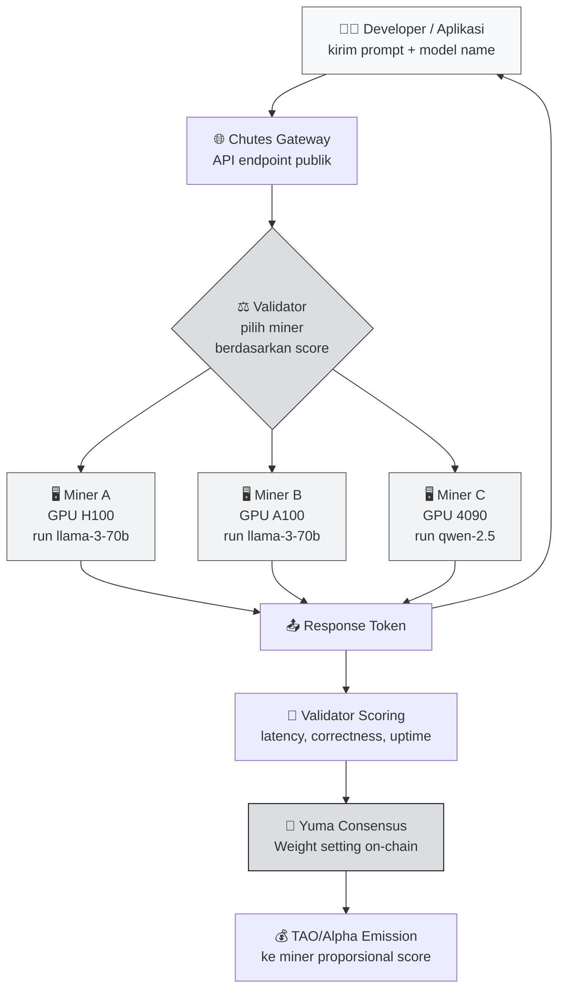

# ⚡ Chutes — Decentralized Inference Infrastructure Subnet

Sekarang kamu sudah paham **arsitektur umum Bittensor** (subnet, miner, validator, Yuma Consensus) dari Concept 1. Saatnya turun satu level: **apa yang sebenarnya dilakukan tiap subnet?** Kita mulai dari **Chutes** — salah satu subnet paling "terlihat" manfaatnya karena langsung menyentuh kebutuhan developer: **inference LLM**.

:::info Goal Unit Ini
Setelah selesai membaca unit ini kamu akan bisa:
- 🎯 Menjelaskan **apa itu decentralized inference** dan kenapa itu berbeda dengan memanggil OpenAI API
- ⚙️ Menggambarkan **peran miner & validator di Chutes** — siapa mengerjakan apa
- 💰 Membandingkan **Chutes vs centralized inference** dari sisi harga, latensi, dan censorship
- 🧠 Mengidentifikasi **use case nyata** di mana Chutes lebih masuk akal daripada API komersial
- 📈 Punya gambaran **basic miner economics** (modal GPU, reward TAO, risiko)
:::

---

## 🧠 Recap Singkat: Kenapa Inference itu Mahal?

Sebelum masuk Chutes, ingat dulu masalah yang mau dipecahkan.

Kalau kamu pernah pakai ChatGPT, Claude, atau Gemini — itu semua jalan di **data center raksasa** milik OpenAI / Anthropic / Google. Setiap prompt yang kamu kirim:

1. Masuk ke server mereka.
2. Diproses oleh GPU cluster (biasanya H100 / A100).
3. Model menghasilkan token balasan.
4. Kamu bayar per-token (atau mereka rugi & subsidi kamu).

Ada tiga masalah klasik:

- 💸 **Mahal.** GPT-4-class model bisa $10–30 per juta token output. Untuk produk volume besar, biaya inference bisa melebihi revenue.
- 🚫 **Censorable.** Mereka bisa block akun kamu, block negara, atau refuse topic tertentu. Kalau kamu bangun produk finansial / medis / kontroversial — risiko tinggi.
- 🔐 **Opaque.** Kamu tidak tahu model apa persisnya yang melayani kamu, apakah di-log, apakah dipakai training.

Chutes lahir untuk **decouple** inference dari tiga-tiganya.

---

## 🎯 Apa itu Chutes?

> **Chutes** adalah subnet Bittensor yang **menyediakan decentralized inference** — artinya siapa pun dengan GPU bisa menjadi miner yang melayani request LLM (text generation, embedding, vision model, dll) dari developer & aplikasi di seluruh dunia.

Anggap Chutes seperti **Uber untuk GPU inference**:

- **Pengguna (developer / aplikasi)** mengirim prompt + pilih model (misalnya `llama-3-70b` atau `qwen-2.5-coder`).
- **Miner** yang punya GPU idle mengambil request itu, menjalankan model, dan mengembalikan hasil.
- **Validator** memastikan miner jujur — output valid, latensi wajar, quality memadai.
- **Jaringan** membayar miner dalam TAO/alpha sebanding dengan kontribusinya.

:::note Analogi Sederhana
Bayangkan **warnet GPU global**. Dulu warnet dipakai buat main game karena orang tidak mampu beli PC gaming sendiri. Chutes adalah **warnet untuk inference**: developer yang tidak punya GPU H100 bisa "numpang" ke miner yang punya — tapi tanpa perlu percaya satu perusahaan sentral, karena ada validator yang memastikan kualitas.
:::

---

## 📊 Arsitektur Chutes — Alur End-to-End

Alur di atas yang terjadi **setiap detik** di subnet Chutes. Mari pecah satu-satu.

---

## ⚙️ Apa yang Dikerjakan Miner?

Miner Chutes adalah **operator GPU** yang menjalankan model yang diminta subnet. Secara konkret:

1. **Pilih model yang mau kamu serve.** Subnet biasanya punya "allowlist" model (contoh: `llama-3.1-70b-instruct`, `qwen-2.5-coder-32b`, beberapa vision / embedding model).
2. **Siapkan infrastructure inference.** Umumnya pakai `vLLM`, `TGI`, atau `SGLang` sebagai engine inference. Ini framework yang meng-optimize throughput GPU (continuous batching, PagedAttention, dll).
3. **Daftar ke subnet.** Bayar registration fee (dalam TAO/alpha) sehingga hotkey kamu terdaftar sebagai neuron di NetUID Chutes.
4. **Listen request dari validator.** Miner software kamu buka endpoint yang di-query validator.
5. **Respon dengan output model.** Kirim balik token stream secepat mungkin.
6. **Repeat ~24/7.** Makin banyak request yang dilayani dengan quality & latency bagus, makin tinggi score.

:::tip Hardware Requirement (indikasi)
Untuk serve model 70B (Llama-3-70b) efisien, kamu butuh minimal:
- **2× A100 80GB** atau **1× H100 80GB** untuk fp16
- Atau **1× A100 80GB** kalau pakai quantization (AWQ/GPTQ 4-bit)

Untuk model 7B–13B bisa jalan di **RTX 4090 24GB**. Tapi reward jelas lebih rendah karena demand ke model kecil juga lebih rendah & kompetisi tinggi.
:::

---

## ⚖️ Apa yang Dikerjakan Validator?

Validator tidak mem-proses prompt user langsung. Tugas mereka: **mengukur kinerja miner** supaya emission TAO turun ke yang paling berkontribusi.

Validator Chutes biasanya melakukan:

- **Synthetic queries** — kirim prompt standar ke banyak miner, bandingkan output.
- **Correctness scoring** — periksa apakah output masuk akal, bukan garbage / potong di tengah / beda model dari yang diklaim.
- **Latency scoring** — miner yang respond cepat (p50 & p99 low) dapat score lebih tinggi.
- **Uptime scoring** — miner yang sering offline di-penalize.
- **Consistency** — output untuk prompt sama tidak boleh terlalu acak (kecuali seed random eksplisit).

Hasilnya dipetakan jadi **weight vector** yang di-submit on-chain. Yuma Consensus kemudian meng-aggregate weight dari semua validator → distribusi TAO final.

:::warning Validator juga bisa "bohong"
Seperti miner yang bisa spam junk output, validator juga bisa coba curang (favoritism ke hotkey tertentu). Yuma Consensus melindungi network dengan menghukum validator yang weight-nya menyimpang jauh dari konsensus median. Ini sudah dibahas di Concept 1 Unit 2 — bagian **"Validator incentive & bond"**.
:::

---

## 💰 Chutes vs Centralized API — Perbandingan Nyata

| Aspek | OpenAI / Anthropic API | Chutes |
|---|---|---|
| **Harga input/output** | Fixed per 1M token, ditentukan vendor | Market-driven, cenderung lebih murah untuk model open-source sekelas |
| **Model tersedia** | Hanya model proprietary vendor | Llama, Qwen, Mistral, DeepSeek — semua open model |
| **Censorship** | Vendor bisa block akun / topik / negara | Permissionless — siapa pun bisa akses |
| **Data privacy** | Kebijakan log vendor (kadang dipakai training) | Miner berbeda-beda; bisa pilih miner yang sign privacy commitment |
| **Latency** | Sangat stabil (p99 rendah, SLA kuat) | Variatif — tergantung pilihan miner & beban |
| **Uptime / reliability** | SLA 99.9%+ dengan kompensasi | Tergantung validator fallback; belum ada SLA kontraktual |
| **Custom fine-tuned model** | Terbatas, harus lewat vendor | Bisa — miner bebas serve model hasil fine-tune sendiri |
| **Billing** | Credit card, fiat, post-paid | TAO on-chain (atau via gateway yang accept fiat) |

:::info Kesimpulan Pragmatis
**Untuk enterprise yang butuh SLA & compliance audit** — OpenAI masih unggul.
**Untuk developer indie / startup yang butuh model open-source dengan harga optimal dan tanpa drama KYC** — Chutes jauh lebih menarik.
**Untuk aplikasi yang beroperasi di jurisdiksi / topik "grey"** — Chutes praktis satu-satunya jalan yang scalable.
:::

---

## 🎯 Use Case Nyata

Chutes paling cocok untuk skenario-skenario ini:

### 1. Startup AI yang Burn Ratenya Ketat
Kamu bangun produk agentic (AI agent yang panggil LLM puluhan kali per task). Di OpenAI ini bisa habiskan $5–20 per user per bulan. Di Chutes, dengan model open-source sekelas (Llama-3.1-70B ≈ GPT-4-mini class), biayanya bisa turun signifikan — meski trade-off di SLA.

### 2. Aplikasi yang Perlu Model Custom
Kamu sudah fine-tune Llama buat use case spesifik (legal doc, medis, lokal Indonesia). Di Chutes kamu bisa jadi miner yang serve model fine-tune kamu sendiri, atau kerja sama dengan miner existing.

### 3. Produk yang Aktif di "Grey Zone"
Adult content, gambling assistant, legal research di jurisdiksi sensitif — semua ini akan di-ban OpenAI. Chutes permissionless.

### 4. Research & Benchmark
Peneliti yang butuh inference model terbuka dalam volume besar untuk eksperimen (evals, red-team, synthetic data generation).

### 5. Agent Framework Developer
Builder yang bikin AutoGPT-like agent — mereka butuh akses model beragam & murah untuk test orchestration. Chutes memberikan akses multi-model lewat satu gateway.

---

## 📈 Basic Miner Economics

Ini bagian yang sering ditanya pemula: **"Kalau aku jadi miner Chutes, balik modal gak?"**

Jawaban jujur: **tergantung banyak variabel**. Mari pecah.

### Biaya Utama

| Komponen | Estimasi Bulanan |
|---|---|
| Sewa GPU cloud (1× H100 80GB on-demand) | $1.800 – $3.000/bln |
| Sewa GPU cloud (1× A100 80GB spot) | $700 – $1.200/bln |
| GPU owned (listrik + depresiasi 4090) | $100 – $250/bln |
| Registration fee (one-time, dalam TAO) | Variatif — lihat Taostats |
| Bandwidth / monitoring / ops | $20 – $100/bln |

### Revenue Miner (Qualitatif)

Reward miner dihitung dari:
1. **Score relatif** kamu vs miner lain di subnet (bukan absolut).
2. **Total emission TAO** yang turun ke subnet Chutes per hari (ditentukan dynamic TAO / root subnet weight).
3. **Harga TAO / alpha token** di market.

Karena TAO price & subnet emission **volatile**, revenue harian miner bisa berfluktuasi 30–50% week-over-week. Beberapa rentang indikatif yang sering dilaporkan komunitas:

- **Miner top-ranked dengan H100** di subnet inference populer: beberapa puluh ribu sampai ratusan ribu rupiah per hari (dalam TAO equivalent). Ini sangat kasar — cek Taostats realtime.
- **Miner mid-tier dengan A100**: biasanya di bawah level H100 top-tier, bisa break-even atau profit tipis.
- **Miner entry-level (4090)**: sering kesulitan break-even di subnet dengan model besar. Lebih cocok di subnet dengan model kecil atau subnet non-Chutes.

:::danger Peringatan Realistis
Jangan masuk Bittensor mining dengan **expectation tetap profit**. Ini kompetisi global — kamu head-to-head dengan operator profesional yang punya ratusan GPU. Pemula sangat disarankan mulai dari **subnet yang lebih ramah pemula seperti Data Universe (SN13)** sebelum serius di Chutes. Lihat Unit 2 di Concept ini.
:::

---

## 🧩 Cocok untuk Kamu Kalau...

Profile miner Chutes yang ideal:

- ✅ **Punya akses GPU enterprise-grade** (H100, A100, atau minimal A6000) — baik owned maupun cloud.
- ✅ **Familiar dengan vLLM / TGI / SGLang** — atau mau serius belajar inference engine dalam 2–4 minggu.
- ✅ **Comfortable dengan devops Linux** — systemd, Docker, monitoring, log rotation.
- ✅ **Paham basic networking** — buka port, reverse proxy, TLS.
- ✅ **Tahan banting terhadap volatility** — siap revenue turun 40% dalam semalam karena TAO price.

❌ **Kurang cocok kalau** kamu baru pertama kali sentuh command line atau belum pernah running Docker container production. Mulai dari SN13 dulu.

---

## 🔗 Konteks di Kurikulum Ini

Chutes **bukan** subnet yang kita build miner-nya di Phase 2. Kenapa?

1. **Cost barrier tinggi** — tidak semua peserta punya H100.
2. **Tech complexity** — tuning vLLM untuk competitive latency butuh pengalaman.
3. **Tujuan camp adalah** membuat kamu punya **miner pertama yang running** — bukan miner paling untung. Untuk itu **SN41 (Sportstensor)** dan **SN13 (Data Universe)** jauh lebih cocok sebagai pintu masuk.

Tapi memahami Chutes tetap penting karena:
- Chutes adalah **showcase** dari apa yang Bittensor bisa capai ketika inference di-desentralisasi.
- Banyak konsep scoring (latency, correctness) yang nanti **mirip** di SN41 (prediction correctness + latency).
- Kalau setelah camp kamu upgrade ke GPU enterprise, kamu bisa kembali lagi ke Chutes.

---

## 🎯 Rangkuman

Yang perlu kamu ingat dari unit ini:

1. **Chutes = decentralized LLM inference.** Miner menyediakan GPU, validator scoring quality & latency, user dapat akses model open-source via gateway.
2. **Nilai jualnya:** lebih murah untuk model open, censorship-resistant, permissionless — trade-off di SLA dan konsistensi.
3. **Miner economics rumit:** butuh GPU mahal, kompetisi global, reward volatile. Bukan subnet entry-level untuk pemula.
4. **Validator tidak men-forward prompt user** — mereka menilai miner lewat synthetic queries dan scoring heuristic.
5. **Chutes vs OpenAI** bukan apple-to-apple; itu trade-off positioning — yang satu fokus enterprise SLA, yang satu fokus open access.

### ✅ Quick Check

Sebelum lanjut ke Unit 2 (Data Universe), pastikan kamu bisa jawab:

1. Sebutkan 3 hal yang di-scoring validator Chutes terhadap miner.
2. Kenapa developer indie bisa lebih untung pakai Chutes dibanding OpenAI API?
3. Apa hardware minimal untuk jadi miner Chutes yang kompetitif di model 70B?
4. Kenapa kita **tidak** akan deploy miner Chutes di camp ini?
5. Apa analogi "Uber untuk GPU inference" — siapa driver, penumpang, dan dispatcher-nya?

Kalau lima pertanyaan di atas terjawab lancar → lanjut ke Data Universe. Kalau masih goyang, baca ulang bagian **Arsitektur Chutes** dan **Miner Economics**.

---

### 📚 Referensi Lanjutan

- [Bittensor Official Docs](https://docs.bittensor.com) — dokumentasi resmi
- [Taostats — Subnet Explorer](https://taostats.io) — cek NetUID Chutes, miner ranking, emission real-time
- [vLLM](https://github.com/vllm-project/vllm) — inference engine paling umum dipakai miner
- [SGLang](https://github.com/sgl-project/sglang) — alternative performant inference
- Concept 1 Unit 2 — **Core Concepts & Mechanisms** (refresher subnet, miner, validator)

---

**Next:** [Unit 2 — Data Universe (SN13) → Decentralized Data Provision](./data-universe) 👉
