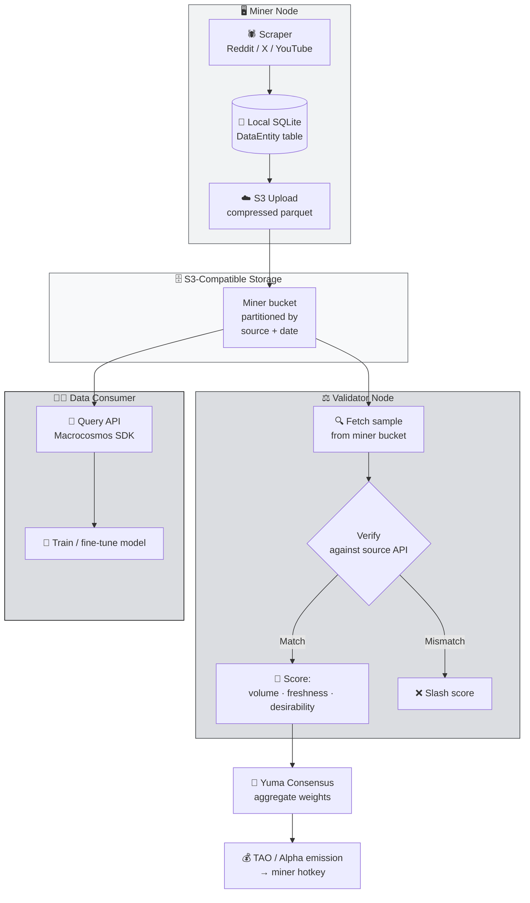

# 📊 Data Universe (SN13) — Decentralized Data Provision Subnet

Setelah Chutes yang menyediakan **compute** (GPU inference), sekarang kita bahas subnet yang menyediakan **bahan bakar** AI: **data**. Welcome to **Data Universe — NetUID 13**.

Kalau di industri AI ada pepatah "data is the new oil", maka SN13 adalah **kilang minyaknya Bittensor**: subnet yang men-scrape, membersihkan, dan menyediakan dataset segar untuk siapa pun yang butuh train / fine-tune model.

:::info Goal Unit Ini
Setelah selesai membaca unit ini kamu akan bisa:
- 🎯 Menjelaskan **misi SN13** dan kenapa "data provision" adalah subnet paling strategis di Bittensor
- 📦 Memahami **sumber data** yang di-scrape miner (Reddit, X/Twitter, YouTube transcripts)
- 🗄️ Memahami **storage architecture** — kenapa S3-compatible dan bagaimana validator verifikasi
- 📏 Memahami prinsip **Data Universe scoring** — faktor yang bikin miner dapat reward
- 🚀 Tahu kenapa **SN13 adalah pilihan terbaik untuk miner pemula** — dan ini yang akan kamu build di Phase 2 GP-2
:::

---

## 🧠 Kenapa "Data" Adalah Gold di AI?

Industri AI modern dibangun di atas tiga pilar: **compute, algoritma, data**. Dari ketiganya, **data adalah yang paling susah di-scale**.

- **Compute** → beli GPU lebih banyak, masalah beres (asal punya modal).
- **Algoritma** → di-publish di arXiv gratis, siapa pun bisa pakai.
- **Data berkualitas** → ini yang **scarce**. Sumber data training internet tidak infinite, dan yang bagus (human-written, recent, non-synthetic) makin langka.

Ketika OpenAI / Google / Anthropic butuh data fresh, mereka:
1. Bayar perusahaan scraping (Common Crawl, atau vendor private).
2. Deal langsung dengan platform (Reddit deal ~$60M untuk Google, X deal dengan xAI).
3. Bangun army scraper internal.

Masalahnya:
- **Deal eksklusif** bikin data jadi moat para raksasa — AI startup kecil tidak punya akses setara.
- **Data statis cepat basi** — tren berubah tiap bulan; dataset tahun lalu sudah out-of-distribution.
- **Data ter-terlabel / dikontekstualisasi** (bukan raw HTML) butuh pipeline kompleks.

SN13 memecahkan ini dengan **desentralisasi kerja scraping** ke ribuan miner global.

:::note Analogi Sederhana
Bayangkan **Wikipedia yang dibayar**. Di Wikipedia orang kontribusi sukarela untuk mengisi artikel. Di SN13, miner "kontribusi" data dari Reddit / X / YouTube — tapi mereka **dibayar dalam TAO** sebanding dengan **kualitas & ke-fresh-an** data mereka. Lebih scalable, lebih bisa diandalkan secara ekonomi.
:::

---

## 🎯 Apa itu Data Universe / SN13?

> **Data Universe (NetUID 13)**, dikelola oleh tim **Macrocosmos**, adalah subnet Bittensor yang mission-nya adalah **mengumpulkan, memvalidasi, dan menyediakan data training high-quality** — terutama dari platform sosial & video yang kontennya dibuat manusia secara real-time.

Outputnya: **dataset terbuka** yang bisa dipakai untuk:
- 🤖 **Fine-tune LLM** dengan data percakapan terkini
- 📈 **Training model analisis sentimen** untuk finance / marketing
- 🔬 **Penelitian social science** dalam skala besar
- 🛒 **Product intelligence** (apa yang orang bicarakan tentang produk X)

---

## 📦 Sumber Data yang Di-scrape

Data Universe fokus pada sumber data yang **high-signal** dan **fresh**. Tiga sumber utama saat ini:

### 1. Reddit
Subreddit-based scraping. Reddit adalah sumber **diskusi panjang & terstruktur** (berbeda dari X yang snippet pendek). Miner mengambil:
- Post (judul + body + metadata subreddit)
- Komentar (tree discussion)
- Timestamp (untuk mengukur ke-fresh-an)

### 2. X (Twitter)
Microblogging, sumber sinyal real-time paling cepat (berita, drama, meme). Miner mengambil:
- Tweet text + metadata (author, timestamp, engagement)
- Tagged hashtag
- Reply thread

### 3. YouTube Transcripts
Video caption / auto-generated transcript. Ini emas untuk training model karena:
- Format "spoken language" berbeda dari "written language"
- Konten long-form (podcast, lecture, tutorial) memberikan context panjang
- Multi-bahasa

:::tip Subnet Evolve
Daftar sumber data bisa berubah. Tim Macrocosmos menambah / me-retire source berdasarkan prioritas downstream buyer. Cek repo **macrocosm-os/data-universe** untuk list aktual saat kamu masuk.
:::

---

## 📊 Arsitektur SN13 — Dari Scrape sampai Reward



Alur ini berjalan **terus-menerus**. Miner scrape 24/7, validator audit sampel tiap epoch, consumer query data lewat API Macrocosmos.

---

## 🗄️ Kenapa S3-Compatible Storage?

Ini salah satu design decision paling cerdas di SN13 — dan sering jadi pertanyaan pemula.

**Masalah:** data yang di-scrape bisa sampai gigabytes per miner per hari. Kalau disimpan on-chain (Bittensor Subtensor), blockchain akan meledak dalam seminggu.

**Solusi SN13:** data disimpan **off-chain** di **S3-compatible bucket** milik masing-masing miner. Yang di-chain cukup:
- Commitment (hash) terhadap bucket content
- Metadata terbatas (index, source breakdown)
- Scoring weight hasil validator

**Kenapa "S3-compatible" bukan S3 saja?**

Karena standar S3 dipakai banyak provider:
- **AWS S3** (original, paling mahal)
- **Cloudflare R2** (no egress fee — populer di kalangan miner)
- **Backblaze B2** (termurah untuk storage dingin)
- **Wasabi, DigitalOcean Spaces**, dll.

Miner bebas pilih provider mana pun selama **endpoint-nya S3 API compatible**. Ini menurunkan cost barrier entry signifikan.

:::tip Pilihan Populer untuk Miner Pemula
Komunitas SN13 sering merekomendasikan **Cloudflare R2** karena:
- Free tier 10GB storage + 1M Class A operations/bulan
- **No egress fee** — validator bisa fetch dari bucket kamu tanpa kamu dikenai charge bandwidth
- Setup gampang (mirip AWS S3 API)
:::

---

## ⚙️ Apa yang Dikerjakan Miner SN13?

Secara konkret, tugas miner Data Universe:

1. **Scrape data** dari source yang dipilih subnet (Reddit / X / YouTube).
2. **Simpan lokal** di SQLite dengan schema `DataEntity` (content, source, timestamp, label).
3. **Upload batch** ke S3 bucket secara periodic (biasanya per-interval 2-4 jam).
4. **Expose index** di endpoint HTTP lokal supaya validator bisa query "apa saja yang kamu punya".
5. **Commit bucket hash** on-chain tiap epoch.

:::info Keunggulan untuk Pemula
Tidak butuh GPU. Tidak butuh model inference. Hardware minimal banget:
- **VPS murah** (Contabo, Hetzner — €5–15/bulan)
- **Storage cloud** (R2 / B2 — $5–20/bulan tergantung volume)
- **Bandwidth sedang** (scraping + upload)
- **Python skill dasar**

Total modal entry bisa **di bawah $30/bulan**, jauh lebih murah dari Chutes.
:::

---

## 📏 Bagaimana Scoring Bekerja?

Ini bagian yang menentukan **seberapa banyak TAO yang kamu dapat**. Scoring SN13 dibangun di tiga dimensi utama:

### 1. Volume (Jumlah data)
Makin banyak data valid yang kamu supply, makin tinggi base score. Tapi **bukan linear** — ada diminishing returns.

### 2. Freshness (Ke-fresh-an)
Data recent (misal tweet hari ini) bernilai **jauh lebih tinggi** daripada data lama (tweet 3 tahun lalu). Kenapa? Karena downstream consumer (AI trainer) lebih butuh data current. Subnet aktif meng-**decay** nilai data lama.

### 3. Desirability (Keinginan)
Subnet punya **dynamic label preferences** — beberapa topic / subreddit / keyword lebih "diinginkan" daripada yang lain. Contoh: `r/wallstreetbets` saat earnings season, atau tweet dengan keyword AI saat big model release. Miner yang nge-scrape label desirable dapat multiplier.

Rumus simplified:

```
score_miner ≈ Σ ( volume_i × freshness_weight(i) × desirability_weight(label_i) )
```

Validator menghitung ini tiap epoch, lalu set weight on-chain.

:::warning Duplicate & Fake Data
Validator secara aktif mendeteksi:
- **Duplication** — data yang sama persis antar-miner hanya dihitung untuk satu miner.
- **Fake data** — validator sampling random lalu **verify ke source API aslinya**. Kalau tidak match → penalty berat.

Jangan coba-coba generate synthetic data atau copy dari miner lain. Validator akan ketahuan.
:::

---

## 💼 Siapa yang Beli Data-nya?

Pertanyaan penting: **data yang di-scrape ini, siapa yang butuh?**

Beberapa jalur monetisasi ekosistem SN13:

1. **Internal Bittensor subnets** — subnet lain (misal subnet model training) beli data dari SN13 untuk fine-tune model mereka.
2. **External AI labs** — peneliti / startup AI di luar Bittensor butuh dataset fresh berlabel, bayar Macrocosmos untuk akses API.
3. **Macrocosmos productization** — tim membangun produk turunan (dashboard analitik, sentiment feed untuk trader) di atas data SN13.

Revenue ini secara tidak langsung menjaga "demand" terhadap emission TAO SN13 — makin banyak buyer, makin valid ekonomi subnet.

---

## 💰 Miner Economics — Realistic Expectation

### Biaya Tipikal (per bulan)

| Komponen | Rentang |
|---|---|
| VPS (2 vCPU, 4GB RAM) — Contabo/Hetzner | $5–15 |
| Cloudflare R2 storage (50–200 GB) | $0.75–3 |
| Reddit/X API credentials atau proxy | $0–30 (tergantung strategi) |
| Registration fee SN13 (one-time) | Variatif dalam TAO — cek Taostats |
| **Total OpEx** | **~$10–50/bulan** |

### Potensi Revenue (kualitatif)

Reward harian miner SN13 bergantung pada:
- Score rank kamu di antara ratusan miner lain
- Emission TAO ke subnet 13 (dynamic TAO)
- Harga TAO di market

**Realistic expectation** untuk miner baru yang setup OK tapi belum tuning:
- Minggu pertama sering di bawah break-even (masih ngumpulin volume & learning).
- Setelah tuning (pilih desirable labels, stabilkan uptime): **realistic untuk profit kecil–menengah** dalam TAO, tergantung harga market.
- Top-tier miner dengan scraping strategy canggih: bisa signifikan — tapi juga mereka paling kompetitif.

:::note Jangan percaya angka presisi
Kamu akan lihat screenshot "earning $XXX/day" di Twitter. Itu biasanya **cherry-picked** di hari TAO pump. Budget planning kamu harus assumsi **harga TAO flat / turun** supaya tidak kaget kalau market jelek.
:::

---

## 🧩 Cocok untuk Kamu Kalau...

Profile miner SN13 yang ideal — dan ini **mayoritas peserta camp ini**:

- ✅ **Budget mining terbatas** ($10–50/bulan OK) — tidak perlu GPU mahal.
- ✅ **Python developer level menengah** — bisa baca repo, ngoprek config file, debug exception.
- ✅ **Familiar Linux basic** — ssh, tmux/screen, systemd, `tail -f`.
- ✅ **Sabar tuning** — subnet ini kompetisinya soal **optimization**, bukan brute-force compute.
- ✅ **Mau mulai dari miner pertama kamu** — kurva belajar paling gentle di Bittensor.

❌ **Kurang cocok kalau** kamu cari "passive income tanpa effort" — scoring dinamis, kamu harus adjust strategy seiring waktu.

---

## 🔗 Konteks di Kurikulum Ini

Inilah subnet **pertama** yang kita akan deploy miner-nya dalam Phase 2.

➡️ **Phase 2 — GP-2 (Guided Project 2): Data Universe (SN13) Mining** akan membawa kamu step-by-step dari:
1. Introduction SN13 & environment setup
2. Deploy miner software
3. Konfigurasi scraping strategy
4. Tuning untuk optimasi reward
5. S3 storage configuration & upload flow
6. Interaction layer (query API test)

Semua konsep di unit ini — **freshness, desirability, S3 bucket, commitment hash** — akan kamu jalankan sendiri dengan tangan kamu di Phase 2 GP-2. Jadi pastikan paham dulu di level konsep sekarang.

:::tip Pair dengan SN41
Kami rekomendasikan tiap peserta **mencoba dua-duanya**: SN41 (Sportstensor) untuk belajar subnet prediction yang revenue-generating, dan SN13 untuk belajar subnet data yang paling pemula-friendly. Next unit kita bahas SN41.
:::

---

## 🎯 Rangkuman

Yang perlu kamu ingat dari unit ini:

1. **SN13 = Data Universe** — menyediakan **training data fresh** dari Reddit, X, YouTube untuk AI ecosystem.
2. **Data disimpan off-chain di S3-compatible bucket** milik miner. On-chain hanya hash commitment & scoring.
3. **Scoring = volume × freshness × desirability** — bukan sekadar "banyak-banyakan data", tapi **relevance**.
4. **Duplicate & fake data akan dihukum** — validator cek ke source API asli secara random.
5. **Barrier of entry paling rendah** di Bittensor — VPS + storage cloud cukup, tidak butuh GPU.
6. **Subnet ini yang akan kamu deploy di Phase 2 GP-2** — konsep di unit ini langsung kepakai.

### ✅ Quick Check

Sebelum lanjut ke Unit 3 (Sportstensor), pastikan kamu bisa jawab:

1. Kenapa data SN13 disimpan di S3 bucket miner, bukan on-chain?
2. Tiga dimensi scoring SN13 adalah... (sebutkan semua).
3. Kenapa "data lama" dinilai lebih rendah dari "data fresh" — apa alasan ekonomisnya?
4. Cloudflare R2 populer di kalangan miner SN13 karena satu fitur spesifik — apa itu?
5. Apa yang terjadi kalau dua miner upload data yang persis sama?

Semua terjawab → lanjut. Kalau masih goyang di scoring formula, baca ulang bagian **Bagaimana Scoring Bekerja**.

---

### 📚 Referensi Lanjutan

- [Macrocosmos — Data Universe](https://macrocosmos.ai) — tim pengelola SN13
- [Repo SN13 (macrocosm-os/data-universe)](https://github.com/macrocosm-os/data-universe) — source code miner/validator
- [Taostats — SN13](https://taostats.io/subnets/13) — emission & ranking real-time
- [Cloudflare R2](https://www.cloudflare.com/developer-platform/r2/) — storage pilihan populer
- Phase 2 GP-2 Unit 1 — **Introduction to SN13** (next deep-dive, hands-on)

---

**Next:** [Unit 3 — Sportstensor (SN41) → Sports Event Prediction Subnet](./sportstensor) 👉
