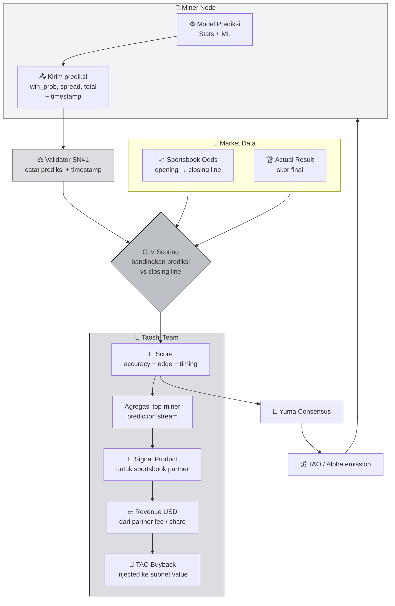

# 🏀 Sportstensor (SN41) — Sports Event Prediction Subnet

Kalau Chutes menjual **compute** dan SN13 menjual **data**, **Sportstensor (NetUID 41)** menjual sesuatu yang lebih langsung bernilai: **alpha di pasar sports betting**. Ini salah satu subnet paling menarik untuk dipelajari karena — tidak seperti kebanyakan subnet Bittensor — SN41 **punya revenue USD nyata** yang mengalir balik ke ekosistem dalam bentuk TAO buyback.

:::info Goal Unit Ini
Setelah selesai membaca unit ini kamu akan bisa:
- 🎯 Menjelaskan **misi SN41** dan bagaimana sports prediction bisa jadi "alpha" yang dimonetisasi
- ⚽ Memahami **olahraga yang di-cover** (NBA, NFL, MLB, Soccer) dan mekanisme prediksi
- 📏 Memahami **validator scoring** — closing line value (CLV), accuracy, dan kenapa ini fair
- 💸 Memahami **model revenue Taoshi/Sportstensor** — integrasi sportsbook → USD → TAO buyback
- 🔐 Memahami konsep **almanac binding** dan **programmatic trade execution** (kita bahas deep di Phase 2)
- 🚀 Tahu kenapa **SN41 adalah subnet kedua** yang kamu deploy miner-nya di Phase 2 GP-1
:::

---

## 🧠 Kenapa Sports Betting?

Sebelum skeptis — "kenapa AI harus prediksi bola?" — pahami dulu bahwa **pasar sports betting adalah salah satu pasar forecasting paling efisien dan likuid di dunia**.

- **Global volume**: $100B+ annual legal betting volume.
- **Information rich**: stats pemain, cuaca, injury report, line movement, public sentiment.
- **Immediate settlement**: tiap pertandingan selesai dalam 2–3 jam, ground truth jelas (siapa menang).
- **Pricing signal jelas**: sportsbook menetapkan odds yang bergerak realtime — sinyal "true probability" bisa diambil.

Ini membuat sports betting jadi **lab sempurna untuk decentralized prediction market**. Tidak seperti "prediksi stock market" (noisy, fundamental lambat), sports punya ground truth yang **clear, fast, repeated** — ideal untuk scoring system.

:::note Analogi Sederhana
Bayangkan SN41 sebagai **Renaissance Technologies-nya Bittensor, tapi fokus ke sports**. Miner adalah quant trader individual yang pakai model prediksi masing-masing. Validator adalah risk desk yang meng-audit performance tiap trader. Yang perform konsisten lebih baik dari market (sportsbook line) dapat bagian profit.
:::

---

## 🎯 Apa itu Sportstensor / SN41?

> **Sportstensor (NetUID 41)**, dikelola oleh tim **Taoshi**, adalah subnet Bittensor yang mission-nya adalah **menghasilkan prediksi outcome olahraga yang akurat dan early** — lalu memonetisasi prediksi itu lewat integrasi dengan sportsbook & exchange betting di pasar legal.

Outputnya: **stream prediksi real-time** (probabilitas menang, spread, total) untuk ribuan pertandingan per bulan yang kemudian diterjemahkan jadi **actionable trading signal**.

### Liga yang Di-cover

- 🏀 **NBA** (basketball US)
- 🏈 **NFL** (American football)
- ⚾ **MLB** (baseball US)
- ⚽ **Soccer** (Premier League, La Liga, MLS, Champions League, dll)

List ini berkembang seiring waktu — tim Taoshi menambah liga berdasarkan market size & data availability.

---

## 📊 Arsitektur SN41 — Dari Prediksi ke Revenue



Perhatikan **dua loop ekonomi** di diagram ini:
- **Loop kiri** (miner ↔ validator ↔ TAO emission) — standar Bittensor.
- **Loop kanan** (prediction aggregated → USD revenue → TAO buyback) — yang membuat SN41 **ekonomis sustainable**, bukan cuma dari inflasi TAO.

---

## ⚙️ Apa yang Dikerjakan Miner?

Miner SN41 itu **pada dasarnya quant trader**. Workflow tipikal:

1. **Ingest data** — stats pertandingan (player box scores, team metrics), injury report, line movement sportsbook, historical match data.
2. **Build model** — bisa dari sederhana (Elo rating, logistic regression) sampai kompleks (gradient boosting, deep learning, ensemble). Subnet tidak memaksa architecture — hasil akhir yang dinilai.
3. **Kirim prediksi** ke validator — untuk tiap match: probability menang home/away, spread prediction, over/under total.
4. **Timestamp matters** — prediksi yang dikirim **early** (jauh sebelum match dan sebelum line bergerak) bernilai lebih tinggi daripada yang last-minute.
5. **Repeat untuk ribuan matches** di minggu itu.

:::tip Keunggulan Model Sederhana Tapi Solid
Jangan terintimidasi "harus pakai deep learning". Miner yang sustain long-term sering pakai **combination model sederhana + domain expertise** (paham struktur liga, head-to-head, home advantage) daripada deep net yang overfitting.
:::

---

## ⚖️ Bagaimana Validator Scoring?

Validator SN41 menggunakan dua sinyal ground truth:

### 1. Closing Line Value (CLV)

**CLV** adalah konsep penting dari dunia sports betting profesional. Intinya:

> **Closing line** (odds terakhir sebelum match dimulai) dianggap sebagai **best available estimate** untuk probabilitas sebenarnya, karena semua informasi public sudah ter-price di situ.

Kalau miner kamu memprediksi `team_A win_prob = 0.62` **satu minggu sebelum match**, dan closing line bergerak ke implied probability 0.60 → kamu **beat the closing line** sebesar 2% — ini "alpha" terukur.

CLV bagus karena:
- **Tidak noisy seperti actual outcome** — satu match tunggal high-variance, tapi CLV stabil.
- **Tidak bisa di-game** — closing line ditetapkan market, bukan subnet.
- **Mengukur skill prediksi, bukan luck** — miner yang konsisten beat CLV pasti skilled.

### 2. Actual Outcome (tertimbang)

Meskipun CLV jadi signal utama (karena stabilitas statistik), validator tetap melacak **actual result** jangka panjang. Miner yang CLV-nya bagus tapi actual-nya konsisten jelek akan tetap kena penalty (walau jarang terjadi kalau CLV beneran beat).

### Formula Simplified

```
score_miner ≈ α · CLV_edge_avg + β · accuracy_realized + γ · timing_bonus - δ · penalties
```

`timing_bonus` artinya: prediksi yang dikirim **2 hari sebelum match** lebih dihargai daripada 2 jam sebelum.

:::warning Fair Play
Validator melawan strategi game-able seperti:
- **Copy dari miner lain** (deteksi via hotkey clustering + timing)
- **Kirim prediksi hanya untuk match yang "obvious"** (favorit vs underdog jomplang)
- **Spam submission**

Kalau kamu coba pendekatan cerdik-tapi-short-cut, biasanya terdeteksi dan dihukum.
:::

---

## 💸 Model Revenue — Kenapa SN41 Unik

Ini yang membedakan SN41 dari mayoritas subnet Bittensor.

**Sebagian besar subnet** hidup dari **emisi TAO inflasioner** — TAO baru dicetak dan dibagi ke subnet via root weight. Ini sustainable **hanya selama** market percaya value TAO naik.

**SN41 berbeda** — tim Taoshi menjual **aggregated prediction signal** ke integrasi eksternal:

- **Sportsbook partner** — platform betting membayar fee untuk akses early-signal untuk risk management / line setting mereka.
- **Prop betting platform / exchange** — integrasi untuk user-facing prediction products.
- **B2B analytics** — media sport / tim profesional yang butuh model output.

Revenue USD ini dipakai (sebagian) untuk **TAO buyback** — tim membeli TAO di market dan mengalirkannya kembali ke ekosistem subnet. Ini menciptakan **demand real** untuk TAO yang tidak bergantung hanya pada narasi.

:::info Kenapa Ini Penting untuk Miner
Kalau SN41 berhasil meningkatkan revenue USD-nya, alpha token SN41 punya **buyer of last resort** yang konkret. Secara long-term ini membuat SN41 kandidat subnet dengan **emission-to-value ratio lebih stabil** dibanding subnet tanpa revenue external.
:::

---

## 🔐 Almanac Binding & Programmatic Trade Execution

Dua konsep lanjutan yang akan kita bahas **lengkap di Phase 2 GP-1**, tapi penting kamu kenal namanya sekarang:

### Almanac Binding

> **Almanac** adalah registry on-chain yang mengikat **hotkey miner** dengan **identitas operasional** (misalnya endpoint URL, public key untuk signed prediksi, metadata miner).

Binding ke almanac memastikan:
- Prediksi yang di-submit beneran dari miner yang sesuai hotkey.
- Validator bisa verifikasi signature tiap submission.
- Miner tidak bisa pretend jadi miner lain.

Pas registrasi di Phase 2, kamu akan melakukan **binding hotkey ke almanac** sebagai salah satu step wajib.

### Programmatic Trade Execution

> **Programmatic trade execution** adalah kemampuan untuk **auto-eksekusi trade** (di sportsbook / exchange) berdasarkan prediksi miner, tanpa human intervention tiap kali.

Ini optional — miner dasar cuma kirim prediksi. Tapi miner advanced bisa hook predictions → execution layer yang melakukan real trading di platform yang di-whitelist. Ini bagian **Trading Strategies** di Phase 2 GP-1 Unit 7.

:::tip Tenang, Bertahap
Kamu tidak perlu paham ini 100% sekarang. Yang penting: **know the terms, know they exist, paham kenapa subnet perlu konsep ini** (identity binding biar fair, programmatic execution biar alpha miner konkret jadi USD).
:::

---

## 💰 Miner Economics — Realistic Expectation

### Profile Setup

| Komponen | Rentang |
|---|---|
| VPS (2–4 vCPU, 4–8GB RAM) | $5–20/bulan |
| Data API (sports stats / odds) | $0–50/bulan (banyak sumber gratis untuk start) |
| Compute untuk training model | Minimal — bisa di-train offline di laptop |
| Registration fee SN41 (one-time) | Variatif dalam TAO — cek Taostats |
| **Total OpEx awal** | **~$10–70/bulan** |

Biaya mirip dengan SN13 — entry barrier rendah dari sisi infrastructure.

### Revenue

Karena SN41 punya revenue USD eksternal, value alpha token-nya bisa berperilaku berbeda dari subnet pure-inflation. Tapi **miner income day-to-day tetap bergantung** pada:
- Score rank di antara miner lain
- Emission TAO ke subnet 41
- Harga TAO & alpha SN41

**Key insight:** SN41 adalah subnet di mana **skill prediksi real kamu** menentukan outcome. Beda dari SN13 (volume + strategy) atau Chutes (hardware + tuning) — SN41 paling mirip "quant competition" dengan gradient bonus long-term kalau skill kamu meningkat.

:::danger Jangan Asal Submit
Kalau kamu submit prediksi random atau jauh dari closing line terus-menerus, bukan cuma gak dapat reward — bisa kena slash. Pastikan model kamu minimal capture home advantage + head-to-head dasar sebelum daftar.
:::

---

## 🧩 Cocok untuk Kamu Kalau...

Profile miner SN41 yang ideal:

- ✅ **Punya minat / background statistik, ML, atau quant finance** — SN41 adalah subnet paling "quant" di Bittensor.
- ✅ **Familiar dengan sport yang dicover** — NBA/NFL/MLB/Soccer. Domain knowledge matter.
- ✅ **Python developer** — semua tooling mining di Python.
- ✅ **Mau belajar konsep betting (CLV, line movement, implied probability)** — ini core subnet.
- ✅ **Tertarik subnet dengan revenue eksternal** — kalau kamu long-term thinker, subnet dengan "real buyer" lebih menarik.

❌ **Kurang cocok kalau** kamu tidak tertarik dunia olahraga / betting sama sekali dan tidak mau belajar CLV concept. Scoring subnet ini sangat tied dengan terminology betting profesional.

---

## 🔗 Konteks di Kurikulum Ini

SN41 adalah subnet **pertama** yang kita deploy miner-nya di Phase 2.

➡️ **Phase 2 — GP-1 (Guided Project 1): Sportstensor SN41 Mining Guide** akan membawa kamu step-by-step dari:

1. Introduction SN41 (deeper dive)
2. Bittensor wallet setup & TAO funding
3. Registering miner on Sportstensor
4. **Almanac registration & miner identity binding**
5. Miner initialization & metadata registration
6. **Programmatic trade execution**
7. Trading strategies

Konsep yang kita bahas ringkas di unit ini — **CLV, almanac, programmatic execution** — akan kamu implement sendiri di Phase 2.

:::tip Strategi Belajar
Rekomendasi: **baca unit ini dulu sampai paham konsep**. Nanti di Phase 2 GP-1, step-by-step eksekusi akan jauh lebih mudah dicerna karena fondasi teori sudah ada.
:::

---

## 🎯 Rangkuman

Yang perlu kamu ingat dari unit ini:

1. **SN41 = Sportstensor** — subnet prediksi olahraga (NBA/NFL/MLB/Soccer) dengan scoring berbasis **Closing Line Value (CLV)**.
2. **Unik di Bittensor:** punya **revenue USD eksternal** via integrasi sportsbook → **TAO buyback** → subnet ekonomis sustainable.
3. **Scoring = CLV edge + accuracy + timing** — submit early lebih bernilai.
4. **Almanac binding** = identitas miner on-chain yang memastikan signature valid.
5. **Programmatic trade execution** = feature advanced untuk auto-execute prediksi jadi trade real (optional di level miner).
6. **Subnet paling "quant"** di Bittensor — fit buat yang suka statistik, ML, domain olahraga.
7. **Akan kamu deploy di Phase 2 GP-1** — konsep di unit ini langsung kepakai.

### ✅ Quick Check

Sebelum lanjut ke Unit 4 (Ridges), pastikan kamu bisa jawab:

1. Apa itu **Closing Line Value (CLV)** dan kenapa lebih bagus untuk scoring daripada actual outcome tunggal?
2. Kenapa prediksi yang dikirim **lebih awal** (timing bonus) dihargai lebih tinggi?
3. Apa sumber revenue USD Taoshi yang kemudian jadi TAO buyback?
4. Apa fungsi **almanac binding** — kenapa wajib?
5. Sebutkan 4 liga utama yang di-cover SN41.

Kalau terjawab lancar → lanjut Ridges. Kalau CLV masih blur, baca ulang bagian **Validator Scoring**.

---

### 📚 Referensi Lanjutan

- [Taoshi — Sportstensor](https://taoshi.io) — tim pengelola SN41
- [Repo Sportstensor (taoshidev/sportstensor)](https://github.com/taoshidev/sportstensor) — source code
- [Taostats — SN41](https://taostats.io/subnets/41) — emission & ranking real-time
- [CLV Primer — What is Closing Line Value?](https://www.pinnacle.com/en/betting-articles/educational/what-is-closing-line-value) — penjelasan konsep CLV
- Phase 2 GP-1 Unit 1 — **Introduction to SN41** (next deep-dive, hands-on)

---

**Next:** [Unit 4 — Ridges → Engineering & Code Intelligence Subnet](./04-ridges) 👉
