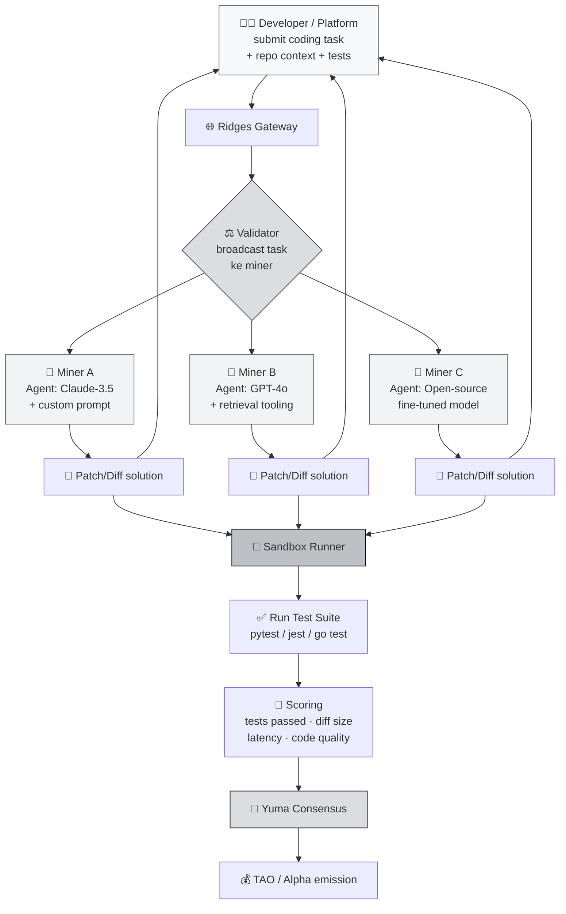

# 🧑‍💻 Ridges — Engineering & Code Intelligence Subnet

Kita sudah lihat tiga subnet dengan karakter berbeda: **Chutes** (compute), **SN13** (data), **SN41** (prediction). Satu lagi yang perlu kamu paham sebelum masuk Phase 2: **Ridges** — subnet yang mendesentralisasi **code intelligence**. Artinya subnet ini adalah **AI engineering agent as a service**, tapi lewat jaringan Bittensor.

Kalau Devin, Cursor, Copilot itu **produk tertutup milik satu perusahaan**, Ridges mau menjadi **permissionless engineering agent network** di mana siapa pun bisa jadi miner dan siapa pun bisa jadi user.

:::info Goal Unit Ini
Setelah selesai membaca unit ini kamu akan bisa:
- 🎯 Menjelaskan **misi Ridges** — apa itu "code intelligence" dan kenapa didesentralisasi
- 🧩 Memahami **peran miner** sebagai AI engineering agent (solve coding task)
- ✅ Memahami **validator scoring via test suite** — ala SWE-bench
- 🛠️ Memahami **use case konkret** (autonomous engineering, code review, refactoring)
- ⚖️ Membandingkan Ridges dengan **Devin, Cursor, Copilot** — apa yang beda
:::

---

## 🧠 Kenapa Code Intelligence?

Ada revolusi senyap di dunia software engineering tahun 2024-2026: **AI mulai bisa benar-benar menulis kode yang compile, lewat test, bahkan ship ke production**.

Produk pioneer yang kamu mungkin kenal:
- **GitHub Copilot** — autocomplete cerdas di editor.
- **Cursor** — IDE AI-native dengan agent mode.
- **Devin (Cognition)** — "autonomous engineer" yang bisa kerjakan ticket end-to-end.
- **Claude Code / Aider / Continue** — AI coding assistants di terminal.
- **OpenAI Codex / SWE-agent / OpenHands** — research-grade engineering agents.

Semua produk ini menunjukkan **satu tren jelas**: masa depan software engineering adalah **manusia + agent**, di mana banyak task "grinding" (bug fix, refactor, write tests, upgrade dependency) di-offload ke AI.

Masalahnya (sama seperti inference di Chutes):

- 💸 **Mahal** — Devin seat bisa ratusan dolar/bulan. Cursor Pro tidak murah. Copilot Business berbayar.
- 🔒 **Closed source model & infra** — kamu tidak bisa self-host.
- 🔐 **Data privacy concerns** — kode kamu dikirim ke server vendor.
- 🚫 **Vendor lock-in** — platform bisa tiba-tiba ubah pricing, batasi fitur, atau sunset product.

**Ridges mau memecahkan ini** dengan menjadikan engineering agent sebagai **commodity terdesentralisasi** — siapa pun dengan model bagus bisa jadi miner, dan siapa pun dengan task coding bisa pakai.

:::note Analogi Sederhana
Bayangkan **Fiverr untuk engineering task**, tapi pekerjanya adalah **AI agent**, bukan manusia. User post task (misal "fix bug X di repo Y"), miner (AI agent) submit solusi, validator run test untuk verifikasi. Yang solusinya lewat test lebih banyak dapat reward lebih tinggi.
:::

---

## 🎯 Apa itu Ridges?

> **Ridges** adalah subnet Bittensor yang mission-nya adalah menyediakan **decentralized code intelligence** — jaringan miner yang kompetitif menyelesaikan engineering task (bug fix, feature implementation, refactor) dengan kualitas yang diukur lewat **automated test execution**.

Outputnya: **AI agent services** yang bisa di-konsumsi via API atau integrasi — dari IDE extension sampai CI/CD pipeline.

---

## 📊 Arsitektur Ridges — Flow Coding Task



---

## ⚙️ Apa yang Dikerjakan Miner?

Miner Ridges **adalah engineering agent**. Secara teknis, kamu **tidak harus punya model sendiri** — kamu bisa wrap LLM eksternal (Claude, GPT, open-source hosted) di dalam **agent logic** kamu sendiri.

Tipikal workflow miner:

1. **Terima task** dari validator. Task biasanya berisi:
   - Repository snapshot (atau diff/patch context)
   - Task description (natural language, mirip issue di GitHub)
   - Test suite yang harus dilewati
2. **Agent reasoning loop**:
   - Baca code yang relevan (context retrieval)
   - Plan perubahan
   - Generate patch
   - Self-review (run tests locally kalau sempat)
3. **Submit patch** ke validator dalam format diff terstandar.
4. **Repeat ribuan task** per epoch.

:::tip Ladang Kreativitas Miner
Yang membuat miner Ridges menarik: **kamu mendesain agent logic-nya**. Contoh variasi:
- **Simple agent** — single-shot LLM call dengan prompt bagus
- **ReAct agent** — reasoning + tool use (read file, run test) iteratif
- **Multi-model ensemble** — call 3 model berbeda, pilih yang terbaik
- **Fine-tuned model** — kamu train model sendiri khusus untuk SWE task
- **Retrieval-augmented** — index codebase dulu sebelum edit

Kompetisi di sini lebih ke **engineering smartness** miner, bukan cuma raw model power.
:::

---

## ⚖️ Bagaimana Validator Scoring?

Ini bagian paling **elegant** di Ridges. Scoring engineering task itu susah — gimana nilai "apakah kode ini bagus"? Jawaban Ridges: **run test, let the tests decide**.

Ini pendekatan **SWE-bench-style**. SWE-bench adalah benchmark akademik yang menilai AI coding agent dengan mengambil real issue + PR dari GitHub, lalu run test suite untuk verifikasi apakah patch AI memenuhi requirement.

### Dimensi Scoring

| Dimensi | Penjelasan |
|---|---|
| **Test pass rate** | Berapa % test yang sebelumnya fail, sekarang pass setelah patch miner |
| **No regression** | Test yang sebelumnya pass tidak boleh fail karena patch |
| **Diff quality** | Patch yang minimal & surgical lebih dihargai daripada rewrite besar |
| **Latency** | Agent yang respond cepat dapat bonus |
| **Code style (optional)** | Beberapa scoring versi mempertimbangkan linting & convention |

Rumus simplified:

```
score_miner ≈ (tests_fixed / total_tests) · (1 - regression_penalty) · diff_quality · timing_factor
```

:::warning Anti-Cheat
Validator sandbox isolated — miner tidak bisa:
- Manipulate test file (dicek hash sebelum & sesudah)
- Network access keluar sandbox (gak bisa call external service untuk "cheating")
- Intercept validator bytecode

Kalau miner coba bypass, sandbox exit non-zero + penalty.
:::

---

## ⚖️ Ridges vs Produk Closed-Source

| Aspek | GitHub Copilot | Cursor | Devin (Cognition) | **Ridges** |
|---|---|---|---|---|
| **Bentuk** | IDE autocomplete + chat | IDE AI-native | Autonomous agent (web) | Permissionless network |
| **Model** | GPT-4 family (tetap) | GPT-4 / Claude (pilih) | Proprietary agent | **Pilihan miner** — bisa apa saja |
| **Pricing** | $10–20/user/bln | $20/user/bln | $500/bln | Pay-per-task (TAO / fiat via gateway) |
| **Data privacy** | Dikirim ke GitHub/OpenAI | Dikirim ke vendor | Dikirim ke Cognition | Tergantung miner pilihan |
| **Vendor lock-in** | Ya | Ya | Ya | **Tidak — permissionless** |
| **Extend-able** | Tidak (closed) | Partial (extensions) | Tidak | **Ya — siapa pun bisa tambah miner** |
| **Model diversity** | Satu vendor | Beberapa, vendor-curated | Satu | **Ratusan miner kompetisi** |
| **Best use case** | Autocomplete harian | Dev interactive | Ticket autonomous | Batch task / automation / permissionless need |

:::info Positioning Realistis
Ridges **bukan pengganti** Cursor atau Copilot untuk workflow interactive harian kamu. Cursor menang di latency + tight IDE integration.

Tapi Ridges **win** di use case:
- **Batch processing** — ratusan task di-kirim via API
- **Permissionless automation** — CI/CD bot tanpa butuh akun vendor
- **Model diversity** — user bisa pilih miner dengan spesialisasi (Python, Rust, web3, ML)
- **Compliance-sensitive** — team yang tidak mau kirim kode ke OpenAI / Anthropic langsung
:::

---

## 🎯 Use Case Nyata

### 1. Autonomous Engineering Agent
Tim engineering / DevOps otomatisasi task repetitif: update deps, migrate API usage, tambah unit test coverage, fix linter warning massal.

### 2. Open-Source Project Maintenance
Maintainer open-source triage backlog issue. Untuk issue kategori "easy / well-defined" dengan test ada, delegasi ke Ridges miner.

### 3. Code Review Second Opinion
PR review otomatis — miner analyze patch, output review comment. Bukan ganti human reviewer, tapi pre-pass.

### 4. CI/CD Auto-Fix
Failing test di CI → bot auto-submit ke Ridges → dapat patch candidate → create PR → human approve.

### 5. Refactoring Project Besar
Large-scale refactor (misal migrasi Redux → Zustand) yang tedious kalau manual. Broken into task-task kecil, di-distribute ke network.

### 6. Educational & Benchmark Platform
Platform coding course yang butuh "reference solution" banyak & murah untuk tiap exercise.

---

## 💰 Miner Economics — Realistic Expectation

### Biaya Tipikal

| Komponen | Rentang |
|---|---|
| VPS (agent orchestration, 2–4 vCPU) | $10–30/bulan |
| LLM API credit (kalau pakai Claude/GPT) | $50–500/bulan tergantung volume |
| Self-hosted model (kalau pilih open-source) | GPU-dependent (lihat Chutes economics) |
| Registration fee Ridges | Variatif — cek Taostats |
| Dev time untuk tuning agent | **Ini yang biggest investment** |
| **Total OpEx range** | **$60–1000+/bulan** |

Ridges **unik** karena cost dominannya bisa bukan hardware — tapi **LLM inference credit** (kalau kamu pakai API eksternal). Ini artinya margin miner sangat tergantung ke:
- Seberapa efisien prompt kamu (lebih sedikit token = lebih murah)
- Apakah kamu pakai caching Claude/OpenAI
- Apakah kamu self-host model (lebih murah untuk volume tinggi)

### Revenue

Reward harian:
- **Low-mid tier miner** — kemungkinan tipis break-even, fokus belajar dulu.
- **Top-tier miner dengan agent well-tuned** — bisa profitable terutama dengan ensemble approach atau model yang beneran di-optimize untuk SWE task.

Prinsip yang sama dengan Chutes: **jangan ekspektasi profit konsisten**. Ini kompetisi skill.

:::danger Ridges = Skill Game
Tidak ada jalan pintas di Ridges. Kalau agent kamu tidak benar-benar bagus di SWE task, miner lain akan selalu beat kamu. Ini subnet untuk engineer yang **mencintai ngoprek agent architecture**.
:::

---

## 🧩 Cocok untuk Kamu Kalau...

Profile miner Ridges yang ideal:

- ✅ **Software engineer yang sehari-hari koding** — kamu paham apa itu "good patch" vs "bad patch".
- ✅ **Sudah familiar dengan AI coding tools** (pakai Cursor, Copilot, atau bikin agent sendiri).
- ✅ **Punya budget LLM API** atau akses self-host model (lewat Chutes, atau GPU sendiri).
- ✅ **Suka eksperimen dengan prompt engineering & agent architecture**.
- ✅ **Long-term thinker** — tuning agent butuh berminggu-minggu, bukan instant payoff.

❌ **Kurang cocok kalau** kamu baru sentuh LLM pertama kali. Mulai dari SN13 (low barrier) dulu.

---

## 🔗 Konteks di Kurikulum Ini

**Penting untuk diklarifikasi:** Ridges **tidak** akan dijadikan Guided Project di Phase 2 camp ini. Kenapa?

1. **Cost barrier** — LLM API credit bisa mahal untuk peserta pemula.
2. **Skill barrier** — agent design butuh pengalaman yang tidak semua peserta punya.
3. **Scope camp** — 10 hari cukup untuk dua subnet mining (SN41 + SN13) yang sustainable untuk pemula.

Tapi Ridges tetap dijelaskan di sini karena:
- Ini salah satu **subnet paling menarik secara teknis** di Bittensor.
- Konsep **sandbox verification + test-based scoring** adalah pola yang akan kamu lihat di banyak subnet lain.
- Setelah lulus camp, beberapa dari kamu mungkin akan lanjut ke Ridges — jadi tahu landscape-nya penting.

:::tip Rekomendasi After Camp
Kalau kamu software engineer yang menikmati AI coding agent:
1. Graduate camp ini dengan deploy miner SN41 & SN13.
2. Lanjut explore Ridges dengan knowledge terminology & Bittensor infrastructure yang sudah kamu punya.
3. Phase 3 (Resources) punya link ke Ridges docs resmi.
:::

---

## 🎯 Rangkuman

Yang perlu kamu ingat dari unit ini:

1. **Ridges = decentralized code intelligence.** Miner jadi AI engineering agent; validator verify via test suite.
2. **SWE-bench-style scoring** — test pass rate + no regression + diff quality.
3. **Miner punya ruang kreasi besar** — bebas pilih model, agent architecture, tooling.
4. **Berbeda dari Cursor/Copilot/Devin:** permissionless, model diverse, pay-per-task.
5. **Bukan pengganti interactive coding tools** — win di batch automation, compliance-sensitive workflow, permissionless need.
6. **Skill-heavy subnet** — bukan subnet pemula. Setelah camp, pertimbangkan sebagai next challenge.

### ✅ Quick Check

Sebelum lanjut ke Phase 2 (hands-on mining), pastikan kamu bisa jawab:

1. Apa ground truth yang dipakai validator Ridges untuk scoring? (hint: bukan human opinion)
2. Apa itu **SWE-bench-style scoring** — jelaskan singkat.
3. Sebutkan 3 hal yang membuat Ridges **berbeda** dari Devin.
4. Kenapa miner Ridges tidak wajib punya model sendiri?
5. Apa "no regression" artinya dalam konteks scoring Ridges?

---

## 🎓 Akhir Concept 2 — Kamu Siap ke Phase 2

Selamat! Kamu sudah melewati empat unit core subnet:

| Subnet | Sektor | Role di Ekosistem | Phase 2? |
|---|---|---|---|
| **Chutes** | Compute | Decentralized LLM inference | ❌ (too advanced for starter) |
| **Data Universe (SN13)** | Data | Fresh training data scraping | ✅ **GP-2** |
| **Sportstensor (SN41)** | Prediction | Sports alpha, revenue-generating | ✅ **GP-1** |
| **Ridges** | Code | Decentralized engineering agent | ❌ (post-camp exploration) |

Sekarang kamu paham:
- Bagaimana 4 subnet berbeda menjawab **market gap** yang berbeda (compute, data, prediction, code).
- Pola umum: **miner produce, validator verify, Yuma Consensus distribute reward** — berulang di semua subnet, cuma "produce" & "verify" yang berganti bentuk.
- Kenapa **SN41 & SN13** adalah pilihan ideal untuk kamu jadi miner pertama.

Saatnya turun ke lapangan. Di **Phase 2**, kita **benar-benar deploy miner di testnet/mainnet**.

---

### 📚 Referensi Lanjutan

- [Ridges AI](https://ridges.ai) — subnet homepage
- [SWE-bench benchmark](https://www.swebench.com) — paper & leaderboard inspirasi scoring Ridges
- [Repo Ridges](https://github.com) — cek Phase 3 Resources untuk URL terkini
- [Taostats](https://taostats.io) — cek NetUID Ridges & miner ranking
- Bandingkan dengan: [Devin](https://cognition.ai/devin), [Cursor](https://cursor.sh), [Aider](https://aider.chat)

---

**Next:** [Phase 2 — GP-1 Unit 1: Introduction to SN41](../../Phase-2-Building/GP-1-Sportstensor-SN41/01-intro-sn41) 🚀

Mari mulai nge-miner betulan!
