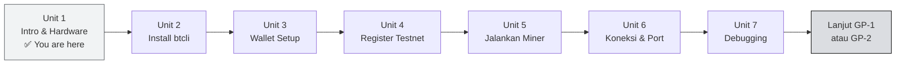

import Tabs from '@theme/Tabs';
import TabItem from '@theme/TabItem';

# 🖥️ Unit 1 — Intro & Hardware Check

:::info Goal Unit Ini
Di akhir unit ini kamu akan:
- Paham **tujuan GP-0** dan bedanya dengan GP-1 (SN41) dan GP-2 (SN13)
- Tahu apakah **komputer kamu memenuhi syarat** untuk menjalankan miner lokal
- **WSL2 aktif** (Windows) atau terminal siap (macOS/Linux)
- Siap lanjut ke instalasi btcli di Unit 2
:::

:::note Prasyarat
- ✅ Selesai **Phase 1** — paham konsep subnet, miner, validator, tokenomik
- ✅ Punya komputer (Windows 10/11, macOS, atau Linux)
- ✅ Koneksi internet stabil
- ❌ GPU **tidak dibutuhkan** — semua di GP-0 pakai testnet CPU-only
:::

---

## 🎯 Kenapa Ada GP-0?

GP-1 (Sportstensor) dan GP-2 (Data Universe) dirancang untuk **production miner** — artinya pakai VPS cloud, public IP statis, dan modal operasional bulanan. Itu bagus untuk graduation, tapi **bukan titik mulai yang ideal** kalau kamu belum pernah sentuh Bittensor CLI sama sekali.

**GP-0 hadir untuk menjawab pertanyaan yang sering muncul:**

> _"Bisa gak sih belajar Bittensor dari laptop saya sendiri dulu, sebelum keluar uang buat VPS?"_

Jawabannya: **Bisa.** Bittensor punya testnet (jaringan latihan) di mana kamu bisa:
- Install dan konfigurasi btcli
- Buat wallet coldkey + hotkey
- Register miner di subnet testnet (gratis / biaya TAO test)
- Jalankan miner dari komputer lokal
- Lihat hasil di metagraph

Semua ini **tanpa GPU, tanpa VPS, tanpa TAO sungguhan.**

---

## 👤 Untuk Siapa GP-0 Ini?

| Profil | Cocok? |
|--------|--------|
| Baru pertama kali pakai btcli | ✅ Sangat cocok |
| Punya laptop 8 GB RAM + SSD | ✅ Cukup |
| Mau belajar flow mining sebelum invest ke VPS | ✅ Tepat |
| Sudah punya VPS dan mau langsung production | ⬛ Lanjut ke GP-1/GP-2 |
| Mau mining mainnet serius | ⬛ GP-0 adalah stepping stone, lanjut GP-1 atau GP-2 |

---

## 💻 Minimum Spec Komputer Lokal

| Komponen | Minimum | Recommended | Catatan |
|----------|---------|-------------|---------|
| **OS** | Windows 10 (64-bit), macOS 12+, Ubuntu 20.04+ | Windows 11, macOS 14+, Ubuntu 22.04 | Windows pakai WSL2 |
| **CPU** | 2 core / 4 thread | 4 core+ | Scraping & CLI = I/O bound, bukan compute |
| **RAM** | 4 GB | 8 GB+ | btcli + Python + miner ~500 MB–1 GB |
| **Storage** | 10 GB free | 20 GB+ | Repo + venv + log |
| **Internet** | 5 Mbps | 20 Mbps+ | Untuk sync chain data |
| **GPU** | ❌ Tidak perlu | — | Testnet dengan subnet-template tidak butuh GPU |

:::tip Laptop Lama Pun Bisa
MacBook Intel 2017, laptop Windows dengan i5 generasi 8, atau PC Linux RAM 8 GB — semua cukup untuk GP-0. Yang penting Python 3.10+ bisa jalan.
:::

---

## 🪟 Setup WSL2 (Khusus Windows)

Bittensor CLI (`btcli`) dan ekosistemnya **berbasis Unix**. Di Windows, cara terbaik adalah memakai **WSL2 (Windows Subsystem for Linux)** — virtual Linux yang jalan di dalam Windows tanpa dual-boot.

<Tabs>
<TabItem value="windows" label="🪟 Windows" default>

### Install WSL2

Buka **PowerShell sebagai Administrator** (klik kanan → Run as Administrator):

```powershell
wsl --install
```

Command ini otomatis:
- Mengaktifkan fitur WSL2
- Download dan install **Ubuntu 22.04 LTS** (distro default)
- Restart komputer kalau diminta

Setelah restart, **Ubuntu** akan muncul di Start Menu. Buka Ubuntu — pertama kali akan setup username dan password Linux kamu.

:::note Verifikasi WSL2
```powershell
wsl --list --verbose
```
Output yang benar:
```
  NAME      STATE   VERSION
* Ubuntu    Running       2
```
Pastikan `VERSION` adalah **2**, bukan 1.
:::

### Jika Ubuntu sudah ada tapi versi WSL1

```powershell
wsl --set-version Ubuntu 2
wsl --set-default-version 2
```

### Update Ubuntu setelah install

Di terminal Ubuntu:

```bash
sudo apt update && sudo apt upgrade -y
```

</TabItem>
<TabItem value="macos" label="🍎 macOS">

### Cek versi macOS

```bash
sw_vers -productVersion
# Harus 12.0 (Monterey) atau lebih baru
```

### Install Homebrew (jika belum ada)

```bash
/bin/bash -c "$(curl -fsSL https://raw.githubusercontent.com/Homebrew/install/HEAD/install.sh)"
```

Ikuti instruksi terminal. Setelah selesai, tambah Homebrew ke PATH:

```bash
# Untuk Apple Silicon (M1/M2/M3)
echo 'eval "$(/opt/homebrew/bin/brew shellenv)"' >> ~/.zprofile
eval "$(/opt/homebrew/bin/brew shellenv)"

# Untuk Intel Mac
echo 'eval "$(/usr/local/bin/brew shellenv)"' >> ~/.zprofile
eval "$(/usr/local/bin/brew shellenv)"
```

Verifikasi:
```bash
brew --version
# Output: Homebrew 4.x.x
```

Terminal bawaan macOS (zsh) sudah cukup — tidak perlu konfigurasi tambahan.

</TabItem>
<TabItem value="linux" label="🐧 Linux">

### Ubuntu / Debian

Tidak perlu setup khusus — terminal sudah siap.

Update system dulu:

```bash
sudo apt update && sudo apt upgrade -y
```

### Fedora / RHEL

```bash
sudo dnf update -y
```

### Arch Linux

```bash
sudo pacman -Syu
```

Lanjut ke Unit 2 langsung.

</TabItem>
</Tabs>

---

## ✅ Checklist Sebelum Lanjut

Sebelum ke Unit 2, pastikan:

<Tabs>
<TabItem value="windows-check" label="🪟 Windows" default>

- [ ] WSL2 aktif (`wsl --list --verbose` menunjukkan VERSION 2)
- [ ] Ubuntu 22.04 bisa dibuka dari Start Menu
- [ ] Bisa menjalankan `sudo apt update` tanpa error di terminal Ubuntu
- [ ] Tahu password Linux yang kamu buat saat setup Ubuntu

</TabItem>
<TabItem value="macos-check" label="🍎 macOS">

- [ ] Homebrew terinstall (`brew --version` tidak error)
- [ ] Terminal (zsh) bisa diakses via Spotlight (Cmd+Space → "Terminal")
- [ ] `sw_vers` menunjukkan macOS 12+

</TabItem>
<TabItem value="linux-check" label="🐧 Linux">

- [ ] Terminal bisa dibuka
- [ ] `sudo apt update` (atau distro equivalent) berjalan tanpa error
- [ ] Python 3.10+ tersedia: `python3 --version`

</TabItem>
</Tabs>

---

## 🗺️ Roadmap GP-0 (7 Unit)



---

## 🎯 Rangkuman

- **GP-0** = hands-on local mining menggunakan testnet — cocok untuk pemula sebelum ke production
- Minimum spec: **4 GB RAM, 10 GB storage, internet stabil** — GPU tidak diperlukan
- **Windows**: wajib setup WSL2 terlebih dahulu (`wsl --install`)
- **macOS**: install Homebrew jika belum ada
- **Linux**: langsung siap

---

**Next:** [Unit 2 — Instalasi Python, venv & btcli →](./instalasi-btcli)

*Jalan jauh dimulai dari langkah pertama. 🚀*
