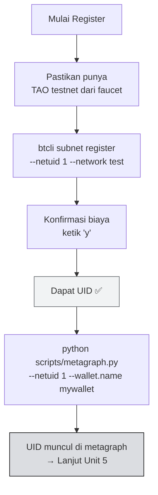

import Tabs from '@theme/Tabs';
import TabItem from '@theme/TabItem';

# 📋 Unit 4 — Register Miner di Subnet Testnet

:::info Goal Unit Ini
Di akhir unit ini kamu akan:
- Berhasil **register hotkey** di **NetUID 1 testnet** menggunakan TAO testnet
- Punya **UID** (nomor posisi miner di subnet)
- Bisa verifikasi status via metagraph (di testnet: `scripts/metagraph.py`; di mainnet: `btcli subnets metagraph`)
:::

:::note Prasyarat
- ✅ [Unit 3](./wallet-setup) selesai — wallet & hotkey siap, TAO testnet ada
- ✅ venv aktif: `source ~/bittensor-env-v10/bin/activate`
- ✅ Koneksi internet stabil
:::

---

## 🌐 Konfigurasi Testnet

Sebelum register, set default network ke testnet supaya semua command btcli otomatis pakai testnet:

```bash
btcli config set --network test
```

Verifikasi konfigurasi:

```bash
btcli config get
# Output: network: test
```

:::tip Alternatif: Flag Per Command
Kalau tidak mau set global config, tambah `--network test` di setiap command btcli.
:::

---

## 📊 Step 1 — Lihat Subnet Testnet yang Tersedia

:::danger `btcli subnets list` Juga Gagal di Testnet (per Juni 2026) — Pakai Script SDK
`btcli subnets list --network test` kena error yang **sama** (`Storage function "Swap.AlphaSqrtPrice" not found`) karena runtime testnet belum sinkron dengan btcli terbaru — sama seperti register & balance. Untuk melihat daftar subnet **testnet**, pakai script SDK dari repo fork:

```bash
# Clone repo dulu kalau belum (dipakai lagi di Unit 5)
cd ~ && git clone https://github.com/Ethereum-Jakarta/bittensor-subnet-template-v10.git
cd bittensor-subnet-template-v10

# Daftar semua subnet + tingkat keterisian (used/max), urut netuid
python scripts/subnets.py

# Hanya subnet yang MASIH ada slot kosong, paling kosong di atas
python scripts/subnets.py --open

# Cek satu subnet: penuh atau tidak?
python scripts/subnets.py --netuid 1
```

Script ini bahkan lebih informatif dari `btcli subnets list`: ia menampilkan **used/max UID** tiap subnet, jadi kamu langsung tahu mana yang masih punya slot. `btcli subnets list` tetap normal untuk **mainnet**.
:::

Untuk **mainnet** (atau begitu runtime testnet sinkron lagi), `btcli` tetap berlaku:

```bash
btcli subnets list --network test
```

Output menampilkan tabel semua subnet aktif (per 2026 ada **ratusan subnet** di testnet).

:::warning NetUID 1 Sering Penuh
**NetUID 1** adalah subnet learning klasik, tapi sekarang sering **penuh (256/256 slot terpakai)** — `python scripts/subnets.py --netuid 1` akan menunjukkannya. Registrasi masih diizinkan, tapi kamu akan mendepak miner skor terendah dan bersaing slot. Untuk latihan, lebih nyaman pilih subnet testnet lain yang slotnya masih kosong — jalankan `python scripts/subnets.py --open`, ambil salah satu netuid dengan banyak slot kosong, lalu **pakai netuid itu** secara konsisten di semua perintah berikutnya (register, miner, metagraph).
:::

:::note Biaya Registrasi
Biaya register di subnet yang sudah ada (recycle TAO) akan ditampilkan otomatis saat kamu jalankan `btcli subnet register` di Step 2 — btcli akan tanya konfirmasi dengan angka biaya sebelum lanjut.
:::

---

## 🔑 Pre-Check — Verifikasi Wallet & Hotkey

Sebelum register, pastikan wallet dan hotkey kamu benar-benar ada:

```bash
btcli wallet list
```

Output yang diharapkan:

```text
Wallets
└── mywallet
    └── miner1
```

Kalau hotkey tidak muncul, buat dulu:

```bash
btcli wallet new_hotkey --wallet-name mywallet --hotkey miner1
```

:::warning Sesuaikan Nama Hotkey
Kalau kamu punya hotkey dengan nama **berbeda** (misal `miner_testnet`), ganti `miner1` di semua command berikutnya dengan nama hotkey kamu yang sebenarnya.
:::

---

## 🔑 Register Miner (TAO Burn)

:::danger Testnet btcli Sedang Bermasalah (per Juni 2026) — Pakai Script SDK
Chain **testnet** sekarang menjalankan runtime yang **tidak terbaca oleh btcli terbaru**. Perintah `btcli subnet register --network test` (juga `wallet balance` & `metagraph` di testnet) gagal dengan:

```
❌ An unknown error has occurred: Storage function "Swap.AlphaSqrtPrice" not found
```

Ini **bukan** salah instalasimu — btcli tetap normal di **mainnet** dan untuk operasi wallet **lokal** (`wallet create`/`list`). SDK (`bittensor` 10.x) tetap jalan di testnet, jadi untuk register di testnet **pakai script SDK** dari repo fork:

```bash
# Clone repo dulu kalau belum (dipakai lagi di Unit 5)
cd ~ && git clone https://github.com/Ethereum-Jakarta/bittensor-subnet-template-v10.git
cd bittensor-subnet-template-v10

# Register via SDK (butuh TAO testnet di coldkey; akan minta password coldkey)
python scripts/register.py --wallet.name mywallet --wallet.hotkey miner1 --netuid 1
```

Perintah `btcli subnet register` di bawah tetap valid untuk **mainnet**, dan akan berfungsi lagi di testnet begitu runtime testnet sinkron dengan btcli.
:::

```bash
btcli subnet register \
  --netuid 1 \
  --wallet-name mywallet \
  --hotkey miner1 \
  --network test
```

Prompt konfirmasi akan muncul:

```text
Your balance is τ 1.000000
The cost to register by recycle is τ 0.000100
Do you want to continue? [y/n]: y
```

Ketik `y` dan tekan Enter. Tunggu beberapa detik hingga konfirmasi muncul.

**Output sukses:**

```text
✅ Registered hotkey miner1 on netuid 1
   UID: 42 (contoh — angka kamu beda)
```

Catat **UID** kamu — angka ini adalah posisi miner kamu di subnet.

:::warning Registrasi = Recycle TAO (era dTAO)
Sejak **dTAO** (Feb 2025), cara standar mendaftarkan hotkey di **semua** subnet adalah **recycle/burn**: TAO yang kamu pakai untuk register akan **dibakar (recycle)**, bukan dikunci, dan **tidak dikembalikan** saat deregister. POW registration (`pow_register`) sudah bukan jalur umum lagi.

Pastikan kamu sudah punya TAO testnet sebelum lanjut (lihat Unit 3).
:::

---

## ✅ Step 2 — Verifikasi Registrasi

Setelah register, verifikasi dengan melihat metagraph.

:::danger `btcli subnets metagraph` Juga Gagal di Testnet — Pakai Script SDK
Sama seperti `subnets list`, `btcli subnets metagraph --network test` kena error `Swap.AlphaSqrtPrice` di testnet. Pakai script SDK `metagraph.py` (cetak tabel neuron yang sama, plus bisa **menandai UID kamu**):

```bash
# Tandai baris UID kamu di metagraph netuid 1
python scripts/metagraph.py --netuid 1 --wallet.name mywallet --wallet.hotkey miner1

# Atau cek cepat status registrasi saja (UID + balance)
python scripts/status.py --wallet.name mywallet --wallet.hotkey miner1 --netuid 1
```
:::

Output `metagraph.py` (baris kamu ditandai `<-- you`):

```text
Metagraph netuid 1 on test — 256 neurons (block 7399241)
serving axons: 84/256   validator permits: 127/256   your UID: 87

 UID        STAKE  TRUST  INCENT   DIVID  EMISSION VP ACT    UPD  AXON              HOTKEY
------------------------------------------------------------------------------------------
  87       0.0000  0.000  0.0000  0.0000  0.000000  ·   Y     19  —                 5GNaMz7WkB…  <-- you
```

Penjelasan kolom: **UID** = posisimu, **STAKE** = stake alpha, **VP** = punya validator permit?, **ACT** = active, **UPD** = berapa block sejak update terakhir, **AXON** = `—` artinya miner belum serving (akan terisi `ip:port` begitu `neurons/miner.py` jalan di Unit 5).

Output `status.py`:

```text
network        : test  (block 7399227)
registered on netuid 1: True
  UID          : 87
  subnet size  : 256 neurons
```

Untuk **mainnet** (atau begitu runtime testnet sinkron lagi), `btcli` tetap berlaku:

```bash
btcli subnets metagraph --netuid 1 --network test
btcli wallet overview --wallet-name mywallet --network test
```

---

## ⏳ Immunity Period

Setelah register, miner kamu masuk **immunity period** (~24 jam di mainnet, lebih singkat di testnet). Selama periode ini:

- Miner **tidak akan di-deregister** meski skor 0
- Bisa dipakai untuk setup dan tes miner tanpa risiko kehilangan posisi
- Setelah immunity habis, miner dengan skor terlalu rendah bisa didorong keluar oleh miner baru yang mendaftar

:::note Testnet Lebih Lenient
Di testnet, immunity period lebih pendek dan konsekuensi deregistrasi tidak seserius mainnet (tidak ada TAO sungguhan yang dipertaruhkan).
:::

---

## 🔄 Alur Registrasi



---

## 🐛 Troubleshooting Registrasi

| Error | Penyebab | Solusi |
|-------|----------|--------|
| `Insufficient balance for registration` | TAO testnet kurang | Minta lebih dari faucet (Unit 3) |
| `Hotkey already registered` | Hotkey sudah punya UID di subnet ini | Cek dengan `btcli wallet overview --network test` |
| `Subnet does not exist` | NetUID salah atau subnet belum aktif | Cek `btcli subnets list --network test` |
| `hotkey 'miner1' does not exist` | Hotkey belum dibuat atau nama salah | Jalankan `btcli wallet list` untuk cek nama hotkey yang ada, lalu buat: `btcli wallet new_hotkey --wallet-name mywallet --hotkey miner1` |
| `No such option: --wallet.name` | Pakai flag lama | Gunakan `--wallet-name` (dengan tanda hubung) |
| `Connection refused` / `Timeout` | Testnet subtensor down | Coba lagi 5–10 menit kemudian |
| UID tidak muncul di metagraph | Chain butuh beberapa block | Tunggu 2–5 menit, sync belum selesai |

---

## 🎯 Rangkuman

- **NetUID 1 testnet** = subnet learning klasik, tapi sering **penuh** — pilih subnet testnet yang slotnya kosong kalau perlu
- Registrasi via **recycle TAO** (era dTAO): `btcli subnet register --netuid <N> --wallet-name mywallet --hotkey miner1 --network test`
- TAO yang dipakai register **dibakar (recycle)** — tidak dikembalikan saat deregister
- Setelah register → dapat **UID**, muncul di metagraph
- Flag btcli menggunakan **tanda hubung**: `--wallet-name`, `--hotkey`, `--network` (bukan titik)

### ✅ Quick Check

1. Apa perbedaan flag `--wallet-name` (btcli) vs `--wallet.name` (miner.py)?
2. Kenapa kita pakai `--network test` bukan tanpa flag?
3. Apa itu immunity period dan kenapa penting?
4. Bagaimana cara verifikasi bahwa registrasi berhasil?

<details>
<summary>💡 Jawaban</summary>

1. **`--wallet-name`** adalah flag btcli (CLI tool). **`--wallet.name`** adalah flag yang dipakai saat menjalankan script Python seperti `neurons/miner.py` — keduanya berbeda tool dengan konvensi flag berbeda.
2. **`--network test`** = pakai testnet Bittensor (sandbox, TAO tidak bernilai uang nyata). Tanpa flag, btcli default ke `finney` (mainnet) yang pakai TAO sungguhan.
3. **Immunity period** = grace period setelah register (~24 jam mainnet), di mana miner tidak bisa dideregister meski skor 0. Penting supaya ada waktu setup miner.
4. Di **testnet**: `python scripts/metagraph.py --netuid 1 --wallet.name mywallet --wallet.hotkey miner1` — baris kamu ditandai `<-- you`. Atau `python scripts/status.py ...` untuk cek UID cepat. (Di **mainnet**: `btcli subnets metagraph --netuid 1`.)

</details>

---

**Next:** [Unit 5 — Jalankan Miner Lokal →](./jalankan-miner-lokal)

*UID kamu sudah ada di blockchain. Sekarang waktunya hidupkan miner! ⛏️*
