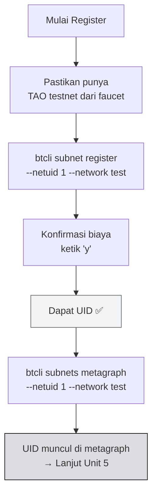

import Tabs from '@theme/Tabs';
import TabItem from '@theme/TabItem';

# 📋 Unit 4 — Register Miner di Subnet Testnet

:::info Goal Unit Ini
Di akhir unit ini kamu akan:
- Berhasil **register hotkey** di **NetUID 1 testnet** menggunakan TAO testnet
- Punya **UID** (nomor posisi miner di subnet)
- Bisa verifikasi status via `btcli subnets metagraph`
:::

:::note Prasyarat
- ✅ [Unit 3](./wallet-setup) selesai — wallet & hotkey siap, TAO testnet ada
- ✅ venv aktif: `source ~/bittensor-env/bin/activate`
- ✅ Koneksi internet stabil
:::

---

## 🌐 Konfigurasi Testnet

Sebelum register, set default network ke testnet supaya semua command btcli otomatis pakai testnet:

```bash
btcli config set --network test
```

Verifikasi konfigurasi:

```bash
btcli config get
# Output: network: test
```

:::tip Alternatif: Flag Per Command
Kalau tidak mau set global config, tambah `--network test` di setiap command btcli.
:::

---

## 📊 Step 1 — Lihat Subnet Testnet yang Tersedia

Cek subnet yang tersedia di testnet:

```bash
btcli subnets list --network test
```

Output menampilkan tabel semua subnet aktif di testnet. Cari **NetUID 1** — ini adalah subnet development/learning Bittensor.

:::note Biaya Registrasi
Biaya register di subnet yang sudah ada (recycle TAO) akan ditampilkan otomatis saat kamu jalankan `btcli subnet register` di Step 2 — btcli akan tanya konfirmasi dengan angka biaya sebelum lanjut.
:::

---

## 🔑 Pre-Check — Verifikasi Wallet & Hotkey

Sebelum register, pastikan wallet dan hotkey kamu benar-benar ada:

```bash
btcli wallet list
```

Output yang diharapkan:

```text
Wallets
└── mywallet
    └── miner1
```

Kalau hotkey tidak muncul, buat dulu:

```bash
btcli wallet new_hotkey --wallet-name mywallet --hotkey miner1
```

:::warning Sesuaikan Nama Hotkey
Kalau kamu punya hotkey dengan nama **berbeda** (misal `miner_testnet`), ganti `miner1` di semua command berikutnya dengan nama hotkey kamu yang sebenarnya.
:::

---

## 🔑 Register Miner (TAO Burn)

```bash
btcli subnet register \
  --netuid 1 \
  --wallet-name mywallet \
  --hotkey miner1 \
  --network test
```

Prompt konfirmasi akan muncul:

```text
Your balance is τ 1.000000
The cost to register by recycle is τ 0.000100
Do you want to continue? [y/n]: y
```

Ketik `y` dan tekan Enter. Tunggu beberapa detik hingga konfirmasi muncul.

**Output sukses:**

```text
✅ Registered hotkey miner1 on netuid 1
   UID: 42 (contoh — angka kamu beda)
```

Catat **UID** kamu — angka ini adalah posisi miner kamu di subnet.

:::warning POW Registration Tidak Tersedia di NetUID 1
`btcli subnet pow_register` tidak bisa dipakai di NetUID 1 karena **POW secara permanen dinonaktifkan** oleh operator subnet ini. Satu-satunya cara register di NetUID 1 adalah via TAO burn.

Pastikan kamu sudah punya TAO testnet dari faucet sebelum lanjut (lihat Unit 3).
:::

---

## ✅ Step 2 — Verifikasi Registrasi

Setelah register, verifikasi dengan melihat metagraph:

```bash
btcli subnets metagraph --netuid 1 --network test
```

Output menampilkan tabel semua miner di subnet. Cari UID kamu:

```text
Metagraph for subnet 1 (test)
┌─────┬─────────────────────────────┬──────────┬──────────┬────────┐
│ UID │ Hotkey                      │ Stake    │ Trust    │ Active │
├─────┼─────────────────────────────┼──────────┼──────────┼────────┤
│ 42  │ 5Gx1...miner1               │ τ 0.00   │ 0.0000   │ True   │
└─────┴─────────────────────────────┴──────────┴──────────┴────────┘
```

Atau cek via wallet overview:

```bash
btcli wallet overview --wallet-name mywallet --network test
```

---

## ⏳ Immunity Period

Setelah register, miner kamu masuk **immunity period** (~24 jam di mainnet, lebih singkat di testnet). Selama periode ini:

- Miner **tidak akan di-deregister** meski skor 0
- Bisa dipakai untuk setup dan tes miner tanpa risiko kehilangan posisi
- Setelah immunity habis, miner dengan skor terlalu rendah bisa didorong keluar oleh miner baru yang mendaftar

:::note Testnet Lebih Lenient
Di testnet, immunity period lebih pendek dan konsekuensi deregistrasi tidak seserius mainnet (tidak ada TAO sungguhan yang dipertaruhkan).
:::

---

## 🔄 Alur Registrasi



---

## 🐛 Troubleshooting Registrasi

| Error | Penyebab | Solusi |
|-------|----------|--------|
| `Insufficient balance for registration` | TAO testnet kurang | Minta lebih dari faucet (Unit 3) |
| `Hotkey already registered` | Hotkey sudah punya UID di subnet ini | Cek dengan `btcli wallet overview --network test` |
| `Subnet does not exist` | NetUID salah atau subnet belum aktif | Cek `btcli subnets list --network test` |
| `hotkey 'miner1' does not exist` | Hotkey belum dibuat atau nama salah | Jalankan `btcli wallet list` untuk cek nama hotkey yang ada, lalu buat: `btcli wallet new_hotkey --wallet-name mywallet --hotkey miner1` |
| `No such option: --wallet.name` | Pakai flag lama | Gunakan `--wallet-name` (dengan tanda hubung) |
| `Connection refused` / `Timeout` | Testnet subtensor down | Coba lagi 5–10 menit kemudian |
| UID tidak muncul di metagraph | Chain butuh beberapa block | Tunggu 2–5 menit, sync belum selesai |

---

## 🎯 Rangkuman

- **NetUID 1 testnet** = subnet learning Bittensor
- Registrasi via **TAO burn**: `btcli subnet register --netuid 1 --wallet-name mywallet --hotkey miner1 --network test`
- **POW registration dinonaktifkan** di NetUID 1 — wajib pakai TAO testnet
- Setelah register → dapat **UID**, muncul di metagraph
- Flag btcli menggunakan **tanda hubung**: `--wallet-name`, `--hotkey`, `--network` (bukan titik)

### ✅ Quick Check

1. Apa perbedaan flag `--wallet-name` (btcli) vs `--wallet.name` (miner.py)?
2. Kenapa kita pakai `--network test` bukan tanpa flag?
3. Apa itu immunity period dan kenapa penting?
4. Bagaimana cara verifikasi bahwa registrasi berhasil?

<details>
<summary>💡 Jawaban</summary>

1. **`--wallet-name`** adalah flag btcli (CLI tool). **`--wallet.name`** adalah flag yang dipakai saat menjalankan script Python seperti `neurons/miner.py` — keduanya berbeda tool dengan konvensi flag berbeda.
2. **`--network test`** = pakai testnet Bittensor (sandbox, TAO tidak bernilai uang nyata). Tanpa flag, btcli default ke `finney` (mainnet) yang pakai TAO sungguhan.
3. **Immunity period** = grace period setelah register (~24 jam mainnet), di mana miner tidak bisa dideregister meski skor 0. Penting supaya ada waktu setup miner.
4. `btcli subnets metagraph --netuid 1 --network test` — cari UID kamu di tabel. Atau `btcli wallet overview --wallet-name mywallet --network test`.

</details>

---

**Next:** [Unit 5 — Jalankan Miner Lokal →](./jalankan-miner-lokal)

*UID kamu sudah ada di blockchain. Sekarang waktunya hidupkan miner! ⛏️*
