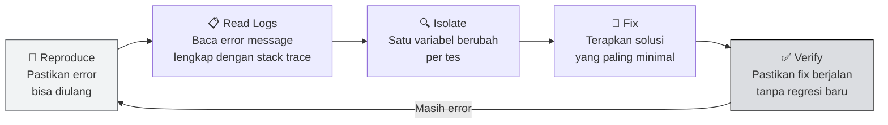

import Tabs from '@theme/Tabs';
import TabItem from '@theme/TabItem';

# 🐛 Unit 7 — Debugging & Troubleshooting Lokal

:::info Goal Unit Ini
Di akhir unit ini kamu akan:
- Punya **framework debug** yang sistematis: reproduce → read logs → isolate → fix → verify
- Paham **top 10 isu** paling umum miner Bittensor lokal dan cara fixnya
- Bisa **baca log** btcli dan miner untuk identify masalah
- Tahu **perintah diagnostik** per OS untuk network, port, dan process
:::

:::note Prasyarat
- ✅ Unit 1–6 selesai — miner sudah pernah running (meski ada error)
- ✅ Familiar dengan terminal dasar
:::

---

## 🔧 Framework Debug: 4 Langkah

Jangan langsung Google atau tanya di Discord kalau ada error. **Reproduce dulu, lalu isolate:**



---

## 📋 Cara Baca Log Miner

Log miner pakai format: `TIMESTAMP | LEVEL | MESSAGE`

```text
2026-04-21 10:30:12 | INFO     | Loading wallet mywallet/miner1       ← OK
2026-04-21 10:30:13 | WARNING  | No validators found in metagraph     ← Normal di testnet
2026-04-21 10:30:14 | ERROR    | Connection refused to subtensor      ← MASALAH
2026-04-21 10:30:14 | CRITICAL | Failed to initialize axon            ← FATAL
```

### Lihat Log Berdasarkan Metode Jalankan

<Tabs>
<TabItem value="foreground" label="Terminal Biasa" default>

Log langsung tampil di terminal. Scroll up untuk melihat error awal.

Jalankan dengan flag debug untuk log lebih detail:

```bash
python neurons/miner.py \
  --netuid 1 \
  --wallet.name mywallet \
  --wallet.hotkey miner1 \
  --subtensor.network test \
  --logging.debug 2>&1 | tee ~/miner.log
```

Flag `2>&1 | tee ~/miner.log` = tampilkan di terminal DAN simpan ke file.

</TabItem>
<TabItem value="screen" label="screen">

```bash
# Re-attach ke session
screen -r bittensor-miner

# Scroll up dengan: Ctrl+A, [   (buka scroll mode)
# Scroll: PgUp / PgDn
# Keluar scroll mode: q atau Enter
```

Atau baca file log:

```bash
tail -f ~/miner.log
```

</TabItem>
<TabItem value="tmux" label="tmux">

```bash
# Re-attach
tmux attach -t bittensor-miner

# Scroll mode: Ctrl+B, [
# Scroll: arrow keys / PgUp / PgDn
# Keluar: q
```

</TabItem>
</Tabs>

---

## 🔟 Top 10 Isu Paling Umum

:::danger Isu Khusus Testnet: `Storage function "Swap.AlphaSqrtPrice" not found`
Kalau perintah btcli ke **testnet** (`wallet balance`, `wallet overview`, `subnets metagraph`, `subnet register`) gagal dengan error ini — **bukan salah instalasimu**. Chain testnet sedang menjalankan runtime yang belum sinkron dengan btcli terbaru. Bukti: btcli normal di **mainnet**, dan SDK normal di testnet.

**Solusi:** untuk operasi testnet, pakai script SDK dari repo fork — `python scripts/status.py ...` (ganti `wallet balance`/`metagraph`) dan `python scripts/register.py ...` (ganti `subnet register`). Lihat Unit 4. Operasi wallet **lokal** (`wallet create`/`list`) dan semua perintah **mainnet** tetap normal di btcli.
:::

### Isu 1 — `btcli: command not found`

**Gejala:** Ketik `btcli` → `command not found`

**Penyebab:** venv belum aktif.

```bash
# Fix
source ~/bittensor-env-v10/bin/activate
btcli --version  # sekarang harus muncul
```

**Cegah:** Tambah alias `btenv10` ke `.bashrc` / `.zprofile` (lihat Unit 2).

---

### Isu 2 — `ModuleNotFoundError: No module named 'bittensor'`

**Gejala:** Error import saat python jalan.

**Penyebab:** venv salah atau bittensor tidak terinstall.

```bash
# Verifikasi venv aktif
which python
# Harus: /home/user/bittensor-env-v10/bin/python

# Reinstall SDK (versi terbaru, JANGAN pin <10)
pip install bittensor
```

---

### Isu 3 — `ImportError: cannot import name 'ScaleObj'` (konflik versi)

**Gejala:**
```text
ImportError: cannot import name 'ScaleObj' from 'async_substrate_interface.types'
```

**Penyebab:** SDK `bittensor` **9.x** terpasang bareng `btcli` (yang butuh `async-substrate-interface` 2.x). Keduanya bentrok di satu venv.

```bash
# Cek versi
python -c "import bittensor; print(bittensor.__version__)"

# Kalau 9.x → UPGRADE ke 10.x (bukan downgrade):
pip install -U bittensor
```

:::danger Jangan downgrade ke `bittensor<10`!
Saran lama "pin ke `bittensor<10`" sekarang **justru penyebab error ini**. Pakai SDK **10.x** + fork template SDK-10 (Unit 5).
:::

**Gejala lain —** `AttributeError: module 'bittensor' has no attribute 'metagraph'`: kamu menjalankan template **resmi** (SDK 9.x) di atas SDK 10.x. Solusinya pakai fork `Ethereum-Jakarta/bittensor-subnet-template-v10` (lihat Unit 5).

---

### Isu 4 — `Connection refused` / Timeout ke Subtensor

**Gejala:**
```text
ERROR | SubstrateRequestException: Connection refused
ERROR | Failed to connect to subtensor at test
```

**Penyebab:** Subtensor testnet endpoint down atau network issue.

```bash
# Coba endpoint alternatif
python neurons/miner.py \
  --netuid 1 \
  --wallet.name mywallet \
  --wallet.hotkey miner1 \
  --subtensor.chain_endpoint wss://test.finney.opentensor.ai:443 \
  --logging.debug

# Atau cek koneksi dasar
curl -s --max-time 5 https://test.finney.opentensor.ai && echo "OK" || echo "FAIL"
```

---

### Isu 5 — Port 8091 Already in Use

**Gejala:**
```text
ERROR | Port 8091 is already in use
OSError: [Errno 98] Address already in use
```

```bash
# Temukan proses yang pakai port
lsof -i :8091

# Kill proses tersebut (ganti <PID> dengan angka dari output lsof)
kill -9 <PID>

# Atau pakai port lain
python neurons/miner.py --axon.port 8092 ...
```

---

### Isu 6 — `Wallet not found` / `Wallet file corrupted`

**Gejala:**
```text
ERROR | Wallet not found at path: ~/.bittensor/wallets/mywallet
```

```bash
# Cek wallet tersedia
btcli wallet list

# Cek lokasi file
ls ~/.bittensor/wallets/

# Kalau file ada tapi corrupt, restore dari mnemonic
btcli wallet regen_coldkey --wallet-name mywallet
```

---

### Isu 7 — `Insufficient balance` saat Register

**Gejala:**
```text
ERROR | Your balance τ 0.0000 is insufficient to pay the registration fee
```

**Solusi:**
1. Minta TAO testnet dari faucet (Unit 3)
2. Catatan: registrasi memakai **recycle TAO** (era dTAO), jadi TAO testnet wajib ada sebelum register

```bash
btcli subnet register \
  --netuid 1 \
  --wallet-name mywallet \
  --hotkey miner1 \
  --network test
```

---

### Isu 8 — Axon `—` / `Active: False` di Metagraph

**Gejala:** Miner jalan tapi di metagraph kolom **AXON** masih `—` (axon belum serving / tidak terdeteksi).

:::note Cek metagraph di testnet pakai script SDK
`btcli subnets metagraph --network test` gagal (`Swap.AlphaSqrtPrice`). Pakai:
```bash
cd ~/bittensor-subnet-template-v10
python scripts/metagraph.py --netuid 1 --wallet.name mywallet --wallet.hotkey miner1
```
Kalau kolom **AXON** baris kamu (`<-- you`) masih `—`, lanjut diagnosa di bawah.
:::

**Langkah diagnosa:**

```bash
# 1. Pastikan miner jalan
ps aux | grep miner.py

# 2. Cek port 8091 listening
ss -tlnp | grep 8091       # Linux/WSL2
lsof -i :8091              # macOS/Linux

# 3. Test port dari terminal lain
curl -s http://localhost:8091

# 4. Cek apakah ada firewall block
sudo ufw status            # Linux
```

Kalau port listening tapi `Active: False` → kemungkinan **CGNAT**. Setup Ngrok (Unit 6).

---

### Isu 9 — Miner Exit Tanpa Error Message

**Gejala:** Proses langsung mati setelah start, tidak ada error di terminal.

```bash
# Jalankan dengan verbose logging, simpan output
python neurons/miner.py \
  --netuid 1 \
  --wallet.name mywallet \
  --wallet.hotkey miner1 \
  --subtensor.network test \
  --logging.debug 2>&1 | tee ~/debug-miner.log

# Baca log
cat ~/debug-miner.log | head -50
```

Sering penyebabnya: hotkey belum teregister di subnet → cek dengan `btcli wallet overview --network test`.

---

### Isu 10 — Miner Berjalan tapi Tidak Dapat Reward

**Gejala:** Miner `Active: True`, sudah running berhari-hari, tapi `Trust` dan emission tetap 0.

**Checklist:**

```bash
# 1. Cek status kamu di metagraph (testnet: pakai script SDK, bukan btcli)
cd ~/bittensor-subnet-template-v10
python scripts/metagraph.py --netuid 1 --wallet.name mywallet --wallet.hotkey miner1
# Lihat baris '<-- you': kolom EMISSION/TRUST/INCENT

# 2. Cek apakah ada validator aktif di subnet testnet
# (Testnet mungkin tidak punya validator aktif — normal, tidak ada reward di testnet)

# 3. Cek versi subnet template fork
git -C ~/bittensor-subnet-template-v10 log --oneline -5

# 4. Pastikan axon endpoint benar-benar reachable
curl -v http://<public_ip>:8091
```

:::note Reward Nol di Testnet = Normal
Di testnet, validator mungkin tidak aktif atau emission mekanisme berbeda. GP-0 ini fokus pada **belajar flow** — bukan actual reward. Reward production ada di mainnet (GP-1/GP-2).
:::

---

## 🔍 Diagnostik Lanjutan

### Cek Koneksi Network

```bash
# Ping subtensor
ping -c 4 test.finney.opentensor.ai

# Traceroute ke subtensor
traceroute test.finney.opentensor.ai

# Cek DNS resolve
nslookup test.finney.opentensor.ai
```

### Cek Python Environment

```bash
# Versi Python
python --version

# List semua package di venv
pip list

# Cek spesifik package
pip show bittensor
pip show bittensor-cli
```

### Cek Proses & Resources

```bash
# List proses Python
ps aux | grep python

# Monitor resource real-time
top -p $(pgrep -f miner.py)    # Linux
# htop lebih bagus: sudo apt install htop, lalu: htop

# Cek disk space
df -h ~
```

---

## 🪟 Troubleshooting Khusus Per OS

<Tabs>
<TabItem value="wsl2" label="🪟 WSL2" default>

| Error | Penyebab | Solusi |
|-------|----------|--------|
| `network unreachable` saat start WSL2 | WSL2 network adapter masalah | Di PowerShell: `wsl --shutdown`, buka Ubuntu lagi |
| Port tidak bisa diakses dari Windows | Port proxy belum diset | `netsh interface portproxy add v4tov4 listenaddress=0.0.0.0 listenport=8091 connectaddress=$(wsl hostname -I) connectport=8091` di PowerShell Admin |
| `clock skew` error di chain | Waktu WSL2 tidak sync | `sudo hwclock -s` atau `sudo ntpdate pool.ntp.org` |
| `Permission denied` saat `sudo apt` | Sudo tidak configured | Jalankan WSL2, ketik `passwd`, set password dulu |
| File path Windows tidak dikenali | Path harus format Linux | Gunakan `/mnt/c/Users/...` bukan `C:\Users\...` |

</TabItem>
<TabItem value="macos" label="🍎 macOS">

| Error | Penyebab | Solusi |
|-------|----------|--------|
| `SSL: CERTIFICATE_VERIFY_FAILED` | SSL cert macOS belum update | `python -m bittensor certifi` |
| Miner mati saat layar mati | Sleep mode aktif | Pakai `caffeinate -i python3 ...` |
| `zsh: command not found: btcli` | venv tidak aktif atau PATH salah | `source ~/bittensor-env-v10/bin/activate` |
| Homebrew permission error | Multi-user Mac | `sudo chown -R $(whoami) /opt/homebrew` (Apple Silicon) |
| `libomp` atau `libssl` error | Missing dylib | `brew install libomp openssl` |
| Python 3.10 tidak ditemukan | PATH belum diupdate | `export PATH="/opt/homebrew/opt/python@3.10/bin:$PATH"` |

</TabItem>
<TabItem value="linux" label="🐧 Linux">

| Error | Penyebab | Solusi |
|-------|----------|--------|
| `failed to build wheel for cryptography` | Dev headers kurang | `sudo apt install libssl-dev libffi-dev python3-dev` |
| `PermissionError: /etc/resolv.conf` | DNS tidak bisa ditulis (non-root) | Jalankan sebagai user biasa, bukan root |
| `No such file or directory: /proc/net/if_inet6` | IPv6 disabled | Tambah `--no-use-ipv6` ke flag miner (kalau supported) |
| `systemd` service gagal start | Path atau user salah di unit file | Cek `journalctl -u nama-service -e` untuk detail |

</TabItem>
</Tabs>

---

## 🆘 Kapan Harus Minta Bantuan

Setelah coba debug sendiri dan masih stuck, barulah minta bantuan di komunitas. Tips:

1. **Siapkan info lengkap:**
   ```bash
   # Copy output ini ke Discord/forum
   python --version
   pip show bittensor | grep Version
   pip show bittensor-cli | grep Version
   uname -a  # atau: sw_vers (macOS)
   btcli --version
   ```

2. **Share error message lengkap** — bukan screenshot potongan, tapi full stack trace

3. **Coba solusi yang sudah disarankan** sebelum tanya lagi (baca thread sebelumnya)

### Tempat Tanya

| Platform | Channel | Untuk |
|----------|---------|-------|
| Discord Bittensor | `#miner-support`, `#developer-discussion` | Issue teknis general |
| Discord Bittensor | `#subnet-1-dev` | Issue terkait subnet 1 spesifik |
| GitHub | Issues di `opentensor/bittensor` | Bug SDK/btcli |
| GitHub | Issues di repo subnet template | Bug template miner |

---

## 🎯 Rangkuman

- **Framework debug**: reproduce → read logs → isolate → fix → verify
- **Top 3 issue terbanyak**: (1) venv tidak aktif, (2) versi SDK salah, (3) port/CGNAT
- **Log lengkap** = kunci debugging — selalu pakai `--logging.debug`
- `Active: False` = port tidak reachable → cek firewall atau setup Ngrok
- Reward nol di testnet = **normal** — testnet tidak selalu punya validator aktif

### ✅ Quick Check

1. Sebutkan 4 langkah framework debug Bittensor.
2. Kenapa `--logging.debug` penting saat debugging?
3. Apa perbedaan `ERROR` dan `WARNING` di log miner?
4. Bagaimana cara cek proses miner masih jalan di background?

<details>
<summary>💡 Jawaban</summary>

1. **Reproduce → Read Logs → Isolate → Fix → Verify**
2. Tanpa `--logging.debug`, banyak pesan diagnostic tidak tampil. `DEBUG` level menampilkan semua detail: koneksi ke validator, query yang masuk, nilai metagraph yang diambil.
3. **WARNING** = ada sesuatu yang tidak ideal tapi program masih jalan (misalnya: tidak ada validator aktif). **ERROR** = ada kegagalan yang perlu ditangani (koneksi gagal, file tidak ditemukan).
4. `ps aux | grep miner.py` — kalau ada output dengan path `miner.py`, proses masih jalan.

</details>

---

## 🎓 Selesai GP-0!

Selamat! Kamu sudah menyelesaikan seluruh rangkaian **GP-0 Local Mining**:

- ✅ Setup WSL2 / macOS terminal / Linux
- ✅ Install Python, venv, btcli, Bittensor SDK
- ✅ Buat wallet coldkey + hotkey, backup mnemonic
- ✅ Register miner di NetUID 1 testnet (TAO atau POW)
- ✅ Clone & jalankan subnet-template miner
- ✅ Setup screen/tmux untuk 24/7 background running
- ✅ Konfigurasi port dan Ngrok untuk CGNAT
- ✅ Tahu cara debug isu umum secara sistematis

Kamu sekarang punya **fondasi teknis yang kuat** untuk lanjut ke production mining:

- **[GP-1 — Sportstensor SN41](../GP-1-Sportstensor-SN41/intro-sn41)** → CPU-friendly, sports prediction, bisa dari laptop
- **[GP-2 — Data Universe SN13](../GP-2-Data-Universe-SN13/intro-sn13)** → VPS recommended, scraping data, storage-heavy

*Debug adalah skill, bukan kelemahan. Miner terbaik adalah miner yang tahu cara fix masalahnya sendiri. 🔧*
