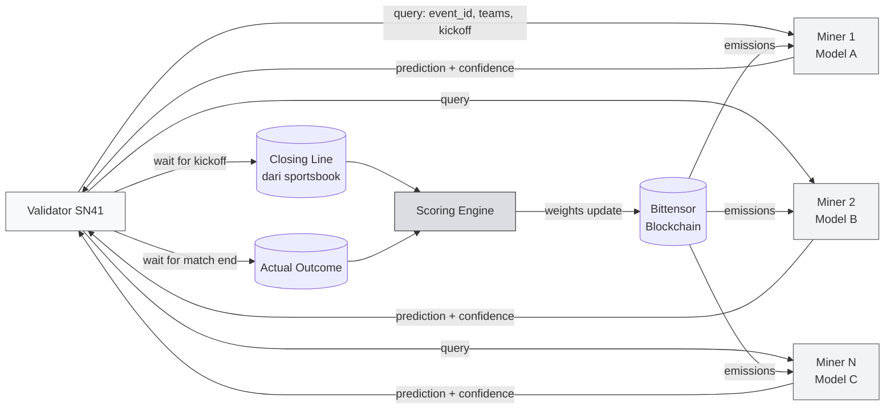
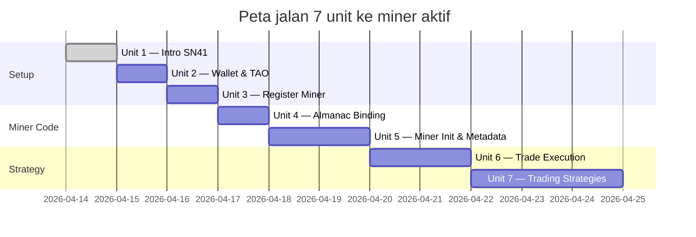

# ⚡ Introduction to the SN41 Subnet

:::info Goal Unit Ini
Setelah menyelesaikan unit ini, kamu akan:
- Paham **apa yang dilakukan Sportstensor (SN41)** dan kenapa subnet ini unik di antara subnet Bittensor lain
- Mengerti **arsitektur miner ↔ validator** untuk prediksi olahraga
- Tahu **hardware requirement** minimum dan budget awal (TAO + infra)
- Punya **peta jalan 7 unit** sampai miner kamu aktif di mainnet
- Siap mengambil keputusan: lanjut setup wallet di Unit 2, atau evaluasi dulu
:::

:::note Prasyarat
- ✅ Sudah menyelesaikan **Phase 0** (Web3, AI, Decentralized AI)
- ✅ Sudah menyelesaikan **Phase 1** — terutama Concept II Unit 3 (Sportstensor overview)
- ✅ Punya laptop/VPS dengan Linux atau WSL2 (Ubuntu 22.04+ recommended)
- ✅ Python 3.10+ terinstall (`python3 --version`)
- ✅ Dana awal **~0.5–2 TAO** untuk registration + buffer (harga fluktuatif, cek harga terbaru)
:::

---

## 🏟️ Apa Itu Sportstensor?

**Sportstensor** (netuid **41** di Bittensor mainnet) adalah subnet yang mengoperasikan **pasar prediksi olahraga terdesentralisasi**. Miner di subnet ini bersaing untuk memberikan prediksi paling akurat tentang hasil pertandingan olahraga — mulai dari sepak bola, NBA, NFL, MLB, sampai tennis — dan validator mengukur akurasi prediksi tersebut terhadap **closing line** (odds resmi saat pertandingan kickoff) atau **outcome aktual**.

Yang membuat SN41 berbeda:

1. **Revenue model nyata (USD → TAO buyback)**
   Sportstensor punya produk B2B yang menjual akses prediksi ke klien di dunia olahraga/betting. Revenue USD yang masuk digunakan untuk **buyback TAO** secara berkala dan didistribusikan kembali ke miner berperforma tinggi. Ini salah satu dari sedikit subnet dengan *real-world cashflow*.

2. **Ground truth objektif**
   Berbeda dengan subnet LLM yang scoring-nya subjektif, hasil pertandingan olahraga adalah fakta. Validator tidak perlu debat "jawaban mana yang lebih bagus" — tim A menang, atau kalah, atau seri. Titik.

3. **Barrier to entry rendah secara hardware**
   Kamu tidak butuh 8× H100 seperti di subnet LLM training. CPU modern + internet stabil sudah cukup untuk mulai. GPU hanya berguna kalau kamu training model ML prediktif sendiri.

---

## 🧭 High-Level Architecture



### Siklus hidup satu prediksi

1. **Validator** mendapat jadwal pertandingan dari sumber data (scheduler internal).
2. Sebelum kickoff, validator mengirim **query** berisi `event_id`, sport, tim, dan waktu kickoff ke semua miner aktif.
3. **Miner** menjalankan model prediksi mereka (statistik / ML / hybrid) dan membalas dengan `{prediction, confidence, stake_suggestion}`.
4. Validator **mencatat jawaban** miner dan timestamp.
5. Saat kickoff, validator mengunci **closing line** dari sportsbook (misal Pinnacle) — ini adalah "smart money consensus".
6. Setelah pertandingan selesai, validator punya **actual outcome**.
7. **Scoring engine** menghitung seberapa dekat prediksi miner ke closing line (CLV — *Closing Line Value*) dan ke actual outcome.
8. Validator submit **weights** ke chain; blockchain mendistribusikan **emissions** (TAO) proporsional ke miner top-performer.

:::tip Kenapa closing line, bukan cuma win/lose?
Closing line adalah **benchmark efisiensi**. Kalau prediksi kamu konsisten "beat the closing line", itu bukti skill, bukan sekadar hoki. Satu pertandingan bisa salah; 1000 pertandingan dengan CLV positif = alpha nyata.
:::

---

## 🖥️ Hardware Requirements

:::info Spesifikasi yang terbukti cukup
Kebanyakan miner SN41 jalan di spek ini tanpa masalah. Mulai kecil, scale kalau strategi kamu butuh.
:::

| Komponen | Minimum | Recommended | Catatan |
|---|---|---|---|
| **CPU** | 2 vCPU | 4–8 vCPU | Untuk handle inference + scraping data |
| **RAM** | 4 GB | 8–16 GB | Model ML kecil cukup 4 GB; kalau heavy feature-store → 16 GB |
| **Disk** | 40 GB SSD | 100 GB SSD | Logs + historical data + model artifacts |
| **GPU** | — (optional) | RTX 3060 / cloud T4 | Hanya kalau train ML sendiri. Inference ringan = CPU only |
| **Internet** | 50 Mbps stabil | 100+ Mbps, low jitter | **KRITIS** — miner yang timeout = 0 reward |
| **OS** | Ubuntu 20.04+ | Ubuntu 22.04 LTS | WSL2 boleh untuk dev; production pakai native Linux / VPS |
| **Uptime** | 95%+ | 99%+ | Down saat validator query = miss reward window |

### Opsi hosting yang umum dipakai

- **VPS murah**: Contabo VPS-M (~€8/bulan), Hetzner CX22 (~€4/bulan)
- **VPS menengah**: DigitalOcean Basic Droplet $12/bulan
- **Cloud GPU** (kalau butuh GPU): Vast.ai, RunPod on-demand

:::warning Jangan pakai WiFi rumah untuk production
WiFi rumah bisa down, IP berubah, latensi spike. Untuk testing 1–2 hari oke; untuk production — **pakai VPS**. Harga sebotol kopi per bulan lebih murah daripada kehilangan emission satu hari.
:::

---

## 💰 Estimasi Biaya & Waktu

### Biaya one-time (registration)

Registration cost di Bittensor bersifat **dinamis** (recycle / burn mechanism). Cek harga aktual:

```bash
btcli subnet burn_cost --netuid 41
```

Range historis (cek ulang saat kamu mendaftar):

| Komponen | Estimasi |
|---|---|
| Registration fee (burn TAO) | 0.1 – 1.5 TAO |
| Transaction buffer | 0.05 TAO |
| **Total minimum siap di coldkey** | **~1.5 – 2 TAO** |

### Biaya running (bulanan)

| Komponen | Estimasi |
|---|---|
| VPS | $5 – $20 / bulan |
| Data API (The Odds API free tier atau Sportradar trial) | $0 – $50 / bulan |
| **Total operasional** | **$5 – $70 / bulan** |

### Timeline realistis



**Estimasi total**: 7–14 hari santai, 3–5 hari jika full-time.

---

## 🗺️ Peta Jalan 7 Unit (What's Next)

| Unit | Topik | Output |
|---|---|---|
| 1 | **Intro SN41** (kamu di sini) | Paham kenapa & siap lanjut |
| 2 | Wallet & TAO Funding | Coldkey + hotkey siap, saldo TAO ada |
| 3 | Register Miner | UID assigned di netuid 41 |
| 4 | Almanac Registration | Hotkey ↔ miner profile terbinding |
| 5 | Miner Init & Metadata | Miner process jalan 24/7 |
| 6 | Programmatic Trade Execution | Handler prediksi berfungsi |
| 7 | Trading Strategies | Strategi aktif + monitoring CLV |

:::tip Bisa testnet dulu, kok
Semua langkah di unit 2–6 bisa kamu coba di **testnet** dulu dengan flag `--subtensor.network test` dan testnet netuid sebelum main di mainnet. Kita akan jelaskan detail di Unit 2.
:::

---

## 🔒 Mindset Sebelum Mulai

:::danger Disclaimer Risiko
- **TAO yang kamu burn untuk registrasi tidak bisa dikembalikan**. Ini bukan deposit — ini fee masuk subnet.
- Miner yang **underperform akan dikalahkan** miner baru (deregistration). Kamu bisa kehilangan slot kalau skor rendah terus-menerus.
- Sports betting / prediction market terikat regulasi di beberapa yurisdiksi. Pastikan kamu paham regulasi setempat.
- **Ini bukan investment advice.** Kurikulum ini mengajarkan teknis mining, bukan jaminan profit.
:::

Kalau kamu siap dengan risiko di atas dan siap belajar iteratif (tidak expect langsung profit di hari pertama), Sportstensor adalah **salah satu subnet paling straightforward** untuk belajar mining Bittensor end-to-end.

---

## 🎯 Rangkuman

Di unit ini kamu sudah:

- ✅ Kenal Sportstensor (SN41) sebagai subnet prediksi olahraga dengan revenue model nyata
- ✅ Paham arsitektur validator ↔ miner dan siklus scoring (query → closing line → actual outcome)
- ✅ Tahu hardware requirement minimum (2 vCPU / 4 GB RAM / VPS $5/bulan cukup)
- ✅ Punya estimasi biaya (~1.5–2 TAO + $5–70/bulan) dan timeline (7–14 hari)
- ✅ Punya peta jalan 7 unit yang akan kamu eksekusi

### ✅ Quick Check

Sebelum lanjut ke Unit 2, jawab cepat:

1. Apa beda Sportstensor dengan subnet LLM dari sisi ground truth?
2. Apa itu **closing line** dan kenapa penting?
3. Berapa TAO minimum yang perlu kamu siapkan sebelum registrasi?
4. Kenapa WiFi rumah kurang ideal untuk miner production?

Kalau keempatnya bisa kamu jawab tanpa scroll ulang — kamu siap lanjut.

### 🐛 Troubleshooting

| Masalah | Solusi |
|---|---|
| Bingung antara netuid testnet vs mainnet | Mainnet SN41 = netuid `41`. Testnet pakai netuid berbeda, akan kita konfirmasi di Unit 3 |
| Belum punya Linux | Install WSL2 di Windows, atau sewa VPS Hetzner/Contabo dari awal |
| Python 3.10+ belum ada | `sudo apt install python3.11 python3.11-venv` |
| Ragu soal budget | Testnet dulu (gratis via faucet). Mainnet nanti setelah yakin strategi kamu jalan |

---

**Next:** [Unit 2 — Bittensor Wallet Setup & TAO Funding →](./wallet-tao-funding)
