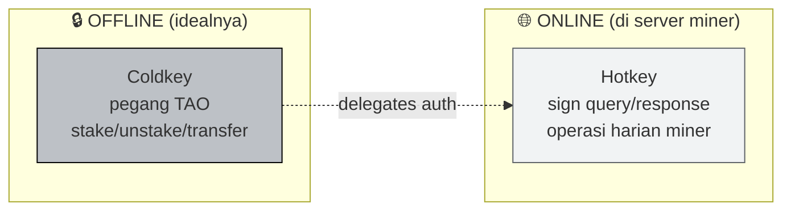

# 🔑 Bittensor Wallet Setup and TAO Funding

:::info Goal Unit Ini
Setelah unit ini kamu akan punya:
- `btcli` terinstall dan versi konfirmasi
- **Coldkey** baru (untuk holding TAO, offline-first)
- **Hotkey** baru (untuk signing operasi miner, online)
- Mnemonic **dibackup dengan aman** di lokasi offline
- Saldo TAO siap di coldkey — testnet (via faucet) atau mainnet (via exchange)
- Verifikasi saldo via `btcli wallet overview`
:::

:::note Prasyarat
- ✅ Sudah menyelesaikan [Unit 1 — Intro SN41](./01-intro-sn41)
- ✅ Python 3.10+ (`python3 --version`)
- ✅ `pip` dan `venv` sudah siap
- ✅ Akses internet stabil
- ✅ (Untuk mainnet) Akun exchange yang support TAO: **Kraken**, **MEXC**, **Gate.io**, **KuCoin**
:::

---

## 🧭 Konsep Coldkey vs Hotkey

Sebelum eksekusi, wajib paham beda dua kunci ini — salah pakai = kehilangan dana.



| Aspek | Coldkey | Hotkey |
|---|---|---|
| **Fungsi** | Holding TAO, high-value ops | Sign message miner/validator |
| **Exposure** | Idealnya offline / dingin | Hidup di server miner 24/7 |
| **Kalau compromised** | 🚨 TAO bisa dicuri | Bisa di-replace, TAO aman |
| **Jumlah** | Biasanya 1 | Bisa banyak (satu per role) |

:::danger Analogi penting
**Coldkey = brankas bank**. **Hotkey = kartu ATM**. Kalau kartu ATM hilang kamu blokir, dana tetap aman di brankas. Kalau brankas jebol, semua hilang. Perlakukan coldkey dengan *paranoia* yang sesuai.
:::

---

## ⚙️ Step 1 — Install btcli

Ada dua paket:

- `bittensor-cli` → hanya CLI (lebih ringan, cukup untuk operasi wallet)
- `bittensor` → SDK full (dibutuhkan untuk nanti menjalankan miner)

### Setup virtual environment dulu

```bash
# buat folder project
mkdir -p ~/bittensor && cd ~/bittensor

# virtual env supaya tidak konflik global
python3 -m venv venv
source venv/bin/activate

# konfirmasi pip
pip install --upgrade pip
```

### Install

```bash
# CLI + SDK sekalian (recommended, karena nanti butuh SDK juga)
pip install bittensor bittensor-cli
```

**Cek instalasi:**

```bash
btcli --version
```

Output kira-kira:

```text
btcli, version 8.x.x
```

:::tip Kalau error `command not found`
Pastikan venv aktif (`source ~/bittensor/venv/bin/activate`). Kalau ingin global, re-install tanpa venv, tapi risiko konflik dependency tinggi — **venv lebih aman**.
:::

### Checkpoint validation

```bash
btcli --help | head -20
```

Kalau muncul daftar subcommand (`wallet`, `subnet`, `stake`, dll) — instalasi sukses.

---

## 🔐 Step 2 — Buat Coldkey

```bash
btcli wallet new_coldkey --wallet.name sn41_miner
```

Proses:

1. btcli minta **password** untuk enkripsi file coldkey lokal. Pilih password kuat, **jangan hilangkan** — tidak ada recovery.
2. btcli generate **12-word mnemonic** dan tampilkan di terminal.
3. Konfirmasi mnemonic sudah dicatat.

Output (contoh — mnemonic di bawah HANYA ilustrasi, jangan pernah pakai yang bocor di doc):

```text
IMPORTANT: Store this mnemonic in a secure (preferable offline place), as anyone
who has possession of this mnemonic can use it to regenerate the key and access your tokens.

The mnemonic to the new coldkey is:
word1 word2 word3 word4 word5 word6 word7 word8 word9 word10 word11 word12

You can use the mnemonic to recreate the key in case it gets lost. The command to use to regenerate the key is:
btcli w regen_coldkey --mnemonic "word1 word2 ... word12"
```

:::danger BACKUP MNEMONIC SEKARANG
**Sebelum lanjut:** tulis 12 kata itu di **kertas fisik** (dua salinan, simpan di tempat berbeda). Jangan:
- ❌ Screenshot
- ❌ Simpan di Google Docs / Notion / cloud notes
- ❌ Kirim ke WhatsApp sendiri
- ❌ Taruh di file `.txt` di laptop

**Siapa yang punya mnemonic = punya TAO kamu.** Setelah dicatat, `clear` terminal.
:::

```bash
clear   # hapus mnemonic dari scrollback terminal
history -c   # hapus history shell session ini
```

### Checkpoint

```bash
btcli wallet list
```

Harus muncul `sn41_miner` dengan address `5...` (format SS58).

---

## 🔥 Step 3 — Buat Hotkey

```bash
btcli wallet new_hotkey \
  --wallet.name sn41_miner \
  --wallet.hotkey miner_01
```

Sama prosesnya — password + mnemonic hotkey baru. Hotkey mnemonic **juga sebaiknya dibackup**, tapi risk-profile-nya lebih rendah dari coldkey.

Output:

```text
The mnemonic to the new hotkey is:
...12 words...

btcli w regen_hotkey --mnemonic "..."
```

### Checkpoint

```bash
btcli wallet list
```

Expected output:

```text
Wallets
└── sn41_miner
    ├── Coldkey  5FHneW46xGXgs5mUiveU4sbTyGBzmstUspZC92UhjJM694ty
    └── Hotkeys
        └── miner_01  5CiPPseXPECbkjWCa6MnjNokrgYjMqmKndv2rSnekmSK2DjL
```

Address **SS58** kamu akan beda, tapi struktur sama.

:::tip Screenshot output ini
Kamu akan butuh screenshot `btcli wallet list` untuk graduation submission di akhir Guided Project.
:::

---

## 💧 Step 4 — Dapat TAO (Testnet dulu!)

### Opsi A — Testnet Faucet (RECOMMENDED untuk belajar)

Testnet TAO gratis via faucet. Jaringan testnet punya subtensor endpoint terpisah.

```bash
btcli wallet faucet \
  --wallet.name sn41_miner \
  --subtensor.network test
```

Proses meminta **proof-of-work** (jalan beberapa menit di CPU). Setelah selesai:

```bash
btcli wallet overview \
  --wallet.name sn41_miner \
  --subtensor.network test
```

Saldo testnet TAO (τ) akan muncul di coldkey.

:::tip Faucet kadang disabled
Kalau faucet lagi rate-limited atau disabled, minta ke **Bittensor Discord** channel `#testnet-faucet` atau coba ulang beberapa jam kemudian.
:::

### Opsi B — Mainnet (beli dari exchange)

Untuk **real mining di SN41 mainnet**:

1. Beli TAO di exchange yang support:
   - **Kraken** (pair: TAO/USD, TAO/USDT) — paling established
   - **MEXC** — spread lumayan
   - **Gate.io** — listing luas
   - **KuCoin** — alternatif
2. Withdraw TAO ke **coldkey address SS58** kamu.
   - ⚠️ Pastikan exchange support **Bittensor native withdrawal** (bukan wrapped TAO di jaringan lain!)
3. Tunggu konfirmasi (biasanya 1–3 menit).

:::warning Double-check address SS58
Paste coldkey address dari `btcli wallet list`. Jangan ketik manual. **Transfer salah address = TAO hilang permanen.**

Tes dulu dengan **amount kecil** (0.01 TAO) sebelum withdraw full amount. Biaya $0.01 sekarang > kehilangan 2 TAO nanti.
:::

### Cek saldo mainnet

```bash
btcli wallet overview --wallet.name sn41_miner
```

Expected:

```text
Coldkey: sn41_miner
  Balance: τ 2.000000000
  Hotkeys:
    miner_01 (5Ci...DjL)  Stake: τ 0.0
```

---

## ✅ Step 5 — Verifikasi Lengkap

Jalankan checklist berikut. **Semuanya harus pass** sebelum lanjut ke Unit 3.

```bash
# 1. btcli terinstall & versi oke
btcli --version

# 2. Wallet terdaftar
btcli wallet list

# 3. Saldo coldkey cukup (min 1.5 TAO di mainnet, atau 5+ test-τ di testnet)
btcli wallet overview --wallet.name sn41_miner

# 4. (Opsional) cek saldo by hotkey
btcli wallet balance --wallet.name sn41_miner
```

### Checkpoint matrix

| Check | Expected | Kalau gagal |
|---|---|---|
| `btcli --version` | `8.x.x` muncul | Re-install, pastikan venv aktif |
| `btcli wallet list` | Coldkey + hotkey muncul | Re-run step 2 & 3 |
| Saldo coldkey ≥ 1.5 TAO (mainnet) | Balance muncul | Tambah deposit dari exchange |
| Saldo ≥ 5 test-τ (testnet) | Balance muncul | Re-run faucet |

---

## 🗂️ Struktur File Wallet

btcli menyimpan wallet di `~/.bittensor/wallets/`:

```text
~/.bittensor/wallets/sn41_miner/
├── coldkey             # encrypted, butuh password
├── coldkeypub.txt      # public key (aman di-share)
└── hotkeys/
    └── miner_01        # encrypted hotkey
```

:::danger JANGAN commit folder ini ke Git
Tambahkan ke `.gitignore`:
```text
.bittensor/
*.bittensor
wallets/
```
Dan **jangan upload `coldkey` file ke mana pun** — meskipun terenkripsi.
:::

---

## 🎯 Rangkuman

Kamu sudah berhasil:

- ✅ Install `btcli` + `bittensor` SDK di virtualenv
- ✅ Generate **coldkey** `sn41_miner` + backup mnemonic offline
- ✅ Generate **hotkey** `miner_01` + backup mnemonic
- ✅ Dapat TAO (testnet via faucet atau mainnet via exchange)
- ✅ Verifikasi saldo via `btcli wallet overview`

### ✅ Quick Check

1. Apa beda peran coldkey vs hotkey dalam operasi miner?
2. Di mana file wallet lokal disimpan secara default?
3. Kenapa mnemonic **tidak boleh** disimpan di Google Docs?
4. Flag apa yang dipakai untuk operasi di testnet?

### 🐛 Troubleshooting

| Error | Kemungkinan penyebab | Solusi |
|---|---|---|
| `command not found: btcli` | venv belum aktif | `source ~/bittensor/venv/bin/activate` |
| `ModuleNotFoundError: bittensor` | Install gagal separuh | `pip install --force-reinstall bittensor` |
| Faucet output `rate limited` | Terlalu sering request | Tunggu 1–4 jam, atau tanya Discord |
| Saldo muncul tapi `0.0` | Transaksi belum confirmed | Tunggu 1–3 blok (12–36 detik) |
| Address SS58 tampak beda format | Pakai network berbeda | Pastikan endpoint sama (`--subtensor.network test` untuk testnet) |
| `Invalid password` saat unlock | Salah ketik | Tidak ada reset — harus pakai mnemonic via `btcli w regen_coldkey` |
| Mnemonic hilang | 🚨 Tidak bisa recover | Buat wallet baru, anggap yang lama loss |

:::tip Bookmark output
Simpan screenshot `btcli wallet list` dan `btcli wallet overview` — dibutuhkan di **graduation submission**.
:::

---

**Next:** [Unit 3 — Registering a Miner on Sportstensor →](./03-register-miner)
