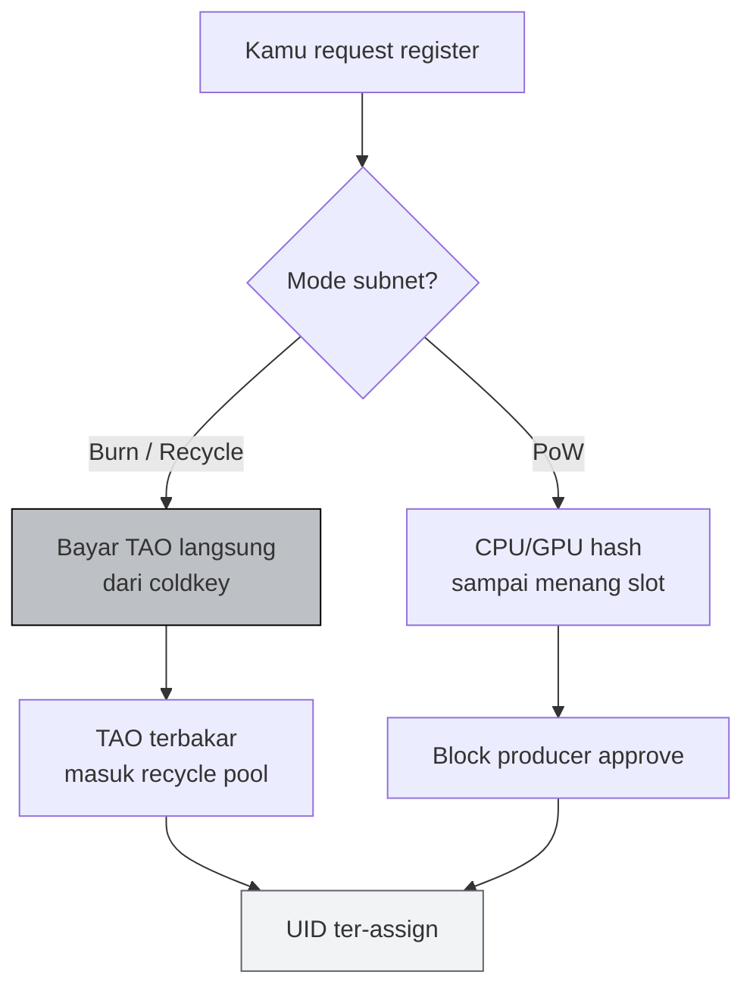
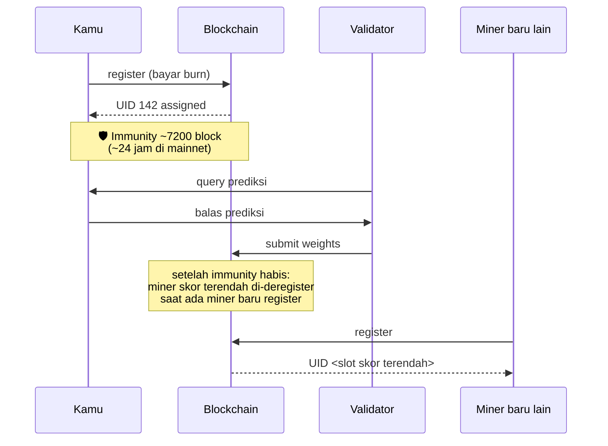

# ⛏️ Registering a Miner on Sportstensor

:::info Goal Unit Ini
Setelah unit ini kamu akan:
- Paham mekanisme **recycle / burn TAO** untuk registrasi subnet
- Tahu cara **cek biaya registrasi aktual** via `btcli subnet burn_cost`
- Berhasil **mendaftarkan hotkey** ke netuid 41 (atau testnet netuid)
- Verifikasi **UID** kamu sudah muncul di metagraph
- Tahu cara handle error umum (insufficient balance, registration closed, dll)
:::

:::note Prasyarat
- ✅ [Unit 2 — Wallet & TAO Funding](./02-wallet-tao-funding) selesai
- ✅ Coldkey `sn41_miner` punya saldo ≥ 1.5 TAO (mainnet) atau ≥ 5 test-τ (testnet)
- ✅ Hotkey `miner_01` sudah dibuat
- ✅ Akses internet stabil (proses register bisa 30–90 detik)
:::

---

## 🧠 Konsep Registrasi: Burn vs PoW

Bittensor punya dua mode registrasi historis. **SN41 saat ini pakai mode burn (recycle)** — lebih predictable dan ramah untuk non-miner-profesional.



### Kenapa burn?

- **Tidak perlu hardware heavy** — tinggal bayar
- **Harga dinamis**: kalau banyak orang register → biaya naik, kalau sepi → turun (mekanisme supply & demand)
- **TAO yang dibakar** masuk ke recycle pool subnet (bukan hilang begitu saja secara ekonomi — menjaga scarcity)

:::warning TAO burned = gone
Setelah burn, TAO tidak bisa di-refund. Kalau kamu deregistered nanti, kamu **tidak dapat kembali** biaya registrasi. Ini bukan deposit.
:::

---

## 💵 Step 1 — Cek Biaya Registrasi

### Mainnet (netuid 41)

```bash
btcli subnet burn_cost --netuid 41
```

Output:

```text
Recycle required to register on subnet 41: τ 0.237493921
```

Angka ini **fluktuatif per blok** (tiap ~12 detik). Kalau lagi tinggi, tunggu beberapa jam.

### Testnet

Testnet Sportstensor biasanya pakai netuid berbeda (sering kali **netuid 199** atau sesuai pengumuman tim — **lihat dokumentasi resmi Sportstensor** untuk konfirmasi).

```bash
btcli subnet burn_cost --netuid <TESTNET_NETUID> --subtensor.network test
```

:::tip Lihat semua subnet + harga
```bash
btcli subnet list
```
Menampilkan tabel semua subnet aktif beserta burn cost terkini. Berguna untuk orientasi.
:::

### Checkpoint sebelum lanjut

Pastikan saldo coldkey kamu **minimal 1.5× burn cost** + buffer:

```bash
btcli wallet overview --wallet.name sn41_miner
```

Kalau burn cost `0.24 τ`, minimum saldo `~0.4 τ`. **Siapkan buffer lebih** kalau burn cost naik saat kamu eksekusi.

---

## 🚀 Step 2 — Eksekusi Registrasi

### Mainnet

```bash
btcli subnet register \
  --netuid 41 \
  --wallet.name sn41_miner \
  --wallet.hotkey miner_01
```

### Testnet (recommended untuk first-time)

```bash
btcli subnet register \
  --netuid <TESTNET_NETUID> \
  --wallet.name sn41_miner \
  --wallet.hotkey miner_01 \
  --subtensor.network test
```

btcli akan:

1. Tampilkan **current burn cost**.
2. Minta **konfirmasi** ("Do you want to continue? [y/N]").
3. Minta **password coldkey**.
4. Submit extrinsic ke chain.
5. Tunggu finality (~12–36 detik).

### Output sukses (contoh)

```text
Balance:
  τ 2.000000000  →  τ 1.762506079
✅ Registered
Registered on netuid 41 with UID 142
```

**Catat UID 142** (angka kamu akan beda) — ini identitas miner kamu di subnet.

### Checkpoint

```bash
btcli wallet overview --wallet.name sn41_miner
```

Expected: saldo turun sebesar burn_cost, dan di bawah hotkey `miner_01` muncul `uid: <nomor>`.

---

## 🔍 Step 3 — Verifikasi di Metagraph

**Metagraph** = snapshot state subnet (semua miner + validator, UID, stake, weights).

```bash
btcli subnet metagraph --netuid 41
```

Output tabel (potongan):

```text
Subnet 41 — Sportstensor
  UID  STAKE    RANK     TRUST    INCENTIVE   EMISSION   HOTKEY
  ...
  142  0.0000   0.0000   0.0000   0.0000      0.0000     5Ci...DjL
  ...
```

Cari baris dengan **hotkey SS58** yang match `btcli wallet list` kamu.

:::tip Filter langsung ke UID kamu
Pipe grep untuk cari cepat:
```bash
btcli subnet metagraph --netuid 41 | grep "5Ci"
```
(Ganti `5Ci` dengan 3–5 karakter awal hotkey SS58 kamu.)
:::

### Apa arti kolom?

| Kolom | Arti awal (baru register) | Berubah jadi |
|---|---|---|
| **UID** | Nomor slot unik kamu | Tetap (sampai deregistered) |
| **STAKE** | 0 | Naik kalau kamu/delegator staking |
| **RANK** | 0 | Naik berdasar skor validator |
| **TRUST** | 0 | Naik saat validator konsisten score kamu positif |
| **INCENTIVE** | 0 | Share emission berdasar rank |
| **EMISSION** | 0 | TAO per blok yang kamu dapat |

Semua kolom nol saat awal — **normal**. Butuh 1–3 hari active mining untuk mulai naik.

---

## 🧭 Siklus Registrasi & Deregistrasi (Immunity Period)



:::warning Immunity period = waktu belajar
Setelah register, kamu dapat **immunity period** (~24 jam di mainnet). Dalam window ini kamu tidak akan di-deregister meski skor 0. Pakai waktu ini untuk **setup miner code** di unit 4–6 dan jangan buang-buang.
:::

---

## 🐛 Error Umum & Solusi

### 1. `InsufficientBalance`

```text
Error: Not enough balance to pay for registration.
  required: τ 0.51, available: τ 0.42
```

**Solusi:**
- Tambah TAO dari exchange (mainnet) atau faucet (testnet)
- Atau tunggu burn cost turun (`watch -n 60 btcli subnet burn_cost --netuid 41`)

### 2. `RegistrationDisabled` / registration closed window

Beberapa subnet punya **registration interval** (tidak selalu terbuka). Kalau error:

```text
Error: Registration is disabled.
```

**Solusi:**
- Tunggu window berikutnya — biasanya tim subnet umumkan di Discord
- Cek `btcli subnet list` kolom status / next registration

### 3. `PriorityIsTooLow` / `TooManyRegistrationsThisBlock`

Artinya ada banyak orang register di blok yang sama.

**Solusi:**
- Coba lagi 1–2 blok kemudian. btcli otomatis retry beberapa kali.
- Kalau persistent, naikkan gas priority (advanced — umumnya tidak perlu di burn mode).

### 4. Timeout `connection refused`

```text
Error: Unable to connect to subtensor endpoint.
```

**Solusi:**
- Cek internet (`ping entrypoint-finney.opentensor.ai`)
- Gunakan endpoint fallback: `--subtensor.chain_endpoint wss://entrypoint-finney.opentensor.ai:443`

### 5. Password salah

```text
Error: Incorrect password for coldkey.
```

**Solusi:**
- Tidak ada reset. Kalau password hilang permanen → gunakan mnemonic regen:
  ```bash
  btcli w regen_coldkey --mnemonic "..." --wallet.name sn41_miner_v2
  ```
- Ini wallet baru dari mnemonic sama — address tetap sama (SS58 deterministik dari mnemonic).

---

## 📸 Dokumentasi untuk Graduation

Ambil screenshot output berikut (kamu butuh untuk submission akhir):

1. `btcli subnet burn_cost --netuid 41` **sebelum** register
2. Output dari `btcli subnet register ...` yang menunjukkan `Registered on netuid 41 with UID <N>`
3. `btcli subnet metagraph --netuid 41 | grep <hotkey_prefix>` yang menunjukkan UID kamu di metagraph
4. `btcli wallet overview --wallet.name sn41_miner` (saldo setelah burn)

Simpan di folder lokal `~/bittensor/submission-evidence/03-register/`.

---

## 🎯 Rangkuman

- ✅ Paham mode **burn/recycle**: bayar TAO → dapat UID
- ✅ Cek burn cost via `btcli subnet burn_cost`
- ✅ Berhasil `btcli subnet register --netuid 41 ...`
- ✅ Dapat UID ter-assign
- ✅ Verifikasi UID muncul di `btcli subnet metagraph --netuid 41`
- ✅ Paham konsep immunity period (~24 jam buffer untuk setup miner)

### ✅ Quick Check

1. Apa beda mode **burn** vs **PoW** registration?
2. Berapa flag minimum yang dibutuhkan `btcli subnet register` di mainnet?
3. Apa yang terjadi ke TAO setelah burn — hilang, di-refund, atau di-recycle?
4. Apa gunanya immunity period bagi miner baru?
5. Di tabel metagraph, kolom apa yang paling penting untuk emission kamu?

### 🐛 Troubleshooting

| Gejala | Solusi cepat |
|---|---|
| Burn cost kelihatan tinggi tidak wajar | Tunggu beberapa jam — supply & demand |
| UID tidak muncul di metagraph padahal output sukses | Tunggu 1–2 menit (sync delay), lalu cek ulang |
| `btcli subnet metagraph` lambat banget | Normal — metagraph besar. Pakai `grep` untuk filter |
| Salah register di netuid lain | TAO hilang di netuid itu — tidak bisa dipindahkan. Hati-hati next time |
| Ingin deregister sukarela | Tidak bisa — hanya auto-deregister kalau skor terendah dan ada miner baru masuk |

:::danger JANGAN register double di netuid sama
Kalau kamu register hotkey kedua di netuid 41 dengan coldkey sama — OK, dua slot. Tapi kalau kamu re-register hotkey yang sama tanpa deregister dulu → TAO terbuang. Cek `metagraph` dulu sebelum register ulang.
:::

---

**Next:** [Unit 4 — Almanac Registration & Miner Identity Binding →](./04-almanac-registration)
