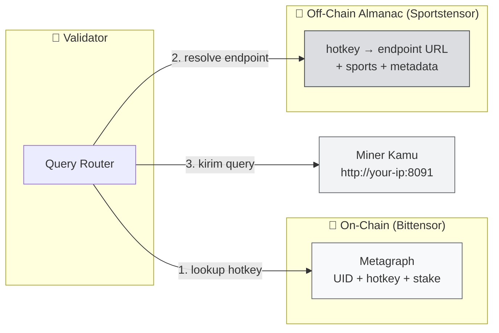
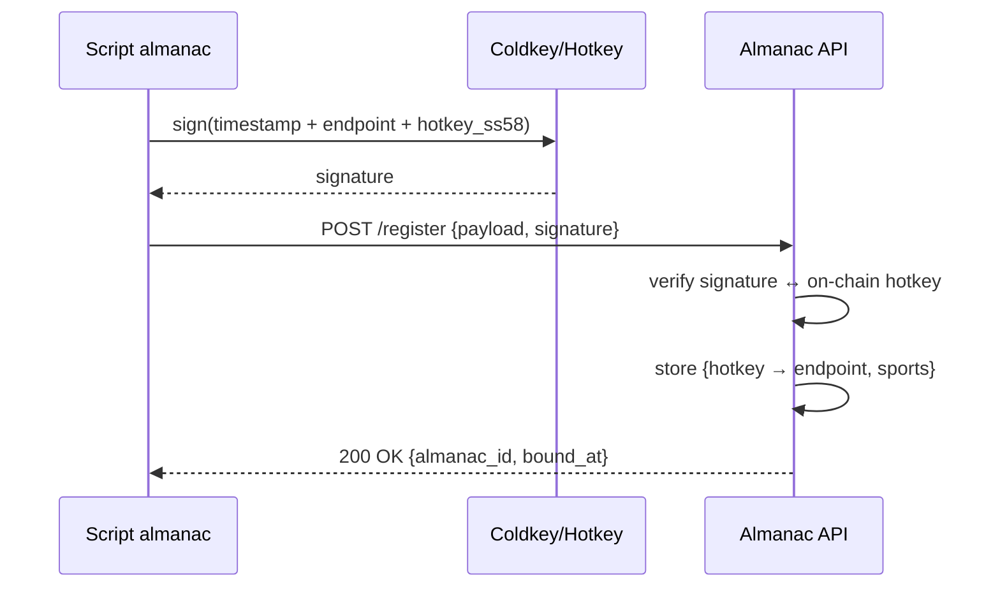

# 📖 Almanac Registration and Miner Identity Binding

:::info Goal Unit Ini
Setelah unit ini kamu akan:
- Paham apa itu **Almanac** dan kenapa diperlukan di atas registrasi on-chain
- Clone **Sportstensor miner repo** dan siapkan environment
- Konfigurasi `config.yaml` dengan **hotkey SS58** + **endpoint URL** miner kamu
- Jalankan script **almanac registration** dan verifikasi binding berhasil
- Paham siklus re-binding saat IP/endpoint kamu berubah
:::

:::note Prasyarat
- ✅ [Unit 3 — Register Miner di SN41](./register-miner) selesai — UID sudah ter-assign
- ✅ Hotkey `miner_01` terdaftar di metagraph netuid 41
- ✅ Git + Python 3.10+ tersedia di server
- ✅ Port publik (default **8091** atau sesuai repo) bisa di-expose — kalau VPS pastikan firewall ok, kalau rumah pastikan port forwarding aktif
:::

---

## 🧭 Apa Itu Almanac?

On-chain registry Bittensor hanya menyimpan info minimal (hotkey, stake, weights). Tapi Sportstensor butuh info tambahan:

- **Endpoint URL** miner kamu (di mana validator harus kirim query?)
- **Sports coverage** (apakah kamu cover NBA? NFL? Sepak bola?)
- **Model metadata** (versi prediction engine, dsb)

Semua ini disimpan di **Almanac** — off-chain registry yang dikelola Sportstensor team, tapi ter-verify pakai **signature hotkey** (jadi tidak bisa dipalsukan).



:::tip Analogi sederhana
Metagraph = KTP (identitas resmi). Almanac = kartu nama bisnis (alamat kantor + jam buka + layanan yang kamu tawarkan). Validator butuh keduanya.
:::

---

## 📦 Step 1 — Clone Sportstensor Miner Repo

:::warning URL repo resmi
Organisasi repo Sportstensor bisa berubah. **Lihat dokumentasi resmi** di [Sportstensor Docs](https://docs.sportstensor.com) atau pinned message Discord untuk URL terbaru. Contoh di bawah pakai placeholder `sportstensor/sportstensor` — sesuaikan jika berbeda.
:::

```bash
cd ~/bittensor
git clone https://github.com/sportstensor/sportstensor.git
cd sportstensor

# Pastikan kamu di branch stable
git checkout main   # atau 'mainnet' / 'production' — cek README

# Install dependencies di venv yang sama dari Unit 2
source ~/bittensor/venv/bin/activate
pip install -r requirements.txt
pip install -e .    # install package ini sebagai editable
```

### Checkpoint

```bash
ls -la
```

Harus ada minimal:

```text
config.yaml (atau config.example.yaml)
neurons/
  miner.py
  validator.py
scripts/
  register_almanac.py  (nama bisa berbeda — lihat README)
requirements.txt
README.md
```

:::tip Kalau struktur berbeda
Baca `README.md` repo. Kurikulum ini mengasumsikan struktur generik SN miner. Nama file spesifik (`register_almanac.py`, `almanac_bind.sh`, dll) **lihat dokumentasi resmi**.
:::

---

## 🌐 Step 2 — Siapkan Endpoint Publik

Validator harus bisa reach miner kamu dari internet. Pastikan:

### Cek IP publik server

```bash
curl -s ifconfig.me
```

Contoh output:

```text
203.0.113.42
```

### Pastikan port terbuka

Default miner Sportstensor biasanya port **8091** (atau sesuai config).

**Di VPS (ufw):**

```bash
sudo ufw allow 8091/tcp
sudo ufw reload
sudo ufw status
```

**Di jaringan rumah:**
- Port forward di router: `Public 8091 → LAN <miner-local-ip>:8091`
- **Dynamic DNS** recommended (NoIP, DuckDNS) supaya hostname tetap walau IP rumah berubah

### Test reachability

Dari laptop kedua / HP data seluler:

```bash
curl http://<IP_PUBLIK>:8091/health
```

Kalau miner belum jalan, cukup pastikan port terbuka via:

```bash
nc -zv <IP_PUBLIK> 8091
```

:::danger Jangan expose ke 0.0.0.0 tanpa firewall
Miner mendengarkan koneksi masuk. Tanpa firewall, server kamu exposed ke semua traffic internet. Selalu: `ufw allow <port>` + deny default.
:::

---

## ⚙️ Step 3 — Konfigurasi `config.yaml`

Template konfigurasi biasanya disediakan sebagai `config.example.yaml`. Copy dan edit:

```bash
cp config.example.yaml config.yaml
nano config.yaml
```

Struktur umum (field exact lihat dokumentasi resmi):

```yaml
# config.yaml
wallet:
  name: sn41_miner
  hotkey: miner_01
  path: ~/.bittensor/wallets

subtensor:
  network: finney          # 'finney' = mainnet; 'test' = testnet
  netuid: 41

miner:
  endpoint: "http://203.0.113.42:8091"  # <-- GANTI dengan IP + port kamu
  external_ip: "203.0.113.42"
  external_port: 8091
  name: "my-first-miner"

sports:
  - mlb
  - nba
  - nfl
  - soccer

logging:
  level: debug
  file: ./logs/miner.log
```

:::warning Endpoint harus match realita
Kalau kamu di VPS dengan IP statis → pakai IP itu. Kalau di rumah → pakai hostname dynamic DNS (`miner.duckdns.org`). **Endpoint salah = validator gagal query = 0 reward.**
:::

### Checkpoint

```bash
cat config.yaml | grep -E "hotkey|endpoint|netuid"
```

Verifikasi value sudah sesuai.

---

## 📝 Step 4 — Jalankan Almanac Registration Script

Script yang dipakai bisa bernama berbeda-beda. Opsi umum:

### Opsi A — Script Python dedicated

```bash
python scripts/register_almanac.py \
  --config config.yaml \
  --wallet.name sn41_miner \
  --wallet.hotkey miner_01
```

### Opsi B — CLI command dari package

```bash
sportstensor-miner almanac-register \
  --wallet.name sn41_miner \
  --wallet.hotkey miner_01
```

### Opsi C — Langsung dari miner entrypoint

Beberapa repo auto-register almanac saat miner pertama kali dijalankan:

```bash
python neurons/miner.py \
  --netuid 41 \
  --wallet.name sn41_miner \
  --wallet.hotkey miner_01 \
  --almanac.register_only
```

**Lihat README repo** untuk command exact.

### Proses yang terjadi



### Output sukses (contoh)

```text
[almanac] Signing payload with hotkey miner_01 (5Ci...DjL)
[almanac] Submitting to https://almanac.sportstensor.com/api/v1/register
[almanac] ✅ Successfully registered.
  almanac_id: alm_01HXYZ...
  endpoint:   http://203.0.113.42:8091
  sports:     [mlb, nba, nfl, soccer]
  bound_at:   2026-04-14T10:23:45Z
```

---

## 🔍 Step 5 — Verifikasi Binding

### A. Cek via endpoint status resmi

Kebanyakan subnet punya public status page. Contoh (URL spesifik lihat dokumentasi resmi):

```bash
curl https://almanac.sportstensor.com/api/v1/miner/<hotkey_ss58>
```

Response:

```json
{
  "hotkey": "5Ci...DjL",
  "uid": 142,
  "endpoint": "http://203.0.113.42:8091",
  "sports": ["mlb","nba","nfl","soccer"],
  "bound_at": "2026-04-14T10:23:45Z",
  "status": "active"
}
```

### B. Cek local cache

Kalau repo menyimpan state lokal:

```bash
cat ~/.sportstensor/almanac_binding.json
```

### C. Self-check via miner health endpoint

Kalau miner udah jalan (kita akan lakukan di Unit 5):

```bash
curl http://localhost:8091/almanac/status
```

:::tip Screenshot untuk graduation
Simpan output step A atau B — dibutuhkan untuk submission akhir.
:::

---

## 🔄 Kapan Harus Re-Bind Almanac?

| Situasi | Harus re-register? |
|---|---|
| IP VPS berubah | ✅ Ya |
| Port berubah | ✅ Ya |
| Ganti hotkey | ✅ Ya (binding baru) |
| Ganti domain / DNS | ✅ Ya |
| Restart miner saja | ❌ Tidak |
| Update kode miner | ❌ Tidak |
| Tambah sport coverage | ✅ Ya (update metadata) |

Simpan command registrasi di **Makefile** atau shell alias supaya mudah re-run:

```bash
# ~/.bashrc
alias sn41-almanac='cd ~/bittensor/sportstensor && python scripts/register_almanac.py --config config.yaml'
```

---

## 🐛 Error Umum

### `Signature verification failed`

Artinya server Almanac tidak bisa verify signature kamu.

- **Kemungkinan:** hotkey di `config.yaml` ≠ hotkey yang kamu pakai di CLI flag
- **Fix:** samakan `wallet.hotkey` di config dengan flag `--wallet.hotkey`

### `Hotkey not registered on-chain`

Almanac cek metagraph dulu sebelum bind.

- **Fix:** balik ke [Unit 3](./register-miner) dan konfirmasi UID sudah ter-assign.

### `Endpoint unreachable`

Server Almanac ping endpoint kamu; gagal.

- **Fix:**
  - `curl http://<IP>:<PORT>/health` dari luar — harus 200
  - Cek firewall (`ufw status`) dan port forwarding
  - Pastikan miner process sudah listening (lsof -i :8091)

### `Rate limited`

Terlalu sering re-register dalam waktu pendek.

- **Fix:** tunggu 5–15 menit.

### `Unknown sport in config`

Sports list di `config.yaml` harus match enum yang didukung Almanac.

- **Fix:** cek list valid di dokumentasi resmi; umumnya `mlb`, `nba`, `nfl`, `soccer`, `tennis`.

---

## 🎯 Rangkuman

- ✅ Paham Almanac sebagai off-chain registry pelengkap metagraph
- ✅ Clone Sportstensor miner repo + install deps
- ✅ Siapkan IP/port publik + firewall
- ✅ Konfigurasi `config.yaml` (wallet, endpoint, sports)
- ✅ Jalankan almanac registration script → dapat `almanac_id`
- ✅ Verifikasi binding via API atau local cache

### ✅ Quick Check

1. Kenapa almanac dibutuhkan padahal sudah ada metagraph on-chain?
2. Apa yang di-sign saat register almanac?
3. Kapan kamu **wajib** re-bind almanac?
4. Apa konsekuensi endpoint di config salah?

### 🐛 Troubleshooting

| Gejala | Solusi |
|---|---|
| Script tidak ditemukan | Cek README repo — nama script mungkin beda versi |
| Bind sukses tapi validator tidak pernah query | Tunggu 1–2 siklus; verify endpoint reachable dari luar |
| IP rumah berubah tiap hari | Pakai dynamic DNS (DuckDNS/NoIP) + re-bind ketika hostname update |
| `config.yaml` ter-commit ke git | **Pindahkan keluar repo**. Tambahkan ke `.gitignore`. Jangan bocorkan hotkey path. |

:::danger Jangan upload config.yaml ke GitHub
Meski hotkey address public, path ke wallet lokal kamu sebaiknya tidak publik. Selalu `.gitignore` file config.
:::

---

**Next:** [Unit 5 — Miner Initialization & Metadata Registration →](./miner-init-metadata)
