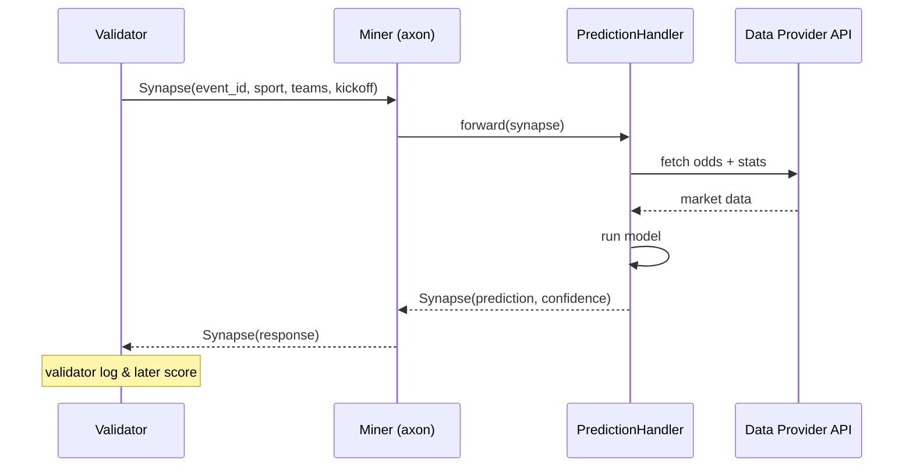

# 🤖 Programmatic Trade Execution

:::info Goal Unit Ini
Setelah unit ini kamu akan:
- Paham **shape request/response** antara validator dan miner di SN41
- Implement **prediction handler** di Python dengan clean architecture
- Integrasi ke **sports data API** (The Odds API / Sportradar / scraping Pinnacle conceptually)
- Tangani **timeout, rate limit, dan error** secara gracefully
- Tambah **structured logging** supaya bisa debug performance
- Punya prediksi baseline yang bisa di-score validator (sebelum improve strategy di Unit 7)
:::

:::note Prasyarat
- ✅ [Unit 5 — Miner Init & Metadata](./miner-init-metadata) selesai — miner running, validator query sudah masuk
- ✅ Python fundamentals (async, dataclass, try/except)
- ✅ Akses ke minimal **satu sports data API** (The Odds API free tier — [the-odds-api.com](https://the-odds-api.com))
:::

---

## 🧭 Shape Validator ↔ Miner Protocol

Bittensor pakai **bt.Synapse** (object dataclass) untuk serialize request/response. Sportstensor mendefinisikan synapse spesifik — struktur konseptual:



### Request (dari validator)

```python
# Contoh shape (field exact: lihat dokumentasi resmi sportstensor repo)
class PredictionRequest(bt.Synapse):
    event_id: str              # "mlb_2026_04_14_NYY_BOS"
    sport: str                 # "mlb" / "nba" / "nfl" / "soccer"
    home_team: str             # "NYY"
    away_team: str             # "BOS"
    kickoff_utc: str           # ISO8601
    league: str | None = None
    # response fields
    prediction: dict | None = None
    confidence: float | None = None
```

### Response (dari miner)

`prediction` dict format umum:

```python
{
  "home_win": 0.58,
  "away_win": 0.35,
  "draw": 0.07,              # untuk sport yang support draw
  "total_over_under": 8.5,   # optional, sport tertentu
  "stake_suggestion": 0.02   # fraction kelly, optional
}
```

`confidence` float `[0.0, 1.0]` — seberapa yakin model kamu.

:::warning Shape exact bisa berubah
Check `synapse.py` atau `protocol.py` di repo Sportstensor untuk field dan tipe persis. Contoh di atas adalah template umum. **Lihat dokumentasi resmi** selalu.
:::

---

## 🏗️ Step 1 — Scaffold Handler

Struktur folder yang kita buat:

```text
sportstensor/
├── neurons/
│   └── miner.py            (sudah ada — entrypoint)
├── src/
│   ├── handler.py          (BARU — orchestrator)
│   ├── predictors/
│   │   ├── baseline.py     (BARU — simple implied-odds)
│   │   └── registry.py     (BARU — pilih predictor per sport)
│   └── data/
│       ├── odds_api.py     (BARU — wrapper The Odds API)
│       └── cache.py        (BARU — in-memory LRU)
└── tests/
    └── test_handler.py
```

### `src/data/odds_api.py`

```python
"""Wrapper untuk The Odds API (https://the-odds-api.com).
Free tier: 500 requests/bulan — cukup untuk dev, upgrade kalau production.
"""
from __future__ import annotations
import os
import time
import logging
from typing import Any
import httpx

log = logging.getLogger(__name__)

BASE_URL = "https://api.the-odds-api.com/v4"


class OddsAPIClient:
    def __init__(self, api_key: str | None = None, timeout: float = 4.0):
        self.api_key = api_key or os.getenv("ODDS_API_KEY")
        if not self.api_key:
            raise RuntimeError("ODDS_API_KEY not set in env")
        self.timeout = timeout
        self._client = httpx.Client(timeout=timeout)

    def get_event_odds(
        self,
        sport_key: str,
        event_id: str,
        regions: str = "us,eu",
        markets: str = "h2h",
    ) -> dict[str, Any] | None:
        """Fetch odds untuk satu event. Return None kalau tidak ditemukan."""
        url = f"{BASE_URL}/sports/{sport_key}/events/{event_id}/odds"
        params = {"apiKey": self.api_key, "regions": regions, "markets": markets}
        try:
            r = self._client.get(url, params=params)
            r.raise_for_status()
            return r.json()
        except httpx.HTTPStatusError as e:
            log.warning("OddsAPI HTTP %s for %s", e.response.status_code, event_id)
            return None
        except httpx.TimeoutException:
            log.warning("OddsAPI timeout for %s", event_id)
            return None
        except Exception as e:
            log.exception("OddsAPI unexpected error: %s", e)
            return None
```

### `src/data/cache.py`

```python
"""Simple TTL cache supaya tidak hit data API berkali-kali untuk query validator yg sama."""
from __future__ import annotations
import time
from collections import OrderedDict
from typing import Any


class TTLCache:
    def __init__(self, max_size: int = 1024, ttl_seconds: int = 60):
        self.max_size = max_size
        self.ttl = ttl_seconds
        self._d: OrderedDict[str, tuple[float, Any]] = OrderedDict()

    def get(self, key: str) -> Any | None:
        item = self._d.get(key)
        if not item:
            return None
        ts, val = item
        if time.time() - ts > self.ttl:
            self._d.pop(key, None)
            return None
        self._d.move_to_end(key)
        return val

    def set(self, key: str, value: Any) -> None:
        self._d[key] = (time.time(), value)
        self._d.move_to_end(key)
        while len(self._d) > self.max_size:
            self._d.popitem(last=False)
```

---

## 🧮 Step 2 — Baseline Predictor

Baseline sederhana: convert odds ke **implied probability** lalu normalize. Tidak akan beat pasar, tapi jadi fallback safe dan starting point.

### `src/predictors/baseline.py`

```python
"""Baseline predictor: implied probability dari market odds (h2h).
Kalau market efisien, ini sudah cukup untuk dapat CLV netral-ish.
Improve di Unit 7 dengan ML / feature engineering.
"""
from __future__ import annotations
import logging
from typing import Any

log = logging.getLogger(__name__)


def american_to_prob(odds: int) -> float:
    """Convert American odds to implied probability."""
    if odds >= 100:
        return 100 / (odds + 100)
    return -odds / (-odds + 100)


def decimal_to_prob(odds: float) -> float:
    return 1.0 / odds


def normalize(probs: dict[str, float]) -> dict[str, float]:
    """Buang margin bookmaker (vig), scale ke sum=1."""
    s = sum(probs.values())
    if s <= 0:
        return probs
    return {k: v / s for k, v in probs.items()}


def predict_from_odds(odds_payload: dict[str, Any]) -> dict[str, float] | None:
    """Extract best h2h odds dari multiple bookmakers, return normalized probs."""
    if not odds_payload or "bookmakers" not in odds_payload:
        return None

    # Sederhana: ambil rata-rata decimal odds dari semua bookmaker
    home_odds, away_odds, draw_odds = [], [], []
    for bm in odds_payload["bookmakers"]:
        for market in bm.get("markets", []):
            if market["key"] != "h2h":
                continue
            for o in market["outcomes"]:
                name = o["name"]
                price = o["price"]  # asumsikan decimal
                if name == odds_payload.get("home_team"):
                    home_odds.append(price)
                elif name == odds_payload.get("away_team"):
                    away_odds.append(price)
                else:
                    draw_odds.append(price)

    if not home_odds or not away_odds:
        log.warning("Insufficient odds data for %s", odds_payload.get("id"))
        return None

    probs = {
        "home_win": sum(decimal_to_prob(o) for o in home_odds) / len(home_odds),
        "away_win": sum(decimal_to_prob(o) for o in away_odds) / len(away_odds),
    }
    if draw_odds:
        probs["draw"] = sum(decimal_to_prob(o) for o in draw_odds) / len(draw_odds)

    return normalize(probs)
```

### `src/predictors/registry.py`

```python
"""Router: pilih predictor berdasarkan sport."""
from __future__ import annotations
from .baseline import predict_from_odds


PREDICTORS = {
    "mlb": predict_from_odds,
    "nba": predict_from_odds,
    "nfl": predict_from_odds,
    "soccer": predict_from_odds,
}


def get_predictor(sport: str):
    return PREDICTORS.get(sport.lower(), predict_from_odds)
```

---

## 🧵 Step 3 — Main Handler (Orchestrator)

### `src/handler.py`

```python
"""PredictionHandler: dipanggil dari neurons/miner.py forward().
Timeout budget: ~2 detik total (validator biasanya timeout di 3–5s).
"""
from __future__ import annotations
import asyncio
import logging
import time
from typing import Any

from .data.odds_api import OddsAPIClient
from .data.cache import TTLCache
from .predictors.registry import get_predictor

log = logging.getLogger(__name__)

SPORT_KEY_MAP = {
    "mlb": "baseball_mlb",
    "nba": "basketball_nba",
    "nfl": "americanfootball_nfl",
    "soccer": "soccer_epl",   # contoh EPL; extend per league
}


class PredictionHandler:
    def __init__(self):
        self.odds = OddsAPIClient()
        self.cache = TTLCache(max_size=2048, ttl_seconds=45)

    def handle(self, req: Any) -> dict[str, Any]:
        """Main entry. Input: PredictionRequest synapse. Output: dict response."""
        t0 = time.monotonic()
        event_id = getattr(req, "event_id", "unknown")
        sport = getattr(req, "sport", "unknown")

        try:
            # 1. cache check
            cache_key = f"{sport}:{event_id}"
            cached = self.cache.get(cache_key)
            if cached:
                log.debug("Cache hit for %s", cache_key)
                return cached

            # 2. fetch data
            sport_key = SPORT_KEY_MAP.get(sport.lower())
            if not sport_key:
                return self._fallback(reason=f"unsupported sport {sport}")

            odds_payload = self.odds.get_event_odds(sport_key, event_id)
            if not odds_payload:
                return self._fallback(reason="odds_api_miss")

            # attach team names to payload for predictor
            odds_payload.setdefault("home_team", getattr(req, "home_team", None))
            odds_payload.setdefault("away_team", getattr(req, "away_team", None))

            # 3. predict
            predictor = get_predictor(sport)
            probs = predictor(odds_payload)
            if not probs:
                return self._fallback(reason="predictor_none")

            # 4. compute confidence: spread antara top pick vs runner-up
            sorted_probs = sorted(probs.values(), reverse=True)
            confidence = min(1.0, (sorted_probs[0] - sorted_probs[1]) * 2) if len(sorted_probs) >= 2 else 0.5

            response = {
                "prediction": probs,
                "confidence": round(confidence, 3),
                "stake_suggestion": round(min(0.05, confidence * 0.1), 4),
            }

            self.cache.set(cache_key, response)
            elapsed_ms = int((time.monotonic() - t0) * 1000)
            log.info("Predicted %s in %dms: %s (conf=%.2f)",
                     event_id, elapsed_ms, probs, confidence)
            return response

        except Exception as e:
            log.exception("Handler crash for %s: %s", event_id, e)
            return self._fallback(reason="exception")

    def _fallback(self, reason: str) -> dict[str, Any]:
        """Kalau apa pun gagal, return uniform prior + confidence 0.
        Uniform prior = tidak merugikan scoring (50/50 atau 33/33/33).
        Confidence 0 = validator tahu kita tidak yakin."""
        log.warning("Fallback triggered: %s", reason)
        return {
            "prediction": {"home_win": 0.5, "away_win": 0.5},
            "confidence": 0.0,
            "stake_suggestion": 0.0,
        }
```

---

## 🔌 Step 4 — Wire ke `neurons/miner.py`

Edit `forward()` function miner (exact signature lihat repo — umumnya seperti ini):

```python
# neurons/miner.py (excerpt)
from src.handler import PredictionHandler

class Miner(BaseNeuron):
    def __init__(self, config=None):
        super().__init__(config)
        self.handler = PredictionHandler()

    async def forward(self, synapse):
        """Dipanggil tiap validator query masuk."""
        result = self.handler.handle(synapse)
        synapse.prediction = result["prediction"]
        synapse.confidence = result["confidence"]
        return synapse

    async def blacklist(self, synapse):
        """Filter: reject query dari non-validator."""
        caller_hotkey = synapse.dendrite.hotkey
        # pastikan caller ada di metagraph & punya stake minimum
        if caller_hotkey not in self.metagraph.hotkeys:
            return True, "not in metagraph"
        uid = self.metagraph.hotkeys.index(caller_hotkey)
        if self.metagraph.S[uid] < 1000:  # min 1000 TAO stake = validator sah
            return True, "stake too low"
        return False, "ok"
```

:::tip Blacklist penting
Tanpa blacklist, spam request bisa flood miner kamu. **Minimal stake threshold** adalah filter standar.
:::

---

## ⏱️ Step 5 — Timeout & Error Handling

### Rules of thumb

| Budget | Recommended |
|---|---|
| Total response time | `< 2.5s` |
| Data API call | `< 1.5s` timeout |
| Prediction compute | `< 0.5s` |
| Fallback latency | `< 50ms` |

### Gunakan async + semaphore

Kalau kamu load-test dan 10+ query per detik:

```python
import asyncio

SEM = asyncio.Semaphore(32)  # max 32 concurrent

async def forward(self, synapse):
    async with SEM:
        result = await asyncio.wait_for(
            asyncio.to_thread(self.handler.handle, synapse),
            timeout=2.0
        )
        synapse.prediction = result["prediction"]
        synapse.confidence = result["confidence"]
        return synapse
```

### Rate limit sports API

The Odds API free tier = 500 req/bulan. Pakai cache agresif + hanya hit saat benar-benar butuh.

```python
# di OddsAPIClient, hitung quota
self._quota_used = 0

def get_event_odds(self, ...):
    if self._quota_used > 450:
        log.warning("API quota near limit, returning None")
        return None
    # ...
    self._quota_used += 1
```

---

## 📊 Step 6 — Structured Logging & Observability

### JSON logging

```python
# src/logging_setup.py
import logging
import json
import sys

class JSONFormatter(logging.Formatter):
    def format(self, record):
        payload = {
            "ts": self.formatTime(record, "%Y-%m-%dT%H:%M:%S"),
            "level": record.levelname,
            "logger": record.name,
            "msg": record.getMessage(),
        }
        if record.exc_info:
            payload["exc"] = self.formatException(record.exc_info)
        return json.dumps(payload)


def setup():
    h = logging.StreamHandler(sys.stdout)
    h.setFormatter(JSONFormatter())
    root = logging.getLogger()
    root.handlers = [h]
    root.setLevel(logging.INFO)
```

Log JSON memudahkan parse di ELK / Loki / CloudWatch.

### Metrik yang wajib log per request

```python
log.info("prediction_complete", extra={
    "event_id": event_id,
    "sport": sport,
    "latency_ms": elapsed_ms,
    "confidence": confidence,
    "cache_hit": bool(cached),
    "fallback": False,
})
```

### Ringkas performa harian

```bash
grep prediction_complete logs/miner.log \
  | jq -r '[.latency_ms, .fallback] | @csv' \
  | awk -F, '{sum+=$1; if($2=="true") fb++} END {print "avg_ms="sum/NR, "fallback_rate="fb/NR}'
```

---

## 🧪 Checkpoint Validation

Tes handler kamu **tanpa menunggu validator**:

```python
# tests/test_handler.py
from src.handler import PredictionHandler

class FakeReq:
    event_id = "test_event_1"
    sport = "mlb"
    home_team = "New York Yankees"
    away_team = "Boston Red Sox"
    kickoff_utc = "2026-04-14T23:05:00Z"

def test_happy_path():
    h = PredictionHandler()
    out = h.handle(FakeReq())
    assert "prediction" in out
    assert 0.0 <= out["confidence"] <= 1.0
    assert abs(sum(out["prediction"].values()) - 1.0) < 0.05
```

Run:

```bash
pytest tests/test_handler.py -v
```

:::tip Screenshot untuk graduation
Simpan:
1. Log JSON 1 prediksi sukses (event_id, latency_ms, confidence)
2. Output `pytest` yang hijau
3. 5–10 line log menunjukkan validator query → response sent
:::

---

## 🎯 Rangkuman

- ✅ Paham struktur Synapse protocol Sportstensor
- ✅ Scaffold handler + data wrapper + cache
- ✅ Baseline predictor pakai implied probability dari odds API
- ✅ Fallback graceful + blacklist non-validator
- ✅ Timeout budget `< 2.5s` + async/semaphore
- ✅ Structured JSON logging siap di-parse

### ✅ Quick Check

1. Apa peran `blacklist()` function di miner?
2. Kenapa butuh TTL cache di depan API eksternal?
3. Apa strategi fallback saat data API timeout?
4. Kenapa confidence `0.0` lebih baik daripada confidence tinggi saat tidak yakin?
5. Budget total response time yang aman?

### 🐛 Troubleshooting

| Gejala | Fix |
|---|---|
| `ODDS_API_KEY not set` | `source .env` sebelum run, atau restart PM2 |
| Latency spike > 3s | Profile: biasanya API call. Add timeout + cache |
| Confidence selalu 0 | Baseline return None → fallback. Cek response Odds API |
| 429 Too Many Requests | Pakai cache; upgrade tier API; throttle dengan semaphore |
| Validator disconnect mid-query | Network glitch — retry handled by validator, jangan panic |
| Response malformed | Cek Synapse protocol resmi — field mungkin beda nama |

:::warning Jangan over-engineer dulu
Baseline implied-odds + cache + fallback sudah **cukup** untuk mulai. Di Unit 7 kita akan naik level dengan ML model. **Jalan dulu, optimasi kemudian.**
:::

---

**Next:** [Unit 7 — Trading Strategies →](./trading-strategies)
