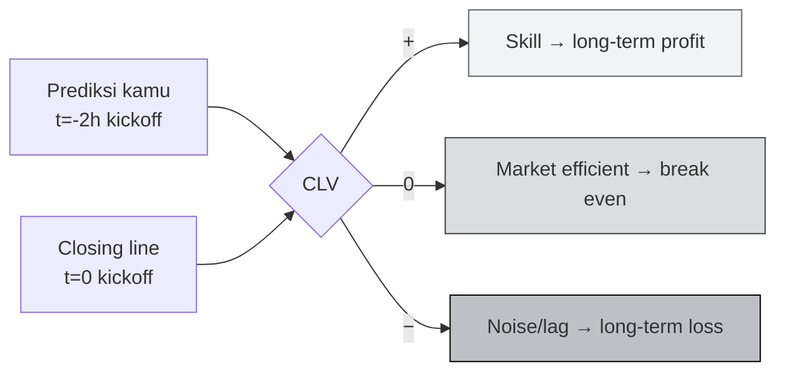
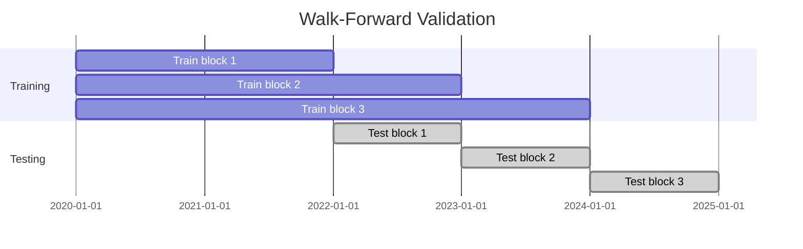
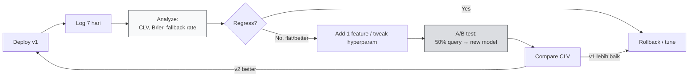

# 📊 Trading Strategies

:::info Goal Unit Ini
Setelah unit ini kamu akan:
- Paham **Closing Line Value (CLV)** sebagai north-star metric miner Sportstensor
- Kenal 3 **strategy archetypes**: statistical model, arbitrage, sharp book tailing
- Tahu **feature** apa yang berguna (form, injury, weather, line movement)
- Mampu **backtest** strategi pakai walk-forward methodology
- Paham **risk management** via confidence calibration
- Punya **iteration loop** yang terukur: analyze → adjust → redeploy
:::

:::note Prasyarat
- ✅ [Unit 6 — Programmatic Trade Execution](./06-programmatic-trade-execution) selesai — handler baseline sudah jalan
- ✅ Miner sudah running 24/7 + logging aktif minimal 48 jam (biar ada data evaluasi)
- ✅ Basic Python data science: `pandas`, `numpy`, idealnya `scikit-learn`
- ✅ Minimal 1 sumber **historical odds + outcomes** (kaggle / scraped / API trial)
:::

---

## 🎯 North-Star: Closing Line Value (CLV)

### Definisi

**Closing Line Value** = selisih (%) antara odds prediksi kamu vs odds closing (tepat sebelum kickoff). Positif berarti prediksi kamu lebih akurat dari pasar final.

```text
CLV = (implied_prob_mu - closing_implied_prob) / closing_implied_prob
```

Contoh:
- Prediksi kamu (2 jam sebelum kickoff): `home_win = 0.60`
- Closing line market: `home_win = 0.55`
- CLV = `(0.60 - 0.55) / 0.55 = +9.1%`

:::tip Kenapa CLV, bukan win rate?
**Win rate bisa bohong.** Kamu bisa 55% betul hanya karena favorite sering menang. Tapi kalau closing line sudah 70% favorite, prediksi kamu `65%` = CLV **negatif** (pasar "tahu lebih"). Konsisten beat closing = skill nyata.
:::



**Target awal realistis:** CLV rata-rata **+1–3%** setelah 100+ prediksi. Di atas +5% konsisten = elite miner.

---

## 🧬 Strategy Archetypes

Tiga arketipe utama — pilih satu, kuasai, baru ekspansi.

### 1. Statistical Model (paling umum untuk beginner)

Build model sendiri pakai data historis. Arsitektur favorit:

#### a. Elo-based rating

Setiap tim punya rating Elo; update tiap game. Prediksi = fungsi logistik dari selisih rating.

```python
# src/predictors/elo.py
import math

class EloModel:
    def __init__(self, k: float = 20, home_adv: float = 60):
        self.ratings: dict[str, float] = {}
        self.k = k
        self.home_adv = home_adv

    def rating(self, team: str) -> float:
        return self.ratings.get(team, 1500.0)

    def predict(self, home: str, away: str) -> float:
        diff = self.rating(home) + self.home_adv - self.rating(away)
        return 1.0 / (1 + 10 ** (-diff / 400))

    def update(self, home: str, away: str, home_score: int, away_score: int):
        p_home = self.predict(home, away)
        result = 1.0 if home_score > away_score else 0.0 if home_score < away_score else 0.5
        delta = self.k * (result - p_home)
        self.ratings[home] = self.rating(home) + delta
        self.ratings[away] = self.rating(away) - delta
```

Simple, cepat, dan punya **baseline yang sulit dikalahkan untuk sport dengan home-field advantage jelas** (MLB, NBA, NFL).

#### b. ML regression (logistic / gradient boosting)

Feature-based. Contoh stack:

```python
# src/predictors/gbm.py
from sklearn.ensemble import GradientBoostingClassifier
import numpy as np

FEATURES = [
    "home_elo", "away_elo",
    "home_form_last10", "away_form_last10",
    "home_rest_days", "away_rest_days",
    "home_injury_index", "away_injury_index",
    "travel_km",
    "market_line_open",   # line saat market buka
    "line_move_pct",      # pergerakan sejak open
]

class GBMPredictor:
    def __init__(self):
        self.model = GradientBoostingClassifier(
            n_estimators=200,
            max_depth=4,
            learning_rate=0.05,
            random_state=42,
        )

    def fit(self, X: np.ndarray, y: np.ndarray):
        self.model.fit(X, y)

    def predict_proba(self, X: np.ndarray) -> np.ndarray:
        return self.model.predict_proba(X)
```

Latihan: train di 2–3 musim historical, validate di season berikutnya (walk-forward — lihat di bawah).

#### c. Deep learning (advanced)

LSTM/Transformer untuk line movement time-series. **Hanya worth it** kalau kamu punya 5+ musim data granular per menit. Untuk 90% miner, GBM sudah cukup.

---

### 2. Arbitrage

Cari diskrepansi antar bookmaker: kalau book A set `home 2.10` dan book B set `away 2.10`, ada arbitrage window (jarang, tapi exists).

**Untuk miner SN41:** arbitrage tidak langsung → kamu infer "true" probability dari **average sharp book** lalu bet against soft books.

```python
# konsep
def sharp_consensus(odds_list: list[dict]) -> float:
    """Weighted average implied prob, bobot lebih tinggi utk sharp books (Pinnacle, Circa)."""
    weights = {"Pinnacle": 3.0, "Circa": 2.5, "Betfair_Exchange": 2.0}
    total_w, total_wp = 0.0, 0.0
    for o in odds_list:
        w = weights.get(o["book"], 1.0)
        p = 1.0 / o["decimal_odds"]
        total_w += w
        total_wp += w * p
    return total_wp / total_w if total_w else 0.0
```

**Pro:** high accuracy kalau data fresh.
**Con:** bergantung ke availability dan latensi data API.

---

### 3. Sharp Book Tailing

Pinnacle, Circa, dan Betfair exchange punya **lowest margin** → harga mereka closest to true. Strategi: pakai harga Pinnacle sebagai "oracle", prediksi miner kamu = Pinnacle probability ± small adjustment.

**Ini strategi paling *simple-but-effective* untuk pemula.** Hampir guaranteed CLV ≈ 0 (kamu tidak beat closing, tapi juga tidak loss). Dari sini tambah feature untuk dapat edge.

```python
def pinnacle_tail(pinnacle_odds: float, edge_bps: int = 0) -> float:
    """Return implied prob, optionally adjusted by edge_bps basis points."""
    base = 1.0 / pinnacle_odds
    return base + (edge_bps / 10000)
```

:::warning Pinnacle scraping
Pinnacle **tidak punya API resmi untuk public retail**. Scraping mereka melanggar ToS mereka. Alternatif legal: pakai agregator yang sudah punya partnership (lihat dokumentasi resmi The Odds API — ada tier yang include Pinnacle).
:::

---

## 🔬 Feature Engineering

Feature yang konsisten berguna lintas sport:

| Feature | Deskripsi | Sumber data |
|---|---|---|
| **Elo rating** | Rolling rating per tim | Hitung dari historical scores |
| **Form last 10** | Win rate 10 game terakhir | Scoreboards |
| **Rest days** | Hari sejak game terakhir | Schedule |
| **Travel km** | Jarak tempuh ke venue | Airport + venue coords |
| **Injury index** | Weighted sum key player injury | ESPN / team reports |
| **Weather** | Outdoor sports: wind, rain, temp | OpenWeatherMap |
| **Referee bias** | Stat per wasit (NBA, soccer) | Historical box scores |
| **Line open → move** | Pergerakan odds sejak market buka | Odds API historical |
| **Steam moves** | Big sudden line shift = sharp money | Monitor odds stream |
| **Public %** | % bettor memihak X | Action Network / public data |

:::tip Minimum viable features
Untuk first ML model, 5 feature sudah OK:
1. `home_elo - away_elo`
2. `home_rest - away_rest`
3. `home_form_10 - away_form_10`
4. `market_line_implied_prob`
5. `line_move_pct_last_24h`

Jangan over-feature di awal. **Curse of dimensionality** lebih sering bikin loss daripada feature rich bikin gain.
:::

---

## 🧪 Backtesting: Walk-Forward Validation

Jangan pernah backtest dengan random train/test split — itu **data leak**. Pakai walk-forward:



### Implementasi

```python
# backtest.py
import pandas as pd
from sklearn.metrics import brier_score_loss

def walk_forward_backtest(df: pd.DataFrame, model_cls, feature_cols: list[str], target_col: str):
    df = df.sort_values("game_date").reset_index(drop=True)
    # split per musim
    seasons = df["season"].unique()
    results = []
    for i in range(2, len(seasons)):
        train = df[df["season"].isin(seasons[:i])]
        test = df[df["season"] == seasons[i]]
        model = model_cls()
        model.fit(train[feature_cols].values, train[target_col].values)
        p = model.predict_proba(test[feature_cols].values)[:, 1]
        # metrics
        brier = brier_score_loss(test[target_col].values, p)
        clv = compute_clv(p, test["closing_implied_prob"].values)
        results.append({
            "test_season": seasons[i],
            "n": len(test),
            "brier": brier,
            "clv_mean": clv.mean(),
            "clv_median": clv.median() if hasattr(clv, 'median') else float(pd.Series(clv).median()),
        })
    return pd.DataFrame(results)


def compute_clv(pred_prob: pd.Series, closing_prob: pd.Series) -> pd.Series:
    return (pred_prob - closing_prob) / closing_prob
```

### Metrik yang wajib dilihat

| Metric | Target | Arti |
|---|---|---|
| **Brier score** | `< 0.24` | Calibration error; lower = better |
| **CLV mean** | `> 0` | Average edge vs closing line |
| **CLV hit rate** | `> 52%` | % prediksi yg beat closing |
| **Log loss** | `< 0.66` | Alternative to Brier |

Kalau backtest 3 musim konsisten CLV > 0 → baru worth deploy ke mainnet.

---

## 🎚️ Risk Management: Confidence Calibration

Confidence kamu harus **mean what it says.** Kalau kamu output `confidence=0.8`, maka harus terbukti benar ~80% dari waktu di data backtest.

### Cek calibration (reliability diagram)

```python
import numpy as np
import matplotlib.pyplot as plt

def reliability_diagram(y_true, y_prob, n_bins=10):
    bins = np.linspace(0, 1, n_bins + 1)
    idx = np.digitize(y_prob, bins) - 1
    accuracies, confidences = [], []
    for b in range(n_bins):
        mask = idx == b
        if mask.sum() > 0:
            accuracies.append(y_true[mask].mean())
            confidences.append(y_prob[mask].mean())
    plt.plot([0,1],[0,1],"k--", label="perfect")
    plt.scatter(confidences, accuracies, label="model")
    plt.xlabel("confidence"); plt.ylabel("actual accuracy")
    plt.legend(); plt.show()
```

### Platt scaling / isotonic regression kalau miscalibrated

```python
from sklearn.calibration import CalibratedClassifierCV
cal = CalibratedClassifierCV(base_model, method="isotonic", cv=3)
cal.fit(X_train, y_train)
```

### Jangan over-bet pas confidence rendah

Di handler, clamp output:

```python
def safe_confidence(raw_conf: float, sample_size: int) -> float:
    # shrink ke 0.5 kalau data insufficient
    if sample_size < 100:
        return 0.5 + (raw_conf - 0.5) * 0.3
    return raw_conf
```

:::danger Overconfidence = emission loss
Validator score miss kamu lebih keras saat confidence tinggi. Salah dengan conf 0.9 > salah dengan conf 0.55. **Under-promise over-deliver** lebih menguntungkan.
:::

---

## 🔁 Iteration Loop

Iterasi weekly adalah tempo sehat:



### Weekly review checklist

1. **Log ingestion**: `grep prediction_complete logs/*.log | jq > week.jsonl`
2. **Metrics**: compute CLV mean/median, Brier, fallback rate
3. **Breakdown per sport**: kadang kamu kuat di MLB tapi bleed di NBA — drop sport yang negatif
4. **Validator feedback**: cek posisi rank di metagraph, trend emission
5. **Decide**: hold / rollback / experiment

### A/B testing di production

Jalankan 2 model paralel dengan query routing 50/50 via hash(event_id):

```python
import hashlib

def route(event_id: str) -> str:
    h = int(hashlib.md5(event_id.encode()).hexdigest(), 16)
    return "v2" if h % 2 == 0 else "v1"
```

Log variant, compute CLV per variant setelah 200+ event.

---

## 🧰 Stack Lengkap yang Recommended

| Layer | Pilihan |
|---|---|
| **Data API** | The Odds API (free → paid), Sportradar (trial) |
| **Storage** | PostgreSQL / SQLite untuk historical, Redis untuk cache |
| **ML** | scikit-learn, XGBoost, LightGBM |
| **Backtest** | pandas + custom walk-forward |
| **Monitoring** | Grafana + Prometheus (scrape custom `/metrics`) |
| **Alerting** | Simple: cron + script → Telegram bot saat CLV drop |

---

## 🧪 Checkpoint Validation

### Minggu 1 (baseline deployed)

- [ ] Handler v1 (baseline implied odds) jalan 7 hari
- [ ] Log min 100 prediksi tercatat
- [ ] CLV mean bisa dihitung (boleh ≈ 0 atau slightly negative — ini baseline)

### Minggu 2 (Elo / GBM v1)

- [ ] Feature pipeline jadi (minimal 5 features)
- [ ] Walk-forward backtest 3 musim sukses
- [ ] Model v1 deployed, A/B test vs baseline

### Minggu 3 (calibration & expansion)

- [ ] Reliability diagram terlihat near-diagonal
- [ ] CLV mean konsisten > 0 di 1+ sport
- [ ] Drop sport negatif atau tambah feature

:::tip Screenshot untuk graduation
Kumpulan untuk submission akhir:
1. CSV / tabel CLV weekly report
2. Reliability diagram (model kamu)
3. Backtest walk-forward output (Brier per musim)
4. Metagraph screenshot dengan UID kamu + trust/emission > 0
:::

---

## 🎯 Rangkuman

- ✅ CLV sebagai north-star metric (bukan win rate)
- ✅ Tiga archetype: statistical (Elo/GBM), arbitrage, sharp tailing
- ✅ Feature engineering yang minimum-viable (5 feature > 50 feature random)
- ✅ Walk-forward backtest (jangan random split)
- ✅ Calibration: confidence harus match actual accuracy
- ✅ Weekly iteration loop dengan A/B testing

### ✅ Quick Check

1. Kenapa CLV > win rate sebagai metric?
2. Apa beda walk-forward vs random train/test split?
3. Apa risiko overconfidence di output miner?
4. Kenapa pemula disarankan pilih 1 sport dulu?
5. Brier score target yang sehat?

### 🐛 Troubleshooting

| Gejala | Solusi |
|---|---|
| Backtest bagus, live jelek | Data leak — cek apakah feature masa depan bocor ke training |
| CLV negatif konsisten | Lag data — prediksi kamu terbit setelah line sudah bergerak |
| Model overfit | Kurangi `max_depth`, tambah regularization, train size lebih besar |
| Calibration off tapi accuracy oke | Pakai isotonic regression post-hoc |
| Rank miner stuck / menurun | Validator mungkin update scoring — cek changelog subnet |
| Quota Odds API jebol | Cache aggressively, upgrade tier, atau kombinasikan dengan scraper legal |

:::warning Jangan chase noise
1 minggu performa jelek bukan berarti strategi failed. Minimum **30 hari** sebelum decision rollback. Terlalu banyak iterasi = overfitting ke noise baru.
:::

---

## 🏁 Graduation Submission (akhir Guided Project I)

Kumpulkan evidence berikut dalam 1 folder `submission-gp1/`:

1. Screenshot `btcli wallet list`
2. Screenshot `btcli subnet register` output (UID assigned)
3. Screenshot `btcli subnet metagraph --netuid 41` dengan UID kamu terlihat
4. Screenshot Almanac binding response / verification
5. Screenshot `pm2 status` (miner online)
6. Log snippet minimal 10 validator query → response sukses
7. CLV weekly report (CSV atau screenshot tabel)
8. Reliability diagram PNG
9. Short write-up (1 halaman): strategi yang dipakai + hasil minggu pertama

Submit ke organizer ETHJKT / HackQuest Indonesia sesuai instruksi kanal submission.

---

**Selamat!** 🎉 Kamu sudah menyelesaikan Guided Project I — Sportstensor SN41. Lanjut ke GP-II untuk belajar mining di subnet data-provision:

**Next:** [GP-II Unit 1 — Intro ke Subnet SN13 Data Universe →](../GP-2-Data-Universe-SN13/01-intro-sn13)
