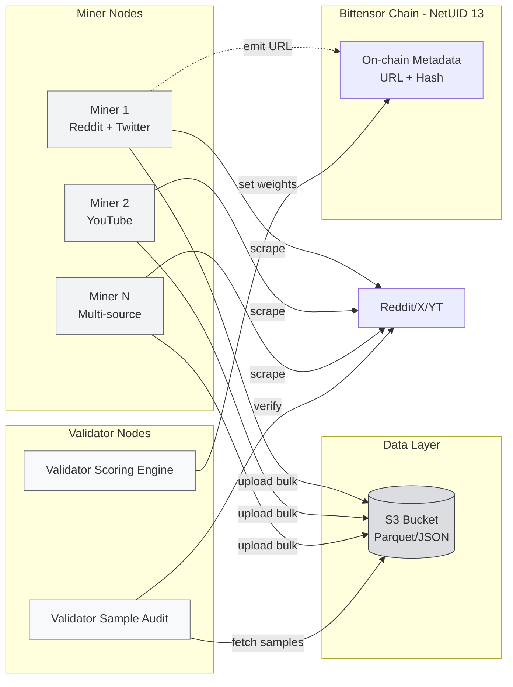
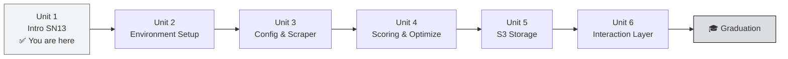

# 📊 Unit 1 — Introduction to SN13 Data Universe

:::info Goal Unit Ini
Setelah menyelesaikan unit ini, kamu akan:
- Paham **mission & raison d'être** Data Universe (SN13) di ekosistem Bittensor
- Tahu **arsitektur miner ↔ validator** dan alur data pipeline SN13
- Mengerti kenapa **data is the new oil** untuk AI training (call-back ke Phase 0 Unit 2)
- Bisa menghitung kasar **hardware & bandwidth budget** sebelum deploy
- Tahu **perbedaan fundamental** SN13 vs SN41 (storage-heavy vs compute-light)
:::

:::note Prasyarat
Sebelum lanjut, pastikan kamu sudah selesaikan:
- ✅ **Phase 0** lengkap (Web3, AI, Decentralized AI, Kenapa Bittensor)
- ✅ **Phase 1 Concept I & II** (Core Concepts, Tokenomics, Core Subnets)
- ✅ **Phase 2 GP-1** — Sportstensor (SN41) sampai miner running
- ✅ Punya **coldkey/hotkey wallet**, paham `btcli`, paham miner lifecycle
:::

---

## 🌌 Kenapa Data Universe Ada?

Kalau kamu sudah baca Phase 0 Unit 2, kamu tahu bahwa **AI modern (LLM, vision, reasoning model) butuh data dalam jumlah yang gila-gilaan.** GPT-4 ditraining dengan puluhan TB teks. LLaMA 3 pakai 15T token. Gemini butuh multimodal corpus: text + video + audio + code.

Tapi ada masalah klasik di dunia AI centralized:

| Problem | Dampak |
|---------|--------|
| **Data terkunci di platform besar** | Reddit, Twitter/X, YouTube charge fee jutaan USD per bulan untuk API akses |
| **Scraping unilateral rentan banned** | Single IP ketahuan → rate-limited → data pipeline mati |
| **Fresh data sangat mahal** | Training dengan data 6 bulan lalu = model stale |
| **Centralized vendor lock-in** | Data provider single point of failure (contoh: Twitter cut off academic API 2023) |

**Data Universe (SN13)** menyelesaikan ini dengan prinsip Bittensor: **decentralize the data layer.** Ratusan miner di seluruh dunia scraping → upload → validator audit → reward yang kontribusi data paling fresh, unique, dan valid.

:::tip Framing Sederhana
SN13 itu seperti **"Uber untuk data scraping"**: siapa saja (dengan storage + bandwidth) bisa jadi supplier, validator jadi auditor kualitas, dan pembeli (AI developer) dapat akses ke data pool terdesentralisasi tanpa harus bayar ke Reddit/X langsung.
:::

---

## 🧭 Mission Statement SN13

> **Data Universe menyediakan pipeline data yang continuously updated, decentralized, dan auditable untuk training AI generasi berikutnya.**

Tiga sumber data utama yang di-scrape miner saat kurikulum ini ditulis:

1. **Reddit** — teks forum, opini, diskusi niche (subreddit)
2. **Twitter / X** — microblog, trending topics, real-time sentiment
3. **YouTube** — transcript video, metadata channel

:::note Kenapa 3 sumber ini?
Tiga platform ini punya **signal-to-noise ratio** yang bagus untuk training LLM: Reddit punya long-form reasoning, Twitter punya real-time event coverage, YouTube punya multimodal (audio + text). Subnet ini **ekspandable** — di masa depan bisa ditambah source baru lewat governance.
:::

---

## 🏗️ Arsitektur SN13

### Peran Masing-masing Node

**⛏️ Miner — The Data Scrapers**

- Jalan scraper otomatis 24/7 (Reddit/X/YouTube)
- Simpan raw data → compress ke Parquet/JSON.gz
- Upload ke S3-compatible storage (AWS S3 / Cloudflare R2 / Backblaze)
- Emit metadata (URL bucket + hash) on-chain ke subnet
- Respon ke query validator via HTTP endpoint (interaction layer — bahas di Unit 6)

**🛡️ Validator — The Auditors**

- Sampling random dari bucket miner (misal: 1% data)
- Verifikasi ke source asli (apakah tweet ini real? apakah timestamp akurat?)
- Scoring berdasarkan **freshness**, **uniqueness**, **volume**, **validity**, **coverage**
- Set weights on-chain → menentukan emission TAO ke miner

**⛓️ Subnet (NetUID 13)**

- Coordinator on-chain: registry UID, weights, emission
- Bukan tempat data disimpan (chain tetap lightweight) — hanya pointer

---

## 📈 Scoring Sekilas (Full Detail di Unit 4)

Kelima dimensi scoring SN13:

| Dimensi | Bobot Kasar | Artinya |
|---------|-------------|---------|
| 🆕 **Freshness** | Tertinggi (≤ 24 jam best) | Data yang baru di-scrape jauh lebih berharga |
| 🔑 **Uniqueness** | Tinggi | Duplikat dihukum — deduplication critical |
| 📦 **Volume** | Sedang (ada cap) | Banyak data = poin, tapi ada titik diminishing return |
| 🎯 **Coverage** | Sedang | Diversify source (jangan cuma 1 subreddit) |
| ✅ **Validity** | Gate | Kalau validator gagal verify → skor nol |

:::warning Jangan spam!
Miner yang upload data palsu / duplikat / stale akan dapat **score ≈ 0** dan di-deregister setelah immunity period habis. Validator SN13 punya heuristik cross-check yang agresif.
:::

---

## 💻 Hardware Requirements

Berbeda dengan subnet compute-heavy (Chutes, Targon) yang butuh GPU, **SN13 adalah subnet storage-heavy & network-heavy.** GPU **TIDAK** diperlukan.

### Minimum Spec (Baru Mulai)

| Komponen | Spec | Catatan |
|----------|------|---------|
| **OS** | Ubuntu 22.04 LTS | Debian 12 juga bisa |
| **CPU** | 4 vCPU | Scraping I/O-bound, gak butuh banyak core |
| **RAM** | 8 GB | 16 GB lebih aman buat parsing YouTube transcript besar |
| **Storage** | 500 GB SSD (NVMe preferred) | Data rotate, tapi buffer lokal penting |
| **Bandwidth** | 50+ Mbps symmetric | Upload ke S3 bottleneck utama |
| **Public IP / Port** | Terbuka di port miner (default 8091 atau configurable) | Validator butuh reach miner |

### Recommended Spec (Serious Miner)

| Komponen | Spec |
|----------|------|
| **CPU** | 8 vCPU (compress Parquet paralel) |
| **RAM** | 16–32 GB |
| **Storage** | 1 TB NVMe SSD (working set) + S3 unlimited |
| **Bandwidth** | 100 Mbps+ symmetric |
| **Jaringan** | Data center / VPS (bukan home ISP dengan CGNAT) |

:::tip Pro Tip — Indonesia Specific
🇮🇩 **Jangan jalankan miner SN13 dari rumah kalau ISP kamu pakai CGNAT** (Indihome residential biasanya CGNAT, IP kamu di-share). Validator gak bisa reach endpoint kamu → scoring jatuh.

Solusi praktis:
1. **VPS di Singapore** (Vultr, DigitalOcean, Linode) — latency rendah, public IP static, $40–60/bulan
2. **Tunnel via Cloudflare Tunnel / ngrok** kalau insist pakai rumah — tapi risiko koneksi drop
3. **Upgrade ke Indihome Bisnis / Biznet** (static IP available, ~Rp 500rb/bulan)

Dari pengalaman alumni CLC sebelumnya: **VPS Singapore adalah pilihan paling stabil & cost-effective** untuk SN13.
:::

---

## 💰 Ekonomi Kasar Miner SN13

Sebelum kamu deploy, budget kasar bulanan:

| Item | Biaya Bulanan (USD) |
|------|---------------------|
| VPS Vultr 4 vCPU 8 GB 500 GB | ~$40 |
| S3 Storage (Cloudflare R2, 1 TB) | ~$15 |
| Egress bandwidth (R2 = gratis) | $0 |
| Reddit API (free tier cukup awalnya) | $0 |
| Twitter API (pakai library scrape gratis) | $0 |
| **Total** | **~$55/bulan** |

**ROI** sangat tergantung TAO price dan posisi ranking miner. Di rentang bull (TAO > $400), miner top-50 SN13 bisa earn setara $200–500/bulan gross. Tapi ingat: **camp ini bukan get-rich-quick** — goal kamu adalah belajar & graduasi.

:::note Disclaimer
Angka di atas estimasi kasar April 2026. Real earning volatile — bisa lebih tinggi saat subnet emission naik, atau sangat rendah kalau kamu di bawah immunity threshold.
:::

---

## 🆚 SN13 vs SN41 — Kapan Pakai Yang Mana?

Kamu sudah jalan miner SN41. Apa bedanya?

| Aspek | SN41 Sportstensor | SN13 Data Universe |
|-------|-------------------|--------------------|
| **Core work** | Predictive model untuk hasil pertandingan | Scraping & storing raw web data |
| **Hardware bottleneck** | CPU + model inference | Storage + bandwidth |
| **GPU?** | Opsional (buat ML model) | Tidak perlu |
| **Scoring sinyal** | Akurasi prediksi vs actual result | Freshness + uniqueness + validity |
| **Kompleksitas ML** | Tinggi (butuh feature engineering) | Rendah (scraper standard) |
| **Ideal untuk** | ML engineer, data scientist | DevOps, backend engineer, hobbyist dengan storage |

:::tip Dual-Miner Strategy
Banyak graduate CLC jalankan **miner di SN41 dan SN13 bersamaan** di VPS terpisah untuk diversifikasi emission TAO. Tapi untuk graduasi camp, satu miner stabil (yang running saat submission) sudah cukup.
:::

---

## 🗺️ Roadmap 6 Unit GP-2

Berikut alur belajar kita 6 unit ke depan:

Setiap unit punya deliverable praktis — end of Unit 6, kamu sudah punya miner jalan 24/7 dengan data real terupload ke S3 dan ter-audit validator.

---

## 🎯 Rangkuman

- **Data Universe (SN13)** = subnet penyedia data terdesentralisasi untuk training AI (Reddit + Twitter + YouTube)
- NetUID = **13**, mainnet Bittensor
- Miner = scraper + uploader; validator = auditor sampel + scorer
- Scoring 5 dimensi: **freshness, uniqueness, volume, coverage, validity**
- Hardware: **storage-heavy + bandwidth-heavy, no GPU needed** (Ubuntu 22.04, 4 vCPU, 8 GB RAM, 500 GB SSD, 50 Mbps+)
- Total cost operasional ~**$55/bulan** (VPS + R2)
- Indonesia: **VPS Singapore > home ISP** karena CGNAT

### ✅ Quick Check

1. Berapa NetUID Data Universe di mainnet Bittensor?
2. Apakah SN13 butuh GPU? Kenapa?
3. Sebutkan 3 sumber data utama yang di-scrape miner SN13.
4. Apa yang terjadi kalau miner upload data duplikat ke bucket?
5. Kenapa home ISP residential Indonesia biasanya bermasalah jalan miner SN13?

💡 Jawaban

1. **13** — NetUID 13.
2. **Tidak.** Pekerjaan miner adalah I/O-bound (scraping + compress + upload), bukan compute-bound. GPU = waste of money di SN13.
3. **Reddit, Twitter/X, YouTube.**
4. Validator deteksi duplikat → **uniqueness score turun** → reward jatuh; kalau terlalu banyak duplikat, skor total bisa ≈ 0.
5. **CGNAT** — IP publik di-share banyak user, validator gak bisa reach miner endpoint. Butuh public IP static (VPS).

### 🐛 Troubleshooting

| Gejala | Kemungkinan Penyebab | Solusi |
|--------|----------------------|--------|
| "Saya bingung pilih VPS region" | Latency ke Bittensor mainnet & source API | Singapore untuk Indonesia — proxy ke Reddit/X cepat |
| "Storage 500 GB cukup gak?" | Tergantung retention policy | Cukup untuk working buffer; data lama rotate ke S3 |
| "Gaji TAO gak jelas" | Subnet emission fluktuatif | Pakai [taostats.io/subnets/13](https://taostats.io) untuk tracking realtime |

---

**Next:** [Unit 2 — Environment Setup & Deployment →](./environment-setup)

*Data is the new oil. Bittensor is the refinery. 🛢️*
