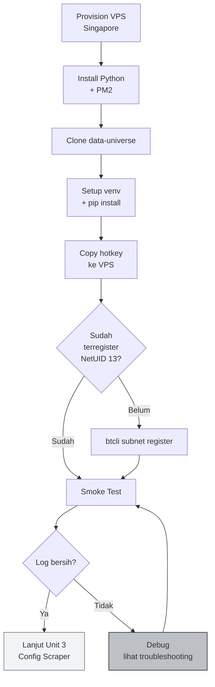

# ⚙️ Unit 2 — Environment Setup & Deployment

:::info Goal Unit Ini
Di akhir unit ini kamu akan:
- Punya **VPS Ubuntu 22.04** siap pakai (Vultr/DigitalOcean/Linode, Singapore region)
- **Python 3.10+, git, pm2** terinstall dan verified
- **Repo `macrocosm-os/data-universe`** ter-clone + dependencies ter-install
- **Hotkey miner** teregister di **NetUID 13** mainnet
- Bisa menjalankan **dry-run / smoke test** miner tanpa error
:::

:::note Prasyarat
- ✅ Selesai [Unit 1 — Introduction to SN13](./01-intro-sn13)
- ✅ Punya **coldkey + hotkey** (dari GP-1)
- ✅ Punya **minimal 0.5 TAO** di coldkey untuk registration fee + reserve
- ✅ Credit card / e-wallet untuk provision VPS (~$40/bulan)
:::

---

## 🖥️ Step 1 — Provision VPS

### Opsi Provider

| Provider | Region SG | Spec Rekomendasi | Harga/bulan |
|----------|-----------|------------------|-------------|
| **Vultr** ⭐ | Singapore | Cloud Compute 4 vCPU / 8 GB / 500 GB NVMe | ~$40 |
| **DigitalOcean** | Singapore SG1 | Basic Droplet Premium AMD, 8 GB | ~$48 |
| **Linode / Akamai** | Singapore | Dedicated 4 GB | ~$36 |
| **Hetzner** | Finland/Germany | CX41 | ~€16 (~$17, tapi latency ke Asia ↑) |

:::tip Rekomendasi
Untuk CLC9 graduation: **Vultr High Frequency 4 vCPU / 8 GB / 256 GB NVMe di Singapore (SGP)** — storage cukup untuk working set + bisa upgrade storage addon. Harga ~$48/bulan. Bayar per jam, jadi kalau cuma mau 2 minggu bisa under $25.
:::

### Checklist Post-Provision

Setelah VPS aktif, SSH masuk:

```bash
ssh root@<IP_VPS>
```

Kemudian lakukan hardening basic:

```bash
# Update system
apt update && apt upgrade -y

# Create non-root user
adduser miner
usermod -aG sudo miner

# Setup SSH key untuk miner (dari local machine)
# ssh-copy-id miner@<IP_VPS>

# Disable root login (opsional tapi recommended)
sed -i 's/#PermitRootLogin yes/PermitRootLogin no/' /etc/ssh/sshd_config
systemctl restart sshd

# Setup firewall dasar
ufw allow OpenSSH
ufw allow 8091/tcp    # port miner default
ufw enable
```

:::warning Port Miner
Default port miner SN13 adalah **8091**. Bisa diganti via flag `--axon.port`, tapi pastikan **port tersebut terbuka di firewall VPS** — kalau tidak, validator gak bisa reach miner kamu dan scoring jatuh.
:::

---

## 🐍 Step 2 — Install System Dependencies

Login sebagai user `miner`:

```bash
ssh miner@<IP_VPS>
```

Install toolchain:

```bash
# Core tools
sudo apt install -y build-essential git curl wget \
                    python3.10 python3.10-venv python3-pip \
                    libssl-dev pkg-config

# Verifikasi versi Python (harus >= 3.10)
python3 --version
# Output: Python 3.10.12 (atau lebih tinggi)
```

:::tip Kalau Python belum 3.10+
Ubuntu 22.04 default sudah Python 3.10. Kalau kamu pakai Ubuntu 20.04, tambahkan PPA:

```bash
sudo add-apt-repository ppa:deadsnakes/ppa
sudo apt update
sudo apt install python3.10 python3.10-venv
```
:::

### Install Node.js + PM2

PM2 dipakai untuk menjalankan miner sebagai service (auto-restart kalau crash):

```bash
# Install Node.js LTS via NVM
curl -o- https://raw.githubusercontent.com/nvm-sh/nvm/v0.39.7/install.sh | bash
source ~/.bashrc
nvm install --lts
nvm use --lts

# Install PM2 globally
npm install -g pm2

# Verifikasi
pm2 --version
```

---

## 📦 Step 3 — Clone Data Universe Repo

```bash
cd ~
git clone https://github.com/macrocosm-os/data-universe.git
cd data-universe
```

:::note Repo Location
Repo resmi SN13 = `macrocosm-os/data-universe` (Macrocosmos adalah company yang maintain SN13). Versi lama ada di `RusticLuftig/data-universe` — hindari, sudah archived.
:::

Periksa struktur:

```bash
ls -la
# Kamu akan lihat: neurons/, scraping/, storage/, requirements.txt, README.md, dst.
```

---

## 🧪 Step 4 — Setup Python Virtual Environment

Best practice: isolasi dependency di venv.

```bash
cd ~/data-universe
python3 -m venv venv
source venv/bin/activate

# Prompt kamu akan berubah jadi:
# (venv) miner@vps:~/data-universe$
```

Install dependencies:

```bash
pip install --upgrade pip
pip install -r requirements.txt
```

:::warning Kalau install gagal
Error umum + fix:

- **`error: Microsoft Visual C++ 14.0 required`** — kamu di Windows, bukan Linux. Pindah ke VPS Ubuntu.
- **`failed building wheel for cryptography`** — install dev headers:
  ```bash
  sudo apt install libssl-dev libffi-dev python3.10-dev
  ```
- **`ModuleNotFoundError: No module named 'bittensor'`** — install manual:
  ```bash
  pip install bittensor
  ```
- **`torch` too big / timeout** — kalau requirements.txt include torch dan kamu gak butuh (SN13 gak pakai ML training), skip dulu:
  ```bash
  pip install -r requirements.txt --no-deps
  # lalu install selective
  ```
:::

Verifikasi installation:

```bash
python -c "import bittensor; print(bittensor.__version__)"
# Output: 7.x.x atau lebih tinggi
```

---

## 🔑 Step 5 — Setup Wallet di VPS

Coldkey & hotkey kamu sudah ada dari GP-1 (di local machine). Sekarang copy hotkey ke VPS — **TANPA** coldkey (best practice security).

### Opsi A: Regenerate Hotkey di VPS (paling aman)

Di VPS:

```bash
btcli wallet regen_coldkeypub --wallet.name my_cold
# Paste public key coldkey (bukan mnemonic!)

btcli wallet regen_hotkey --wallet.name my_cold --wallet.hotkey sn13_miner
# Paste mnemonic hotkey kamu
```

:::danger Jangan Simpan Coldkey di VPS!
Coldkey = akses penuh ke dana TAO kamu. **Hanya simpan coldkeypub (public key)** di VPS. Kalau VPS kena hack, attacker cuma bisa reach hotkey (yang hanya bisa operate miner, bukan transfer TAO).
:::

### Opsi B: Buat Hotkey Baru Khusus SN13

Disarankan kalau kamu mau pisahkan hotkey per subnet:

```bash
btcli wallet new_hotkey --wallet.name my_cold --wallet.hotkey sn13_miner
```

Simpan mnemonic yang muncul di tempat aman!

Cek hotkey:

```bash
btcli wallet overview --wallet.name my_cold
```

---

## 🎯 Step 6 — Register Miner di NetUID 13

Registration cost bervariasi (dynamic recycled TAO). Cek dulu:

```bash
btcli subnet list
# Lihat kolom "RECYCLE" untuk NetUID 13 — itu fee saat ini
```

Register:

```bash
btcli subnet register \
  --netuid 13 \
  --wallet.name my_cold \
  --wallet.hotkey sn13_miner \
  --subtensor.network finney
```

Ikuti prompt. Setelah sukses, kamu akan dapat **UID** (nomor posisi miner di subnet). Catat angka ini!

Verifikasi:

```bash
btcli wallet overview --wallet.name my_cold --netuid 13
```

:::tip Registration Fee Tinggi?
Subnet populer = recycle TAO tinggi (bisa 1–5 TAO). Strategi:

1. **Pantau `btcli subnet list` beberapa jam**, register saat fee turun
2. **Register di off-peak hour** (biasanya weekend UTC)
3. **Siapkan TAO reserve 2× estimasi fee** untuk safety margin
:::

---

## 🚦 Step 7 — Smoke Test (Dry Run)

Sebelum jalan production, test minimal:

```bash
cd ~/data-universe
source venv/bin/activate

# Kebanyakan miner SN13 punya entrypoint neurons/miner.py
python neurons/miner.py \
  --netuid 13 \
  --subtensor.network finney \
  --wallet.name my_cold \
  --wallet.hotkey sn13_miner \
  --logging.debug \
  --axon.port 8091 \
  --neuron.dry_run 2>&1 | tee smoke-test.log
```

:::note Flag `--neuron.dry_run`
Flag persis bisa beda antar versi repo. Cek `python neurons/miner.py --help` untuk list flag lengkap. Kalau tidak ada dry-run, jalankan 30 detik normal lalu `Ctrl+C` — yang penting **tidak ada exception saat startup.**
:::

Log sukses kira-kira:

```
2026-04-14 12:34:56 | INFO | Loaded wallet my_cold/sn13_miner
2026-04-14 12:34:57 | INFO | Connected to subtensor finney
2026-04-14 12:34:58 | INFO | Found UID 1234 on netuid 13
2026-04-14 12:34:59 | INFO | Axon serving on 0.0.0.0:8091
2026-04-14 12:35:00 | INFO | Scraper module initialized (default: reddit)
```

Kalau muncul error koneksi ke validator, itu normal di smoke test — kita setting scraper config di Unit 3.

---

## 🔄 Alur Deployment End-to-End



---

## 📁 Struktur Direktori Ideal

Setelah setup, VPS kamu harus punya layout ini:

```
/home/miner/
├── data-universe/              # Repo
│   ├── neurons/
│   │   └── miner.py           # Entry point
│   ├── scraping/              # Modul scraper
│   ├── storage/               # Local buffer
│   ├── venv/                  # Python venv
│   ├── config.json            # (akan dibuat Unit 3)
│   ├── .env                   # (akan diisi Unit 5 — S3 creds)
│   └── requirements.txt
├── .bittensor/
│   └── wallets/
│       └── my_cold/
│           ├── coldkeypub.txt  # HANYA pub, JANGAN coldkey full!
│           └── hotkeys/
│               └── sn13_miner
└── logs/                       # untuk PM2 logs (auto-created)
```

---

## 🎯 Rangkuman

- VPS Singapore + Ubuntu 22.04 = setup paling stabil untuk miner SN13
- Python **3.10+** + PM2 wajib
- Repo resmi: **`macrocosm-os/data-universe`**
- Isolasi dependency di **venv** — jangan pollute system Python
- **Hotkey only** di VPS, coldkey tetap di local machine
- Register di **NetUID 13** via `btcli subnet register`
- Smoke test dulu sebelum lanjut config scraping

### ✅ Quick Check

1. Kenapa kita pakai venv, bukan install global?
2. Port default miner SN13? Harus dibuka di firewall mana?
3. Apa yang boleh dan TIDAK boleh disimpan di VPS terkait wallet?
4. Repo SN13 yang benar itu yang mana?
5. Kenapa registration fee bisa berubah-ubah?

<details>
<summary>💡 Jawaban</summary>

1. Venv **isolasi** dependency per project → gak nabrak versi sistem; rollback mudah (hapus folder venv).
2. Port **8091**, harus open di **firewall VPS** (`ufw allow 8091`). Kalau ada firewall di provider cloud (misal DigitalOcean Cloud Firewall), buka juga di sana.
3. ✅ Boleh: **hotkey**, **coldkeypub.txt** (public key). ❌ Jangan: file coldkey full, mnemonic coldkey.
4. **`macrocosm-os/data-universe`** — yang `RusticLuftig/data-universe` sudah archived.
5. Bittensor pakai **dynamic recycled TAO** — fee naik saat demand register tinggi, turun saat sepi.

</details>

### 🐛 Troubleshooting

| Error | Penyebab | Solusi |
|-------|----------|--------|
| `bittensor.core.errors.SubstrateRequestException: Connection refused` | Subtensor endpoint down / network issue | Coba ganti ke `--subtensor.network finney` atau chain endpoint alternatif |
| `Insufficient balance` saat register | TAO coldkey < recycle fee | Top up coldkey dari exchange |
| `Permission denied` saat `pm2` | Node/NPM perms | Install via NVM (bukan `sudo apt install nodejs`) |
| Miner tidak muncul di `btcli wallet overview` | UID belum sync | Tunggu 1-2 menit, chain butuh block confirmation |
| SSH drop saat pip install besar | VPS timeout | Pakai `tmux` atau `screen`: `tmux new -s install` |

---

**Next:** [Unit 3 — Miner Configuration & Data Scraping Strategy →](./03-miner-config-scraping)

*Infrastructure is destiny. 🏗️*
