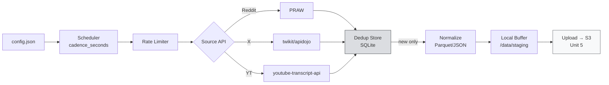

# ⛏️ Unit 3 — Miner Configuration & Data Scraping Strategy

:::info Goal Unit Ini
Di akhir unit ini kamu bisa:
- Memahami struktur **`config.json` / `miner.yaml`** Data Universe
- Setup **scraper Reddit** (PRAW credentials) + **Twitter/X** (twikit/snscrape) + **YouTube** (transcript API)
- Implementasi **deduplication logic** supaya tidak double-upload
- Paham **rate limiting** & best practice menghindari IP ban
- Memilih **subreddit + keyword strategy** yang scoring-nya tinggi di SN13
:::

:::note Prasyarat
- ✅ Selesai [Unit 2 — Environment Setup](./02-environment-setup)
- ✅ Miner teregister di NetUID 13, smoke test clean
- ✅ Akses ke `~/data-universe` di VPS
:::

---

## 🗂️ Anatomi Config File

Data Universe pakai config file untuk menentukan **scraper mana yang aktif, berapa interval, dan filter apa.** Tergantung versi repo, bisa `config.json`, `miner.yaml`, atau `scraper_config.json`. Cek:

```bash
cd ~/data-universe
ls scraping/
# Umumnya ada: scraper_coordinator.py, reddit/, twitter/, youtube/
```

### Contoh Struktur `config.json`

```json
{
  "scraper_configs": [
    {
      "scraper": "reddit",
      "enabled": true,
      "cadence_seconds": 300,
      "labels_to_scrape": [
        {
          "label_choices": ["r/cryptocurrency", "r/wallstreetbets", "r/technology"],
          "max_data_entities": 100,
          "max_age_hint_minutes": 60
        }
      ]
    },
    {
      "scraper": "X.apidojo",
      "enabled": true,
      "cadence_seconds": 180,
      "labels_to_scrape": [
        {
          "label_choices": ["#bitcoin", "#AI", "#bittensor"],
          "max_data_entities": 150,
          "max_age_hint_minutes": 30
        }
      ]
    },
    {
      "scraper": "youtube.transcripts",
      "enabled": false,
      "cadence_seconds": 3600,
      "labels_to_scrape": []
    }
  ],
  "miner": {
    "upload_cadence_seconds": 1800,
    "local_buffer_max_mb": 2048,
    "compression": "gzip"
  }
}
```

**Key fields:**

| Field | Artinya |
|-------|---------|
| `cadence_seconds` | Interval antar scrape cycle |
| `labels_to_scrape` | Subreddit / hashtag / channel target |
| `max_data_entities` | Kuota per cycle (hindari API limit) |
| `max_age_hint_minutes` | Filter age — hanya ambil post ≤ N menit untuk freshness |
| `upload_cadence_seconds` | Interval push ke S3 (Unit 5) |

:::tip Lokasi File
Biasanya diletakkan di `~/data-universe/config.json`. Kalau repo versi lama pakai `miner.yaml`, format YAML equivalent. Check `README.md` repo untuk konfirmasi.
:::

---

## 🔑 Step 1 — Reddit Scraper Setup

Reddit butuh **OAuth credentials** (API resmi via PRAW). Dapat gratis dari Reddit developer portal.

### Buat Reddit App

1. Kunjungi [reddit.com/prefs/apps](https://www.reddit.com/prefs/apps)
2. Klik **"Create app"** (atau "Create another app")
3. Pilih tipe: **`script`**
4. Nama: bebas, misal `sn13-miner-ETHJKT`
5. Redirect URI: `http://localhost:8080` (tidak dipakai, tapi required)
6. Submit — kamu akan dapat:
   - **Client ID** (di bawah nama app, string pendek)
   - **Client Secret** (klik "edit", string panjang)

### Simpan ke `.env`

Di `~/data-universe/.env`:

```bash
# Reddit
REDDIT_CLIENT_ID=abc123DEFghi
REDDIT_CLIENT_SECRET=xyz789UVWrst
REDDIT_USERNAME=your_reddit_username
REDDIT_PASSWORD=your_reddit_password
REDDIT_USER_AGENT=sn13-miner/0.1 by u/your_reddit_username
```

:::warning Password Reddit
PRAW butuh password untuk `script` app. Kalau akun kamu pakai 2FA, **generate app password** di Reddit settings, atau buat akun Reddit khusus miner (tanpa 2FA). **Jangan reuse password main account!**
:::

### Test Credentials

```python
# test_reddit.py
import praw
import os
from dotenv import load_dotenv

load_dotenv()

reddit = praw.Reddit(
    client_id=os.getenv("REDDIT_CLIENT_ID"),
    client_secret=os.getenv("REDDIT_CLIENT_SECRET"),
    username=os.getenv("REDDIT_USERNAME"),
    password=os.getenv("REDDIT_PASSWORD"),
    user_agent=os.getenv("REDDIT_USER_AGENT"),
)

print(f"Authenticated as: {reddit.user.me()}")

# Coba fetch 5 post terbaru dari r/cryptocurrency
for post in reddit.subreddit("cryptocurrency").new(limit=5):
    print(f"[{post.created_utc}] {post.title[:80]}")
```

Jalankan:

```bash
pip install praw python-dotenv
python test_reddit.py
```

Sukses = output 5 judul post. Kalau error `401 Unauthorized` → cek credentials lagi.

---

## 🐦 Step 2 — Twitter / X Scraper Setup

Twitter API resmi sekarang berbayar ($100/bulan minimum). **Alternatif gratis:**

### Opsi A — `twikit` (Login via browser cookie)

```bash
pip install twikit
```

```python
# test_twitter.py
from twikit import Client
import asyncio

async def main():
    client = Client('en-US')
    # Login pakai akun Twitter/X (gunakan akun dummy!)
    await client.login(
        auth_info_1='your_dummy_username',
        auth_info_2='your_email@example.com',
        password='your_password',
    )
    # Save cookies untuk next time
    client.save_cookies('x_cookies.json')

    tweets = await client.search_tweet('#bittensor', 'Latest', count=10)
    for t in tweets:
        print(f"[{t.created_at}] @{t.user.screen_name}: {t.text[:80]}")

asyncio.run(main())
```

### Opsi B — `snscrape` (No login, lebih rapuh)

```bash
pip install snscrape
```

```python
import snscrape.modules.twitter as sntwitter

for i, tweet in enumerate(sntwitter.TwitterSearchScraper('#bittensor since:2026-04-01').get_items()):
    if i >= 10:
        break
    print(f"[{tweet.date}] @{tweet.user.username}: {tweet.rawContent[:80]}")
```

:::warning X.com sering update anti-bot
snscrape dan twikit kadang rusak setelah X update backend. Banyak SN13 miner migrasi ke **`X.apidojo`** (layanan paid proxy) atau **Apify scraper API** untuk reliability. Budget ~$10/bulan kalau volume kamu besar.
:::

:::tip Pakai Akun Dummy
Jangan pakai akun Twitter pribadi — risiko shadowban atau suspend tinggi kalau scraping aggressive. Buat akun baru khusus miner.
:::

---

## 🎬 Step 3 — YouTube Transcript Scraper

Paling simple dari ketiganya — pakai library `youtube-transcript-api`:

```bash
pip install youtube-transcript-api pytube
```

```python
# test_youtube.py
from youtube_transcript_api import YouTubeTranscriptApi
from pytube import Channel

# Channel target (contoh: Bittensor Guru)
channel = Channel("https://www.youtube.com/@bittensor")

for i, video in enumerate(channel.videos[:5]):
    try:
        transcript = YouTubeTranscriptApi.get_transcript(video.video_id)
        text = " ".join([chunk['text'] for chunk in transcript])
        print(f"[{video.publish_date}] {video.title}")
        print(f"  Transcript ({len(text)} chars): {text[:100]}...")
    except Exception as e:
        print(f"  No transcript: {e}")
```

:::note Auto-generated vs Manual Transcript
Transcript yang di-auto-generate YouTube quality-nya lebih rendah dari manual. Validator SN13 lebih highly-value **manual/reviewed transcript**. Pilih channel dengan creator yang manually upload caption.
:::

---

## 📋 Step 4 — Final `config.json` Multi-Source

Gabungkan semua:

```json
{
  "scraper_configs": [
    {
      "scraper": "reddit",
      "enabled": true,
      "cadence_seconds": 300,
      "labels_to_scrape": [
        {
          "label_choices": [
            "r/cryptocurrency",
            "r/bittensor_",
            "r/MachineLearning",
            "r/wallstreetbets",
            "r/technology"
          ],
          "max_data_entities": 100,
          "max_age_hint_minutes": 60
        }
      ]
    },
    {
      "scraper": "X.twikit",
      "enabled": true,
      "cadence_seconds": 240,
      "labels_to_scrape": [
        {
          "label_choices": [
            "#bittensor",
            "#TAO",
            "#AI",
            "#crypto",
            "#LLM"
          ],
          "max_data_entities": 150,
          "max_age_hint_minutes": 30
        }
      ]
    },
    {
      "scraper": "youtube.transcripts",
      "enabled": true,
      "cadence_seconds": 3600,
      "labels_to_scrape": [
        {
          "label_choices": [
            "@bittensor",
            "@OpenTensorFoundation"
          ],
          "max_data_entities": 20,
          "max_age_hint_minutes": 1440
        }
      ]
    }
  ],
  "miner": {
    "upload_cadence_seconds": 1800,
    "local_buffer_max_mb": 2048,
    "compression": "gzip",
    "dedup_window_hours": 24
  }
}
```

---

## 🔁 Step 5 — Deduplication Logic

**Uniqueness** = dimensi scoring SN13 paling brutal. Kalau kamu upload tweet yang sama dua kali (atau yang sudah di-upload miner lain), skor turun.

### Strategi Deduplication

1. **Per-scraper local cache** — simpan hash ID setiap entitas yang sudah di-scrape

```python
# scraping/dedup.py
import hashlib
import sqlite3
from datetime import datetime, timedelta

class DedupStore:
    def __init__(self, db_path="dedup.sqlite"):
        self.conn = sqlite3.connect(db_path)
        self.conn.execute("""
            CREATE TABLE IF NOT EXISTS seen (
                hash TEXT PRIMARY KEY,
                source TEXT,
                seen_at TIMESTAMP
            )
        """)

    def hash_entity(self, source: str, uid: str, content: str) -> str:
        key = f"{source}:{uid}:{content[:200]}"
        return hashlib.sha256(key.encode()).hexdigest()

    def is_seen(self, source: str, uid: str, content: str) -> bool:
        h = self.hash_entity(source, uid, content)
        cur = self.conn.execute("SELECT 1 FROM seen WHERE hash = ?", (h,))
        return cur.fetchone() is not None

    def mark(self, source: str, uid: str, content: str):
        h = self.hash_entity(source, uid, content)
        self.conn.execute(
            "INSERT OR IGNORE INTO seen VALUES (?, ?, ?)",
            (h, source, datetime.utcnow())
        )
        self.conn.commit()

    def purge_old(self, hours=72):
        cutoff = datetime.utcnow() - timedelta(hours=hours)
        self.conn.execute("DELETE FROM seen WHERE seen_at < ?", (cutoff,))
        self.conn.commit()
```

2. **Normalize sebelum hash** — lowercase, strip whitespace, hapus URL tracking params

3. **Periodik purge cache** — jangan simpan selamanya, dedup window 24-72 jam cukup

---

## 🚦 Step 6 — Rate Limiting & API Etiquette

```python
# scraping/rate_limiter.py
import asyncio
import time
from collections import deque

class RateLimiter:
    def __init__(self, max_calls: int, window_seconds: int):
        self.max_calls = max_calls
        self.window = window_seconds
        self.calls = deque()

    async def acquire(self):
        now = time.monotonic()
        # purge expired
        while self.calls and self.calls[0] <= now - self.window:
            self.calls.popleft()
        if len(self.calls) >= self.max_calls:
            wait = self.window - (now - self.calls[0])
            await asyncio.sleep(wait)
            return await self.acquire()
        self.calls.append(now)

# Usage
reddit_limiter = RateLimiter(max_calls=60, window_seconds=60)  # 60/min
twitter_limiter = RateLimiter(max_calls=15, window_seconds=900)  # 15 per 15 min
```

:::warning Tanda-tanda Kamu Kena Rate Limit
- Reddit: HTTP 429 atau `TooManyRequests`
- Twitter: cookie invalidated / `LoginRequired` saat scrape
- YouTube: `VideoUnavailable` massal

Respon: **slow down cadence**, rotate user-agent, atau rotate IP (proxy).
:::

---

## 🎯 Step 7 — Subreddit & Keyword Strategy

Tidak semua label sama-sama berharga. Validator SN13 weight **coverage + trending relevance.**

### ✅ Tier S (High Value)

Subreddit/hashtag besar + traffic konsisten + diverse topics:

- `r/cryptocurrency`, `r/bitcoin`, `r/ethereum`
- `r/MachineLearning`, `r/LocalLLaMA`, `r/singularity`
- `r/wallstreetbets`, `r/stocks`
- `r/worldnews`, `r/technology`
- `#AI`, `#Bitcoin`, `#Ethereum`, `#LLM`

### 🟡 Tier A (Good)

Niche communities tapi masih aktif:

- `r/bittensor_`, `r/NEAR`, `r/solana`
- `#bittensor`, `#TAO`, `#Web3`

### ❌ Tier Z (Avoid)

- **Subreddit default sepi** (r/test, r/subreddits)
- **Hashtag generic spam** (#giveaway, #followme)
- **Private/quarantined subs** — validator gak bisa verify

### Diversify!

Jangan 100% Reddit crypto. Validator reward **coverage diversity.** Mix 40% crypto + 30% tech/AI + 20% finance + 10% general news adalah starting point yang sehat.

---

## 🗺️ Alur Scraping Pipeline



---

## 📦 Data Format — Parquet vs JSON

Data Universe accept keduanya tapi **Parquet** = standard industri (kompresi lebih baik, query lebih cepat):

```python
import pandas as pd

# Kumpulkan records
records = [
    {"source": "reddit", "id": "t3_abc", "created_at": 1744632000, "text": "...", "author": "u/bob"},
    # ...
]

df = pd.DataFrame(records)

# Save Parquet (kompresi snappy default)
df.to_parquet("data/reddit_2026-04-14-12.parquet", compression="snappy")

# Untuk JSON gz
df.to_json("data/reddit_2026-04-14-12.json.gz", orient="records", lines=True, compression="gzip")
```

Ukuran: Parquet biasanya **3–5× lebih kecil** dari JSON setelah kompresi.

---

## 🎯 Rangkuman

- **`config.json`** = otak miner: menentukan scraper aktif, cadence, label, kuota
- Tiga scraper utama: **Reddit (PRAW)**, **X (twikit/snscrape)**, **YouTube (youtube-transcript-api)**
- **Reddit**: perlu OAuth app + username/password
- **Twitter**: pakai twikit dengan akun dummy, hati-hati ban
- **Deduplication SQLite-based** pakai hash SHA-256 — mandatory
- **Rate limiting** = survive long-term; jangan greedy per-cycle
- Label strategy: mix crypto + tech + finance + news untuk coverage bonus

### ✅ Quick Check

1. Kenapa deduplication penting di SN13?
2. Tipe Reddit app apa yang perlu dibuat?
3. Kenapa disarankan pakai akun Twitter dummy untuk scraping?
4. Kapan kita pilih Parquet over JSON?
5. Apa risiko kalau cadence_seconds terlalu kecil?

<details>
<summary>💡 Jawaban</summary>

1. **Uniqueness** adalah dimensi scoring besar — data duplikat dihukum → miner score turun drastis.
2. Tipe **`script`** (bukan `web app` atau `installed app`) — karena kita automate dari server tanpa user login browser.
3. Scraping aggressive dari akun pribadi bisa trigger **shadowban atau suspend** Twitter. Akun dummy = damage terisolasi.
4. Ketika volume besar (>100MB per batch) — **Parquet** kompresi lebih baik & query columnar lebih cepat.
5. Kena **rate limit API** → scraper gagal → data gap → freshness & volume score turun.

</details>

### 🐛 Troubleshooting

| Error | Penyebab | Solusi |
|-------|----------|--------|
| `praw.exceptions.OAuthException: invalid_grant` | Password salah / 2FA enabled | Disable 2FA di akun dummy atau gunakan app password |
| `twikit.errors.LoginFailed` | Cookie expired / suspicious login | Delete `x_cookies.json`, login ulang dari scratch |
| `youtube_transcript_api.NoTranscriptFound` | Video gak punya caption | Skip, pindah video lain (jangan retry) |
| Miner jalan tapi 0 upload | Local buffer belum hit threshold | Kecilkan `local_buffer_max_mb` atau tunggu 30 menit |
| Dedup SQLite makin besar | Purge belum jalan | Cron harian `dedup.purge_old(hours=72)` |

---

**Next:** [Unit 4 — Understanding Scoring & Optimizing Rewards →](./04-scoring-optimization)

*Scrape smart, not hard. 🧠*
