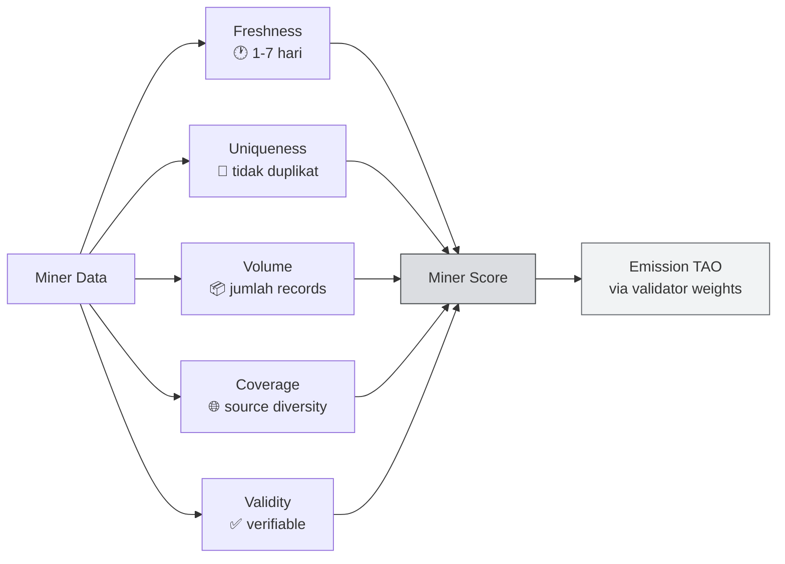
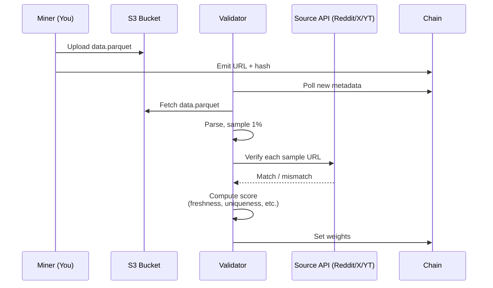

# 🎯 Unit 4 — Understanding the Scoring System & Optimizing Rewards

:::info Goal Unit Ini
Di akhir unit ini kamu akan:
- Memahami **5 dimensi scoring** SN13 secara mendalam
- Paham cara **validator audit** sample data miner
- Kenali **common mistakes** yang menyebabkan score nol
- Menguasai **optimization playbook** untuk naik ranking
- Tahu cara **monitoring leaderboard** miner kamu di taostats & dashboard komunitas
:::

:::note Prasyarat
- ✅ Selesai [Unit 3 — Config & Scraping Strategy](./miner-config-scraping)
- ✅ Miner kamu sudah bisa scrape data (Reddit/X/YT) ke local buffer
:::

---

## 🧮 Filosofi Scoring SN13

Bittensor incentive mechanism SN13 dirancang untuk reward **data yang valuable untuk training AI**. "Valuable" di-quantify lewat 5 dimensi:



Rumus kasar (disederhanakan — implementasi real di repo):

```
final_score = validity_gate * (
    w_fresh * freshness_score +
    w_uniq * uniqueness_score +
    w_vol * volume_score +
    w_cov * coverage_score
)
```

`validity_gate` adalah **0 atau 1** — kalau gagal verifikasi, semua dimensi lain jadi sia-sia.

---

## 🕐 Dimensi 1 — Freshness

**Data yang baru jauh lebih berharga.** Untuk training AI yang relevan dengan realitas sekarang, model butuh data terbaru.

### Kurva Scoring Freshness

```
Age of data           Score multiplier
-----------------------------------
≤ 1 jam              1.00 (max)
1 – 24 jam           0.80 – 0.95
1 – 3 hari            0.50 – 0.75
3 – 7 hari            0.20 – 0.45
> 7 hari              ≈ 0 (dianggap stale)
```

:::tip Optimization
**Prioritaskan data dari 24 jam terakhir.** Set `max_age_hint_minutes` di config (Unit 3) agar scraper skip post yang lebih tua.

Untuk Reddit: sort by `.new()`, bukan `.top()`. Untuk X: `search_tweet(..., 'Latest')` bukan `'Top'`.
:::

### Pitfall

- **Scraping archive / old subreddit post** → 0 score meski volumenya banyak
- **Cron miner mati 6 jam** → gap window, semua data di gap hilang nilai freshness-nya
- **Timezone confusion** — timestamp data harus **UTC** saat di-upload

---

## 🔑 Dimensi 2 — Uniqueness

Validator SN13 maintain **global dedup index**. Kalau 100 miner upload tweet yang sama, hanya 1 yang dihitung unique — sisanya penalty.

### Cara Kerja

1. Setiap data entity di-hash berdasarkan `(source, content_id)` atau fuzzy content hash
2. Validator cross-reference global dedup index
3. Score contribution turun **proporsional dengan berapa miner lain sudah claim data yang sama**

```
If N miners uploaded same entity:
  your_uniqueness_contribution = 1 / N
```

### Optimization

1. **Scrape niche labels** — subreddit kecil & hashtag niche lebih sedikit kompetitor
2. **Be first** — cadence_seconds kecil (tapi jaga rate limit)
3. **Geographic / language diversity** — scrape Indonesian subreddits (r/indonesia, #bahasaindonesia) → lebih sedikit miner internasional scraping ini

:::tip Niche = Gold
🇮🇩 Pro tip Indonesia: miner internasional **jarang scrape konten Bahasa Indonesia** karena gak paham bahasanya. Kalau kamu include `r/indonesia`, `r/Indonesia_people`, `#indonesia`, `#cryptoindonesia` → uniqueness score bisa melonjak karena kamu unique supplier.
:::

---

## 📦 Dimensi 3 — Volume

Lebih banyak data = lebih banyak score, **tapi ada cap & diminishing return.**

### Kurva

```
Entities per epoch    Score (normalized)
-------------------------------------------
0 – 1,000            Linear growth
1,000 – 10,000       Sublinear (sqrt curve)
10,000 – 100,000     Log curve (diminishing)
> 100,000            ≈ Cap (no benefit)
```

Cap exact bervariasi per epoch dan tergantung validator configuration.

### Strategy

- **Jangan spam** — quality > quantity lewat batas tertentu
- **Fokus stabilitas upload 24/7** daripada burst besar lalu idle
- **Monitor local buffer** — kalau sering penuh & data drop, upgrade storage

---

## 🌐 Dimensi 4 — Coverage

Validator reward **diversity**. Miner yang cover Reddit + X + YouTube skor-nya lebih tinggi dari miner single-source volume besar.

### Matrix Coverage

| Source | Minimum % untuk bonus |
|--------|-----------------------|
| Reddit | 20% |
| Twitter/X | 20% |
| YouTube | 10% |

### Contoh

Miner A: 100% Reddit, 100k entries → coverage multiplier 0.8
Miner B: 50% Reddit + 40% X + 10% YT, total 50k entries → coverage multiplier 1.2

Miner B bisa **menang** meski volume lebih kecil.

:::note Cek `enabled: true`
Pastikan semua 3 scraper di `config.json` `enabled: true` dengan cadence realistis. YouTube memang lambat, tapi tetap kontribusi ke coverage.
:::

---

## ✅ Dimensi 5 — Validity (Gate)

**Ini gate killer.** Kalau data kamu ga verifiable, semua dimensi lain direset ke 0.

### Yang Divalidasi

Validator sampling random ~1% data miner, lalu:

1. **URL check** — apakah post/tweet masih exist di source asli?
2. **Content match** — apakah text yang kamu upload sama dengan di source (fuzzy match)?
3. **Timestamp sanity** — apakah `created_at` di range logis?
4. **Author match** — apakah author field konsisten?
5. **Schema compliance** — apakah JSON/Parquet sesuai schema SN13?

### Cara Bikin Validity Tinggi

```python
# Contoh record Reddit yang valid
record = {
    "source": "reddit",
    "uri": "https://reddit.com/r/cryptocurrency/comments/abc123/",
    "datetime": "2026-04-14T12:34:56Z",  # UTC, ISO 8601
    "label": "r/cryptocurrency",
    "content": "Bitcoin hit $150k today...",  # exact text, unescaped
    "content_size_bytes": 245,
    "obfuscated_content_hash": "sha256:...",
}
```

:::warning Common Validity Failures
- **Truncating content** — jangan `[:200]`, upload full text
- **HTML unescaped** — `&amp;` harus jadi `&`
- **URL relative** — harus absolute (`https://...`)
- **Deleted post** — kalau post di-delete antara scrape & validator check, ini di luar kendali kamu. Makanya freshness penting (delete rate di 24 jam pertama rendah).
- **Fake data** — validator advanced bisa deteksi LLM-generated text. **Jangan pernah** synthesize data palsu.
:::

---

## 🛡️ Mekanisme Validator Audit



### Frekuensi Audit

- Validator audit cycle: **setiap tempo ~20 menit**
- Tidak semua validator audit tiap cycle — round robin
- Score kamu = **median** dari banyak validator (robust vs 1 outlier)

---

## ❌ Common Mistakes Checklist

Dari hasil post-mortem miner CLC batch sebelumnya:

| Mistake | Dampak | Fix |
|---------|--------|-----|
| Upload data > 7 hari dari archive scrape | Freshness 0 | Filter di scraper dengan `max_age_hint_minutes` |
| Scraper Twitter cookie expired, tidak alert | Volume drop 80% | Setup health check + alerting (Unit 6) |
| Content di-truncate 200 char | Validity fail | Upload full content |
| 100% scraper Reddit, skip X + YT | Coverage 0.4× | Enable ketiga scraper |
| Port axon 8091 di firewall closed | Validator gak reach → skor reset | `ufw allow 8091` |
| Timestamp pakai local timezone (WIB) | Validity fail (parsing) | Selalu UTC ISO 8601 |
| Duplicate antara run (restart miner) | Uniqueness drop | Persist dedup SQLite across restart |
| Disk penuh, upload fail silently | Tidak terdeteksi berhari-hari | Cron `df -h` alert |

---

## 🚀 Optimization Playbook

### 🥉 Level 1 — Survival (Week 1)

Goal: **tidak di-deregister**, masuk ke median score.

- ✅ Ketiga scraper enabled (Reddit + X + YT)
- ✅ Cadence normal (300s Reddit, 240s X, 3600s YT)
- ✅ Dedup SQLite functional
- ✅ Port 8091 open, validator bisa reach
- ✅ S3 upload stabil (Unit 5)

Expected rank: **top 60–80%**.

### 🥈 Level 2 — Growing (Week 2)

Goal: **top 50%**.

- ✅ Cadence lebih agresif (180s Reddit, 120s X)
- ✅ Tambah label niche (r/indonesia, r/localLLaMA, hashtag trending)
- ✅ Monitor dashboard per 4 jam, adjust label set
- ✅ Upgrade bandwidth/storage kalau buffer sering penuh

### 🥇 Level 3 — Elite (Long-term)

Goal: **top 20%**.

- ✅ Multi-region proxy untuk scraping IP rotation
- ✅ Custom scraper untuk trending detection (scrape reactive based on spikes)
- ✅ Fine-tune validity — schema compliance 100%
- ✅ Diversify ke source baru kalau subnet governance update
- ✅ Hotkey separation untuk multi-miner strategy (advanced)

:::tip Data Science-lah sedikit
Export log miner kamu harian, plot `score vs label_set`. Kadang kamu akan ketemu `r/someRandomSub` kontribusi tak terduga tinggi. Double down di sana.
:::

---

## 📊 Monitoring & Dashboard

### taostats.io

Cek subnet performance:

- **URL**: `https://taostats.io/subnets/13/metagraph`
- Lihat kolom **Incentive** (= score normalized) dan **Emission** (TAO earned per block)
- Sort by UID — cari UID miner kamu, lihat trend 24h

### Subnet-specific Dashboard

Tim Macrocosmos sering publish dashboard:

- `https://data-universe.macrocosmos.ai` (check kalau aktif)
- Community Grafana dashboards — link biasanya di Discord `#sn13-general`

### CLI Check

```bash
btcli subnet metagraph --netuid 13 | head -50
# Cari baris UID kamu, lihat kolom:
# - Stake: total stake (tidak relevan untuk miner)
# - Trust: dari validator 
# - Incentive: score normalized (0-1, makin tinggi makin baik)
# - Emission: TAO yang kamu earn per tempo
```

### Alert Setup

```python
# alert.py — basic monitoring
import requests
import subprocess
import time

WEBHOOK = "https://discord.com/api/webhooks/..."  # Discord atau Telegram bot

def check_incentive(uid: int):
    result = subprocess.run(
        ["btcli", "subnet", "metagraph", "--netuid", "13"],
        capture_output=True, text=True
    )
    # Parse output, cari row UID kamu, ambil incentive value
    # ... (parsing code)
    return incentive

while True:
    inc = check_incentive(my_uid=1234)
    if inc < 0.01:
        requests.post(WEBHOOK, json={"content": f"⚠️ Incentive low: {inc}"})
    time.sleep(600)
```

---

## 🎯 Rangkuman

- **5 Dimensi scoring**: Freshness, Uniqueness, Volume, Coverage, Validity
- **Validity = gate** — gagal verifikasi berarti semua dimensi lain 0
- Validator audit 1% sample vs source asli setiap ~20 menit
- **Niche labels + Bahasa Indonesia** = strategi unfair advantage untuk miner ID
- Monitor via **taostats.io/subnets/13** + CLI `btcli subnet metagraph`
- Optimization bertingkat: **Survival → Growing → Elite**

### ✅ Quick Check

1. Sebutkan 5 dimensi scoring SN13.
2. Kenapa truncate content bisa bikin miner dapat score 0?
3. Apa keuntungan scraping konten Bahasa Indonesia?
4. Berapa lama data masih dianggap "fresh"?
5. Apa yang dicek validator saat audit sample?

<details>
<summary>💡 Jawaban</summary>

1. **Freshness, Uniqueness, Volume, Coverage, Validity.**
2. Validator verify isi data vs source asli (fuzzy match). Kalau truncate, content mismatch → **validity gate fail** → score 0.
3. Miner internasional jarang scrape konten Bahasa Indonesia → **uniqueness score tinggi** karena kamu jadi unique supplier.
4. **≤ 7 hari masih ada skor**, tapi optimum **≤ 24 jam** (multiplier ~0.8-0.95 vs 0.5-0.75 di 1-3 hari).
5. URL masih exist, content match (fuzzy), timestamp logis, author konsisten, schema compliant.

</details>

### 🐛 Troubleshooting

| Gejala | Kemungkinan Penyebab | Solusi |
|--------|----------------------|--------|
| Incentive stuck di 0 selama >24 jam | Validity fail massal | Audit log miner, cek sample data vs source manual |
| Score naik turun drastis setiap tempo | Scraper intermittent (connection issue) | Setup retry + backoff, health check cron |
| UID kamu missing di metagraph | Di-deregister (immunity period habis) | Re-register + perbaiki config |
| Validator weight ke UID kamu 0 | Mungkin validator belum audit, atau IP kamu geoblock | Cek `ufw`, cek provider VPS gak block outbound ke validator |
| Miner kamu beat testnet tapi zero di mainnet | Subnet mainnet lebih ketat | Sync config & tune ulang |

---

**Next:** [Unit 5 — S3 Storage Configuration & Data Upload →](./s3-storage-upload)

*Dalam economy attention, fresh data is currency. 💎*
