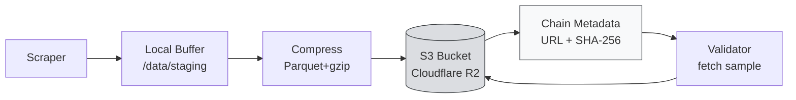

# 💾 Unit 5 — S3 Storage Configuration & Data Upload

:::info Goal Unit Ini
Di akhir unit ini kamu akan:
- Paham **kenapa SN13 perlu S3-compatible storage** (bukan simpan on-chain)
- Bisa membanding **AWS S3 vs Cloudflare R2 vs Backblaze B2** untuk miner
- Setup bucket, access key, dan konfigurasi `.env` dengan benar
- Implement **upload flow**: scraper → compress → S3 → emit URL on-chain
- Verifikasi upload via `s3cmd`, AWS CLI, atau rclone
:::

:::note Prasyarat
- ✅ Selesai [Unit 4 — Scoring System](./scoring-optimization)
- ✅ Miner sudah scrape data ke local buffer (Parquet/JSON.gz)
- ✅ Credit card untuk provisioning cloud storage (estimasi $5-15/bulan)
:::

---

## ☁️ Kenapa S3?

Chain Bittensor = expensive & slow untuk simpan TB data. Solusi umum subnet data-heavy: **off-chain storage + on-chain pointer.**



Chain hanya simpan **URL dan hash**. Data real bersemayam di S3.

---

## 🏆 Provider Comparison

| Provider | Storage $/GB/bulan | Egress Fee | Free Tier | Region SG | Rekomendasi |
|----------|--------------------|------------|-----------|-----------|-------------|
| **Cloudflare R2** ⭐ | $0.015 | **$0** (GRATIS!) | 10 GB storage + 10M ops/bulan | via CDN global | **TOP PICK** |
| **Backblaze B2** | $0.006 | $0.01/GB (via Cloudflare: gratis) | 10 GB | via Bandwidth Alliance | Cost paling murah |
| **AWS S3** | $0.023 | $0.09/GB | 5 GB (12 bulan only) | ap-southeast-1 | Mahal, skip |
| **Wasabi** | $6.99/TB flat | $0 | trial 30 hari | Singapore | Bagus untuk big volume |

:::tip Pilihan untuk CLC9
**Cloudflare R2**. Alasan:
1. **Egress gratis** = validator bisa fetch sample tanpa biaya nambah ke kamu
2. Free tier 10 GB cukup untuk 1-2 minggu scraping awal
3. S3-compatible API (works out-of-the-box dengan `boto3`)
4. Global edge network → validator di mana pun latency rendah

Total cost: **$0-5/bulan** untuk miner CLC level.
:::

---

## 🚀 Step 1 — Setup Cloudflare R2

### Buat Account & Bucket

1. Kunjungi [cloudflare.com](https://www.cloudflare.com/), sign up gratis
2. Dashboard → **R2** (sidebar kiri)
3. Aktifkan R2 (butuh payment method, tapi free tier tidak charge)
4. Klik **"Create bucket"**
   - Nama: `sn13-miner-<your_uid>` (harus unique global)
   - Location: **Automatic** (atau pilih region Asia-Pacific kalau ada)
   - **Jangan** centang "Require admin authentication to access the bucket"
5. Klik **"Settings"** bucket → catat **S3 API endpoint**:
   ```
   https://<account_id>.r2.cloudflarestorage.com
   ```

### Buat API Token

1. Klik **"Manage R2 API Tokens"** (kanan atas)
2. **"Create API token"**
   - Permission: **Object Read & Write**
   - Bucket: pilih bucket kamu (bukan all)
   - TTL: bisa infinite atau 1 tahun
3. Simpan:
   - **Access Key ID**
   - **Secret Access Key**

:::danger Simpan Aman
Secret key **hanya muncul sekali**. Salin segera ke password manager. Kalau hilang, harus regenerate.
:::

---

## 🔐 Step 2 — Configure `.env` di Miner

Di `~/data-universe/.env`:

```bash
# Cloudflare R2
S3_ENDPOINT=https://abcd1234.r2.cloudflarestorage.com
S3_BUCKET=sn13-miner-1234
S3_ACCESS_KEY=your_access_key_id_here
S3_SECRET_KEY=your_secret_access_key_here
S3_REGION=auto

# Public URL prefix (optional — kalau kamu setup custom domain)
S3_PUBLIC_URL=https://pub-abcdef.r2.dev/sn13-miner-1234
```

:::warning Jangan Commit `.env` ke Git
Tambahkan `.env` ke `.gitignore`. Kalau repo kamu publish dengan credentials, attacker bisa nge-nuke bucket kamu.

```bash
echo ".env" >> .gitignore
```
:::

---

## 📤 Step 3 — Upload Flow

### Install Library

```bash
source ~/data-universe/venv/bin/activate
pip install boto3 python-dotenv
```

### Script Upload

```python
# storage/s3_uploader.py
import os
import gzip
import hashlib
import logging
from datetime import datetime
from pathlib import Path
import boto3
from botocore.client import Config
from dotenv import load_dotenv

load_dotenv()

log = logging.getLogger(__name__)

class S3Uploader:
    def __init__(self):
        self.endpoint = os.getenv("S3_ENDPOINT")
        self.bucket = os.getenv("S3_BUCKET")
        self.access_key = os.getenv("S3_ACCESS_KEY")
        self.secret_key = os.getenv("S3_SECRET_KEY")
        self.region = os.getenv("S3_REGION", "auto")

        self.client = boto3.client(
            "s3",
            endpoint_url=self.endpoint,
            aws_access_key_id=self.access_key,
            aws_secret_access_key=self.secret_key,
            region_name=self.region,
            config=Config(signature_version="s3v4"),
        )

    def _hash_file(self, path: Path) -> str:
        h = hashlib.sha256()
        with open(path, "rb") as f:
            for chunk in iter(lambda: f.read(1024 * 1024), b""):
                h.update(chunk)
        return h.hexdigest()

    def upload(self, local_path: Path, s3_key: str = None) -> dict:
        s3_key = s3_key or f"data/{datetime.utcnow().strftime('%Y/%m/%d')}/{local_path.name}"
        file_hash = self._hash_file(local_path)
        file_size = local_path.stat().st_size

        log.info(f"Uploading {local_path.name} ({file_size // 1024} KB) → {s3_key}")

        self.client.upload_file(
            str(local_path),
            self.bucket,
            s3_key,
            ExtraArgs={
                "ContentType": "application/gzip" if s3_key.endswith(".gz") else "application/octet-stream",
                "Metadata": {
                    "sha256": file_hash,
                    "size_bytes": str(file_size),
                    "uploaded_at": datetime.utcnow().isoformat(),
                },
            },
        )

        url = f"{self.endpoint}/{self.bucket}/{s3_key}"
        log.info(f"✅ Uploaded: {url}")
        return {"url": url, "sha256": file_hash, "size": file_size, "key": s3_key}


# Usage
if __name__ == "__main__":
    logging.basicConfig(level=logging.INFO)
    uploader = S3Uploader()
    result = uploader.upload(Path("data/reddit_2026-04-14-12.parquet"))
    print(result)
```

### Test Upload

```bash
# Buat file test
echo '{"test": "hello"}' | gzip > /tmp/test.json.gz

# Upload
python -c "
from storage.s3_uploader import S3Uploader
from pathlib import Path
u = S3Uploader()
print(u.upload(Path('/tmp/test.json.gz'), 'test/hello.json.gz'))
"
```

Sukses kalau output `✅ Uploaded: https://<endpoint>/<bucket>/test/hello.json.gz`

---

## 🔗 Step 4 — Emit URL On-Chain

Setelah upload, miner harus publish metadata ke chain supaya validator tahu di mana fetch data.

Tergantung versi `data-universe`, biasanya framework handle ini otomatis lewat `MinerStorage` abstraction. Tapi di dalamnya:

```python
# storage/chain_notifier.py (pseudocode — lihat implementasi real di repo)
import bittensor as bt

class ChainNotifier:
    def __init__(self, wallet: bt.wallet, subtensor: bt.subtensor, netuid: int):
        self.wallet = wallet
        self.subtensor = subtensor
        self.netuid = netuid

    def commit_metadata(self, url: str, sha256: str):
        """Emit data location to chain metadata."""
        metadata = f"{url}|{sha256}"
        self.subtensor.commit(
            wallet=self.wallet,
            netuid=self.netuid,
            data=metadata,
        )
        bt.logging.info(f"Committed to chain: {metadata}")
```

Validator akan query `subtensor.get_commitment(netuid=13, uid=<miner_uid>)` untuk fetch URL.

:::note Framework Handles This
Kamu **tidak perlu** manual implement chain notifier — `neurons/miner.py` di repo sudah call ini setiap upload cycle. Baca kode untuk paham alurnya.
:::

---

## 📦 Step 5 — Integrated Upload Loop

```python
# neurons/miner_upload_loop.py (contoh integrasi)
import asyncio
import logging
from pathlib import Path
from storage.s3_uploader import S3Uploader
from storage.chain_notifier import ChainNotifier

log = logging.getLogger(__name__)

class UploadScheduler:
    def __init__(self, buffer_dir: Path, uploader: S3Uploader, notifier: ChainNotifier, cadence_s: int = 1800):
        self.buffer_dir = buffer_dir
        self.uploader = uploader
        self.notifier = notifier
        self.cadence = cadence_s

    async def run(self):
        while True:
            try:
                await self.cycle()
            except Exception as e:
                log.exception(f"Upload cycle failed: {e}")
            await asyncio.sleep(self.cadence)

    async def cycle(self):
        # ambil semua file .parquet / .json.gz ready di buffer
        files = list(self.buffer_dir.glob("*.parquet")) + list(self.buffer_dir.glob("*.json.gz"))
        if not files:
            log.info("No files to upload this cycle.")
            return

        for f in files:
            result = self.uploader.upload(f)
            self.notifier.commit_metadata(result["url"], result["sha256"])
            # cleanup local file setelah sukses upload
            f.unlink()
            log.info(f"🗑️ Deleted local: {f.name}")
```

:::tip Cadence Balance
- **Terlalu sering** upload (< 10 menit) → banyak file kecil, overhead tinggi, cost naik
- **Terlalu jarang** (> 1 jam) → freshness score turun

**Sweet spot: 15-30 menit.** Buffer lokal akumulasi ~50-200 MB per cycle, upload sekali.
:::

---

## 🔍 Step 6 — Verifikasi Upload

### Via `rclone` (Recommended)

Install & config:

```bash
curl https://rclone.org/install.sh | sudo bash
rclone config
```

Pilih:
- `n` (new remote)
- Nama: `r2`
- Type: **`s3`**
- Provider: **`Cloudflare`**
- Access key & secret (paste)
- Region: `auto`
- Endpoint: (paste S3 endpoint)

Lalu:

```bash
# List bucket
rclone ls r2:sn13-miner-1234

# Lihat total size
rclone size r2:sn13-miner-1234

# Download sample untuk verify
rclone copy r2:sn13-miner-1234/data/2026/04/14/ /tmp/sample --max-depth 1
```

### Via AWS CLI

```bash
pip install awscli
aws configure --profile r2
# masukan access key, secret, region=auto

aws s3 ls s3://sn13-miner-1234/ --endpoint-url https://<account_id>.r2.cloudflarestorage.com --profile r2
```

### Via Cloudflare Dashboard

Login Cloudflare → R2 → klik bucket kamu → tab **Objects**. Kamu bisa lihat file, download manual, cek metadata.

---

## 📊 Estimasi Cost Bulanan (Real)

Asumsi miner aktif 24/7 dengan scraping moderate:

| Item | Volume | R2 Pricing | Cost |
|------|--------|------------|------|
| Storage (rata-rata 100 GB) | 100 GB | $0.015/GB/bulan | $1.50 |
| Class A ops (PUT) ~50k/hari | 1.5M/bulan | $4.50/M | $6.75 (atau gratis di 10M free) |
| Class B ops (GET) ~10k/hari | 300k/bulan | $0.36/M | $0.11 |
| Egress (validator fetch) | ~500 GB/bulan | $0 | **$0** |
| **Total** | | | **~$0-8/bulan** |

Free tier R2 **10 GB storage + 10M Class A + 1M Class B** cukup untuk ~1 bulan miner CLC. Setelah itu masuk paid tier (~$3-8/bulan).

---

## 🧹 Lifecycle & Retention

**Jangan simpan data selamanya.** Storage cost akumulatif, dan validator hanya care data freshness. Setup lifecycle rule:

```python
# Retention policy — delete objects > 14 days
lifecycle_config = {
    "Rules": [
        {
            "ID": "ExpireOldData",
            "Status": "Enabled",
            "Expiration": {"Days": 14},
            "Filter": {"Prefix": "data/"},
        }
    ]
}

uploader.client.put_bucket_lifecycle_configuration(
    Bucket=uploader.bucket,
    LifecycleConfiguration=lifecycle_config,
)
```

Atau lewat Cloudflare dashboard → Bucket → Settings → Object lifecycle rules.

---

## 🎯 Rangkuman

- **Cloudflare R2** = best choice untuk miner SN13 (egress gratis + S3-compatible)
- Setup `.env` dengan `S3_ENDPOINT`, `S3_BUCKET`, access key & secret
- Upload pakai `boto3` dengan signature `s3v4`
- Flow: **scraper → buffer → compress → upload → emit URL on-chain → validator fetch**
- Cadence sweet spot: **15-30 menit** per upload cycle
- Lifecycle rule: **delete data > 14 hari** untuk cap cost
- Total biaya realistic: **$0-8/bulan**

### ✅ Quick Check

1. Kenapa validator tidak fetch data langsung dari chain?
2. Kenapa R2 paling cocok untuk miner SN13 dibanding AWS S3?
3. Apa yang dikirim miner on-chain setelah upload ke S3?
4. Apa konsekuensi cadence upload terlalu sering?
5. Kenapa harus ada lifecycle rule?

<details>
<summary>💡 Jawaban</summary>

1. Chain Bittensor **expensive & slow** untuk blob data. Chain hanya simpan pointer (URL + hash), data real di S3.
2. **Egress gratis** di R2 — validator fetch berapapun tidak nambah cost kamu. AWS S3 charge $0.09/GB egress → mahal kalau banyak validator.
3. **URL bucket + SHA-256 hash** data (metadata commit).
4. **Overhead tinggi** (banyak file kecil, banyak PUT ops → ops cost naik). Juga network overhead HTTP per request.
5. Storage cost akumulatif. Data > 7-14 hari sudah stale (freshness 0) jadi useless disimpan. Hapus otomatis = cost predictable.

</details>

### 🐛 Troubleshooting

| Error | Penyebab | Solusi |
|-------|----------|--------|
| `botocore.exceptions.ClientError: Access Denied` | Access key salah atau bucket permission ga match | Regenerate API token dengan Object R/W, pastikan di-scope ke bucket benar |
| `SignatureDoesNotMatch` | Clock skew VPS > 15 menit | Install NTP: `sudo apt install ntp && sudo systemctl enable ntp` |
| Upload sukses tapi validator gak fetch | URL salah atau bucket private | Pastikan bucket **public read** atau URL signed. Cek via `curl <URL>` — harus return data. |
| `SSL CERTIFICATE_VERIFY_FAILED` | OS cert outdated | `sudo apt install --reinstall ca-certificates` |
| Cost R2 tiba-tiba tinggi | Ops count meledak (cadence terlalu sering) | Kurangi cadence, batch file lebih besar |
| File di bucket tapi "URL not commitable" | Chain commitment size limit (biasanya 256 byte) | Gunakan short URL, hash tidak perlu full di metadata |

---

**Next:** [Unit 6 — Interaction Layer →](./interaction)

*Storage is cheap, lost data is expensive. 💾*
