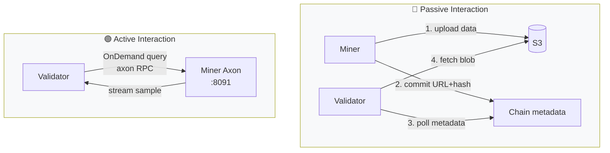

# 🌐 Unit 6 — Interaction Layer

:::info Goal Unit Ini
Di akhir unit ini kamu bisa:
- Memahami **bagaimana validator query miner** (on-chain metadata + HTTP endpoint)
- Implement **axon serving** dengan FastAPI pattern untuk respon data request
- Setup **timeout handling** dan **graceful degradation** saat scraper lambat
- Deploy **monitoring stack** (Prometheus + Grafana atau simpler alternatif)
- Konfigurasi **PM2 auto-restart + log rotation**
- Siap submit **bukti graduation SN13** ke HackQuest Learning Track
:::

:::note Prasyarat
- ✅ Selesai [Unit 5 — S3 Storage Upload](./05-s3-storage-upload)
- ✅ Miner sudah upload data ke R2 dan commit metadata on-chain
- ✅ Sudah running 12+ jam stabil
:::

---

## 🧠 Bagaimana Validator Berinteraksi dengan Miner?

Ada **dua jalur interaksi** miner ↔ validator di SN13:



### Jalur Passive (Primary)

Sudah dibahas di Unit 5. Miner push → chain → validator pull. **Dominant flow.**

### Jalur Active (OnDemand)

Validator kadang minta miner **live sample**: "beri aku 100 tweet dengan label `#bitcoin` dari 1 jam terakhir." Ini untuk spot-check freshness realtime. Miner harus expose HTTP endpoint (axon) yang selalu siap respond.

---

## 🔌 Axon — The Miner Endpoint

Bittensor framework sudah bundle `bt.axon` — wrapper FastAPI untuk handle RPC ala gRPC tapi HTTP.

### Synapse Definition

Synapse = schema request/response. Data Universe punya synapse seperti `GetDataEntities`, `OnDemandRequest`.

```python
# protocol.py (contoh definisi — lihat repo untuk exact schema)
import bittensor as bt
from typing import List, Optional
from pydantic import BaseModel

class DataEntity(BaseModel):
    uri: str
    datetime: str
    source: str
    label: str
    content: str

class OnDemandRequest(bt.Synapse):
    """Validator minta miner kembalikan data sesuai filter."""
    source: str  # "reddit", "x", "youtube"
    label: str   # misal "r/cryptocurrency"
    keywords: Optional[List[str]] = None
    start_time: str  # ISO 8601
    end_time: str
    limit: int = 100

    # Response field
    data_entities: Optional[List[DataEntity]] = None
```

### Handler Function

```python
# neurons/miner.py (skeleton)
import bittensor as bt
from protocol import OnDemandRequest, DataEntity
from storage.query import DataStore

class Miner:
    def __init__(self, config: bt.config):
        self.wallet = bt.wallet(config=config)
        self.subtensor = bt.subtensor(config=config)
        self.axon = bt.axon(wallet=self.wallet, config=config)
        self.datastore = DataStore()  # interface ke local buffer / recent S3

        # Attach handler
        self.axon.attach(
            forward_fn=self.handle_on_demand,
            blacklist_fn=self.blacklist_check,
            priority_fn=self.priority_check,
        )

    async def handle_on_demand(self, synapse: OnDemandRequest) -> OnDemandRequest:
        bt.logging.info(f"OnDemand query: {synapse.source}/{synapse.label} limit={synapse.limit}")
        try:
            entities = await self.datastore.query(
                source=synapse.source,
                label=synapse.label,
                keywords=synapse.keywords,
                start=synapse.start_time,
                end=synapse.end_time,
                limit=synapse.limit,
            )
            synapse.data_entities = entities
        except Exception as e:
            bt.logging.exception(f"Query failed: {e}")
            synapse.data_entities = []  # graceful degrade
        return synapse

    def blacklist_check(self, synapse: OnDemandRequest) -> tuple[bool, str]:
        """Reject request dari hotkey non-validator."""
        hotkey = synapse.dendrite.hotkey
        if not self.is_validator(hotkey):
            return True, "Not a validator"
        return False, ""

    def priority_check(self, synapse: OnDemandRequest) -> float:
        """Validator dengan stake lebih besar → priority lebih tinggi."""
        hotkey = synapse.dendrite.hotkey
        return self.get_stake(hotkey)

    def run(self):
        self.axon.serve(netuid=13, subtensor=self.subtensor)
        self.axon.start()
        bt.logging.info(f"Axon listening on :{self.axon.config.axon.port}")
        while True:
            # main loop — heartbeat, refresh metagraph, dll
            ...
```

---

## ⏱️ Timeout & Graceful Degradation

Validator kirim request dengan timeout (biasanya **10-30 detik**). Miner harus respon sebelum timeout, **sekalipun data belum siap.**

### Pattern: Fast Fail Over Slow Success

```python
import asyncio

async def handle_on_demand(self, synapse: OnDemandRequest) -> OnDemandRequest:
    try:
        entities = await asyncio.wait_for(
            self.datastore.query(...),
            timeout=8.0,  # internal budget < external timeout 10s
        )
        synapse.data_entities = entities
    except asyncio.TimeoutError:
        bt.logging.warning("Query timed out, returning partial/empty")
        synapse.data_entities = []  # empty > no response
    except Exception as e:
        bt.logging.exception(f"Query error: {e}")
        synapse.data_entities = []
    return synapse
```

:::warning Jangan Lambat
Miner yang sering timeout (no response) dapat **validator weight 0**. Lebih baik response empty dari late response.
:::

### Cache Layer

Query yang sama bisa datang dari multiple validator dalam 1 menit. Pakai LRU cache:

```python
from functools import lru_cache
from cachetools import TTLCache

class DataStore:
    def __init__(self):
        self.cache = TTLCache(maxsize=1000, ttl=60)  # 60 detik cache

    async def query(self, source, label, keywords, start, end, limit):
        key = (source, label, tuple(keywords or []), start, end, limit)
        if key in self.cache:
            return self.cache[key]
        result = await self._real_query(source, label, keywords, start, end, limit)
        self.cache[key] = result
        return result
```

---

## 📊 Monitoring Stack

### Opsi 1: Simple — Script + Discord Webhook

Untuk miner CLC (bukan production enterprise), Discord webhook sudah cukup:

```python
# monitoring/health_check.py
import requests
import subprocess
import time
import os

WEBHOOK = os.getenv("DISCORD_WEBHOOK")

def check_miner_pm2():
    result = subprocess.run(["pm2", "jlist"], capture_output=True, text=True)
    return "online" in result.stdout

def check_disk():
    result = subprocess.run(["df", "-h", "/"], capture_output=True, text=True)
    # parse percentage
    usage = int(result.stdout.split("\n")[1].split()[4].rstrip("%"))
    return usage

def notify(msg):
    if WEBHOOK:
        requests.post(WEBHOOK, json={"content": msg})

if __name__ == "__main__":
    if not check_miner_pm2():
        notify("🚨 Miner PM2 process DOWN!")
    if check_disk() > 85:
        notify(f"⚠️ Disk usage {check_disk()}% — cleanup needed")
```

Schedule via cron:

```bash
crontab -e
# tambahkan:
*/10 * * * * /home/miner/data-universe/venv/bin/python /home/miner/data-universe/monitoring/health_check.py
```

### Opsi 2: Full Stack — Prometheus + Grafana

Untuk serious miner:

```bash
# Install Prometheus (singkatnya)
wget https://github.com/prometheus/prometheus/releases/download/v2.51.0/prometheus-2.51.0.linux-amd64.tar.gz
tar xvf prometheus-*.tar.gz && cd prometheus-*

# Expose metrics dari miner (pakai prometheus_client library)
pip install prometheus_client
```

Di miner:

```python
from prometheus_client import start_http_server, Counter, Gauge

scraped_total = Counter('sn13_scraped_total', 'Total entities scraped', ['source'])
uploaded_bytes = Counter('sn13_uploaded_bytes', 'Bytes uploaded to S3')
validator_queries = Counter('sn13_validator_queries', 'OnDemand queries received')
current_incentive = Gauge('sn13_incentive', 'Current incentive score from metagraph')

start_http_server(9100)  # metrics endpoint di :9100
```

Grafana dashboard: monitor scraped rate, upload rate, incentive trend.

:::tip Shortcut
Untuk CLC9 graduation, **Opsi 1 (Discord webhook)** sudah cukup. Grafana setup butuh 2-3 jam extra.
:::

---

## 🔄 PM2 Configuration

### Ecosystem File

```javascript
// ecosystem.config.js
module.exports = {
  apps: [
    {
      name: "sn13-miner",
      script: "venv/bin/python",
      args: "neurons/miner.py --netuid 13 --subtensor.network finney --wallet.name my_cold --wallet.hotkey sn13_miner --axon.port 8091 --logging.info",
      cwd: "/home/miner/data-universe",
      autorestart: true,
      watch: false,
      max_memory_restart: "4G",
      restart_delay: 10000,
      env: {
        PYTHONUNBUFFERED: "1"
      },
      error_file: "/home/miner/logs/miner-err.log",
      out_file: "/home/miner/logs/miner-out.log",
      log_date_format: "YYYY-MM-DD HH:mm:ss"
    }
  ]
};
```

### Start & Persist

```bash
cd ~/data-universe
pm2 start ecosystem.config.js
pm2 save
pm2 startup    # ikuti instruksi untuk auto-start saat VPS reboot
```

### Commands Cheatsheet

```bash
pm2 list               # lihat status
pm2 logs sn13-miner    # tail log realtime
pm2 restart sn13-miner # restart
pm2 stop sn13-miner    # stop
pm2 delete sn13-miner  # remove from PM2
pm2 monit              # live dashboard
```

### Log Rotation

```bash
pm2 install pm2-logrotate
pm2 set pm2-logrotate:max_size 100M
pm2 set pm2-logrotate:retain 7
pm2 set pm2-logrotate:compress true
```

Tanpa ini, log bisa isi disk sampai penuh dalam 2 minggu.

---

## 🧪 End-to-End Smoke Test

Final test sebelum klaim graduation:

```bash
# 1. Miner running
pm2 list
# Status: online, uptime > 1 jam

# 2. Chain registration OK
btcli wallet overview --wallet.name my_cold --netuid 13
# UID terdaftar, stake > 0

# 3. Incentive naik
btcli subnet metagraph --netuid 13 | grep <your_uid>
# Incentive > 0 (biarpun kecil)

# 4. S3 bucket terisi
rclone size r2:sn13-miner-<uid>
# Total > 0 bytes, Count > 0 file

# 5. Axon reachable dari luar
curl -v http://<VPS_IP>:8091/
# Harus return something (bukan timeout)

# 6. Log bersih (no recurring ERROR)
pm2 logs sn13-miner --lines 100 --nostream | grep -i error | wc -l
# < 5 error dalam 100 baris = acceptable
```

---

## 🎓 Checklist Graduation Submission

Untuk graduate CLC9 SN13 (dan dapat NFT + Quack Believers invite):

### Bukti yang Harus Di-submit di HackQuest Learning Track

1. ✅ **Hotkey SS58 Address**
   ```bash
   btcli wallet overview --wallet.name my_cold
   # Copy SS58 dari row hotkey sn13_miner
   ```

2. ✅ **NetUID** — `13`

3. ✅ **Miner UID**
   ```bash
   btcli wallet overview --wallet.name my_cold --netuid 13
   # Angka di kolom UID
   ```

4. ✅ **Screenshot miner running**
   - Open 2 terminal:
     - Terminal 1: `pm2 list` (tunjukkan `sn13-miner` online)
     - Terminal 2: `pm2 logs sn13-miner --lines 20` (tunjukkan log hidup)
   - Screenshot keduanya, upload sebagai 1 image

5. ✅ **Screenshot taostats.io/subnets/13** — browser open halaman metagraph, UID kamu highlighted

6. ✅ **Screenshot bucket R2** — Cloudflare dashboard, bucket menampilkan file-file terupload

7. ✅ **X (Twitter) reflection post** — tulis refleksi belajar, tag `@HackQuest_` dan `@bittensor`, paste link

:::tip Screenshot Pro Tips
- Crop & annotate pakai tool seperti **Snipaste** atau **Flameshot**
- Tambahkan panah merah ke UID/hotkey kamu biar reviewer mudah verify
- Resolusi min 1280x720
:::

---

## 🏁 Production Checklist Lengkap

Sebelum bilang "miner saya production-ready":

- [ ] VPS Singapore region, 4+ vCPU, 8+ GB RAM, 500+ GB SSD
- [ ] Ubuntu 22.04, firewall `ufw` enabled, port 8091 open
- [ ] Non-root user `miner`, SSH key-based auth only
- [ ] Python venv dengan semua deps terinstall
- [ ] Hotkey (bukan coldkey) di VPS
- [ ] Registered di NetUID 13, incentive > 0
- [ ] Config scraper 3 source (Reddit + X + YT) dengan label diversity
- [ ] Dedup SQLite persist across restart
- [ ] S3 bucket (R2), access key di `.env` (gitignored!)
- [ ] Upload cadence 15-30 menit, lifecycle 14 hari
- [ ] Axon handler dengan timeout + graceful degrade
- [ ] PM2 ecosystem config, autorestart, log rotate
- [ ] Monitoring script Discord webhook cron /10 min
- [ ] NTP sync (untuk signature S3 correct)
- [ ] Smoke test end-to-end passed
- [ ] Bukti graduation terkumpul

---

## 🎯 Rangkuman

- Validator berinteraksi 2 jalur: **passive** (via S3 + chain metadata) dan **active** (axon HTTP queries)
- **Axon** = FastAPI wrapper Bittensor untuk handle synapse RPC
- Timeout handling: **fast fail > slow success** — selalu respon, empty list OK
- **PM2 ecosystem** = auto-restart + log rotate + persist across reboot
- Monitoring: **Discord webhook** cukup untuk CLC; Prometheus untuk serious miner
- Graduation submission butuh **6-7 bukti**: hotkey, UID, screenshots, X post

### ✅ Quick Check

1. Apa bedanya jalur passive dan active validator ↔ miner?
2. Apa yang harus dilakukan miner kalau query validator mendekati timeout?
3. Kenapa kita pakai PM2 bukan systemd langsung?
4. Apa yang terjadi kalau miner sering timeout terhadap validator?
5. File apa yang WAJIB di-gitignore di repo miner kamu?

<details>
<summary>💡 Jawaban</summary>

1. **Passive**: miner push data → S3 + chain commit, validator pull. **Active**: validator kirim synapse request (OnDemand) → miner harus respond via axon. Passive dominant.
2. **Respond dengan data partial / empty list.** Late response lebih buruk dari empty response — validator set weight 0 kalau timeout.
3. PM2 native Node tool dengan ecosystem config portable, log rotate plugin, live monit dashboard, zero-downtime restart. Systemd bisa tapi config lebih verbose.
4. **Validator weight ke UID kamu jatuh ke 0** → incentive turun → emission TAO minimal / 0.
5. **`.env`** (credentials S3, Reddit, Twitter) dan **`wallets/`** folder jika somehow bocor. Jangan pernah commit file dengan secret!

</details>

### 🐛 Troubleshooting

| Gejala | Penyebab | Solusi |
|--------|----------|--------|
| Axon listen tapi validator gak reach | IP di belakang NAT / firewall cloud | Verify `curl http://<public_ip>:8091` dari luar VPS. Cek security group provider. |
| `Address already in use` port 8091 | Miner lama masih running | `pm2 delete sn13-miner` lalu restart. Atau `lsof -i :8091` untuk cari PID. |
| Handler crash, PM2 restart loop | Unhandled exception di query | Wrap semua di try/except, return empty list. Check `pm2 logs` untuk stack trace. |
| Disk penuh setelah 1 minggu | Log tidak rotate | Install `pm2-logrotate`, purge old log di `/home/miner/logs/` |
| Metrics Prometheus 404 | `start_http_server` dipanggil tapi port closed di firewall | `ufw allow 9100` (atau jangan expose public, akses via localhost/tunnel) |
| Submission ditolak reviewer | Screenshot blur / UID tidak terlihat | Ulangi screenshot dengan annotation jelas |

---

## 🎉 Selamat!

Kamu sudah sampai di ujung **Guided Project II — Data Universe (SN13)**. Kalau miner kamu sudah running stabil >24 jam, bukti submission lengkap, dan log bersih: **kamu siap graduate!**

Langkah terakhir: submit semua bukti di HackQuest Learning Track sebelum **TH4 (Graduation Day)**.

**Next:** [Phase 3 — More Bittensor Resources →](../../Phase-3-Resources/resources)

*In miners we trust. In TAO we thrive. 🦆⚡*
