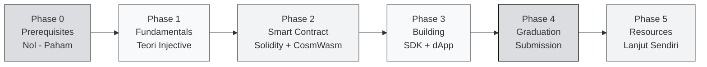

# Injective Co-Learning Camp — Overview

> **Co-Learning Camp #11 · HackQuest Indonesia × Injective**
> **30 Juli – 10 Agustus 2026 · Online via Zoom · 100% GRATIS**

Selamat datang di **Injective Co-Learning Camp**! Kurikulum ini dirancang untuk membawa kamu dari **benar-benar nol** — belum pernah menyentuh blockchain sama sekali — sampai bisa **deploy smart contract sendiri** dan **membangun dApp** di atas Injective, Layer 1 yang dibangun khusus untuk keuangan Web3.

:::tip Kenapa dokumentasi ini ada
Townhall cuma 2 jam. Materi di sini **lebih dalam dan lebih pelan** daripada yang bisa dibahas live. Kalau kamu ketinggalan sesi, atau merasa sesi live terlalu cepat, **halaman-halaman ini adalah jalur utamamu untuk tetap lulus.** Semuanya bisa diikuti sendiri, kapan saja.
:::

---

## 🎯 Untuk Siapa Kurikulum Ini?

:::info Target Peserta
Kurikulum ini beginner-friendly dan cocok untuk:
- 🧑‍🎓 **Mahasiswa** yang mau masuk ke Web3 tapi belum tahu mulai dari mana
- 👨‍💻 **Developer Web2** yang penasaran dengan smart contract
- 💹 **Orang finance / trading** yang mau paham DeFi dari sisi teknis
- 🤔 **Pemula total** yang belum pernah punya wallet crypto sekalipun
:::

Tidak perlu pengalaman blockchain. Tidak perlu jago Rust atau Solidity. Yang penting: **mau belajar dan mau eksekusi.**

:::note Data cohort kita
Dari hasil registrasi CLC11: **sebagian besar peserta belum punya pengalaman ngoding blockchain**, dan mayoritas yang punya pengalaman masih di bawah 1 tahun. Kurikulum ini ditulis dengan asumsi itu — jadi kalau ada bagian yang terasa terlalu dasar, silakan lompat. Tapi kalau terasa terlalu cepat, **kamu bukan satu-satunya**, dan tiap unit punya prasyarat yang jelas supaya kamu bisa mundur ke materi sebelumnya.
:::

---

## 🗺️ Learning Path — 6 Phase

### 🟡 Phase 0 — Prerequisites (Mulai dari Nol)

Fondasi paling dasar. Kalau kamu belum pernah dengar "Web3" atau belum pernah punya wallet, mulai dari sini.

- **Unit 1:** [Apa itu Web3?](./Phase-0-Prerequisites/apa-itu-web3)
- **Unit 2:** [Apa itu Injective?](./Phase-0-Prerequisites/apa-itu-injective)
- **Unit 3:** [Cosmos, IBC & MultiVM](./Phase-0-Prerequisites/cosmos-ibc-dan-multivm)
- **Unit 4:** [Setup Wallet & Testnet](./Phase-0-Prerequisites/setup-wallet-dan-testnet)

### 🔵 Phase 1 — Injective Fundamentals

Masuk ke teori: bagaimana Injective bekerja di dalam, dan kenapa desainnya beda dari chain lain.

**Concept I — Arsitektur & Tokenomics**
- Unit 1: [Arsitektur Injective](./Phase-1-Fundamentals/Concept-1-Arsitektur/arsitektur-injective)
- Unit 2: [Exchange Module & On-Chain Orderbook](./Phase-1-Fundamentals/Concept-1-Arsitektur/exchange-module-orderbook)
- Unit 3: [Tokenomics INJ & Burn Auction](./Phase-1-Fundamentals/Concept-1-Arsitektur/tokenomics-inj)

**Concept II — Ekosistem Injective**
- Unit 1: [dApp & Helix](./Phase-1-Fundamentals/Concept-2-Ekosistem/dapps-dan-helix)
- Unit 2: [Oracle, Bridge & Interoperabilitas](./Phase-1-Fundamentals/Concept-2-Ekosistem/oracle-bridge-interop)

### 🟢 Phase 2 — Smart Contract di Injective

Praktek pertama. Injective punya **dua jalur** smart contract, dan kamu akan mencoba keduanya.

**Jalur A — Solidity di Injective EVM**
1. [Solidity Dasar](./Phase-2-Smart-Contracts/Solidity/solidity-dasar)
2. [Solidity Lanjutan](./Phase-2-Smart-Contracts/Solidity/solidity-lanjutan)
3. [Deploy ke Injective EVM](./Phase-2-Smart-Contracts/Solidity/deploy-ke-injective-evm)

**Jalur B — Rust & CosmWasm**
1. [Rust untuk Web3](./Phase-2-Smart-Contracts/Rust-CosmWasm/rust-untuk-web3)
2. [CosmWasm Starter](./Phase-2-Smart-Contracts/Rust-CosmWasm/cosmwasm-starter)
3. [Build & Deploy CosmWasm](./Phase-2-Smart-Contracts/Rust-CosmWasm/build-deploy-cosmwasm)

:::tip Kalau waktumu mepet
Kerjakan **Jalur A (Solidity) sampai selesai dulu**, baru Jalur B. Solidity lebih cepat dikuasai kalau kamu sudah pernah ngoding, dan Learning Track Phase 3–4 di platform HackQuest semuanya Solidity.
:::

### 🟣 Phase 3 — Building dengan Injective SDK

Bagian di mana kamu benar-benar **membangun sesuatu.**

**Injective TypeScript SDK**
1. [Setup Injective TS SDK](./Phase-3-Building/TS-SDK/setup-injective-ts-sdk)
2. [Query Data Chain](./Phase-3-Building/TS-SDK/query-chain-data)
3. [Wallet Integration](./Phase-3-Building/TS-SDK/wallet-integration)
4. [Build & Broadcast Transaction](./Phase-3-Building/TS-SDK/build-transaction)

**Guided Project (wajib untuk lulus)**
1. [Project Overview](./Phase-3-Building/Guided-Project/project-overview)
2. [Kontrak & Backend](./Phase-3-Building/Guided-Project/kontrak-dan-backend)
3. [Frontend Integration](./Phase-3-Building/Guided-Project/frontend-integration)
4. [Deploy & Demo](./Phase-3-Building/Guided-Project/deploy-dan-demo)

### 🎓 Phase 4 — Graduation

- [Syarat Kelulusan](./Phase-4-Graduation/syarat-kelulusan)
- [Panduan Submission](./Phase-4-Graduation/panduan-submission)
- [Showcase & Demo Tips](./Phase-4-Graduation/showcase-dan-demo-tips)

### 🟠 Phase 5 — Resources & Setelah Camp

- [Resources](./Phase-5-Resources/resources) · [Glossary](./Phase-5-Resources/glossary) · [Setelah Camp](./Phase-5-Resources/setelah-camp)

---

## 📅 Jadwal Townhall (Live Zoom)

Semua sesi **19:00 – 21:00 WIB**.

| TH | Tanggal | Topik | PR setelah sesi |
|----|---------|-------|-----------------|
| **TH1** | Kam, 30 Juli 2026 | Introduction to Injective — Web3 fundamentals, kenapa Injective, walkthrough learning track | Track Phase 1–2 |
| **TH2** | Sen, 3 Agustus 2026 | Smart Contracts on Injective — Solidity, Rust, CosmWasm, deploying | Track Phase 3–5 |
| **TH3** | Kam, 6 Agustus 2026 | Building with Injective — TypeScript SDK, wallet, transaksi, dApp | Track Phase 6–7, mulai Phase 8 |
| **TH4** | Sen, 10 Agustus 2026 | 🎉 Graduation & Builder Showcase | — |

:::warning Jadwal ini sudah pernah berubah dua kali
Jadwal di atas adalah versi **final (30 Juli – 10 Agustus)**. Kalau kamu melihat tanggal lain di halaman platform atau di email lama, **yang berlaku adalah tabel di halaman ini.** Kalau ada perbedaan, tanya di grup Telegram.
:::

:::tip Pro Tip
Baca materi **Phase 0 sebelum TH1** dan **Phase 2 sebelum TH2**. TH2 adalah sesi terpadat di camp ini (Solidity + Rust + CosmWasm dalam 2 jam) — kalau kamu datang sudah pernah baca, sesi itu jadi jauh lebih masuk akal.
:::

---

## 🔗 Peta Materi ↔ Learning Track HackQuest

Kelulusan dinilai dari **Learning Track resmi Injective di platform HackQuest (9 phase, harus 100%)** — bukan dari halaman ini. Dokumentasi ini adalah **pendamping** untuk membantumu menyelesaikan track tersebut.

| Phase Learning Track (platform) | Materi pendamping di sini | Townhall |
|---|---|---|
| 1 · Web3 Basics | Phase 0 Unit 1 | TH1 |
| 2 · Ecosystem Overview | Phase 0 Unit 2–3, seluruh Phase 1 | TH1 |
| 3 · Basic Solidity Syntax | Phase 2 · Solidity Unit 1 | TH2 |
| 4 · Advanced Solidity Syntax | Phase 2 · Solidity Unit 2–3 | TH2 |
| 5 · Rust & CosmWasm Starter Guide | Phase 2 · Rust-CosmWasm Unit 1–3 | TH2 |
| 6 · Unlocking Injective TypeScript SDK | Phase 3 · TS-SDK Unit 1–3 | TH3 |
| 7 · 7 Days of Injective | Phase 3 · TS-SDK Unit 4 + Guided Project Unit 1 | TH3 |
| 8 · Guided Projects | Phase 3 · Guided Project Unit 2–4 | TH3 |
| 9 · Explore More Resources | Phase 5 | TH4 |

:::danger Yang dinilai adalah progress di platform
Membaca halaman ini **tidak otomatis** menaikkan persentase Learning Track kamu. Kamu tetap harus menyelesaikan setiap phase di [platform HackQuest](https://www.hackquest.io/co-learning/a33ca6ae-43fb-4d8f-8ec5-ca0eca9f5cfa). Pakai halaman ini kalau materi di platform terasa kurang jelas.
:::

---

## 🎓 Cara Lulus (Graduation Criteria)

Ada **6 syarat**, dan **semuanya wajib**. Detail lengkap di [Syarat Kelulusan](./Phase-4-Graduation/syarat-kelulusan).

1. **Hadir minimal 3 dari 4 Townhall** — live via Zoom. Telat lebih dari 15 menit tidak dihitung hadir. Nonton rekaman tidak dihitung.
2. **Tetap di grup Telegram** sampai program selesai, dan ikut diskusi.
3. **Learning Track 100%** — seluruh 9 phase di platform HackQuest.
4. **Submit bukti penyelesaian** — link profil HackQuest, screenshot 100%, wallet address, username Telegram, username Discord.
5. **Post refleksi di X** — apa yang kamu pelajari + fitur Injective favoritmu, tag `@HackQuest_` dan `@Injective`.
6. **Isi feedback form** yang dibagikan menjelang akhir camp.

### 🏆 Reward Tier

| Tier | Kriteria | Hadiah |
|------|----------|--------|
| 🥇 **Top Builder** | Partisipasi & hasil paling menonjol | Exclusive Hoodie |
| 🥈 **Outstanding Learner** | Completion tinggi + aktif | T-shirt + Sticker Pack |
| 🎓 **Graduate** | Semua 6 syarat terpenuhi | Certificate + community recognition |
| 📋 **Participant** | Hadir tapi syarat belum lengkap | Participation Certificate |

### ❌ Yang Membatalkan Kelulusan

Hadir kurang dari 3 townhall · Learning Track belum 100% · bukti submission tidak lengkap · keluar dari grup Telegram sebelum program selesai · plagiarisme atau kecurangan.

---

## 💬 Support & Komunitas

- **Grup Telegram CLC11** — [t.me/+5G5ADaRfYvplMDQ1](https://t.me/+5G5ADaRfYvplMDQ1) — tempat utama bertanya. Jangan malu bertanya hal dasar; kalau kamu bingung, ada 10 orang lain yang bingung hal yang sama tapi diam.
- **Platform HackQuest** — [halaman camp CLC11](https://www.hackquest.io/co-learning/a33ca6ae-43fb-4d8f-8ec5-ca0eca9f5cfa)
- **Quack Believers** — alumni network HackQuest Indonesia (invite untuk graduate)

---

## 🚀 Cara Mulai

:::tip Urutan belajar yang direkomendasikan
1. **Baca Phase 0 dulu** kalau kamu pemula total — jangan langsung loncat ke Phase 2.
2. **Selesaikan Phase 0 Unit 4 (wallet + testnet) secepatnya.** Ini prasyarat teknis untuk hampir semua unit setelahnya; kalau tertunda, kamu akan macet di TH2.
3. **Phase 1 selesai sebelum TH2.**
4. **Phase 2 dikerjakan bareng TH2**, Jalur A dulu.
5. **Phase 3 dikerjakan bareng TH3** — guided project butuh waktu, jangan mulai di hari terakhir.
6. **Phase 4 dibaca di awal Agustus**, bukan tanggal 10 — supaya kamu punya waktu mengumpulkan bukti.
:::

**Siap?** Lanjut ke [Phase 0 — Unit 1: Apa itu Web3?](./Phase-0-Prerequisites/apa-itu-web3) 👉

---

### 📚 Referensi Cepat

- 🌐 [Injective Official](https://injective.com)
- 📖 [Dokumentasi Resmi](https://docs.injective.network)
- 🔍 [Explorer Testnet (Blockscout)](https://testnet.blockscout.injective.network/)
- 💧 [Faucet Testnet](https://testnet.faucet.injective.network/)
- 💹 [Helix — DEX flagship Injective](https://helixapp.com)
- 🐙 [Injective di GitHub](https://github.com/InjectiveLabs)

---

:::note Brand & Attribution
Logo dan mark Injective adalah milik **Injective Labs / Injective Foundation**. Materi edukasi ini disusun oleh **HackQuest Indonesia** sebagai community education dan tidak berafiliasi resmi kecuali dinyatakan sebaliknya.

Data teknis (chain ID, endpoint, faucet, versi package) diverifikasi pada **30 Juli 2026** terhadap `docs.injective.network`. Endpoint dan versi bisa berubah — kalau ada perintah yang gagal, cek dokumentasi resmi dulu, lalu laporkan di grup Telegram supaya halaman ini diperbarui.
:::

*In Builders We Trust.*
