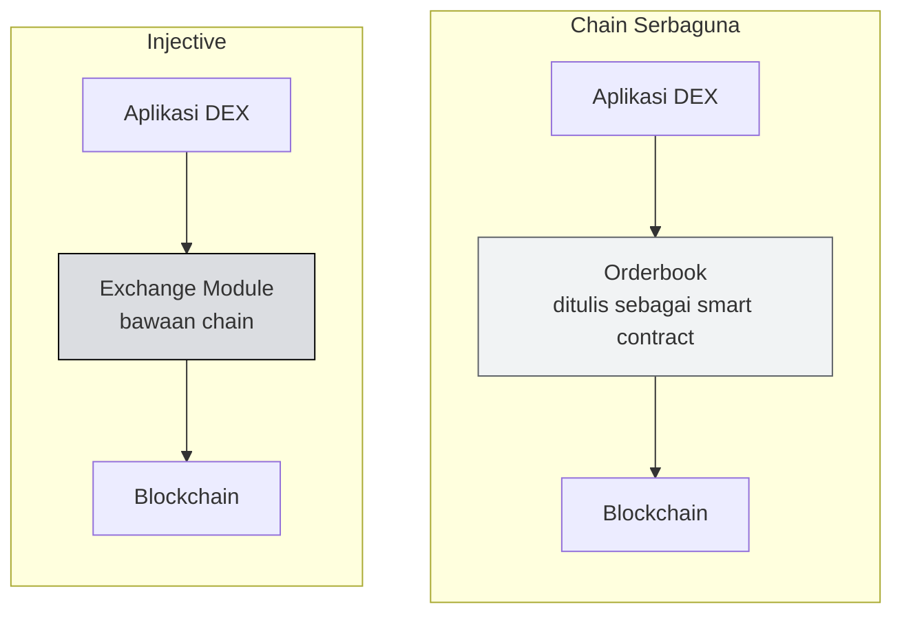

# ⚡ Unit 2 — Apa itu Injective?

:::info Goal Unit Ini
Di akhir unit ini kamu akan:
- Paham apa arti **"Layer 1 khusus keuangan"** dan kenapa itu pilihan desain yang berbeda
- Bisa menyebutkan **4 pembeda utama Injective** dibanding chain general-purpose
- Paham istilah **on-chain orderbook, instant finality, dan MultiVM** di level konsep
- Tahu posisi **INJ** dalam sistem ini
:::

:::note Prasyarat
- ✅ [Unit 1](./apa-itu-web3) selesai — kamu paham blockchain, wallet, dan token
:::

---

## 🏗️ Masalahnya: Chain Umum vs Kebutuhan Keuangan

Kebanyakan blockchain dibangun sebagai **komputer serbaguna**. Ethereum adalah contoh terbaiknya: kamu bisa membangun apa saja di atasnya — game, NFT, social app, DeFi.

Fleksibilitas itu kekuatan besar. Tapi ada konsekuensinya untuk aplikasi keuangan.

Kalau kamu mau membangun bursa (exchange) di chain serbaguna, kamu harus **membangun seluruh mesin bursanya sendiri** sebagai smart contract: orderbook, matching engine, sistem margin, likuidasi, oracle harga. Semuanya, dari nol.

Masalahnya:

| Masalah | Kenapa terjadi |
|---|---|
| **Mahal** | Setiap operasi orderbook (pasang order, batalkan, match) adalah transaksi berbayar |
| **Lambat** | Kecepatan matching dibatasi kecepatan blok chain-nya |
| **Rawan MEV** | Order kamu terlihat di mempool sebelum dieksekusi, jadi bisa didahului orang lain |
| **Setiap tim bikin ulang** | Sepuluh DEX = sepuluh implementasi orderbook yang berbeda |

:::info Apa itu MEV — versi singkat
**MEV** (Maximal Extractable Value) adalah keuntungan yang bisa diambil seseorang dengan mengatur urutan transaksi dalam sebuah blok.

Contoh paling umum, *front-running*: kamu pasang order beli besar. Order itu terlihat dulu di antrean publik sebelum dieksekusi. Bot melihatnya, menyelipkan order beli miliknya lebih dulu dengan biaya gas lebih tinggi, harga naik, lalu menjual ke kamu di harga yang sudah lebih mahal. Kamu tetap dapat token, tapi lebih mahal — dan selisihnya masuk kantong bot.
:::

---

## 💡 Pendekatan Injective: Bangun Fitur Keuangan di Level Chain

Injective mengambil jalan berbeda. Alih-alih menyediakan komputer serbaguna, Injective **memasukkan fungsi pasar keuangan langsung ke dalam chain itu sendiri** sebagai modul bawaan.

Artinya: orderbook bukan smart contract yang harus kamu tulis. **Orderbook adalah bagian dari blockchain-nya.**

Konsekuensinya besar:

- Aplikasi tidak perlu membangun ulang mesin bursa → **waktu development jauh lebih pendek**
- Matching terjadi di level protokol → **jauh lebih murah dan cepat**
- Semua aplikasi bisa berbagi orderbook yang sama → **likuiditas tidak terpecah-pecah**

:::tip Analogi
Chain serbaguna itu seperti **tanah kosong** — kamu bisa bangun apa saja, tapi harus mulai dari fondasi, listrik, dan pipa air sendiri.

Injective seperti **gedung perkantoran yang sudah jadi** — listrik, lift, AC, dan sistem keamanan sudah terpasang. Kamu tinggal masuk dan menata ruanganmu. Trade-off-nya: kamu tidak bisa membangun pabrik baja di lantai 5. Untuk aplikasi keuangan, trade-off ini hampir selalu menguntungkan.
:::

---

## 🔑 Empat Pembeda Utama Injective

### 1. On-Chain Central Limit Order Book (CLOB)

Sebagian besar DEX populer memakai model **AMM** (Automated Market Maker) — harga ditentukan rumus matematis dari rasio dua token dalam sebuah kolam likuiditas.

Injective memakai **orderbook** — model yang sama dengan bursa saham dan bursa kripto terpusat: ada daftar order beli, daftar order jual, dan mesin yang mempertemukan keduanya.

| | AMM (Uniswap-style) | Orderbook (Injective) |
|---|---|---|
| Cara harga terbentuk | Rumus dari rasio kolam | Pertemuan order beli & jual |
| Kontrol harga trader | Terbatas (swap di harga pasar) | Presisi (limit order) |
| Cocok untuk | Token baru, likuiditas kecil | Trading serius, derivatif |
| Modal untuk market maker | Menyediakan kolam likuiditas | Pasang order dua sisi |

Kita bahas detailnya di [Phase 1 — Exchange Module & Orderbook](../Phase-1-Fundamentals/Concept-1-Arsitektur/exchange-module-orderbook).

### 2. Instant Finality & Blok Cepat

**Finality** artinya: sejak kapan sebuah transaksi dianggap benar-benar final dan tidak mungkin dibatalkan?

- Di beberapa chain, kamu perlu menunggu beberapa blok konfirmasi karena secara teori rantai bisa "berganti jalur"
- Injective memakai konsensus keluarga Tendermint/CometBFT yang memberi **instant finality** — begitu blok masuk, transaksi itu final. Titik.

Untuk aplikasi keuangan ini krusial. Kamu tidak mau ada keraguan apakah order kamu jadi atau tidak.

### 3. MultiVM — Solidity **dan** Rust di Chain yang Sama

Ini bagian yang paling relevan untuk camp kita.

Injective mendukung **dua lingkungan smart contract sekaligus**:

- **EVM** — kamu menulis dalam **Solidity**, sama seperti di Ethereum. Tooling yang sudah kamu kenal (Hardhat, Foundry, MetaMask) bisa langsung dipakai.
- **CosmWasm** — kamu menulis dalam **Rust**, standar smart contract di ekosistem Cosmos.

:::info Kenapa kita belajar keduanya di CLC11
Learning Track resmi mencakup keduanya (Phase 3–4 Solidity, Phase 5 Rust/CosmWasm), jadi keduanya diperlukan untuk lulus.

Praktisnya: **Solidity** memberi kamu akses ke ekosistem developer terbesar di Web3 dan skill yang langsung transferable ke chain lain. **CosmWasm** memberi kamu akses lebih dalam ke fitur asli Injective dan ekosistem Cosmos yang lebih luas. Keduanya berguna, dan Solidity lebih mudah dimulai.
:::

### 4. Interoperabilitas Bawaan

Injective dibangun dengan Cosmos SDK, jadi terhubung ke jaringan chain Cosmos lain lewat **IBC** (Inter-Blockchain Communication) — protokol standar untuk memindahkan aset dan pesan antar-blockchain. Ditambah bridge ke ekosistem lain seperti Ethereum dan Solana.

Artinya aset dari banyak chain bisa masuk dan diperdagangkan di Injective. Kita bahas di [Unit 3](./cosmos-ibc-dan-multivm).

---

## 🪙 INJ — Token Aslinya

INJ dipakai untuk beberapa hal sekaligus:

| Fungsi | Penjelasan |
|---|---|
| **Gas / biaya transaksi** | Setiap transaksi di Injective dibayar dengan INJ |
| **Staking** | INJ dikunci oleh validator untuk mengamankan jaringan; pemegang INJ bisa delegasi dan dapat imbal hasil |
| **Governance** | Pemegang INJ memberi suara untuk perubahan protokol |
| **Burn auction** | Sebagian biaya yang dikumpulkan protokol dilelang, dan INJ pemenang lelang **dibakar** — mengurangi suplai |

Mekanisme burn auction adalah salah satu bagian paling khas dari desain ekonomi Injective. Detailnya di [Phase 1 — Tokenomics INJ](../Phase-1-Fundamentals/Concept-1-Arsitektur/tokenomics-inj).

:::note Selama camp kamu tidak butuh INJ asli
Semua praktek memakai **testnet INJ** yang bisa diambil gratis dari faucet. Tidak ada satu pun bagian dari CLC11 yang mengharuskan kamu membeli kripto. Kalau ada yang menyuruhmu membeli sesuatu untuk "ikut camp", itu penipuan.
:::

---

## 🧭 Di Mana Injective Duduk dalam Peta Web3

| | Ethereum | Layer 2 (Arbitrum, dll) | Injective |
|---|---|---|---|
| Tipe | L1 serbaguna | Scaling di atas Ethereum | L1 khusus keuangan |
| Bahasa contract | Solidity | Solidity | **Solidity + Rust** |
| Orderbook | Harus dibangun sendiri | Harus dibangun sendiri | **Bawaan chain** |
| Finality | Beberapa blok | Bergantung L1 | **Instan** |
| Fokus | Semua use case | Skalabilitas | Keuangan & trading |

:::tip Ini bukan soal mana yang "terbaik"
Setiap desain punya trade-off. Ethereum unggul di keamanan dan ukuran ekosistem. L2 unggul di biaya sambil mewarisi keamanan Ethereum. Injective unggul untuk aplikasi keuangan yang butuh orderbook dan finality cepat.

Sebagai developer, nilai sesungguhnya adalah **paham trade-off-nya** — supaya kamu bisa memilih alat yang tepat, bukan mengikuti hype.
:::

---

## 🎯 Rangkuman

:::tip Yang Harus Kamu Ingat
- Chain serbaguna memaksa setiap DEX **membangun ulang mesin bursa** sebagai smart contract — mahal, lambat, rawan MEV
- Injective menaruh fungsi pasar keuangan **di dalam chain** sebagai modul bawaan
- Empat pembeda: **on-chain orderbook**, **instant finality**, **MultiVM (Solidity + Rust)**, **interoperabilitas IBC**
- **INJ** dipakai untuk gas, staking, governance, dan dibakar lewat burn auction
- Selama camp kita hanya pakai **testnet** — tidak perlu uang sungguhan
:::

### ✅ Quick Check

1. Kenapa membangun DEX di chain serbaguna lebih mahal daripada di Injective?
2. Apa beda AMM dan orderbook dalam satu kalimat?
3. Apa arti "instant finality" dan kenapa penting untuk aplikasi keuangan?
4. Dua bahasa apa yang bisa dipakai menulis smart contract di Injective?
5. Sebutkan tiga fungsi token INJ.

---

**Lanjut:** [Unit 3 — Cosmos, IBC & MultiVM](./cosmos-ibc-dan-multivm) 👉
