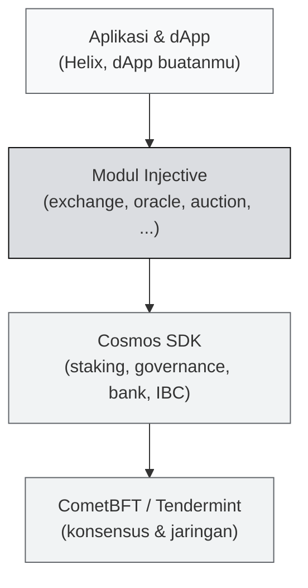

# 🔗 Unit 3 — Cosmos, IBC & MultiVM

:::info Goal Unit Ini
Di akhir unit ini kamu akan:
- Paham apa itu **Cosmos SDK** dan kenapa Injective memilihnya
- Bisa menjelaskan **IBC** dan bedanya dengan bridge biasa
- Paham arsitektur **MultiVM** — kenapa satu chain bisa punya dua lingkungan smart contract
- Paham hubungan antara alamat **`inj1...`** dan alamat **`0x...`**
:::

:::note Prasyarat
- ✅ [Unit 2](./apa-itu-injective) selesai — kamu tahu Injective adalah L1 khusus keuangan
:::

---

## 🧱 Cosmos SDK — "Framework untuk Membuat Blockchain"

Membangun blockchain dari nol itu pekerjaan bertahun-tahun. Kamu harus menulis sendiri jaringan peer-to-peer, mekanisme konsensus, penyimpanan state, kriptografi, dan API.

**Cosmos SDK** adalah framework yang menyediakan semua bagian itu, supaya tim yang mau membuat blockchain bisa fokus pada bagian yang benar-benar unik dari chain mereka.

:::tip Analogi
Cosmos SDK itu seperti **Laravel atau Next.js, tapi untuk blockchain.**

Kamu tidak menulis ulang routing, autentikasi, dan koneksi database setiap kali bikin aplikasi web. Kamu pakai framework, lalu menulis logika bisnismu di atasnya.

Sama halnya: Injective tidak menulis ulang konsensus dan jaringan. Injective pakai Cosmos SDK, lalu menulis **modul keuangan** di atasnya — dan modul itulah yang jadi pembedanya.
:::

### Struktur berlapis

**CometBFT** (dulu bernama Tendermint) adalah mesin konsensusnya. Ini yang memberi Injective **instant finality** yang kita bahas di Unit 2: validator memberi suara pada setiap blok, dan begitu mayoritas setuju, blok itu final selamanya.

### Modul — konsep kunci Cosmos

Sebuah chain Cosmos tersusun dari **modul**, masing-masing menangani satu urusan:

| Modul | Fungsi |
|---|---|
| `bank` | Transfer dan saldo token |
| `staking` | Validator, delegasi, imbal hasil |
| `gov` | Proposal dan voting |
| `ibc` | Komunikasi antar-blockchain |
| `exchange` | **Khas Injective** — orderbook, matching, derivatif |
| `oracle` | **Khas Injective** — data harga masuk ke chain |
| `auction` | **Khas Injective** — burn auction INJ |
| `wasm` | Menjalankan smart contract CosmWasm |
| `evm` | Menjalankan smart contract Solidity |

Tiga modul khas Injective itulah yang membuatnya "chain keuangan", bukan chain umum.

:::info Kenapa ini disebut "app-chain thesis"
Filosofi Cosmos: daripada semua aplikasi berebut ruang di satu blockchain raksasa, **setiap aplikasi besar sebaiknya punya blockchain sendiri** yang dioptimalkan untuk kebutuhannya, lalu semua chain itu saling terhubung.

Injective adalah contoh nyata: chain yang seluruh desainnya dioptimalkan untuk satu bidang, yaitu keuangan.
:::

---

## 🌉 IBC — Bicara Antar Blockchain

Setelah setiap aplikasi punya chain sendiri, muncul masalah baru: **bagaimana mereka saling bicara?**

**IBC (Inter-Blockchain Communication)** adalah protokol standar untuk itu. Anggap saja seperti TCP/IP-nya blockchain — aturan bersama supaya dua chain bisa bertukar pesan dan aset dengan aman.

### IBC vs bridge biasa

Ini perbedaan yang penting dan sering disalahpahami.

| | Bridge biasa | IBC |
|---|---|---|
| Cara kerja | Pihak ketiga menahan aset di chain A, mencetak versi bungkus di chain B | Kedua chain saling **memverifikasi** state satu sama lain lewat light client |
| Siapa yang dipercaya | Operator bridge (multisig, kustodian) | Kode konsensus kedua chain |
| Titik lemah | Operator bisa diretas atau berkhianat | Tidak ada operator terpusat |
| Rekam jejak | Bridge adalah salah satu target peretasan terbesar di Web3 | Belum pernah bobol di level protokol |

:::warning Bridge tetap dibutuhkan — dan tetap berisiko
IBC hanya bekerja antar chain yang sama-sama mendukung IBC (umumnya ekosistem Cosmos). Untuk memindahkan aset dari Ethereum atau Solana, tetap dibutuhkan bridge.

Sebagai developer, pahami ini: **aset hasil bridge membawa risiko bridge-nya.** Kalau kamu membangun aplikasi yang menerima aset ter-bridge, kamu mewarisi asumsi keamanan bridge itu.
:::

---

## 🖥️ MultiVM — Dua Mesin Smart Contract, Satu Chain

Sekarang bagian yang paling langsung memengaruhi cara kamu ngoding di camp ini.

**VM (Virtual Machine)** adalah lingkungan yang menjalankan smart contract. Umumnya satu chain punya satu VM. Injective punya **dua**.

| | **EVM** | **CosmWasm** |
|---|---|---|
| Bahasa | Solidity | Rust |
| Berasal dari | Ethereum | Ekosistem Cosmos |
| Tooling | Hardhat, Foundry, MetaMask, ethers.js | cargo, injectived, Keplr |
| Format alamat | `0x...` | `inj1...` |
| Ekosistem developer | Terbesar di Web3 | Lebih kecil, tapi lebih dekat ke fitur asli Injective |
| Di camp ini | [Phase 2 Jalur A](../Phase-2-Smart-Contracts/Solidity/solidity-dasar) | [Phase 2 Jalur B](../Phase-2-Smart-Contracts/Rust-CosmWasm/rust-untuk-web3) |

### Kenapa repot-repot punya dua?

- **EVM** menurunkan hambatan masuk drastis. Jutaan developer sudah tahu Solidity; mereka bisa deploy ke Injective hampir tanpa belajar hal baru.
- **CosmWasm** memberi akses lebih langsung ke modul asli Injective dan ekosistem Cosmos.

Alih-alih memilih salah satu dan kehilangan separuh calon developer, Injective menjalankan keduanya.

:::tip Yang perlu kamu putuskan sebagai peserta
Kamu **tidak perlu memilih** — Learning Track mencakup keduanya. Tapi untuk urutan belajar, mulai dari **Solidity**: lebih banyak materi, lebih banyak contoh, error message-nya lebih mudah dicari di Google, dan skill-nya langsung terpakai di banyak chain lain.
:::

---

## 🏷️ Dua Format Alamat — `inj1...` dan `0x...`

Ini sumber kebingungan nomor satu untuk pendatang baru, jadi mari diluruskan sekarang.

Injective punya dua representasi alamat:

- **`inj1abcd...`** — format **bech32**, dipakai di sisi Cosmos-native (Keplr, injectived, CosmWasm)
- **`0xAbCd...`** — format **hex**, dipakai di sisi EVM (MetaMask, Solidity, ethers.js)

:::info Keduanya bisa merujuk ke akun yang sama
Kedua format itu bisa merupakan **dua cara menulis kunci yang sama**, mirip seperti menulis satu nomor telepon dengan format `08123...` atau `+62812...`. Formatnya beda, tujuannya sama.

Tapi **jangan berasumsi** — selalu verifikasi. Kalau kamu mengirim ke format yang salah, atau ke akun yang ternyata berbeda, dana bisa hilang permanen. Cek dulu di explorer sebelum mengirim jumlah besar.
:::

Praktisnya selama camp:

| Kegiatan | Wallet | Format alamat |
|---|---|---|
| Ambil testnet INJ dari faucet | Keplr atau MetaMask | Tergantung faucet |
| Deploy contract Solidity | MetaMask | `0x...` |
| Deploy contract CosmWasm | Keplr / injectived | `inj1...` |
| Query lewat TypeScript SDK | — | Umumnya `inj1...` |

Kita pasang keduanya di [Unit 4](./setup-wallet-dan-testnet).

---

## 🎯 Rangkuman

:::tip Yang Harus Kamu Ingat
- **Cosmos SDK** = framework untuk membangun blockchain; Injective menambahkan modul keuangan di atasnya
- **CometBFT/Tendermint** = mesin konsensus yang memberi instant finality
- Modul khas Injective: **`exchange`, `oracle`, `auction`** — inilah yang membuatnya chain keuangan
- **IBC** menghubungkan chain tanpa perantara terpercaya; **bridge** memakai perantara dan membawa risiko tambahan
- **MultiVM** = Injective menjalankan **EVM (Solidity)** dan **CosmWasm (Rust)** sekaligus
- Dua format alamat: **`inj1...`** untuk sisi Cosmos, **`0x...`** untuk sisi EVM
:::

### ✅ Quick Check

1. Sebutkan tiga modul yang khas Injective dan tidak ada di chain Cosmos biasa.
2. Apa perbedaan mendasar antara IBC dan bridge biasa dari sisi kepercayaan?
3. Kenapa Injective menjalankan dua VM sekaligus, bukan memilih satu?
4. Kamu mau deploy contract Solidity. Wallet mana yang kamu pakai, dan alamat formatnya seperti apa?

---

**Lanjut:** [Unit 4 — Setup Wallet & Testnet](./setup-wallet-dan-testnet) 👉
