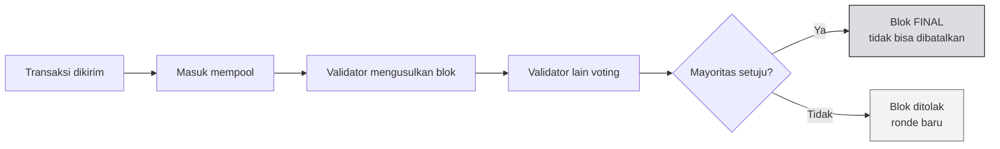
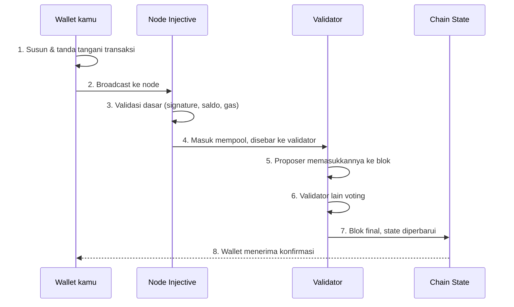

# 🏛️ Unit 1 — Arsitektur Injective

:::info Goal Unit Ini
Di akhir unit ini kamu akan:
- Paham peran **validator** dan cara konsensus memutuskan isi sebuah blok
- Bisa menjelaskan **instant finality** dan bedanya dengan probabilistic finality
- Paham struktur **modul** Injective dan apa fungsi masing-masing
- Bisa mengikuti **perjalanan sebuah transaksi** dari klik sampai final
:::

:::note Prasyarat
- ✅ [Phase 0 Unit 3](../../Phase-0-Prerequisites/cosmos-ibc-dan-multivm) — kamu tahu Injective dibangun dengan Cosmos SDK
:::

---

## 👥 Validator — Siapa yang Menulis Blok

Blockchain butuh pihak yang memutuskan **transaksi mana yang masuk blok berikutnya dan dalam urutan apa**. Di Injective, pihak itu adalah **validator**.

Validator adalah komputer (biasanya server) yang:

1. Menerima transaksi dari pengguna
2. Mengusulkan blok berisi transaksi-transaksi itu
3. Memberi suara pada blok yang diusulkan validator lain
4. Menyimpan salinan lengkap state chain

### Kenapa validator bisa dipercaya?

Karena mereka **mempertaruhkan uang.** Setiap validator harus mengunci sejumlah INJ sebagai jaminan (**stake**). Kalau mereka berbuat curang — misalnya menandatangani dua blok berbeda di tinggi yang sama — sebagian stake mereka **dihanguskan** (istilahnya *slashing*).

:::tip Analogi
Bayangkan panitia penghitung suara yang harus menyetor deposit besar sebelum bertugas. Kalau ketahuan curang, deposit hangus. Semakin besar deposit, semakin mahal biaya berbuat curang — dan semakin aman sistemnya.
:::

### Delegasi

Kamu tidak perlu menjalankan server untuk ikut mengamankan jaringan. Pemegang INJ bisa **mendelegasikan** token mereka ke validator pilihan, dan ikut mendapat bagian imbal hasil. Kalau validator yang kamu pilih kena slashing, delegasimu ikut terpotong — jadi memilih validator itu keputusan yang nyata, bukan formalitas.

---

## ⚡ Instant Finality — Kapan Transaksi Benar-Benar Selesai?

Ini salah satu keunggulan Injective yang paling penting untuk aplikasi keuangan.

### Dua model finality

**Probabilistic finality** (model Bitcoin / Ethereum era PoW):
Blok terus bertambah, dan secara teori rantai bisa "berganti jalur" kalau ada rantai lain yang lebih panjang. Semakin banyak blok di atas transaksimu, semakin kecil kemungkinan itu terjadi — tapi tidak pernah benar-benar nol. Karena itu bursa biasanya menunggu sekian konfirmasi.

**Instant finality** (model CometBFT / Injective):
Validator memberi suara pada setiap blok. Begitu mayoritas yang dibutuhkan setuju, blok itu **final secara definitif**. Tidak ada skenario di mana ia dibatalkan.

### Kenapa ini penting untuk keuangan?

Bayangkan kamu menjalankan bursa. Seseorang menjual aset, lalu langsung menarik hasilnya.

- Dengan **probabilistic finality**, kamu harus menunggu beberapa konfirmasi sebelum berani memproses penarikan — kalau tidak, ada risiko transaksi penjualan itu ternyata dibatalkan dan kamu rugi.
- Dengan **instant finality**, begitu blok masuk, urusan selesai. Kamu bisa langsung memproses.

Perbedaan ini menentukan apakah sebuah aplikasi keuangan terasa seperti aplikasi modern atau seperti transfer antar bank.

:::info Blok Injective sangat cepat
Injective memproduksi blok dengan interval **di bawah satu detik**. Digabung dengan instant finality, artinya transaksi bisa dianggap selesai dalam hitungan detik.

Untuk angka pasti saat ini, lihat [explorer](https://testnet.blockscout.injective.network/) — nilai ini bisa berubah seiring upgrade chain.
:::

---

## 🧩 Struktur Modul

Seperti dibahas di Phase 0, chain Cosmos tersusun dari modul. Mari kita lihat lebih dekat yang penting untuk kamu.

### Modul standar Cosmos SDK

| Modul | Fungsi | Kamu akan berinteraksi dengannya? |
|---|---|---|
| `bank` | Transfer token, cek saldo | ✅ Ya, hampir di setiap unit |
| `staking` | Validator, delegasi | Tidak langsung |
| `gov` | Proposal & voting | Tidak langsung |
| `ibc` | Transfer antar chain | Mungkin |
| `wasm` | Menjalankan contract CosmWasm | ✅ Ya, di Phase 2 Jalur B |
| `evm` | Menjalankan contract Solidity | ✅ Ya, di Phase 2 Jalur A |

### Modul khas Injective

| Modul | Fungsi |
|---|---|
| `exchange` | Orderbook, matching engine, spot & derivatif. **Inti dari Injective** |
| `oracle` | Memasukkan data harga dari luar ke dalam chain |
| `auction` | Burn auction — melelang biaya terkumpul dan membakar INJ |
| `insurance` | Dana penyangga untuk pasar derivatif |
| `peggy` | Bridge ke Ethereum |

:::tip Kenapa "modul" penting untuk dipahami developer
Ketika kamu membangun di Injective, kamu tidak hanya menulis smart contract yang berdiri sendiri — kamu bisa **memanggil modul chain langsung.** Contract CosmWasm-mu bisa membuat order di `exchange` module, atau membaca harga dari `oracle` module.

Ini kemampuan yang tidak ada di chain serbaguna, dan inilah alasan utama seseorang memilih membangun di Injective.
:::

---

## 🚦 Perjalanan Sebuah Transaksi

Mari ikuti apa yang terjadi ketika kamu menekan "Confirm" di wallet.

**Langkah 1 — Tanda tangan.** Wallet-mu memakai private key untuk menandatangani. Ini membuktikan kamu pemilik akun, tanpa pernah mengungkap private key-nya.

**Langkah 3 — Validasi dasar.** Node memeriksa apakah tanda tangan valid, saldo cukup, dan gas mencukupi. Kalau gagal di sini, transaksi ditolak sebelum masuk blok — dan kamu biasanya tidak membayar gas.

**Langkah 5–6 — Konsensus.** Bagian yang butuh waktu paling lama, tapi di Injective ini tetap di bawah satu detik.

**Langkah 7 — Final.** State berubah. Tidak bisa dibatalkan.

:::warning Titik kegagalan yang paling sering kamu temui
Sebagai pemula, error paling umum adalah **gas tidak cukup** (langkah 3) dan **transaksi berhasil masuk tapi logika contract-mu gagal** (langkah 7).

Bedanya penting: yang pertama transaksi tidak jadi. Yang kedua transaksi **jadi dan gas tetap terpotong**, tapi hasilnya bukan yang kamu mau. Explorer akan menunjukkan status "failed" dengan pesan error — itulah yang kamu baca saat debugging.
:::

---

## 🎯 Rangkuman

:::tip Yang Harus Kamu Ingat
- **Validator** mengamankan chain dengan mempertaruhkan INJ; curang = kena **slashing**
- **Instant finality**: begitu blok disetujui mayoritas validator, transaksi final selamanya — tidak seperti model probabilistic yang butuh menunggu konfirmasi
- Blok Injective **di bawah satu detik** → aplikasi keuangan terasa responsif
- Injective punya modul khas: **`exchange`, `oracle`, `auction`, `insurance`, `peggy`**
- Smart contract di Injective bisa **memanggil modul chain langsung** — ini keunggulan utamanya
- Transaksi gagal di validasi awal ≠ transaksi gagal di eksekusi. Yang kedua **tetap memotong gas**
:::

### ✅ Quick Check

1. Apa yang membuat validator tidak berbuat curang?
2. Jelaskan beda instant finality dan probabilistic finality dalam satu kalimat.
3. Modul mana yang menangani orderbook Injective?
4. Transaksimu muncul di explorer dengan status "failed" dan gas terpotong. Di langkah mana ia gagal?

---

**Lanjut:** [Unit 2 — Exchange Module & On-Chain Orderbook](./exchange-module-orderbook) 👉
