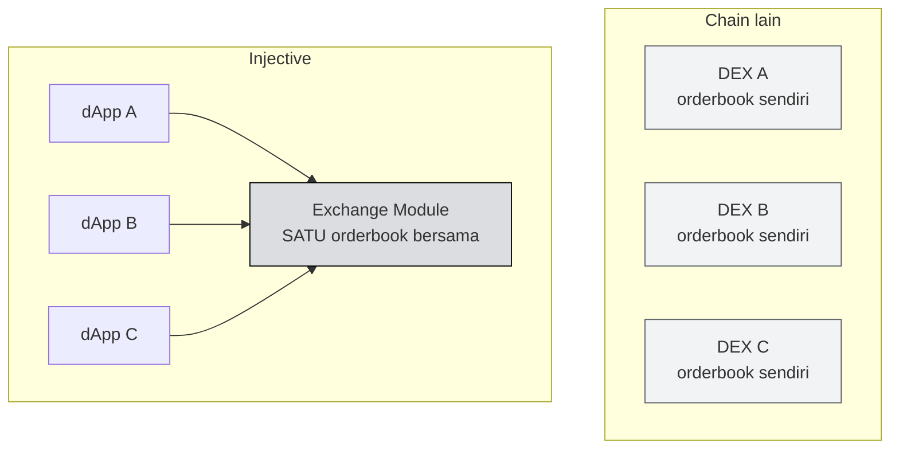
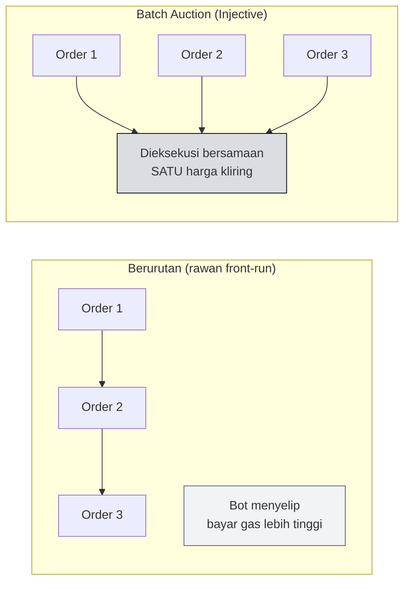

# 📊 Unit 2 — Exchange Module & On-Chain Orderbook

:::info Goal Unit Ini
Di akhir unit ini kamu akan:
- Paham cara kerja **orderbook** dan istilah bid, ask, spread, market order, limit order
- Tahu beda **AMM** dan **CLOB** serta kapan masing-masing lebih cocok
- Paham **Frequent Batch Auction** dan bagaimana ia melawan front-running
- Paham kenapa **shared liquidity** adalah keuntungan besar untuk developer
:::

:::note Prasyarat
- ✅ [Unit 1](./arsitektur-injective) selesai — kamu paham struktur modul Injective
:::

---

## 📖 Orderbook 101 — Untuk yang Belum Pernah Trading

Kalau kamu sudah familiar dengan trading, lewati bagian ini. Kalau belum, ini fondasinya.

**Orderbook** adalah daftar niat jual-beli yang sedang menunggu untuk dipertemukan.

Bayangkan pasar buku bekas:

- **Bid** (order beli) — "Saya mau beli buku ini seharga Rp 50.000"
- **Ask** (order jual) — "Saya mau jual buku ini seharga Rp 55.000"
- **Spread** — selisih antara bid tertinggi dan ask terendah. Di contoh ini, Rp 5.000

Transaksi terjadi ketika ada yang bersedia menyeberangi spread itu.

### Contoh orderbook sederhana

| Sisi | Harga | Jumlah |
|---|---|---|
| 🔴 Ask | 25,20 | 100 |
| 🔴 Ask | 25,10 | 250 |
| 🔴 Ask | **25,05** | 80 | ← ask terendah |
| | *spread 0,05* | |
| 🟢 Bid | **25,00** | 120 | ← bid tertinggi |
| 🟢 Bid | 24,95 | 300 |
| 🟢 Bid | 24,90 | 150 |

### Dua jenis order

| | **Limit order** | **Market order** |
|---|---|---|
| Artinya | "Beli di harga X atau lebih baik" | "Beli sekarang di harga berapa pun" |
| Kepastian harga | ✅ Terjamin | ❌ Tidak |
| Kepastian tereksekusi | ❌ Mungkin tidak kena | ✅ Hampir pasti |
| Cocok untuk | Kamu punya target harga | Kamu butuh cepat |

:::tip Istilah yang akan sering kamu dengar
- **Maker** — orang yang memasang limit order dan menunggu. Ia *menyediakan* likuiditas
- **Taker** — orang yang langsung mengambil order yang sudah ada. Ia *mengambil* likuiditas
- Bursa umumnya memberi biaya lebih murah untuk maker, karena maker membuat pasarnya hidup
:::

---

## ⚖️ AMM vs CLOB

Sebagian besar DEX yang mungkin pernah kamu dengar (Uniswap dan turunannya) memakai **AMM**. Injective memakai **CLOB**. Ini perbedaan desain yang mendasar.

### AMM — Automated Market Maker

Tidak ada orderbook. Ada **kolam likuiditas** berisi dua token, dan harga ditentukan rumus matematis dari rasio keduanya. Kamu tidak berdagang dengan orang lain — kamu berdagang dengan kolam.

**Kelebihan:** sederhana, selalu ada likuiditas, mudah untuk token baru.
**Kekurangan:** tidak bisa pasang limit order presisi, ada slippage besar untuk order besar, dan penyedia likuiditas menghadapi *impermanent loss*.

### CLOB — Central Limit Order Book

Model bursa klasik: order beli dan jual sungguhan dari peserta sungguhan, dipertemukan oleh matching engine.

**Kelebihan:** kontrol harga presisi, cocok untuk derivatif dan trading serius, tidak ada impermanent loss.
**Kekurangan:** butuh market maker aktif supaya orderbook tidak kosong.

| Aspek | AMM | CLOB (Injective) |
|---|---|---|
| Penentu harga | Rumus dari rasio kolam | Order sungguhan |
| Limit order | Tidak native | ✅ Native |
| Cocok untuk derivatif | Sulit | ✅ Ya |
| Butuh apa agar sehat | Kolam besar | Market maker aktif |
| Biaya operasi on-chain | Setiap swap = transaksi | Matching di level protokol |

:::info Kenapa Injective memilih CLOB
Karena target Injective adalah **keuangan serius** — derivatif, perpetual futures, pasar dengan leverage. Instrumen seperti itu praktis membutuhkan orderbook. AMM sulit dipakai untuk produk yang butuh presisi harga dan manajemen posisi.
:::

---

## 🏗️ Yang Membuat Injective Berbeda: Orderbook di Level Chain

Ini poin terpentingnya.

Di chain lain, kalau kamu mau bikin DEX orderbook, kamu harus menulis seluruh orderbook sebagai smart contract. Setiap pasang order, batalkan order, dan matching adalah operasi berbayar di dalam contract-mu.

Di Injective, **orderbook adalah bagian dari chain**, disediakan oleh modul `exchange`.

### Konsekuensi 1 — Shared liquidity

Di model kiri, likuiditas terpecah. DEX A punya orderbook tipis, DEX B punya orderbook tipis, dan tidak ada yang benar-benar dalam.

Di Injective, **semua aplikasi berbagi orderbook yang sama.** Order yang dipasang lewat satu aplikasi bisa dipertemukan dengan order dari aplikasi lain.

:::tip Ini keuntungan besar untuk kamu sebagai developer
Kalau kamu membangun aplikasi trading baru di chain lain, kamu mulai dengan orderbook kosong — dan tidak ada yang mau memakai bursa kosong. Masalah ayam-dan-telur klasik.

Di Injective, aplikasi barumu **langsung terhubung ke likuiditas yang sudah ada.** Kamu bersaing di pengalaman pengguna dan fitur, bukan di siapa yang bisa menarik market maker duluan.
:::

### Konsekuensi 2 — Aplikasi jadi jauh lebih sederhana

Kamu tidak perlu menulis matching engine. Kamu memanggil modul. Yang tadinya proyek berbulan-bulan jadi pekerjaan beberapa hari.

---

## 🛡️ Frequent Batch Auction — Melawan Front-Running

Ingat MEV dan front-running dari [Phase 0 Unit 2](../../Phase-0-Prerequisites/apa-itu-injective)? Injective punya jawaban desain untuk itu.

### Masalahnya

Di sistem yang memproses order **satu per satu sesuai urutan masuk**, urutan jadi sangat berharga. Bot bisa membayar gas lebih tinggi untuk menyelip di depan ordermu — dan mengambil selisihnya darimu.

### Solusi Injective: kumpulkan lalu eksekusi bersamaan

Alih-alih memproses order satu per satu, Injective **mengumpulkan order dalam satu interval, lalu mengeksekusinya bersama-sama pada satu harga kliring yang sama.**

Kalau semua order dalam satu batch dieksekusi di harga yang sama, **tidak ada keuntungan dari menyelip lebih dulu.** Membayar gas lebih tinggi tidak memberimu harga lebih baik. Insentif untuk front-running hilang secara struktural.

:::info Ini pendekatan struktural, bukan tambalan
Banyak protokol mencoba melawan MEV dengan mempersulitnya — misalnya menyembunyikan transaksi sementara. Batch auction menghilangkan **alasan ekonomi**-nya: kalau urutan tidak memberi keuntungan harga, tidak ada yang membayar untuk mendapatkan urutan.

Konsep batch auction bukan penemuan crypto — ia dipakai di bursa saham tradisional, misalnya untuk menentukan harga pembukaan.
:::

---

## 💹 Jenis Pasar yang Didukung

Modul `exchange` mendukung beberapa jenis pasar:

| Jenis | Penjelasan |
|---|---|
| **Spot** | Tukar aset secara langsung — beli token A dengan token B |
| **Perpetual futures** | Kontrak derivatif tanpa tanggal kedaluwarsa, dengan leverage |
| **Expiry futures** | Kontrak derivatif dengan tanggal jatuh tempo |
| **Binary options** | Kontrak berbasis hasil ya/tidak |

Pasar derivatif membutuhkan **harga acuan yang andal** — dan itu datang dari modul `oracle`, yang kita bahas di [Concept II Unit 2](../Concept-2-Ekosistem/oracle-bridge-interop).

---

## 🎯 Rangkuman

:::tip Yang Harus Kamu Ingat
- **Orderbook** = daftar bid dan ask yang menunggu dipertemukan; **maker** menyediakan likuiditas, **taker** mengambilnya
- **AMM** pakai rumus dan kolam; **CLOB** pakai order sungguhan. CLOB lebih cocok untuk derivatif dan trading presisi
- Di Injective, orderbook ada **di level chain**, bukan di dalam contract tiap aplikasi
- Akibatnya: **shared liquidity** — aplikasi barumu langsung dapat likuiditas yang sudah ada
- **Frequent Batch Auction** mengeksekusi order sekumpulan di satu harga kliring, sehingga **front-running tidak lagi menguntungkan**
- Modul `exchange` mendukung spot, perpetual, expiry futures, dan binary options
:::

### ✅ Quick Check

1. Apa beda limit order dan market order?
2. Kenapa CLOB lebih cocok untuk derivatif dibanding AMM?
3. Kamu membangun aplikasi trading baru di Injective. Kenapa kamu tidak menghadapi masalah "orderbook kosong"?
4. Jelaskan dalam satu kalimat kenapa batch auction membuat front-running tidak menguntungkan.

---

**Lanjut:** [Unit 3 — Tokenomics INJ & Burn Auction](./tokenomics-inj) 👉
