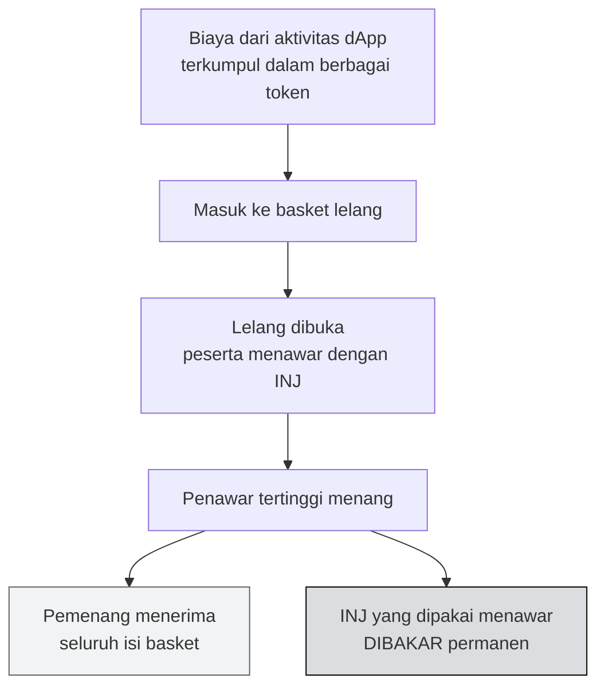

# 🪙 Unit 3 — Tokenomics INJ & Burn Auction

:::info Goal Unit Ini
Di akhir unit ini kamu akan:
- Paham **empat fungsi INJ** dan kenapa satu token memegang banyak peran
- Bisa menjelaskan **burn auction** — mekanisme paling khas dari ekonomi Injective
- Paham hubungan antara **staking, inflasi, dan keamanan jaringan**
- Bisa membaca angka tokenomics secara kritis, bukan sekadar menerima klaim
:::

:::note Prasyarat
- ✅ [Unit 2](./exchange-module-orderbook) selesai — kamu paham modul `exchange` mengumpulkan biaya perdagangan
:::

---

## 🎭 Empat Peran INJ

Satu token, empat pekerjaan berbeda.

### 1. Gas — bahan bakar transaksi

Setiap transaksi di Injective dibayar dengan INJ. Deploy contract, transfer token, pasang order — semuanya butuh gas.

Biaya gas di Injective sangat rendah dibanding banyak chain lain, karena efisiensi arsitekturnya. Untuk latihan kita, testnet INJ dari faucet lebih dari cukup.

### 2. Staking — jaminan keamanan

Validator mengunci INJ sebagai jaminan. Pemegang INJ biasa bisa mendelegasikan ke validator dan ikut menerima imbal hasil.

Ini menciptakan lingkaran yang sehat: semakin banyak INJ yang di-stake, semakin mahal biaya menyerang jaringan, semakin aman chain-nya.

:::info Trade-off yang jarang dibahas
Imbal hasil staking datang dari **inflasi** — token baru dicetak untuk membayar validator dan delegator. Artinya kalau kamu memegang INJ tanpa staking, porsi kepemilikanmu terdilusi seiring waktu.

Ini bukan kelemahan khusus Injective; hampir semua chain proof-of-stake bekerja begitu. Yang penting adalah **apakah ada mekanisme penyeimbang** yang mengurangi suplai. Di Injective, penyeimbang itu adalah burn auction.
:::

### 3. Governance — hak suara

Pemegang INJ bisa mengajukan dan memberi suara pada proposal: perubahan parameter, upgrade chain, penambahan pasar baru, alokasi dana komunitas.

Bobot suara sebanding dengan jumlah INJ yang di-stake.

### 4. Jaminan & utilitas pasar

INJ dipakai di dalam modul `exchange` — misalnya sebagai jaminan di beberapa pasar derivatif dan sebagai kontribusi ke dana asuransi.

---

## 🔥 Burn Auction — Mekanisme Paling Khas Injective

Ini bagian yang paling sering disalahpahami, jadi mari kita bangun pelan-pelan.

### Masalah yang dipecahkan

Protokol yang sukses mengumpulkan biaya. Pertanyaannya: **biaya itu mau diapakan?**

Pilihan umum:
- Masuk ke kas tim → pengguna curiga soal insentif
- Dibagi ke pemegang token → rumit secara regulasi
- Dibakar begitu saja → tapi biayanya terkumpul dalam berbagai macam token, bukan token asli chain

Injective memilih pendekatan yang berbeda.

### Cara kerjanya

Langkah demi langkah:

1. **Biaya terkumpul.** Aktivitas di aplikasi Injective menghasilkan biaya dalam berbagai macam token.
2. **Masuk basket.** Biaya-biaya itu dikumpulkan jadi satu "keranjang".
3. **Dilelang.** Keranjang itu dilelang secara terbuka. Peserta menawar **memakai INJ**.
4. **Pemenang dapat keranjang.** Penawar tertinggi menerima seluruh isinya.
5. **INJ pemenang dibakar.** Ini kuncinya — INJ yang dipakai untuk menawar **dihancurkan permanen**, keluar dari peredaran selamanya.

:::tip Kenapa desain ini elegan
Perhatikan apa yang terjadi: **aktivitas jaringan → biaya terkumpul → keranjang lebih berharga → penawaran lebih tinggi → lebih banyak INJ dibakar.**

Jadi ada hubungan langsung antara **seberapa banyak Injective dipakai** dan **seberapa banyak suplai INJ berkurang.** Tidak ada tim yang memutuskan; ini berjalan otomatis sebagai bagian dari protokol.

Sekaligus, masalah "biaya terkumpul dalam macam-macam token" terselesaikan tanpa protokol harus menjual apa pun di pasar.
:::

### Membacanya secara kritis

:::warning Jangan menelan narasi tokenomics mentah-mentah
"Deflasioner" adalah kata yang sering dipakai untuk pemasaran. Sebagai developer dan calon builder, biasakan bertanya:

- Berapa **banyak** yang benar-benar dibakar, dibanding berapa banyak yang dicetak lewat inflasi staking? Bakar bersih hanya terjadi kalau pembakaran melebihi penerbitan.
- Apakah pembakaran itu **berkelanjutan**, atau bergantung pada satu periode aktivitas tinggi?
- Apakah angkanya bisa **diverifikasi on-chain**, atau hanya klaim di materi pemasaran?

Semua pertanyaan ini bisa dijawab dengan data publik. Itulah keuntungan blockchain — kamu tidak perlu percaya, kamu bisa memeriksa.

Angka terkini bisa dilihat di [explorer](https://blockscout.injective.network/) dan dashboard resmi Injective. **Halaman ini sengaja tidak mencantumkan angka spesifik** karena akan cepat kedaluwarsa — periksa sendiri sumber langsungnya.
:::

---

## ⚖️ Inflasi vs Pembakaran

Dua gaya berlawanan yang bekerja bersamaan:

| | Menambah suplai | Mengurangi suplai |
|---|---|---|
| Mekanisme | Imbal hasil staking (inflasi) | Burn auction |
| Didorong oleh | Kebutuhan mengamankan jaringan | Aktivitas ekonomi di jaringan |
| Naik ketika | Rasio staking rendah | Penggunaan dApp tinggi |

Desainnya kira-kira begini: **inflasi membayar keamanan, pembakaran mengembalikan nilai dari penggunaan.** Kalau jaringan ramai dipakai, pembakaran bisa mengimbangi atau melampaui inflasi.

Beberapa chain PoS mengatur laju inflasi secara dinamis berdasarkan berapa persen suplai yang di-stake — inflasi naik kalau staking terlalu sedikit (untuk menarik lebih banyak validator), turun kalau sudah cukup. Periksa parameter terkini di dokumentasi resmi kalau kamu butuh angka pasti.

---

## 🧑‍💻 Kenapa Developer Perlu Peduli Tokenomics?

Pertanyaan wajar: kamu kan mau ngoding, bukan trading.

Tiga alasan praktis:

1. **Biaya operasional aplikasimu.** Kalau aplikasimu melakukan banyak transaksi on-chain, gas adalah biaya nyata yang harus kamu anggarkan.

2. **Desain insentif aplikasimu sendiri.** Kalau nanti kamu membuat token untuk proyekmu, kamu akan menghadapi pertanyaan yang sama persis: bagaimana menyeimbangkan penerbitan dan penyerapan? Burn auction adalah studi kasus yang bagus.

3. **Menilai chain tempat kamu membangun.** Kamu akan menghabiskan bulan atau tahun membangun di suatu ekosistem. Paham ekonominya membantumu menilai apakah ekosistem itu akan bertahan.

---

## 🎯 Rangkuman

:::tip Yang Harus Kamu Ingat
- INJ punya **empat peran**: gas, staking, governance, dan jaminan di pasar
- Imbal hasil staking berasal dari **inflasi** — memegang tanpa staking berarti terdilusi
- **Burn auction**: biaya dari berbagai token dikumpulkan jadi keranjang, dilelang dengan penawaran INJ, dan **INJ pemenang dibakar permanen**
- Ini mengaitkan **penggunaan jaringan** langsung dengan **pengurangan suplai**, tanpa perlu keputusan manual
- Inflasi menambah suplai, burn auction menguranginya — yang menentukan adalah **selisih bersihnya**
- Verifikasi klaim tokenomics dengan data on-chain, jangan dari materi pemasaran
:::

### ✅ Quick Check

1. Sebutkan empat fungsi INJ.
2. Dari mana asal imbal hasil staking, dan apa konsekuensinya bagi yang tidak staking?
3. Jelaskan alur burn auction dalam empat langkah.
4. Seseorang bilang "INJ itu deflasioner". Dua pertanyaan apa yang kamu ajukan untuk memverifikasinya?

---

🎉 **Concept I selesai.**

**Lanjut:** [Concept II Unit 1 — dApp & Helix](../Concept-2-Ekosistem/dapps-dan-helix) 👉
