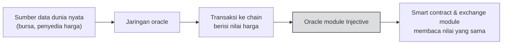
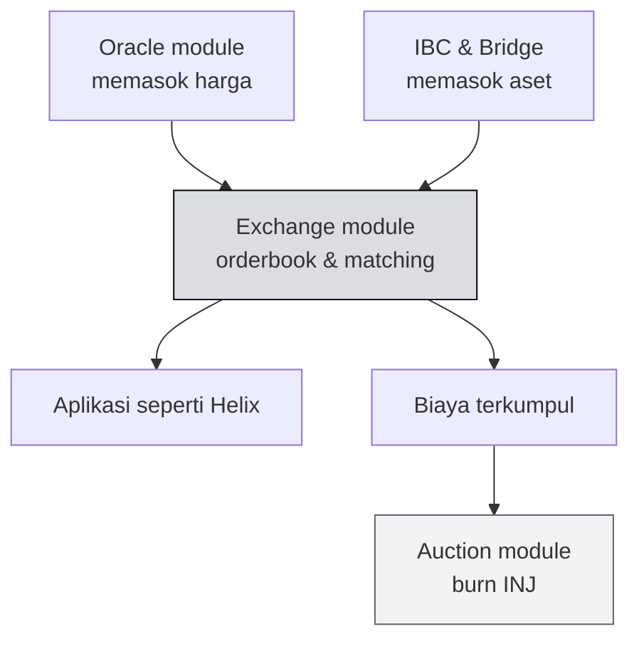

# 🔮 Unit 2 — Oracle, Bridge & Interoperabilitas

:::info Goal Unit Ini
Di akhir unit ini kamu akan:
- Paham **oracle problem** dan kenapa blockchain tidak bisa mengambil data sendiri
- Tahu kenapa oracle adalah **titik kritis keamanan** dan bagaimana ia diserang
- Paham cara aset masuk-keluar Injective lewat **IBC** dan **bridge**
- Bisa menilai **risiko** yang kamu warisi saat memakai aset ter-bridge
:::

:::note Prasyarat
- ✅ [Phase 0 Unit 3](../../Phase-0-Prerequisites/cosmos-ibc-dan-multivm) — kamu tahu apa itu IBC
:::

---

## 🔮 The Oracle Problem

Ini salah satu masalah paling mendasar di seluruh Web3, dan sering diremehkan pemula.

### Blockchain itu buta terhadap dunia luar

Blockchain harus **deterministik** — setiap validator yang menjalankan transaksi yang sama harus mendapat hasil yang sama persis. Kalau tidak, mereka tidak akan pernah sepakat, dan konsensus rusak.

Konsekuensinya: **smart contract tidak boleh memanggil API luar.**

Bayangkan sebuah contract memanggil API harga saat dieksekusi. Validator A memanggilnya pukul 10:00:00,1 dan dapat harga 25,00. Validator B memanggilnya pukul 10:00:00,3 dan dapat harga 25,01. Sekarang mereka punya hasil berbeda dan **tidak bisa sepakat blok mana yang benar.** Chain berhenti.

:::info Jadi masalahnya bukan teknis, tapi konseptual
Bukan karena "susah memanggil API dari blockchain". Secara teknis mudah. Masalahnya, memanggil API **merusak determinisme**, dan determinisme adalah syarat konsensus.

Karena itu solusinya harus berbentuk: data dari luar **dimasukkan ke dalam chain sebagai transaksi**, supaya semua validator melihat nilai yang sama persis pada blok yang sama.
:::

### Solusinya: oracle

**Oracle** adalah sistem yang mengambil data dari dunia luar dan menuliskannya ke chain sebagai transaksi biasa.

Di Injective, ini ditangani modul `oracle`. Pasar derivatif sangat bergantung padanya — harga oracle-lah yang menentukan kapan sebuah posisi dilikuidasi.

---

## ⚠️ Kenapa Oracle Adalah Titik Kritis Keamanan

Ini bagian yang wajib kamu pahami sebelum membangun apa pun yang menyentuh harga.

**Kalau oracle salah, semua yang bergantung padanya ikut salah — dan kesalahan itu final.**

### Skenario serangan klasik: oracle manipulation

1. Sebuah protokol lending memakai harga dari satu pasar dengan likuiditas tipis
2. Penyerang mendorong harga di pasar tipis itu dengan modal relatif kecil
3. Oracle melaporkan harga yang terdistorsi
4. Penyerang meminjam jauh lebih banyak dari yang seharusnya bisa, dengan jaminan yang dinilai terlalu tinggi
5. Harga kembali normal, protokol menanggung utang macet

:::danger Ini penyebab kerugian terbesar di DeFi
Sebagian besar eksploitasi DeFi bernilai besar bukan karena bug di kode contract, tapi karena **asumsi yang salah tentang harga**.

Kalau kamu membangun apa pun yang membaca harga:
- Jangan pernah pakai **satu** sumber harga tunggal
- Waspadai pasar dengan likuiditas tipis — mudah dimanipulasi
- Pertimbangkan **harga rata-rata sepanjang waktu** (TWAP), bukan harga sesaat
- Tanyakan selalu: *"kalau penyerang bisa mengontrol angka ini selama satu blok, apa yang bisa dia curi?"*
:::

### Bagaimana oracle yang baik memitigasi ini

| Teknik | Cara kerja |
|---|---|
| **Agregasi multi-sumber** | Ambil dari banyak bursa, pakai median — satu sumber dimanipulasi tidak cukup |
| **Multi-node** | Banyak operator independen melaporkan; nilai menyimpang diabaikan |
| **Time-weighted average** | Rata-rata sepanjang periode, sehingga lonjakan sesaat tidak berpengaruh |
| **Deviation bound** | Tolak pembaruan yang melompat terlalu jauh dari nilai sebelumnya |

---

## 🌉 Bagaimana Aset Masuk dan Keluar Injective

Injective tidak berdiri sendiri. Ada dua jalur utama masuknya aset.

### Jalur 1 — IBC (untuk ekosistem Cosmos)

Sudah kita bahas di [Phase 0 Unit 3](../../Phase-0-Prerequisites/cosmos-ibc-dan-multivm). Ringkasnya: kedua chain saling memverifikasi state satu sama lain lewat light client. **Tidak ada operator perantara yang harus dipercaya.**

Ini jalur teraman, tapi hanya bekerja antar chain yang sama-sama mendukung IBC.

### Jalur 2 — Bridge (untuk ekosistem lain)

Untuk membawa aset dari Ethereum, Solana, dan chain non-Cosmos lain, dibutuhkan bridge. Injective memiliki modul bridge sendiri ke Ethereum (`peggy`), dan ada bridge pihak ketiga untuk rute lain.

Pola umumnya: aset dikunci di chain asal, versi representasinya dicetak di chain tujuan.

### Perbandingan risiko

| | IBC | Bridge |
|---|---|---|
| Yang harus dipercaya | Konsensus kedua chain | Operator/validator bridge |
| Jangkauan | Ekosistem Cosmos | Hampir semua chain |
| Rekam jejak keamanan | Kuat di level protokol | ⚠️ Target peretasan terbesar di Web3 |

:::warning Aset ter-bridge membawa risiko bridge-nya
Ini konsep penting yang sering dilewatkan.

Ketika kamu memegang token hasil bridge, kamu sebenarnya memegang **klaim** atas aset asli yang dikunci di chain lain. Kalau bridge-nya diretas dan aset yang dikunci itu dicuri, token yang kamu pegang bisa kehilangan nilainya — meski tidak ada yang salah dengan Injective.

Sebagai developer: kalau aplikasimu menerima aset ter-bridge, **kamu mewarisi asumsi keamanan bridge itu.** Tanyakan pada dirimu apakah pengguna aplikasimu memahami risiko yang mereka ambil.
:::

---

## 🧩 Bagaimana Semuanya Terhubung

Mari satukan seluruh Phase 1:

Inilah gambaran utuh Injective:

- **Oracle** memasok harga yang bisa dipercaya
- **IBC dan bridge** memasok aset yang bisa diperdagangkan
- **Exchange module** menyediakan pasar tempat semuanya bertemu
- **Auction module** mengembalikan nilai dari aktivitas itu ke INJ lewat pembakaran

Setiap bagian punya peran, dan semuanya saling terkait. Inilah arti "chain yang dibangun khusus untuk keuangan".

---

## 🎯 Rangkuman

:::tip Yang Harus Kamu Ingat
- Smart contract **tidak boleh** memanggil API luar karena akan merusak determinisme dan konsensus
- **Oracle** menuliskan data luar ke chain sebagai transaksi, sehingga semua validator melihat nilai yang sama
- Oracle adalah **titik kritis keamanan** — sebagian besar eksploitasi DeFi besar berasal dari manipulasi harga, bukan bug kode
- Mitigasi: multi-sumber, multi-node, TWAP, dan batas deviasi
- **IBC** aman karena tanpa perantara; **bridge** memperluas jangkauan tapi menambah risiko
- Memakai aset ter-bridge berarti **mewarisi risiko bridge itu**
:::

### ✅ Quick Check

1. Kenapa smart contract tidak boleh memanggil API harga secara langsung?
2. Jelaskan alur serangan oracle manipulation dalam tiga langkah.
3. Sebutkan dua teknik yang membuat oracle lebih tahan manipulasi.
4. Apa perbedaan mendasar IBC dan bridge dari sisi siapa yang harus dipercaya?

---

🎉 **Phase 1 selesai!** Kamu sekarang paham cara kerja Injective secara konseptual.

Saatnya berhenti membaca dan mulai menulis kode.

**Lanjut:** [Phase 2 — Solidity Dasar](../../Phase-2-Smart-Contracts/Solidity/solidity-dasar) 👉
