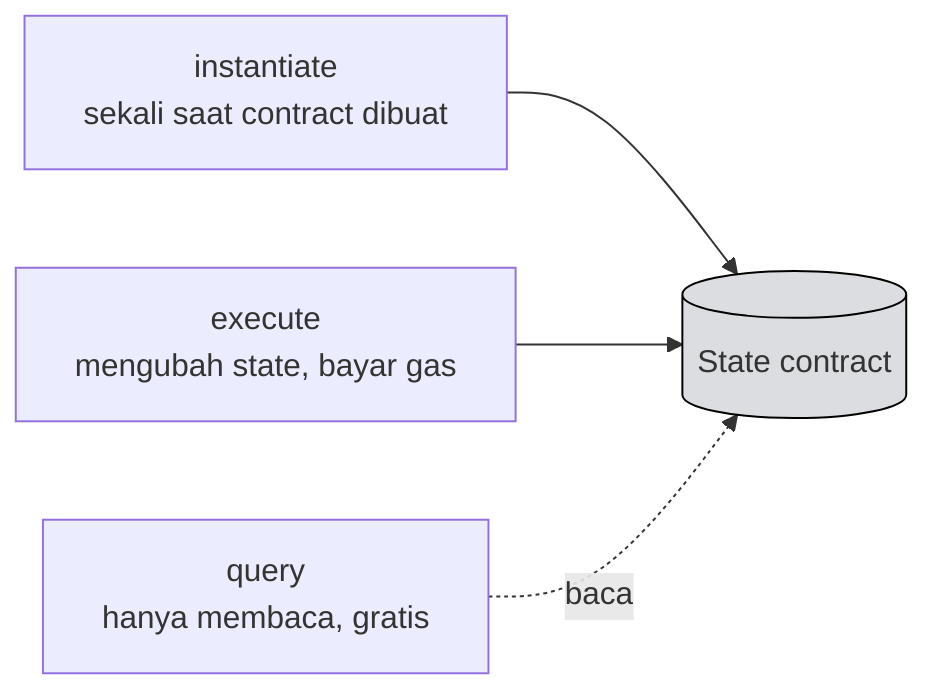

# 📐 Unit 2 — CosmWasm Starter

:::info Goal Unit Ini
Di akhir unit ini kamu akan:
- Paham **tiga entry point** CosmWasm: `instantiate`, `execute`, `query`
- Bisa membaca struktur file sebuah project contract
- Paham cara **menyimpan state** dengan `cw-storage-plus`
- Punya **contract counter** yang ter-compile dan lolos test
:::

:::note Prasyarat
- ✅ [Unit 1](./rust-untuk-web3) selesai — Rust terpasang, target `wasm32-unknown-unknown` sudah ditambahkan
- ✅ Kamu paham enum dengan data dan `Result`
:::

---

## 🧠 Model Mental CosmWasm

Sebelum melihat kode, pahami dulu bentuk besarnya.

Sebuah contract CosmWasm adalah program yang merespons **tiga jenis panggilan**:



| Entry point | Kapan dipanggil | Mengubah state? | Bayar gas? |
|---|---|---|---|
| `instantiate` | Sekali, saat contract dibuat | ✅ Ya | ✅ Ya |
| `execute` | Setiap kali ada aksi | ✅ Ya | ✅ Ya |
| `query` | Saat membaca data | ❌ Tidak | ❌ Tidak |

:::tip Bandingkan dengan Solidity
Kalau kamu sudah melewati Jalur A, ini padanannya:

| Solidity | CosmWasm |
|---|---|
| `constructor` | `instantiate` |
| function biasa | `execute` |
| function `view` | `query` |

Konsepnya sama. Yang berbeda adalah di CosmWasm ketiganya dipisahkan secara eksplisit, dan aksi dipilih lewat **pesan** (enum), bukan lewat nama function langsung.
:::

### Perbedaan penting: store code dan instantiate itu terpisah

Di Solidity, deploy = satu langkah. Di CosmWasm ada **dua langkah**:

1. **Store** — unggah kode Wasm ke chain. Kamu mendapat `code_id`
2. **Instantiate** — buat sebuah *instance* dari `code_id` itu. Kamu mendapat alamat contract

Satu `code_id` bisa di-instantiate berkali-kali menjadi banyak contract terpisah dengan state masing-masing — mirip class dan object.

---

## 📁 Membuat Project

```bash
cargo install cargo-generate
cargo generate --git https://github.com/CosmWasm/cw-template.git --branch 1.0 --name counter-injective
cd counter-injective
```

Struktur yang dihasilkan:

```
counter-injective/
├── Cargo.toml           # dependensi
├── src/
│   ├── lib.rs           # titik masuk modul
│   ├── contract.rs      # instantiate / execute / query
│   ├── msg.rs           # definisi pesan
│   ├── state.rs         # penyimpanan state
│   └── error.rs         # tipe error khusus
└── examples/
    └── schema.rs        # generator JSON schema
```

Empat file yang akan kamu sentuh: `msg.rs`, `state.rs`, `contract.rs`, `error.rs`.

---

## 📨 `msg.rs` — Mendefinisikan Pesan

Ingat enum dengan data dari [Unit 1](./rust-untuk-web3)? Inilah tempatnya dipakai.

```rust
use cosmwasm_schema::{cw_serde, QueryResponses};

// Pesan saat contract pertama kali dibuat
#[cw_serde]
pub struct InstantiateMsg {
    pub count: i32,
}

// Semua aksi yang bisa dilakukan
#[cw_serde]
pub enum ExecuteMsg {
    Increment {},
    Reset { count: i32 },
}

// Semua pertanyaan yang bisa diajukan
#[cw_serde]
#[derive(QueryResponses)]
pub enum QueryMsg {
    #[returns(GetCountResponse)]
    GetCount {},
}

#[cw_serde]
pub struct GetCountResponse {
    pub count: i32,
}
```

:::info Enum menjadi JSON
Setiap varian enum diterjemahkan menjadi JSON saat dipanggil dari luar:

```json
{"increment": {}}
{"reset": {"count": 5}}
{"get_count": {}}
```

Perhatikan nama berubah dari `Increment` menjadi `increment` dan `GetCount` menjadi `get_count`. Ini otomatis dilakukan `#[cw_serde]`.

Kamu akan mengetik JSON persis seperti ini di [Unit 3](./build-deploy-cosmwasm) saat memanggil contract dari terminal — jadi ingat bentuknya.
:::

---

## 💾 `state.rs` — Menyimpan Data

```rust
use cosmwasm_schema::cw_serde;
use cosmwasm_std::Addr;
use cw_storage_plus::{Item, Map};

#[cw_serde]
pub struct State {
    pub count: i32,
    pub owner: Addr,
}

// Item = satu nilai tunggal
pub const STATE: Item<State> = Item::new("state");

// Map = pasangan kunci-nilai, padanan mapping di Solidity
pub const KONTRIBUSI: Map<&Addr, i32> = Map::new("kontribusi");
```

| Tipe | Untuk apa | Padanan Solidity |
|---|---|---|
| `Item<T>` | Satu nilai | variabel state biasa |
| `Map<K, V>` | Kunci → nilai | `mapping` |

:::tip `Addr` bukan `String`
CosmWasm punya tipe `Addr` khusus untuk alamat. Selalu pakai itu, bukan `String`.

Alasannya: `Addr` hanya dibuat setelah alamat divalidasi. Ini mencegah alamat yang salah format masuk ke state-mu — kesalahan yang tidak bisa diperbaiki setelah contract di-deploy.
:::

---

## ⚙️ `contract.rs` — Logika Utama

### `instantiate`

```rust
use cosmwasm_std::{
    entry_point, to_json_binary, Binary, Deps, DepsMut, Env,
    MessageInfo, Response, StdResult,
};

use crate::error::ContractError;
use crate::msg::{ExecuteMsg, GetCountResponse, InstantiateMsg, QueryMsg};
use crate::state::{State, STATE};

#[entry_point]
pub fn instantiate(
    deps: DepsMut,
    _env: Env,
    info: MessageInfo,
    msg: InstantiateMsg,
) -> Result<Response, ContractError> {
    let state = State {
        count: msg.count,
        owner: info.sender.clone(),
    };
    STATE.save(deps.storage, &state)?;

    Ok(Response::new()
        .add_attribute("method", "instantiate")
        .add_attribute("owner", info.sender)
        .add_attribute("count", msg.count.to_string()))
}
```

Empat parameter yang selalu ada:

| Parameter | Isinya |
|---|---|
| `deps` | Akses ke storage, API, dan querier |
| `env` | Info blok: tinggi, waktu, alamat contract |
| `info` | **`info.sender`** = pemanggil (padanan `msg.sender`), `info.funds` = token yang dikirim |
| `msg` | Pesan yang dikirim pemanggil |

:::info `DepsMut` vs `Deps`
`instantiate` dan `execute` menerima **`DepsMut`** — bisa menulis ke storage.

`query` menerima **`Deps`** — hanya bisa membaca.

Ini borrow checker Rust bekerja untukmu: **secara struktural mustahil** menulis state dari dalam function query. Compiler tidak akan mengizinkannya.
:::

### `execute`

```rust
#[entry_point]
pub fn execute(
    deps: DepsMut,
    _env: Env,
    info: MessageInfo,
    msg: ExecuteMsg,
) -> Result<Response, ContractError> {
    match msg {
        ExecuteMsg::Increment {} => execute_increment(deps),
        ExecuteMsg::Reset { count } => execute_reset(deps, info, count),
    }
}

fn execute_increment(deps: DepsMut) -> Result<Response, ContractError> {
    STATE.update(deps.storage, |mut state| -> Result<_, ContractError> {
        state.count += 1;
        Ok(state)
    })?;

    Ok(Response::new().add_attribute("method", "increment"))
}

fn execute_reset(
    deps: DepsMut,
    info: MessageInfo,
    count: i32,
) -> Result<Response, ContractError> {
    STATE.update(deps.storage, |mut state| -> Result<_, ContractError> {
        // Kontrol akses — hanya pemilik
        if info.sender != state.owner {
            return Err(ContractError::Unauthorized {});
        }
        state.count = count;
        Ok(state)
    })?;

    Ok(Response::new().add_attribute("method", "reset"))
}
```

Perhatikan pola `match msg` — inilah kenapa Unit 1 menekankan enum dengan data.

:::warning Kontrol akses tetap tanggung jawabmu
Sama seperti Solidity: **siapa pun bisa mengirim pesan apa pun ke contract-mu.** Rust melindungimu dari bug memori, bukan dari logika yang salah.

Perhatikan pemeriksaan `info.sender != state.owner` di `execute_reset`. Tanpa itu, siapa pun bisa mereset counter. Setiap `execute` yang seharusnya terbatas butuh pemeriksaan eksplisit seperti ini.
:::

### `query`

```rust
#[entry_point]
pub fn query(deps: Deps, _env: Env, msg: QueryMsg) -> StdResult<Binary> {
    match msg {
        QueryMsg::GetCount {} => to_json_binary(&query_count(deps)?),
    }
}

fn query_count(deps: Deps) -> StdResult<GetCountResponse> {
    let state = STATE.load(deps.storage)?;
    Ok(GetCountResponse { count: state.count })
}
```

---

## ❗ `error.rs`

```rust
use cosmwasm_std::StdError;
use thiserror::Error;

#[derive(Error, Debug)]
pub enum ContractError {
    #[error("{0}")]
    Std(#[from] StdError),

    #[error("Unauthorized")]
    Unauthorized {},

    #[error("Jumlah tidak boleh nol")]
    ZeroAmount {},
}
```

Setiap varian jadi pesan error yang bisa dibaca pengguna saat transaksi gagal. Ini padanan custom error di Solidity.

---

## 🧪 Test

Keunggulan besar CosmWasm: kamu bisa mengetes seluruh contract **tanpa menyentuh blockchain**.

Tambahkan di akhir `contract.rs`:

```rust
#[cfg(test)]
mod tests {
    use super::*;
    use cosmwasm_std::testing::{
        mock_dependencies, mock_env, mock_info,
    };
    use cosmwasm_std::{coins, from_json};

    #[test]
    fn proper_initialization() {
        let mut deps = mock_dependencies();
        let msg = InstantiateMsg { count: 17 };
        let info = mock_info("creator", &coins(1000, "inj"));

        let res = instantiate(deps.as_mut(), mock_env(), info, msg).unwrap();
        assert_eq!(0, res.messages.len());

        let res = query(deps.as_ref(), mock_env(), QueryMsg::GetCount {}).unwrap();
        let value: GetCountResponse = from_json(&res).unwrap();
        assert_eq!(17, value.count);
    }

    #[test]
    fn increment_works() {
        let mut deps = mock_dependencies();
        let info = mock_info("creator", &coins(2, "inj"));
        instantiate(deps.as_mut(), mock_env(), info.clone(), InstantiateMsg { count: 17 }).unwrap();

        execute(deps.as_mut(), mock_env(), info, ExecuteMsg::Increment {}).unwrap();

        let res = query(deps.as_ref(), mock_env(), QueryMsg::GetCount {}).unwrap();
        let value: GetCountResponse = from_json(&res).unwrap();
        assert_eq!(18, value.count);
    }

    #[test]
    fn reset_hanya_pemilik() {
        let mut deps = mock_dependencies();
        let creator = mock_info("creator", &coins(2, "inj"));
        instantiate(deps.as_mut(), mock_env(), creator, InstantiateMsg { count: 17 }).unwrap();

        // Orang lain mencoba reset — harus gagal
        let orang_asing = mock_info("orang_asing", &coins(2, "inj"));
        let res = execute(
            deps.as_mut(),
            mock_env(),
            orang_asing,
            ExecuteMsg::Reset { count: 5 },
        );
        assert!(res.is_err());
    }
}
```

Jalankan:

```bash
cargo test
```

:::tip Test ketiga adalah yang paling berharga
`reset_hanya_pemilik` menguji bahwa contract-mu **menolak** yang seharusnya ditolak.

Pemula cenderung hanya menguji jalur bahagia — "apakah fiturnya jalan?". Yang justru menyebabkan kehilangan dana adalah jalur yang **seharusnya gagal tapi ternyata tidak.** Biasakan menulis test untuk keduanya.
:::

---

## ✅ Checklist

- [ ] Project ter-generate dari `cw-template`
- [ ] `cargo build` sukses
- [ ] `cargo test` — semua test lolos
- [ ] Kamu paham peran `msg.rs`, `state.rs`, `contract.rs`, `error.rs`
- [ ] Kamu bisa menjelaskan beda `instantiate`, `execute`, dan `query`

---

## 🎯 Rangkuman

:::tip Yang Harus Kamu Ingat
- Tiga entry point: **`instantiate`** (sekali), **`execute`** (mengubah state), **`query`** (baca saja, gratis)
- **Store dan instantiate terpisah** — satu `code_id` bisa jadi banyak contract
- Pesan didefinisikan sebagai **enum**, diterjemahkan otomatis ke JSON (`Increment` → `increment`)
- State: **`Item`** untuk nilai tunggal, **`Map`** untuk kunci-nilai
- **`info.sender`** adalah padanan `msg.sender`
- **`DepsMut`** bisa menulis, **`Deps`** hanya baca — dipaksakan compiler
- Pakai **`Addr`**, bukan `String`, untuk alamat
- Kontrol akses tetap tanggung jawabmu — Rust tidak melindungimu dari logika yang salah
- Tulis test untuk yang **seharusnya gagal**, bukan hanya jalur bahagia
:::

### ✅ Quick Check

1. Sebutkan tiga entry point CosmWasm dan padanannya di Solidity.
2. Kenapa store dan instantiate dipisah?
3. `ExecuteMsg::Reset { count: 5 }` menjadi JSON seperti apa?
4. Kenapa function `query` mustahil mengubah state?
5. Kenapa memakai `Addr` lebih baik daripada `String` untuk alamat?

---

**Lanjut:** [Unit 3 — Build & Deploy CosmWasm](./build-deploy-cosmwasm) 👉
