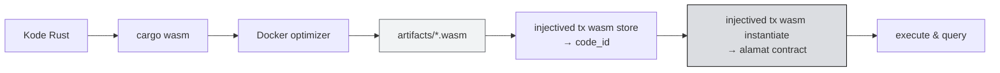

# 📤 Unit 3 — Build & Deploy CosmWasm

:::info Goal Unit Ini
Di akhir unit ini kamu akan:
- Bisa **meng-optimize** contract menjadi Wasm siap deploy
- Punya **`injectived`** terkonfigurasi untuk testnet
- Berhasil **store** contract dan mendapat `code_id`
- Berhasil **instantiate** dan mendapat alamat contract
- Bisa **execute** dan **query** contract dari terminal
:::

:::note Prasyarat
- ✅ [Unit 2](./cosmwasm-starter) selesai — contract counter sudah lolos `cargo test`
- ✅ **Docker** terpasang dan berjalan — dibutuhkan untuk optimizer
- ✅ Punya testnet INJ (lihat [Phase 0 Unit 4](../../Phase-0-Prerequisites/setup-wallet-dan-testnet))
:::

:::warning Unit ini paling rawan macet
Toolchain CosmWasm punya lebih banyak bagian bergerak daripada Hardhat: Docker, binary chain, konfigurasi key. **Sisihkan waktu yang cukup dan jangan mengerjakannya di malam sebelum deadline.**

Kalau macet lebih dari 30 menit di satu langkah, tanya di grup Telegram. Kemungkinan besar peserta lain mengalami hal yang sama.
:::

---

## 📊 Alur Lengkapnya



---

## 🔨 Step 1 — Compile ke Wasm

Dari dalam folder project:

```bash
cargo wasm
```

Ini menghasilkan file Wasm, tapi **belum siap deploy** — ukurannya masih terlalu besar.

---

## 📦 Step 2 — Optimize dengan Docker

Chain membatasi ukuran contract, jadi Wasm harus dikecilkan dulu. Optimizer resmi berjalan di Docker dan menghasilkan build yang **deterministik** — orang lain yang mengompilasi kode yang sama akan mendapat file yang identik.

<details>
<summary><strong>Intel / AMD (x86_64)</strong></summary>

```bash
docker run --rm -v "$(pwd)":/code \
  --mount type=volume,source="$(basename "$(pwd)")_cache",target=/code/target \
  --mount type=volume,source=registry_cache,target=/usr/local/cargo/registry \
  cosmwasm/rust-optimizer:0.12.12
```

</details>

<details>
<summary><strong>Apple Silicon / ARM64</strong></summary>

```bash
docker run --rm -v "$(pwd)":/code \
  --mount type=volume,source="$(basename "$(pwd)")_cache",target=/code/target \
  --mount type=volume,source=registry_cache,target=/usr/local/cargo/registry \
  cosmwasm/rust-optimizer-arm64:0.12.12
```

</details>

Hasilnya ada di folder `artifacts/`:

```bash
ls -lh artifacts/
```

Kamu akan melihat file `.wasm` berukuran ratusan kilobyte.

:::warning Build ARM64 tidak identik dengan x86
Kalau kamu di Apple Silicon, file Wasm hasilmu **bisa berbeda checksum** dari hasil build x86. Untuk latihan camp ini tidak masalah.

Untuk deployment mainnet sungguhan yang butuh verifikasi reproducible, gunakan build x86_64.
:::

:::note Versi optimizer
Perintah di atas memakai `cosmwasm/rust-optimizer:0.12.12` sesuai dokumentasi Injective per 30 Juli 2026. CosmWasm juga merilis image dengan nama `cosmwasm/optimizer` untuk versi yang lebih baru.

Kalau perintah di atas gagal karena image tidak ditemukan, cek [dokumentasi CosmWasm resmi](https://docs.injective.network/developers-cosmwasm/smart-contracts/your-first-smart-contract) untuk versi terkini, lalu laporkan di Telegram supaya halaman ini diperbarui.
:::

---

## 🖥️ Step 3 — Pasang `injectived`

`injectived` adalah CLI resmi untuk berinteraksi dengan Injective chain.

Ikuti panduan instalasi resmi di **[docs.injective.network](https://docs.injective.network)** — cari bagian instalasi `injectived`. Cara pemasangan berbeda antar sistem operasi dan versinya diperbarui berkala, jadi kami sengaja tidak menyalin perintahnya di sini agar tidak kedaluwarsa.

Verifikasi setelah terpasang:

```bash
injectived version
```

:::tip Alternatif kalau injectived sulit dipasang
Kalau instalasi bermasalah, kamu bisa memakai **Docker image resmi Injective** untuk menjalankan perintah `injectived` tanpa memasangnya di sistemmu. Tanya di grup Telegram — beberapa peserta biasanya sudah menemukan jalur termudah untuk OS masing-masing.
:::

---

## 🔑 Step 4 — Siapkan Key

Impor wallet-mu ke `injectived`. **Pakai wallet latihan**, bukan yang berisi aset sungguhan.

```bash
injectived keys add wallet-clc11 --recover
```

Perintah ini akan meminta seed phrase-mu.

:::danger Ini menaruh seed phrase-mu ke dalam keyring komputer
Pastikan ini adalah **wallet latihan yang hanya berisi testnet INJ.** Jangan pernah memasukkan seed phrase wallet utama ke CLI mana pun.

Kalau kamu belum punya wallet latihan terpisah, buat sekarang:

```bash
injectived keys add wallet-clc11
```

Perintah ini membuat wallet baru dan menampilkan seed phrase-nya. Catat di kertas, lalu ambil testnet INJ untuk alamat itu dari [faucet](https://testnet.faucet.injective.network/).
:::

Simpan alamatmu ke variabel supaya perintah berikutnya lebih ringkas:

```bash
export INJ_ADDRESS=$(injectived keys show wallet-clc11 -a)
echo $INJ_ADDRESS
```

Hasilnya harus dimulai dengan `inj1...`.

Cek saldo:

```bash
injectived query bank balances $INJ_ADDRESS \
  --node=https://testnet.sentry.tm.injective.network:443
```

:::info Parameter testnet yang selalu dipakai
Setiap perintah `injectived` untuk testnet butuh dua flag ini:

- `--chain-id="injective-888"` — **testnet** (mainnet adalah `injective-1`)
- `--node=https://testnet.sentry.tm.injective.network:443`

Perhatikan bahwa ini **berbeda** dari endpoint EVM di Jalur A. Sisi Cosmos dan sisi EVM punya endpoint sendiri-sendiri.
:::

---

## 📤 Step 5 — Store Contract

Unggah kode Wasm ke chain:

```bash
injectived tx wasm store artifacts/counter_injective.wasm \
  --from=$INJ_ADDRESS \
  --chain-id="injective-888" \
  --yes --fees=1000000000000000inj --gas=2000000 \
  --node=https://testnet.sentry.tm.injective.network:443
```

Sesuaikan nama file `.wasm` dengan hasil di folder `artifacts/`.

Perintah ini mengembalikan hash transaksi. Ambil `code_id` dari situ:

```bash
injectived query tx <TX_HASH> \
  --node=https://testnet.sentry.tm.injective.network:443 \
  --output json | grep -A1 code_id
```

Simpan nilainya:

```bash
export CODE_ID=<code_id_yang_kamu_dapat>
```

:::note Testnet Injective permissionless
Siapa pun bisa store contract di testnet tanpa izin khusus. Di mainnet ada aturan tambahan — tapi itu di luar cakupan camp ini.
:::

---

## 🏗️ Step 6 — Instantiate

Sekarang buat instance dari `code_id` itu:

```bash
INIT='{"count":99}'

injectived tx wasm instantiate $CODE_ID $INIT \
  --label="CounterCLC11" \
  --from=$INJ_ADDRESS \
  --chain-id="injective-888" \
  --yes --fees=1000000000000000inj \
  --gas=2000000 \
  --no-admin \
  --node=https://testnet.sentry.tm.injective.network:443
```

Perhatikan `INIT` — ini adalah `InstantiateMsg` dari [Unit 2](./cosmwasm-starter) dalam bentuk JSON. Persis seperti yang kita bahas di sana.

Ambil alamat contract dari hasil transaksi, lalu simpan:

```bash
export CONTRACT=<alamat_inj1_hasil_instantiate>
```

:::warning Soal `--no-admin`
Flag ini berarti contract **tidak bisa di-upgrade** setelah dibuat. Untuk latihan ini aman dan sesuai konvensi dokumentasi resmi.

Kalau kamu menghilangkannya dan menetapkan admin, admin itu bisa mengganti kode contract kapan saja — yang berarti pengguna harus mempercayai admin sepenuhnya. Ini keputusan desain penting saat membangun sesuatu yang sungguhan.
:::

---

## ▶️ Step 7 — Execute

Panggil `increment`:

```bash
INCREMENT='{"increment":{}}'

injectived tx wasm execute $CONTRACT "$INCREMENT" \
  --from=$INJ_ADDRESS \
  --chain-id="injective-888" \
  --yes --fees=1000000000000000inj --gas=2000000 \
  --node=https://testnet.sentry.tm.injective.network:443 \
  --output json
```

Coba juga `reset`:

```bash
RESET='{"reset":{"count":42}}'

injectived tx wasm execute $CONTRACT "$RESET" \
  --from=$INJ_ADDRESS \
  --chain-id="injective-888" \
  --yes --fees=1000000000000000inj --gas=2000000 \
  --node=https://testnet.sentry.tm.injective.network:443 \
  --output json
```

---

## 🔍 Step 8 — Query

Query gratis dan tidak butuh tanda tangan:

```bash
GET_COUNT='{"get_count":{}}'

injectived query wasm contract-state smart $CONTRACT "$GET_COUNT" \
  --node=https://testnet.sentry.tm.injective.network:443 \
  --output json
```

Hasilnya kira-kira:

```json
{"data":{"count":42}}
```

🎉 Contract CosmWasm pertamamu berjalan di Injective testnet.

---

## 🧪 Latihan Verifikasi

Buktikan bahwa kontrol aksesmu bekerja di chain sungguhan, bukan hanya di test:

1. Buat wallet kedua: `injectived keys add wallet-test2`
2. Kirim sedikit testnet INJ ke wallet itu untuk gas
3. Coba panggil `reset` dari wallet kedua
4. Transaksinya **harus gagal** dengan error `Unauthorized`

:::tip Kenapa latihan ini berharga
Test unit di Unit 2 berjalan di lingkungan simulasi. Latihan ini membuktikan bahwa perilaku yang sama benar-benar terjadi **di chain sungguhan**.

Kesenjangan antara "lolos di test" dan "benar di produksi" adalah tempat bug mahal bersembunyi. Membiasakan diri memverifikasi keduanya adalah kebiasaan profesional yang baik.
:::

---

## 🛠️ Troubleshooting

<details>
<summary><strong>Docker optimizer: "permission denied" atau "cannot connect to Docker daemon"</strong></summary>

Docker belum berjalan. Jalankan Docker Desktop, atau di Linux:

```bash
sudo systemctl start docker
```

Kalau muncul masalah izin di Linux, tambahkan dirimu ke grup docker:

```bash
sudo usermod -aG docker $USER
```

Lalu logout dan login lagi.

</details>

<details>
<summary><strong>"out of gas"</strong></summary>

Naikkan nilai `--gas`. Coba `--gas=3000000` atau lebih tinggi. Contract yang besar butuh lebih banyak gas untuk di-store.

</details>

<details>
<summary><strong>"insufficient funds"</strong></summary>

Saldo testnet INJ tidak cukup. Ambil lagi dari [faucet](https://testnet.faucet.injective.network/), dan pastikan kamu meminta ke alamat `inj1...` yang benar — cek dengan `echo $INJ_ADDRESS`.

</details>

<details>
<summary><strong>"contract size exceeds limit"</strong></summary>

Kamu men-deploy hasil `cargo wasm` yang belum dioptimasi. Jalankan Docker optimizer dan deploy file dari folder **`artifacts/`**, bukan dari `target/`.

</details>

<details>
<summary><strong>"failed to execute message; message index: 0: Unauthorized"</strong></summary>

Kontrol aksesmu bekerja. Kalau ini terjadi saat kamu memakai wallet pemilik, periksa `--from` menunjuk ke akun yang benar — akun yang melakukan `instantiate`, bukan yang lain.

</details>

<details>
<summary><strong>Perintah menggantung tanpa respons</strong></summary>

Node publik kadang lambat atau sedang penuh. Tekan Ctrl+C dan coba lagi. Cek dulu apakah transaksinya sebenarnya sudah masuk sebelum mengulang — kalau tidak, kamu bisa mengirim transaksi yang sama dua kali.

</details>

---

## ✅ Checklist

- [ ] File `.wasm` teroptimasi ada di folder `artifacts/`
- [ ] `injectived` terpasang dan `injectived version` berjalan
- [ ] Key latihan terimpor, `$INJ_ADDRESS` berisi alamat `inj1...`
- [ ] Ada testnet INJ di alamat itu
- [ ] Contract ter-**store**, `code_id` tercatat
- [ ] Contract ter-**instantiate**, alamat contract tercatat
- [ ] `increment` berhasil, `get_count` menunjukkan nilai yang bertambah
- [ ] Latihan verifikasi: wallet lain **gagal** memanggil `reset`

:::tip Simpan bukti untuk submission
Catat `code_id`, alamat contract, dan hash transaksi. Screenshot output terminal saat `get_count` berhasil.

Kumpulkan sekarang selagi masih segar — [panduan submission](../../Phase-4-Graduation/panduan-submission) akan memintanya.
:::

---

## 🎯 Rangkuman

:::tip Yang Harus Kamu Ingat
- Alur: `cargo wasm` → **Docker optimizer** → `artifacts/*.wasm` → **store** → **instantiate** → execute/query
- Deploy dari folder **`artifacts/`**, bukan `target/` — kalau tidak, ukurannya akan ditolak
- Testnet: `--chain-id="injective-888"`, node `https://testnet.sentry.tm.injective.network:443`
- Endpoint sisi Cosmos **berbeda** dari endpoint EVM di Jalur A
- **Store** memberi `code_id`; **instantiate** memberi alamat contract. Satu `code_id` bisa banyak instance
- `--no-admin` berarti contract tidak bisa di-upgrade — keputusan kepercayaan yang penting
- **Query gratis**, execute bayar gas
- Verifikasi kontrol akses di chain sungguhan, bukan hanya di unit test
:::

### ✅ Quick Check

1. Kenapa hasil `cargo wasm` tidak bisa langsung di-deploy?
2. Apa beda `code_id` dan alamat contract?
3. Apa chain-id testnet Injective untuk perintah `injectived`?
4. Apa konsekuensi memakai `--no-admin`?
5. Kenapa `query` tidak butuh flag `--from` dan `--fees`?

---

🎉 **Phase 2 selesai!** Kamu sudah men-deploy contract di kedua VM Injective.

Ini mencakup **Learning Track Phase 3, 4, dan 5** — bagian tersulit dari track sudah lewat.

**Lanjut:** [Phase 3 — Setup Injective TypeScript SDK](../../Phase-3-Building/TS-SDK/setup-injective-ts-sdk) 👉
